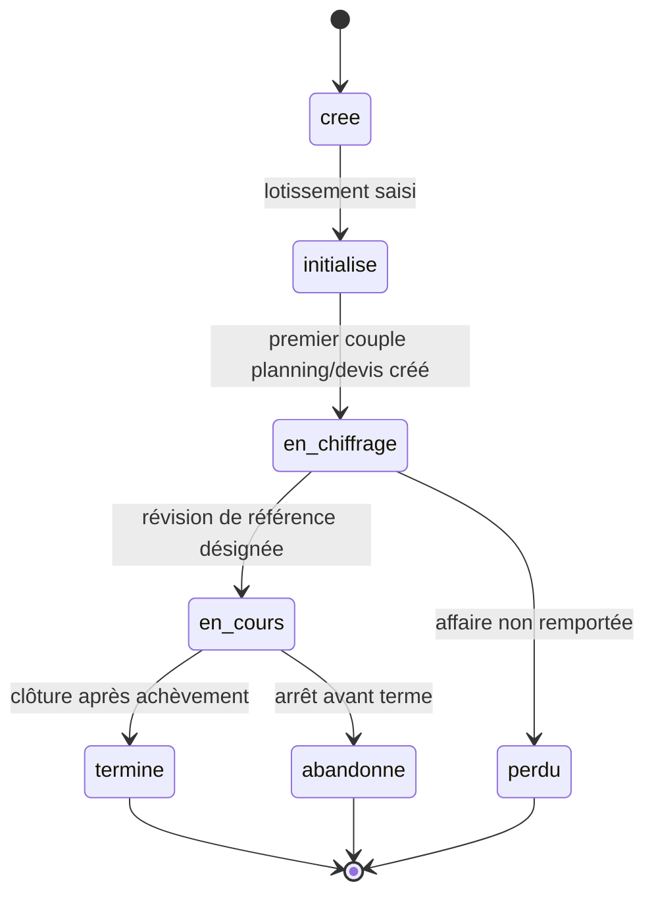

# Revue du 2026-09-17 — document complet

| # | Gravité | Emplacement | Constat | Statut |
|---|---|---|---|---|
| C-001 | majeur | §3.1.4.1 | La boucle de pilotage repasse par la désignation de la révision de référence | sans objet : figure du flux de travail retirée |
| C-002 | majeur | §1.3 | « Cout réel » inclut les engagements, ce qui écarte AC de son acception EVM | intégré |
| C-003 | majeur | §3.2.2 | États du projet définis sans transitions, et en désaccord avec le flux de travail | intégré |
| C-004 | majeur | §3.1.3 | Le diagramme de contexte mêle composants internes et acteurs externes | intégré |
| C-005 | majeur | §3.1.3 / §2.1 | Les coûts réels transitent par Excel dans le diagramme, par l'ERP dans le texte | intégré |
| C-006 | majeur | §3.1.1–3.1.3 | Le tableau des flux est vide : mode d'échange et fréquence non spécifiés | intégré |
| C-007 | majeur | §1.2 / §1.3 | FBS, PBS, RAE, ERP, provision et risque sont employés sans être définis | intégré avec écart : l'arborescence PBS reste à produire |
| C-008 | majeur | §1.4.2 | Trois codes de domaines pour une dizaine de modules fonctionnels | intégré |
| C-009 | mineur | §1.3 / §3.3.4.4 | Écarts de terminologie et coquille dans les parties normatives | intégré (reliquat traité en C-022 du 2026-09-19) |
| C-010 | mineur | document | Synthèse de l'état d'avancement | intégré |

---

## C-001 — La boucle de pilotage repasse par la désignation de la révision de référence

- **gravité** : majeur
- **emplacement** : §3.1.4.1 « Flux de travail principal », figure 2
- **citation** : « I -->|"Poursuivre le pilotage"| F » où F est « Désigner la révision de référence »

**Constat.** À chaque itération de pilotage, le flux revient sur l'étape de
désignation de la révision de référence. Or §2 pose que « la révision retenue
lors de la contractualisation sert ensuite de référence », et §1.3 définit la
révision de référence comme celle qui « sert au calcul du budget de référence et
de la valeur planifiée ». Une référence re-désignée à chaque revue n'est plus une
référence : le budget de référence et la valeur planifiée se déplacent avec elle,
et le CPI comme le SPI deviennent structurellement proches de 1, quel que soit
l'état réel du projet.

Un développeur qui implémente ce diagramme littéralement produira un
re-calibrage silencieux à chaque revue. C'est la mécanique même de la valeur
acquise qui est en jeu, pas un détail de représentation.

**Proposition.** Faire revenir la boucle sur l'étape G « Créer une nouvelle
révision planning/RAE », qui est l'opération réellement répétée à chaque revue
périodique. La désignation de la révision de référence reste une étape unique,
franchie à la contractualisation. Dans le texte alternatif de la figure dans
Word, remplacer :

```
I -->|"Poursuivre le pilotage"| F
```

par :

```
I -->|"Poursuivre le pilotage"| G
```

Si la re-désignation d'une référence est au contraire un besoin réel
(avenant, re-baselining contractuel), elle mérite une branche distincte et
explicite, ainsi qu'une exigence décrivant ce que deviennent les indicateurs
historiques après ce changement.

**Statut.** sans objet : figure du flux de travail retirée

---

## C-002 — « Cout réel » inclut les engagements, ce qui écarte AC de son acception EVM

- **gravité** : majeur
- **emplacement** : §1.3 « Définitions », entrée « Cout réel » ; §1.2, ligne « AC »
- **citation** : « Désigne le montant total des dépenses effectivement payées **et engagées** pour réaliser les travaux à une date donnée. »

**Constat.** Le document définit par ailleurs « Consommé » (dépenses réalisées)
et « Engagé » (dépenses futures déjà engagées contractuellement). Le coût réel
vaut donc consommé + engagé. Mais §1.2 associe « Cout réel » à *Actual Cost*, et
§1.3 pose « CPI = EV / AC ». Dans l'acception EVM courante, AC ne comprend que
les dépenses encourues, à l'exclusion des engagements non encore réalisés.

Avec la définition retenue, le CPI est pessimiste de façon croissante avec le
carnet d'engagements, et l'avancement financier — défini comme
« coût réel / (coût réel + reste à engager) » — dépend du rythme de passation des
commandes autant que de l'avancement des travaux. Deux lecteurs, l'un venant de
l'EVM et l'autre du document, calculeront deux indicateurs différents sous le
même nom.

**Proposition.** Trancher explicitement, et l'écrire. Deux rédactions possibles
selon le choix retenu :

- si AC doit rester conforme à l'EVM — définir « Cout réel » comme « le montant
  des dépenses effectivement encourues pour réaliser les travaux à une date
  donnée, à l'exclusion des engagements non réalisés », et introduire une entrée
  distincte « Coût engagé » pour le suivi du carnet ;
- si le choix est assumé — conserver la définition et ajouter à l'entrée :
  « Cette définition inclut les engagements non encore réalisés, et s'écarte donc
  de l'acception habituelle de l'*Actual Cost* en EVM. Les indicateurs CPI et
  avancement financier sont calculés sur cette base. »

Le second cas demande aussi de compléter la ligne « AC » de §1.2, pour que
l'écart ne se découvre pas à la lecture du seul tableau des abréviations.

**Statut.** intégré

---

## C-003 — États du projet définis sans transitions, et en désaccord avec le flux de travail

- **gravité** : majeur
- **emplacement** : §3.2.2 « Cycle de vie d'un projet »
- **citation** : « Initialisé | initialise | Le lotissement est saisi : on sait ce qu'on vend. »

**Constat.** Sept états sont définis, mais aucune transition ne l'est : ni
l'événement qui fait passer d'un état au suivant, ni les transitions permises,
ni les états terminaux. Trois conséquences concrètes :

- « Perdu » et « Abandonné » ne sont atteignables depuis aucune étape du flux de
  travail §3.1.4.1, qui ne propose que « Poursuivre le pilotage » ou « Clôturer
  le projet » ;
- l'état « Initialisé » est franchi lorsque « le lotissement est saisi », alors
  que le flux de travail ne comporte pas d'étape de saisie du lotissement — il
  passe de « Créer un projet » à « Paramétrer le projet » ;
- « Clôturer le projet » ne dit pas quel état il produit : « Terminé » est
  probable, mais « Abandonné » passe aussi par une clôture.

**Proposition.** Ajouter sous le tableau un diagramme d'états, et le porter dans
`waterfall.visuels.drawio` ou dans le texte alternatif de la figure. Rédaction de
départ, à valider :



Aligner ensuite le flux de travail §3.1.4.1 : y faire apparaître la saisie du
lotissement entre « Créer un projet » et « Paramétrer le projet », et ajouter au
nœud de décision les sorties « Affaire perdue » et « Abandonner le projet ».

**Statut.** intégré

---

## C-004 — Le diagramme de contexte mêle composants internes et acteurs externes

- **gravité** : majeur
- **emplacement** : §3.1.3 « Flux de données », figure 1
- **citation** : nœuds « Base de données », « Cache » et « Stockage » du diagramme de contexte

**Constat.** Un diagramme de contexte pose la frontière du système : il montre ce
qui est à l'extérieur et échange avec lui. Or la base de données, le cache et le
stockage sont des composants internes de Waterfall, et ils figurent au même
niveau et dans la même couleur que les acteurs (Manager, Chef de projets,
Administrateur) et que les systèmes tiers (SAP, Excel, Microsoft Project). La
frontière du système devient illisible : on ne sait plus ce que Waterfall doit
fournir et ce qu'il contient.

Ces trois composants relèvent de §4.3 « Découpage technique », actuellement vide,
et leurs échanges avec l'applicatif de §4.1 « Interactions techniques ».

**Proposition.** Retirer « Base de données », « Cache » et « Stockage » de la
figure 1, et les porter dans un second diagramme rattaché à §4.1. Conserver en
figure 1 les seuls acteurs et systèmes externes. Si une distinction visuelle est
souhaitée dans la figure 1 restante, réserver une couleur aux acteurs humains et
une autre aux systèmes tiers, ce que le convertisseur reprendra automatiquement.

Les trois flux non libellés du diagramme actuel (`Cache → Waterfall`,
`Waterfall → Cache`, `Stockage → Waterfall`) sont à libeller à cette occasion.
Le libellé « Fichiers importés » est aujourd'hui détaché de sa flèche dans le
fichier draw.io — il correspond vraisemblablement au flux `Stockage → Waterfall`.

**Statut.** intégré

---

## C-005 — Les coûts réels transitent par Excel dans le diagramme, par l'ERP dans le texte

- **gravité** : majeur
- **emplacement** : §3.1.3 figure 1 ; §2.1 « Périmètre inclus » ; §2.2 « Périmètre exclu »
- **citation** : « Il importe également les coûts réels issus du système source, notamment de l'ERP. »

**Constat.** Le diagramme de contexte ne relie pas SAP à Waterfall. Il montre
`SAP → Excel`, puis `Excel → Waterfall`. La chaîne d'import réelle passe donc par
un fichier intermédiaire, et Waterfall n'a aucune interface avec l'ERP. Le texte,
lui, laisse entendre un import « issu du système source, notamment de l'ERP »,
formulation qu'un lecteur comprendra comme une interface directe.

L'écart n'est pas cosmétique : il détermine s'il faut spécifier un connecteur ERP
ou un format de fichier d'import, et c'est la seule question d'interface que le
document tranche pour l'instant — implicitement, et dans un diagramme.

**Proposition.** Rendre la chaîne explicite dans §2.1, par exemple : « Il importe
également les coûts réels au moyen d'un fichier produit depuis le système source,
généralement extrait de l'ERP. Waterfall ne dispose pas d'interface directe avec
l'ERP. » Vérifier au passage que §2.2 « Production des coûts réels » reste
cohérent avec cette formulation — c'est le cas aujourd'hui.

Si une interface directe avec l'ERP est au contraire prévue à terme, le préciser
et ajouter le flux correspondant à la figure 1.

**Statut.** intégré

---

## C-006 — Le tableau des flux est vide : mode d'échange et fréquence non spécifiés

- **gravité** : majeur
- **emplacement** : §3.1.1, §3.1.2 et §3.1.3
- **citation** : tableau « Flux | Source | Destination | Sens | Mode d'échange | Fréquence », quatre lignes vides

**Constat.** §3.1.1 « Interactions avec les utilisateurs » et §3.1.2
« Interactions avec les systèmes externes » sont des titres sans contenu, alors
que la figure 1 porte précisément cette information : trois acteurs, trois
systèmes tiers, vingt-quatre flux. Le tableau de §3.1.3 qui devait la recueillir
est vide.

Ce tableau est le seul endroit du document où « mode d'échange » et « fréquence »
apparaissent. Sans lui, rien ne dit si l'import des coûts réels est manuel ou
planifié, ni à quel rythme, ni si l'export vers Microsoft Project est un fichier
ou une API — alors que ces trois réponses conditionnent le chiffrage du
développement.

**Proposition.** Remplir le tableau à partir de la figure 1, une ligne par flux,
en commençant par les échanges avec les systèmes tiers, qui sont les plus
structurants. Rédiger §3.1.1 et §3.1.2 comme une description des acteurs et des
systèmes, en renvoyant au tableau pour le détail des flux — plutôt que de
dupliquer l'information.

Les flux de la figure 1 se regroupent en quatre familles, qui peuvent servir de
plan : planning (Microsoft Project, dans les deux sens), devis et reste à engager
(Excel, dans les deux sens), coûts réels (Excel, entrant), et consultation des
indicateurs par les acteurs.

**Statut.** intégré

---

## C-007 — FBS, PBS, RAE, ERP, provision et risque sont employés sans être définis

- **gravité** : majeur
- **emplacement** : §1.2 « Sigles et terminologie » et §1.3 « Définitions »
- **citation** : « Code FBS : code de la (ou les) fonction(s) à laquelle l'exigence de rapporte. » (§1.4.1)

**Constat.** Six termes portants sont employés sans définition :

| Terme | Où il apparaît | Pourquoi c'est bloquant à la rédaction |
|---|---|---|
| FBS, PBS | champ obligatoire de **chaque** exigence (§1.4.1) | aucun rédacteur ne peut renseigner ces champs sans savoir de quelle arborescence ils viennent, ni où elle est définie |
| RAE | figure 2, « Créer une nouvelle révision planning/RAE » | employé comme acronyme de « reste à engager », jamais posé |
| ERP | §2.1, §2.2, §1.3 « Ligne de cout » | absent du tableau des sigles |
| Provision | §2.1, à trois reprises | notion financière centrale du traitement des risques |
| Risque | tout le document, §3.3.4.5 | l'objet principal d'un des modules n'a pas de définition |

Les champs FBS et PBS sont le cas le plus sérieux : ils figurent dans le gabarit
d'exigence, donc dans les dix-neuf exigences à venir, sans que le document dise
ce qu'ils référencent ni où trouver les arborescences correspondantes.

**Proposition.** Ajouter FBS, PBS, RAE et ERP au tableau §1.2, et « Provision » et
« Risque » au tableau §1.3. Pour FBS et PBS, compléter §1.4.1 d'une phrase
indiquant où les arborescences sont définies — dans ce document, ou dans un
document amont qu'il faut alors référencer. Si ces arborescences n'existent pas
encore, il vaut mieux rendre les deux champs optionnels que les laisser
obligatoires et vides.

**Statut.** intégré avec écart : l'arborescence PBS reste à produire

---

## C-008 — Trois codes de domaines pour une dizaine de modules fonctionnels

- **gravité** : majeur
- **emplacement** : §1.4.2 « Codes de domaines »
- **citation** : « ADM | Administration de la plateforme / PARG | Paramètres généraux de la plateforme / PARP | Paramètres d'un projet »

**Constat.** Les trois codes définis couvrent l'administration et le paramétrage.
Le découpage fonctionnel §3.3 comporte en revanche Management (portefeuille, plan
de charge, indicateurs agrégés), Planification, Chiffrage et devis, Estimation du
reste à engager, Gestion des risques, Coûts réels et Indicateurs projets, auxquels
s'ajoute l'architecture technique §4. Aucun de ces domaines n'a de code.

C'est ce qui explique que dix-huit exigences portent aujourd'hui l'identifiant
littéral `WF-CODE-0010-A` : le gabarit n'a pas pu être instancié, faute de code
disponible. Tant que la table n'est pas complétée, la numérotation des exigences
reste bloquée.

**Proposition.** Étendre le tableau §1.4.2 en suivant le découpage §3.3, par
exemple :

| Code | Domaine |
|---|---|
| ADM | Administration de la plateforme |
| PARG | Paramètres généraux de la plateforme |
| PARP | Paramètres d'un projet |
| MAN | Management et portefeuille de projets |
| PLA | Planification |
| DEV | Chiffrage et devis |
| RAE | Estimation du reste à engager |
| RIS | Gestion des risques |
| CRE | Coûts réels |
| IND | Indicateurs projets |
| ARC | Architecture technique |

Attention au doublon de sens si RAE est retenu à la fois comme code de domaine et
comme acronyme de « reste à engager » (cf. C-007) : les deux usages cohabitent
sans ambiguïté, mais il faut que les deux tableaux le disent.

**Statut.** intégré

---

## C-009 — Écarts de terminologie et coquille dans les parties normatives

- **gravité** : mineur
- **emplacement** : §1.3 ; §3.1.3 figure 1 ; §3.3.4.4
- **citation** : « ésigne une ligne utilisée pour les devis et les restes à engager. »

**Constat.** Trois points, tous dans des parties qui font foi :

- la définition de « Ligne de devis » commence par « ésigne » — le D initial
  manque ;
- le terme défini est « Reste à engager » ; le titre §3.3.4.4 écrit « Estimation
  du reste à engagé » et la figure 1 porte un flux « Reste à engagé » ;
- §1.2 écrit « Cout réel » et « Indice de cout » sans accent circonflexe, tandis
  que §1.3 écrit « coût réel » avec. L'un des deux tableaux fait référence pour
  la suite du document.

**Proposition.** Corriger la coquille, remplacer les deux occurrences de « reste à
engagé » par « reste à engager » — dans Word pour le titre, dans le fichier
draw.io pour le flux — et uniformiser l'accentuation de « coût » sur l'ensemble du
document.

**Statut.** intégré (reliquat traité en C-022 du 2026-09-19)

---

## C-010 — Synthèse de l'état d'avancement

- **gravité** : mineur
- **emplacement** : document complet
- **citation** : —

**Constat.** Constat unique et non répété, conformément à `revue/PROMPT.md` :
dix-huit des dix-neuf exigences du document sont des gabarits vides, et le
découpage fonctionnel §3.3 comme l'architecture technique §4 sont des plans de
titres sans contenu. Ce n'est pas un défaut — la révision A est un squelette
assumé — mais le relevé peut servir de liste de travail.

Sections sans contenu à ce jour :

- §3.1.1, §3.1.2 — interactions avec les utilisateurs et les systèmes externes ;
- §3.3.1 à §3.3.1.3 — administration (utilisateurs, rôles, état du système) ;
- §3.3.2 à §3.3.2.3 — management (portefeuille, plan de charge, indicateurs agrégés) ;
- §3.3.3 à §3.3.3.2 — paramètres applicatifs (coûts, ressources) ;
- §3.3.4.1 à §3.3.4.6 — projets (paramètres, planification, devis, RAE, risques, coûts réels) ;
- §3.3.4.7.1 à §3.3.4.7.9 — les neuf indicateurs projets ;
- §4.1 à §4.3.2 — architecture technique dans son ensemble.

Deux sections contiennent une note de travail restée en clair, à reprendre ou à
supprimer : « Paramétré ou pas » (§3.2.1),
« General/Planning/Devis-RAE/Couts réels/Indicateurs » (§3.1.4.1) et
« Dev/Staging/Tests/Production » (§4.2).

**Proposition.** Traiter en priorité §1.4.2 (cf. C-008), qui débloque la
numérotation de toutes les exigences à venir, puis §3.1.1–3.1.3 (cf. C-006), qui
fige les interfaces et conditionne le chiffrage.

**Statut.** intégré
