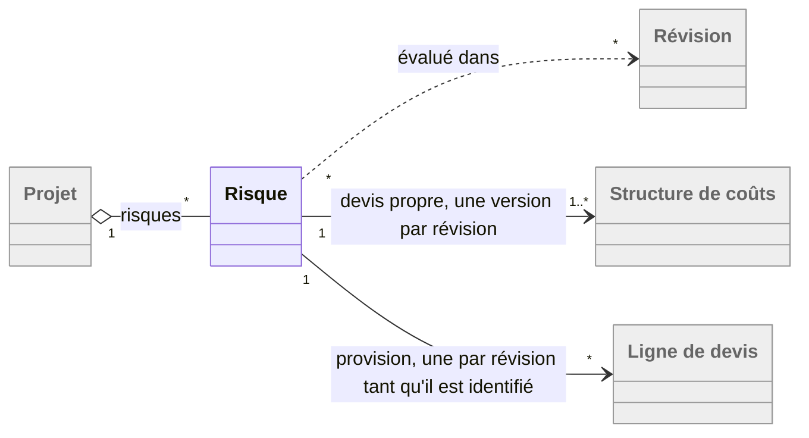

# Revue du 2026-10-09 — document complet, troisième passe, après intégration

## Suivi des revues précédentes

**Les 91 constats des 7 et 9 octobre (C-091 à C-181) sont intégrés** : chaque passage cité par ces
constats a été retrouvé dans son état corrigé, et les douze écarts consignés par l'auteur (C-105,
C-113, C-117, C-126, C-136, C-154, C-157, C-158, C-161, C-165, C-172, C-181, plus C-093, C-095 et
C-103 du 7 octobre) sont ceux de leur fichier. Cette passe ne les recopie pas : elle lit ce que
l'intégration a produit, et ce qu'elle a laissé autour d'elle.

**Une intégration est incomplète.** C-174 demandait une phrase au corps de WF-ADM-0060 définissant
l'anonymisation d'un compte ; la Vérif, WF-SEC-0030 et le §4.6.1 ont été mis à jour, le corps non.
Son statut passe à « intégré avec écart » dans le fichier du 9 octobre, et le trou est repris en
**C-188**.

**Vingt intégrations laissent un résidu**, que cette passe reprend en constats nouveaux : la phrase
insérée contredit une insertion voisine, ou le passage qu'elle corrigeait a des jumeaux qui n'ont
pas suivi. Les principaux : C-110 et C-113 se contredisent sur l'identifiant que les fichiers
portent (→ C-182) ; C-149 a inséré deux clauses incompatibles dans WF-PLA-0130 (→ C-206) ; C-138 a
placé le jalon de fin de lot sous une récapitulative qui, sans livrable, devient de durée nulle
(→ C-207) ; la Vérif proposée par C-096 dit l'inverse de son corps (→ C-208) ; C-154 a tranché
dans les corps sans que les Vérif suivent (→ C-223, C-225) ; la rédaction unique de WF-RAE-0010
(C-095, C-154) diverge du montant réestimé affiché (→ C-224, C-235) ; C-114 et C-165 ont été
intégrés au §3 sans que le §4 suive (→ C-190, C-185) ; C-116 a fait survivre le journal à la
restauration sans dire ce que ses clés étrangères deviennent (→ C-239) ; C-117 a ajouté l'action à
l'inscription, pas au glossaire (→ C-186) ; C-130 a été inséré avec la rédaction d'avant C-161
(→ C-228) ; C-139 a été écrit en cascade de base là où le lot n'est que marqué supprimé (→ C-242) ;
C-172 et C-176 ont mis la session et la table des tâches de fond en place sans dire ce que devient
la file (→ C-241, C-243, C-247) ; C-098 a fait dire à WF-RIS-0010 une exception que WF-PLA-0040 ne
porte pas (→ C-236) ; C-155 raisonne au jour courant sur une révision marquée (→ C-231) ; C-141 a
posé la date de début de planning avec des renvois qui ne la portent pas (→ C-212) ; C-173 a laissé
deux phrases et deux lignes sur l'ancien régime des exports (→ C-245, C-246) ; C-179 a adossé deux
flux à une Vérif que TFX-09 contredit déjà (→ C-240). L'écart de C-093 reste un trou (→ C-227) et
celui de C-105 est repris en constat, parce qu'il laisse une Vérif sans valeur (→ C-189).

**C-023** (reporté sur PO-01) reste ouvert ; **C-015** est sans objet.

## Ce que cette passe apporte

Elle trouve **soixante-quatorze** constats, dont **vingt-deux majeurs**, aucun bloquant — contre
soixante-dix-huit et trente-quatre majeurs à la passe précédente, sur un document qui a bougé en
deux cent soixante lignes. Un peu plus de la moitié tient aux intégrations elles-mêmes : des
phrases justes posées à côté de phrases qui ne le sont plus. L'autre moitié est ce qu'une
troisième lecture complète trouve encore : des cas limites que la rédaction précédente laissait
dans l'ombre (un lot sans livrable, une structure sans tâche, un lien de fixation expiré, un
projet sans code dans un message de refus).

Les recoupements entre relecteurs ont fusionné onze doublons : trois relecteurs ont trouvé
indépendamment l'entrée « Couverture des risques » restée sur le coût réestimé (C-228), deux
l'anonymisation sans corps (C-188), deux le journal réinscrit contre ses clés étrangères (C-239),
deux les valeurs livrées absentes (C-189), deux la date de début de planning sans import (C-212),
deux l'exception des provisions absente de WF-PLA-0040 (C-236), deux le §3.2.5 en retard sur
WF-RAE-0010 (C-235).

**Les issues #577 et #578**, relevées par la revue du lot EP-02/L42g, ont été vérifiées contre le
texte et confirmées ; elles sont reprises en **C-191** et **C-192**, avec les décisions de l'auteur
du 9 octobre — option (a) pour #577, option (b) pour #578 — rédigées en propositions prêtes à
coller, et complétées de deux cas que les issues ne couvraient pas : la catégorie à laquelle un
rôle de ressource est rattaché, et la désignation de la catégorie de provision quand plusieurs
natures de provision existent. **C-193** y ajoute un troisième volet : « employée » ne couvre pas
le rôle de ressource, de sorte qu'une nature peut quitter la main-d'œuvre sous un rôle qui l'exige.

## Où regarder d'abord

Les vingt-deux majeurs se rangent en sept familles.

1. **Les échanges par fichier (C-182, C-183).** Rien ne dit si l'identifiant que les fichiers
   portent est celui de la ligne ou de la lignée — l'aller-retour depuis une révision marquée ne
   marche que par la lignée —, ni sur quelle structure de coûts un import porte, alors qu'il
   supprime ce qui est absent du fichier.
2. **Le référentiel des coûts (C-191, C-192, C-193).** Les deux issues et leur troisième volet :
   une catégorie employée change de type par la porte d'à côté, la nature de provision de
   l'amorçage peut disparaître, et un rôle de ressource ne compte pas comme un emploi.
3. **Les comptes et l'installation (C-188, C-189, C-194).** L'anonymisation sans corps ; les
   bornes et le délai livrés sans valeur ; le lien de fixation de l'administrateur qui expire en
   une heure sans que personne puisse le renvoyer.
4. **La planification et le lotissement (C-206, C-207, C-208).** Deux clauses contradictoires sur
   les tâches fusionnées ; une récapitulative de durée nulle que WF-PLA-0050 fait jalon ; une Vérif
   qui fait échouer un logiciel conforme.
5. **Les montants, l'inflation et les risques (C-223, C-224, C-225, C-226, C-227, C-231).** Les
   Vérif chiffrent sans inflation ; le reste à engager d'une tâche non démarrée diverge du montant
   réestimé affiché ; la provision peut composer l'inflation deux fois ; la survenance ne place ni
   ne date les tâches fusionnées ; le §4 range au régime projet une évaluation que l'abandon doit
   défaire ; le plan de charge raisonne au jour courant sur une révision marquée.
6. **Le portefeuille (C-190).** Un projet sans révision en cours exige au jour courant un recalcul
   que WF-DAT-0040 interdit au portefeuille.
7. **La technique (C-239, C-240, C-241, C-242).** Les inscriptions réinscrites après restauration
   contre les clés étrangères ; `/metrics` en HTTP contre « aucune connexion en clair » ; la file
   de tâches, seule chose dans Redis qui ne se reconstruit pas ; la cascade de base qui ne se
   déclenche pas sur un lot marqué supprimé.

Les cinquante-deux mineurs sont pour l'essentiel des textes d'introduction, des entrées de
glossaire et des Vérif en retard sur les exigences qu'ils accompagnent, et une dizaine de cas
limites non tranchés.

## Ce que la revue ne signale pas

- « le coût réel rapporté au projection du chef de projet » (§3.4.5.8 et annexe A, entrée
  « Avancement financier ») : survivance du remplacement de C-114, un accord à corriger.
- « qui la citait » pour « qui le citait » dans la Vérif de WF-PLA-0130, et les puces 3 et 4 du
  §3.4.4 sans gras : typographie.
- Les identifiants suffixés « -A » (WF-ADM-0190-A) suivent la convention de toutes les exigences.
- L'index : 210 lignes pour 210 blocs hors WF-EXA-0010, sections, titres et flexibilités
  identiques, aucune référence WF morte.
- Le taux de transformation qui ignore l'abandon depuis Chiffrage : choix de conception.

## Constats

| # | Gravité | Emplacement | Constat | Statut |
|---|---|---|---|---|
| C-182 | majeur | annexe B « Formats d’échanges Excel », première phrase ; annexe A,… | L'identifiant que l'export écrit et que l'import rapproche est la lignée selon le glossaire, l'identifiant de ligne selon l'annexe B, et les exigences ne tranchent pas | à traiter |
| C-183 | majeur | §3.1.4, exigence WF-INTF-0090-A ; WF-INTF-0040-A, WF-INTF-0100-A,… | Aucune exigence ne dit sur quelle structure de coûts de la révision un import ou un export porte, alors qu'un import supprime les tâches absentes du fichier | à traiter |
| C-184 | mineur | §3.2.6 « Risques », figure 7  ; texte d'introduction du §3.2.6 | La figure 7 donne au risque un seul devis propre et une seule provision ; le texte réécrit et WF-REV-0100 en figent une version par révision | à traiter |
| C-185 | mineur | annexe A, entrée « Date de calcul » ; à rapprocher de… | L'entrée « Date de calcul » ignore le cas de la dernière révision marquée lue au jour courant | à traiter |
| C-186 | mineur | annexe A, entrée « Journal d'audit » ; à rapprocher de… | L'entrée « Journal d'audit » omet l'action parmi ce qu'une inscription porte | à traiter |
| C-187 | mineur | annexe A, entrée « Objet du référentiel » ; §3.2.3, figure 4 | L'entrée « Objet du référentiel » fait conserver par la révision six objets là où WF-REV-0030 en conserve quatre | à traiter |
| C-188 | majeur | §3.4.2.1 « FBS-1.1 : Gestion des utilisateurs » — exigence… | L'anonymisation d'un compte est vérifiée, journalisée et promise, mais aucun corps d'exigence ne la définit | à traiter |
| C-189 | majeur | §4.5.2 « Installation initiale » — exigence WF-EXP-0020-A et texte… | Les valeurs livrées des bornes de la matrice et du délai entre revues ne sont écrites nulle part | à traiter — écart de C-105 |
| C-190 | majeur | §3.4.3 « FBS-2 : Portefeuille » — exigence WF-PTF-0010-A ; §4.4.2… | Au jour courant, un projet sans révision en cours exige un recalcul que le §4 interdit au portefeuille | à traiter |
| C-191 | majeur | §3.4.4.1.1 « FBS-3.1.1 : Nature et catégories de coûts » —… | Issue #577 : une catégorie employée peut changer de nature, et donc de type | à traiter — issue #577, décision de l'auteur : option (a) |
| C-192 | majeur | §3.4.4.1.1 « FBS-3.1.1 : Nature et catégories de coûts » —… | Issue #578 : la nature provision de l'amorçage peut changer de type ou perdre sa catégorie tant qu'aucun risque n'est déclaré | à traiter — issue #578, décision de l'auteur : option (b) |
| C-193 | majeur | §3.4.4.1.1 « FBS-3.1.1 : Nature et catégories de coûts » —… | « Employée » ne couvre pas le rôle de ressource : le type d'une nature peut quitter la main-d'œuvre sous un rôle qui l'exige | à traiter |
| C-194 | majeur | §3.4.2.1 « FBS-1.1 : Gestion des utilisateurs » — exigence… | Le lien de fixation produit à l'installation vaut une heure, et rien ne permet d'en obtenir un autre | à traiter |
| C-195 | mineur | §3.4.4.1.1 « FBS-3.1.1 : Nature et catégories de coûts » —… | La catégorie de coût n'a pas de libellé, et son code « n'intervient dans aucun import » alors qu'il est son seul nom | à traiter |
| C-196 | mineur | §4.4.1 « Modèle de données et conventions » — exigence… | Trois unicités du référentiel manquent à la liste que la base déclare | à traiter |
| C-197 | mineur | §4.4.1 « Modèle de données et conventions », tableau 10 «… | Les bornes de la matrice de risques n'ont pas de table | à traiter |
| C-198 | mineur | §3.4.3 « FBS-2 : Portefeuille » — exigence WF-PTF-0020-A | « À la seule exception » suivie de deux exceptions | à traiter |
| C-199 | mineur | §3.4.3.4 « FBS-2.4 : Structure des coûts du portefeuille » —… | Le devis courant d'une offre, provisions comprises, tient lieu d'un budget de référence qui n'en contient jamais | à traiter |
| C-200 | mineur | §3.4.2.1 « FBS-1.1 : Gestion des utilisateurs » — exigence… | « Quotidienne par défaut, comme celle des sauvegardes » : WF-ADM-0170 ne fixe aucune valeur par défaut | à traiter |
| C-201 | mineur | §3.4.4.2.2 « FBS-3.2.2 : Rôles de ressources » — exigence… | Le nœud d'un rôle ne se change pas, mais seulement en prose ; WF-REF-0130 dit « rattachement » modifiable | à traiter |
| C-202 | mineur | §4.2.2 « Allocation des fonctions », tableau 7 « Correspondances… | La ligne FBS-1.2 du tableau 7 cite PBS-2.5, qu'aucune exigence de FBS-1.2 n'engage | à traiter |
| C-203 | mineur | §3.4.2.2 texte, second alinéa ; §3.4.4 texte | Six phrases d'introduction ou de glossaire en retard sur les exigences qu'elles annoncent | à traiter |
| C-204 | mineur | §3.4.2.2, texte d'introduction  ; §3.4.5.2, WF-PRJ-0070-A | L'introduction de FBS-1.2 compte deux exceptions à la liste des contributeurs, WF-PRJ-0070 en ajoute une troisième | à traiter |
| C-205 | mineur | §3.4.3.5, WF-PTF-0090-A, dernière phrase du corps ; à rapprocher… | WF-PTF-0090 exclut les projets terminés de la couverture agrégée en les disant sans référence | à traiter |
| C-206 | majeur | §3.4.5.3 « Planification » — exigence WF-PLA-0130-A  ; à… | « Une tâche fusionnée n'en porte pas » contredit le refus de la fusion qui déplace la tâche d'un lot | à traiter |
| C-207 | majeur | §3.4.5.2.1 « Lotissement du projet » — exigence WF-PRJ-0030-A  ;… | Le squelette d'un lot sans livrable produit une récapitulative de durée nulle, que WF-PLA-0050 interdit | à traiter |
| C-208 | majeur | §3.4.5.3 — exigence WF-PLA-0020-A | La Vérif du conflit avec une tâche manuelle dit l'inverse du corps | à traiter |
| C-209 | mineur | §3.4.5.3 — exigence WF-PLA-0130-A  ; à rapprocher de §1.3.1 | « Attributs d'une tâche » porte sept règles du rattachement : exigence non atomique | à traiter |
| C-210 | mineur | §3.4.5.2.1 — exigence WF-PRJ-0030-A  ; WF-PLA-0130-A | Le squelette se propose sur « une structure sans tâche » ici, « que sur la structure principale » là | à traiter |
| C-211 | mineur | §3.4.5.2.1 — exigence WF-PRJ-0030-A  ; WF-PLA-0130-A | « ne change … aucune tâche » alors que la suppression d'un lot retire un attribut de la tâche | à traiter |
| C-212 | mineur | §3.4.5.3 — exigence WF-PLA-0020-A  ; WF-REV-0030-A | La date de début de planning : un renvoi qui ne la porte pas, une « création » ambiguë, un import et un export qui ne la nomment pas | à traiter |
| C-213 | mineur | §3.4.5.3 — exigence WF-PLA-0040-A  ; WF-PLA-0050-A | La récapitulative dégradée en feuille : un jalon « démarré », et une durée que rien ne définit | à traiter |
| C-214 | mineur | §3.4.5.3.3 « Diagramme de GANTT » — exigence WF-PLA-0100-A | « affiche une marge nulle » : faux quand la subordonnée critique porte une marge négative | à traiter |
| C-215 | mineur | §3.4.5.1 « Gestion des révisions » — exigence WF-REV-0070-A  ;… | L'historique des révisions affiche quatre attributs, la Vérif de WF-REV-0090 en exige sept | à traiter |
| C-216 | mineur | §3.4.5.1 — exigence WF-REV-0060-A | « les taux conservés sont appliqués » sans « projetés », à côté de « aux taux conservés, projetés » | à traiter |
| C-217 | mineur | §3.4.5.3 — exigence WF-PLA-0010-A  ; à rapprocher de WF-PRJ-0010-A | Le refus nomme le projet « par son libellé et son code » : un projet en chiffrage n'a pas de code | à traiter |
| C-218 | mineur | §3.4.5.3 — exigence WF-PLA-0160-A  ; §4.4.1 WF-DAT-0100-A | L'exemple des 2 ej raisonne en heures civiles que le modèle ne porte pas | à traiter |
| C-219 | mineur | §3.4.5.3 — exigence WF-PLA-0130-A  ; WF-REV-0010-A | La suppression d'un lot ne nettoie que la révision en cours : la révision suivante reprend un rattachement à un lot supprimé | à traiter |
| C-220 | mineur | §3.4.5.3 — exigence WF-PLA-0020-A  ; §3.4.5.3.3 — WF-PLA-0100-A | Le conflit avec une tâche manuelle n'est défini que pour une liaison fin à début | à traiter |
| C-221 | mineur | §3.4.5.3 — exigence WF-PLA-0130-A  ; §3.4.5.1 — WF-REV-0050-A | WF-PLA-0130 fait parler « le compte rendu » d'une fusion que WF-REV-0050 ne prévoit pas | à traiter |
| C-222 | mineur | annexe A « Glossaire » ; §3.4.5.2.1 | « Rattachement », « date de début de planning » et « squelette de planning » manquent au glossaire | à traiter |
| C-223 | majeur | §3.4.5.4 « Chiffrage et devis » — exigence WF-DEV-0020-A  ;… | Les Vérif du montant d'une ligne chiffrent sans inflation ce que le corps dit « inflation comprise » | à traiter |
| C-224 | majeur | §3.4.5.5 « Estimation du reste à engager » — exigence… | Une tâche non démarrée compte pour son montant budgété « reporté », ce qui ignore les taux de la nouvelle année et diverge du montant réestimé affiché | à traiter |
| C-225 | majeur | §3.4.5.4.3 « Gestion des coûts » — exigence WF-DEV-0030-A ;… | Rien ne dit si une ligne de provision est projetée par l'inflation, alors que sa gravité l'est déjà | à traiter |
| C-226 | majeur | §3.4.5.6.2 « Gestion des provisions pour risques » — exigence… | La survenance ne dit ni où les tâches fusionnées se placent dans l'arbre, ni quelles dates elles prennent | à traiter |
| C-227 | majeur | §4.4.1 « Modèle de données et conventions », paragraphe « Quatre… | L'écart de C-093 laisse un trou : l'abandon d'une révision ne peut pas défaire une évaluation de risque que le §4 range au régime projet | à traiter |
| C-228 | mineur | annexe A, entrée « Couverture des risques » ; §3.2.6 « Risques »,… | Le glossaire compare encore la réserve au « coût réestimé » des survenus, et « coût à la survenance » n'a pas d'entrée | à traiter |
| C-229 | mineur | §3.4.5.7 « Coûts réels » — exigence WF-CRE-0020-A | La phrase insérée dans WF-CRE-0020 rejette une ligne « sans partie sous-projet » que la phrase suivante accepte | à traiter |
| C-230 | mineur | §3.4.5.8 « Indicateurs projets » — exigence WF-IND-0010-A  ;… | « exclue ensuite n’y entre pas » dit l'inverse de « telles qu’elles étaient alors », et WF-DAT-0040 ne conserve pas les courbes | à traiter |
| C-231 | majeur | §3.4.5.4.4 « Plan de charge du projet » — exigence WF-DEV-0070-A … | Le plan de charge raisonne au « jour courant » là où la base est une révision marquée ou une date de portefeuille, et nomme une base que la liste n'a pas | à traiter |
| C-232 | mineur | §3.4.5.5.1 « Indicateurs de reste à engager » — exigence… | Le signe des écarts du reste à engager n'est pas défini, et « la couverture des risques » est accrochée à l'énumération de « deux écarts » | à traiter |
| C-233 | mineur | §3.4.5.8.3 « Avancement physique » — exigence WF-IND-0060-A | L'exemple à 50 % de l'avancement physique dépend de quelles subordonnées sont terminées, et le ratio par récapitulative ne dit pas ce qu'il compte | à traiter |
| C-234 | mineur | §3.4.5.6.1 « Grille de suivi des risques » — exigence WF-RIS-0040-A | La grille des risques distingue deux groupes de risques, sa Vérif attend trois totaux | à traiter |
| C-235 | mineur | §3.2.5 « Chiffrage et coûts », paragraphe « Reste à engager » ;… | Le §3.2.5 et l'introduction du §3.4.5.5 décrivent encore trois cas sans la tâche non démarrée réestimée depuis la grille | à traiter |
| C-236 | mineur | §3.4.5.3 « Planification » — exigence WF-PLA-0040-A  ; §3.6 —… | L'état d'une récapitulative et son signalement n'excluent pas les lignes de provision, contrairement à WF-RIS-0010 | à traiter |
| C-237 | mineur | §3.4.5.8.7 « Coûts cumulés » — exigence WF-IND-0100-A  ; §3.4.5.4… | « un délai de paiement de 60 jours sur toutes les lignes » alors que le délai est « nul pour la main-d’œuvre » | à traiter |
| C-238 | mineur | §3.4.5.6.1, WF-RIS-0010-A ; à rapprocher de WF-RIS-0020-A | La ligne de provision d'un risque déclaré sur une structure sans tâche n'a rien pour la porter | à traiter |
| C-239 | majeur | §3.4.2.4 « Sauvegarde et restauration » — exigence WF-ADM-0160-A ;… | Une inscription réinscrite après restauration peut citer un objet qui n'existe plus | à traiter |
| C-240 | majeur | §4.6.1 « Sécurité » — exigence WF-SEC-0010-A ; §4.3.2 tableau 8… | « Aucune connexion en clair » contre un point de métriques servi en HTTP | à traiter |
| C-241 | majeur | §4.2.1.3 « PBS-3.2 Redis » ; §4.2.2 WF-ARC-0040-A | La file de tâches est la seule chose dans Redis qui ne se reconstruit pas | à traiter |
| C-242 | majeur | §4.4.1 — exigence WF-DAT-0090-A ; à rapprocher de §3.4.5.3… | La mise à nul du rattachement est une cascade de la base qui ne se produit pas quand le lot est marqué supprimé | à traiter |
| C-243 | mineur | §4.4.1, texte « Correspondance entre objets et tables », dernière… | « La rétention de son résultat » n'a pas de valeur | à traiter |
| C-244 | mineur | §4.4.1 texte ; §4.4.5 WF-DAT-0130-A | « Paramètre d'exploitation » : trois emplois, aucune définition | à traiter |
| C-245 | mineur | §4.2 « Découpage technique », texte d'introduction, paragraphe «… | Les exports sont sur le stockage objet partout, sauf dans deux phrases et deux lignes | à traiter |
| C-246 | mineur | §4.2.2 — exigence WF-ARC-0040-A, dernière phrase du corps | « Aucune donnée métier n'existe ailleurs que dans PostgreSQL » face aux fichiers exportés | à traiter |
| C-247 | mineur | §4.4.1, paragraphes « Quatre régimes de données » , «… | « Trois régimes, et aucun quatrième » : les trois lignes techniques en font un, rangé dans le mauvais paragraphe | à traiter |
| C-248 | mineur | §4.3.4 figure 19 Diagramme de séquence des imports ; WF-ARC-0100-A | Le fichier d'un import refusé à l'application est supprimé par la figure, pas par les exigences | à traiter |
| C-249 | mineur | §4.3.1 « Diagramme de déploiement », texte d'introduction ; à… | « Ne parle hors du cluster qu'à l'annuaire et au serveur de messagerie » oublie le fournisseur d'identité externe | à traiter |
| C-250 | mineur | §4.3.2 tableau 8, ligne TFX-13 ; §4.3.1 figure 18, arêtes « API… | L'API et le worker envoient des courriels que personne ne demande | à traiter |
| C-251 | mineur | §4.3.1 figure 18 Diagramme de déploiement  ; §4.3.2 tableau 8,… | TFX-10 n'a pas de source sur la figure 18 | à traiter |
| C-252 | mineur | §4.6.1 — exigence WF-SEC-0030-A, corps, et texte d'introduction du… | « La contractualisation d'un avenant » n'est pas le nom d'une action, et la liste du §4.4.1 est en retard sur WF-SEC-0030 | à traiter |
| C-253 | mineur | §4.6.3 « Observabilité » — exigence WF-OBS-0030-A, Vérif | « Chaque seuil est vérifiable par un essai à sa borne » n'est pas une condition observable | à traiter |
| C-254 | mineur | §4.5.4 — exigence WF-EXP-0040-A, corps ; §3.6 WF-IHM-0010-A, motif | L'écran d'état signale « chaque composant indisponible », sauf les deux qui l'empêchent de s'afficher | à traiter |
| C-255 | mineur | §4.4.4 — exigence WF-DAT-0120-A, corps et Vérif ; §4.3.3 tableau… | « Supprimé à son téléchargement » : au premier octet, au dernier, au premier téléchargement ? | à traiter |

---

## C-182 — L'identifiant que l'export écrit et que l'import rapproche est la lignée selon le glossaire, l'identifiant de ligne selon l'annexe B, et les exigences ne tranchent pas

- **gravité** : majeur
- **emplacement** : annexe B « Formats d’échanges Excel », première phrase ; annexe A, entrée « Lignée » ; §3.1.4, exigences `WF-INTF-0050-A`, `WF-INTF-0100-A`, `WF-INTF-0120-A` ; à rapprocher de `WF-DAT-0030-A` (§4.4.2), `WF-INTF-0090-A`, `WF-INTF-0110-A`, `WF-INTF-0130-A`
- **citation** : « Les deux formats portent l’identifiant de ligne que l’export écrit, et que l’import rapproche (WF-INTF-0100, WF-INTF-0120). » (annexe B) ; « C'est elle que les imports rapprochent, qu'un différentiel désigne, et qui permet de comparer deux révisions. » (glossaire, « Lignée ») ; « une ligne du fichier qui porte l’identifiant d’une ligne de la révision en cours la met à jour » (WF-INTF-0100) ; « Chaque tâche y porte son identifiant Waterfall dans le champ d’identifiant unique de MS Project » (WF-INTF-0050) ; « l’identifiant de sa ligne, propre à la révision, et l’identifiant de sa lignée » (WF-DAT-0030)

**Constat.** WF-DAT-0030 donne à chaque tâche et à chaque ligne deux identifiants, et les nomme :
« l’identifiant de sa ligne, propre à la révision » et « l’identifiant de sa lignée », conservé
« par toutes les copies d’une révision à l’autre ». Les deux phrases nouvelles du périmètre choisissent
chacune l'un des deux : l'annexe B (C-113) dit que les fichiers portent « l’identifiant de ligne »,
le glossaire (C-110) dit que la lignée est ce « que les imports rapprochent ». Les exigences
elles-mêmes ne disent pas lequel : WF-INTF-0050 écrit « son identifiant Waterfall », WF-INTF-0100 et
WF-INTF-0120 rapprochent « l’identifiant d’une ligne de la révision en cours », et WF-DAT-0030, qui
énumère ce qui « s’appuie sur l’identifiant de lignée », n'y met pas les imports.

Le choix n'est pas indifférent. WF-INTF-0110 et WF-INTF-0130 autorisent l'export « d’une révision, en
cours ou marquée », et WF-INTF-0090 fait appliquer tout import à la révision en cours — qu'il crée au
besoin à partir de la dernière révision marquée. Un fichier exporté de la révision marquée v3 et
réimporté dans la révision en cours est le cas normal d'une revue (Motif de WF-INTF-0120 : « le
fichier exporté part, revient »). Si l'identifiant écrit est celui de la ligne, propre à v3, aucune
ligne du fichier ne porte « l’identifiant d’une ligne de la révision en cours » : selon l'exigence,
chacune est traitée comme une ligne nouvelle — ou rejetée, l'exigence ne disant rien d'un identifiant
inconnu —, et l'aller-retour que promettent les Motifs de WF-INTF-0100 et WF-INTF-0120 ne vaut que
depuis la révision en cours. Si c'est la lignée, l'aller-retour vaut depuis n'importe quelle révision,
ce que le glossaire affirme et que l'annexe B contredit. Le développeur de l'export et celui de
l'import peuvent faire deux choix différents en suivant chacun une phrase du document.

**Proposition.** Trancher pour la lignée, qui est ce que le Motif de WF-INTF-0040 et les deux Vérif
d'aller-retour supposent, et le dire aux quatre endroits.

Annexe B, dernière phrase du premier paragraphe : « Les deux formats portent l’identifiant de lignée
de chaque ligne (WF-DAT-0030), que l’export écrit et que l’import rapproche (WF-INTF-0100,
WF-INTF-0120). »

WF-INTF-0050, corps : « Chaque tâche y porte son identifiant de lignée (WF-DAT-0030) dans le champ
d’identifiant unique de MS Project, et son calendrier applicable (WF-PLA-0010) comme calendrier de
tâche ; […] ».

WF-INTF-0100, corps : « L’import est un aller-retour fondé sur l’identifiant de lignée que porte
toute ligne (WF-DAT-0030) : une ligne du fichier dont la lignée est celle d’une ligne de la révision
en cours la met à jour — […] — sans toucher à son montant budgété ni à sa lignée ; une ligne sans
identifiant, ou dont la lignée n’existe pas dans la révision en cours, devient une ligne nouvelle,
[…] ». Vérif, ajouter : « Un devis exporté d’une révision marquée puis réimporté dans la révision en
cours met à jour les lignes de même lignée sans en créer aucune. »

WF-INTF-0120, corps : « Chaque ligne du fichier dont la lignée est celle d’une ligne de la révision en
cours (WF-DAT-0030) met à jour ses grandeurs réestimées […] ». Vérif, ajouter la même phrase
d'aller-retour depuis une révision marquée.

Hors périmètre, WF-DAT-0030, corps, dernière phrase : « La comparaison de deux révisions, le
diagramme temps/temps, les inscriptions aux chronologies et au suivi temps/temps et le rapprochement
des imports (WF-INTF-0040, WF-INTF-0100, WF-INTF-0120) s’appuient sur l’identifiant de lignée. »

Si l'auteur préfère l'identifiant de ligne, c'est alors le glossaire qu'il faut corriger (retirer
« que les imports rapprochent ») et WF-INTF-0100 et WF-INTF-0120 qui doivent dire ce que devient une
ligne dont l'identifiant n'appartient pas à la révision en cours.

**Statut.** à traiter

---

## C-183 — Aucune exigence ne dit sur quelle structure de coûts de la révision un import ou un export porte, alors qu'un import supprime les tâches absentes du fichier

- **gravité** : majeur
- **emplacement** : §3.1.4, exigence `WF-INTF-0090-A` ; `WF-INTF-0040-A`, `WF-INTF-0100-A`, `WF-INTF-0110-A`, `WF-INTF-0120-A`, `WF-INTF-0130-A` ; à rapprocher de `WF-REV-0100-A`, `WF-RIS-0030-A`, `WF-PLA-0130-A`
- **citation** : « Les imports de planning, de devis et de reste à engager s’appliquent à la révision en cours d’élaboration du projet. » (WF-INTF-0090) ; « une tâche existante absente du fichier est supprimée selon WF-PLA-0070, une tâche démarrée ou terminée étant conservée et signalée » (WF-INTF-0040) ; « une ligne existante absente du fichier est supprimée, sauf si sa tâche est démarrée ou terminée » (WF-INTF-0100) ; « exporter le devis d’une révision, en cours ou marquée » (WF-INTF-0110)

**Constat.** Depuis WF-REV-0100, une révision porte « une structure de coûts principale, et le cas
échéant des structures différentielles et une structure propre par risque », chacune avec son arbre
de tâches et de lignes. Les six exigences d'échange parlent de « la révision en cours », du
« planning », du « devis » et du « reste à engager » d'une révision, jamais d'une structure. Or
l'import est un aller-retour qui crée les tâches sans identifiant et supprime « une tâche existante
absente du fichier » (WF-INTF-0040) ou « une ligne existante absente du fichier » (WF-INTF-0100).
Trois lectures sont possibles, et aucune n'est écrite : l'import porte sur la seule structure
principale, et alors ni un différentiel ni le devis propre d'un risque — que WF-RIS-0030 fait saisir
« comme celui du projet » — ne s'importent ; il porte sur toutes les structures de la révision, et
alors l'import d'un planning principal supprime les tâches de tous les devis propres de risques, qui
ne sont pas dans le fichier ; ou l'utilisateur désigne la structure, et rien ne dit où ni comment, ni
quelle structure un export de « devis d’une révision » écrit. Le rejet nouveau de WF-INTF-0040 (« la
tâche d’un lot hors du sous-arbre de la tâche de son poste ») suppose la structure principale,
puisque le rattachement n'existe que là (WF-PLA-0130), sans que l'exigence le dise. Le développeur
de l'import doit choisir, et deux des trois choix sont destructeurs ou incomplets.

**Proposition.** Dans WF-INTF-0090, corps, après la première phrase :

> Un import porte sur une seule structure de coûts de cette révision, désignée par l’utilisateur au
> lancement de l’import — la structure principale par défaut, ou une structure différentielle ou le
> devis propre d’un risque de la révision en cours (WF-REV-0100). Les tâches et les lignes créées y
> sont ajoutées, et seules les tâches et les lignes de cette structure absentes du fichier sont
> supprimées ; les autres structures de la révision sont inchangées.

Vérif de WF-INTF-0090, ajouter : « L’import d’un planning sur la structure principale d’une révision
qui porte un devis propre de risque laisse ce devis propre inchangé, tâches comprises ; l’import du
même fichier sur ce devis propre laisse la structure principale inchangée. » Dans WF-INTF-0110 et
WF-INTF-0130, corps : « exporter le devis [le reste à engager] d’une structure de coûts d’une
révision, en cours ou marquée, la structure principale par défaut ». Dans WF-INTF-0040, corps, après
« ne sont jamais importés […] ce qui a été ignoré. » : « L’import porte sur la structure désignée
(WF-INTF-0090) ; le rejet pour déplacement hors du sous-arbre d’un poste ne s’applique qu’à la
structure principale, seule à porter des rattachements (WF-PLA-0130). »

Si l'auteur préfère réserver les échanges à la structure principale, écrire dans WF-INTF-0090 : « Un
import ne porte que sur la structure principale de cette révision ; les structures différentielles
et les devis propres des risques ne s’importent ni ne s’exportent par fichier, et ne sont pas
touchés par un import. » et le dire aussi dans WF-INTF-0110 et WF-INTF-0130.

**Statut.** à traiter

---

## C-184 — La figure 7 donne au risque un seul devis propre et une seule provision ; le texte réécrit et WF-REV-0100 en figent une version par révision

- **gravité** : mineur
- **emplacement** : §3.2.6 « Risques », figure 7 (source `figures/modele-risques.mmd`) ; texte d'introduction du §3.2.6 ; à rapprocher de `WF-RIS-0020-A`, `WF-RIS-0030-A`, `WF-REV-0100-A`
- **citation** : « Risque "1" --> "1" Structure : devis propre » et « Risque "1" --> "0..1" LigneDevis : provision » (figure 7) ; « son évaluation — probabilité, état, structure propre et ligne de provision — est portée par chaque révision, qui fige celle qu’on en faisait à sa date (WF-RIS-0020) » (§3.2.6)

**Constat.** C-093 a fait réécrire la première phrase du §3.2.6 : l'évaluation d'un risque,
structure propre et ligne de provision comprises, est « portée par chaque révision ». WF-RIS-0030
(« chaque révision en fige une version ») et WF-REV-0100 (« Une structure propre de risque existe
tant que le risque existe, et chaque révision en fige une version ») disent la même chose. La figure
7, juste au-dessous, n'a pas bougé : un risque y est relié à exactement une structure de coûts et à
au plus une ligne de devis, et la révision n'y figure pas. Lue avec les conventions du §3.2.1, elle
dit qu'un risque n'a qu'un devis propre, ce qui est précisément ce que la phrase nouvelle nie. Le
§3.2 ne porte aucune exigence et WF-REV-0100 est net : le risque est de lecture, pas
d'implémentation, mais c'est la seule figure du modèle à contredire son propre texte.

**Proposition.** Dans `figures/modele-risques.mmd`, faire apparaître la révision comme objet
d'ancrage et porter les cardinalités à une version par révision :

Et ajouter au paragraphe « Représentations d’un risque », après « qui décrit ce qu’il coûterait
s’il survenait. » : « Chaque révision en fige une version, comme de la ligne de provision
(WF-REV-0100) ; la figure montre l’une d’elles. »

**Statut.** à traiter

---

## C-185 — L'entrée « Date de calcul » ignore le cas de la dernière révision marquée lue au jour courant

- **gravité** : mineur
- **emplacement** : annexe A, entrée « Date de calcul » ; à rapprocher de `WF-IND-0010-A`, de l'entrée « Révision courante » et de `WF-RAE-0010-A`
- **citation** : « Désigne la date à laquelle un indicateur est établi : la date de marquage pour une révision marquée, le jour courant pour la révision en cours. »

**Constat.** C-165 a fait écrire dans WF-IND-0010 : « Lorsque le projet ne comporte pas de révision
en cours, ses indicateurs au jour courant se calculent sur sa dernière révision marquée, avec le
coût réel au jour courant », et C-114 a défini la « Révision courante » en conséquence. L'entrée
« Date de calcul » est restée à deux cas : pour « une révision marquée », la date de marquage. Lue
avec WF-IND-0010, elle est fausse pour le troisième cas, où une révision marquée est lue au jour
courant et où la date de calcul est le jour courant. WF-RAE-0010 compte « les lignes de provision
des risques identifiés à la date de calcul » : pour un projet qui vient de marquer sa revue, le
glossaire fait lire cette date au marquage et WF-IND-0010 au jour courant.

**Proposition.**

> **Date de calcul.** Désigne la date à laquelle un indicateur est établi : le jour courant pour les
> indicateurs au jour courant, qu'ils se lisent dans la révision en cours ou, à défaut, dans la
> dernière révision marquée ; la date de marquage pour les indicateurs conservés d'une révision
> marquée (WF-IND-0010).

**Statut.** à traiter

---

## C-186 — L'entrée « Journal d'audit » omet l'action parmi ce qu'une inscription porte

- **gravité** : mineur
- **emplacement** : annexe A, entrée « Journal d'audit » ; à rapprocher de `WF-SEC-0030-A`, `WF-ADM-0190-A`
- **citation** : « Désigne la table qui inscrit chaque action irréversible ou structurante avec sa date, son auteur, son objet et son projet (WF-SEC-0030). »

**Constat.** C-117 a fait porter à chaque inscription « l'action, la date, l'auteur, l'objet concerné
et le projet s'il y en a un » (WF-SEC-0030), et WF-ADM-0190 filtre le journal « par action ». L'entrée
du glossaire, insérée ensuite, énumère quatre champs et oublie l'action, qui est celui dont C-117
avait relevé l'absence. Elle dit par ailleurs « son projet » sans la réserve « s'il y en a un » :
la création d'un compte ou d'un rôle n'en a aucun.

**Proposition.**

> **Journal d'audit.** Désigne le registre, tenu dans une table de la base de Waterfall, qui inscrit
> chaque action irréversible ou structurante avec l'action, sa date, son auteur, son objet et, s'il y
> en a un, son projet (WF-SEC-0030). Il se consulte et se filtre (WF-ADM-0190), ne se modifie ni ne
> se supprime, et survit à une restauration (WF-ADM-0160).

**Statut.** à traiter

---

## C-187 — L'entrée « Objet du référentiel » fait conserver par la révision six objets là où WF-REV-0030 en conserve quatre

- **gravité** : mineur
- **emplacement** : annexe A, entrée « Objet du référentiel » ; §3.2.3, figure 4 ; à rapprocher de `WF-REV-0030-A`, `WF-INTF-0170-A`
- **citation** : « Désigne l'un des objets du référentiel commun — nœud d'organisation, rôle de ressource, calendrier, nature de coût, catégorie de coût ou taux horaire — tel qu'une révision en conserve la valeur employée (WF-REV-0030). » (glossaire) ; « Une révision conserve les valeurs du référentiel employées par ses structures — rôles de ressources, calendriers, catégories de coût et taux horaires » (WF-REV-0030)

**Constat.** L'entrée, ajoutée par C-109 pour donner un nom à l'objet grisé de la figure 4, énumère
six objets et dit qu'une révision « en conserve la valeur employée ». WF-REV-0030 n'en conserve que
quatre : ni le nœud d'organisation ni la nature de coût ne sont dans sa liste, et ils n'ont pas à
l'être, une ligne de devis n'employant que le rôle, le calendrier, la catégorie et le taux. Le terme
sert aussi, au sens large des six objets, dans WF-INTF-0170 (« les objets du référentiel » ne sont
pas traduits) et au §3.2.2 (« Les objets du référentiel ne se suppriment pas »). La définition
mélange les deux emplois : pris à la lettre, elle fait conserver par chaque révision des nœuds et
des natures que WF-REV-0030 ne conserve pas.

**Proposition.**

> **Objet du référentiel.** Désigne l'un des objets du référentiel commun : nœud d'organisation,
> rôle de ressource, calendrier, nature de coût, catégorie de coût ou taux horaire. Une révision
> conserve la valeur de ceux que ses structures emploient — rôles, calendriers, catégories et taux
> (WF-REV-0030) ; c'est à ce titre que l'objet figure dans la figure 4.

**Statut.** à traiter

---

## C-188 — L'anonymisation d'un compte est vérifiée, journalisée et promise, mais aucun corps d'exigence ne la définit

- **gravité** : majeur
- **emplacement** : §3.4.2.1 « FBS-1.1 : Gestion des utilisateurs » — exigence `WF-ADM-0060-A` ; §4.6.1 « Sécurité », texte « Un mot des données personnelles » ; `WF-SEC-0030-A`
- **citation** : « Un compte se crée, se modifie et se désactive ; il ne se supprime pas. Un compte désactivé ne peut plus se connecter, n’est plus proposé comme contributeur, et reste affiché partout où il a agi. Il peut être réactivé. » (WF-ADM-0060, corps) ; « Après anonymisation d’un compte désactivé, aucun écran ne présente plus son nom ni son adresse ; les révisions qu’il a marquées affichent le libellé neutre comme auteur ; sa réactivation est refusée. » (WF-ADM-0060, Vérif) ; « une demande d'effacement se traite en anonymisant le compte (WF-ADM-0060) » (§4.6.1)

**Constat.** C-174 proposait deux choses : une phrase au corps de WF-ADM-0060 qui définit
l'anonymisation — qui la demande, qui la fait, ce qu'elle remplace, son irréversibilité — et une
phrase à la Vérif qui la teste. Seule la seconde est dans la projection. Le corps connaît toujours
trois actes, « se crée, se modifie et se désactive », et dit qu'un compte désactivé « peut être
réactivé » sans exception. La Vérif teste donc un acte que l'exigence n'énonce pas et contredit
son corps sur la réactivation ; le §4.6.1 renvoie à WF-ADM-0060 pour un traitement qui n'y est
pas ; WF-SEC-0030 journalise « l'anonymisation d'un compte » sans qu'aucune exigence dise ce que
c'est, ni sous quelle permission on la fait — le catalogue de WF-ADM-0100 n'en a pas, et
« modifier FBS-1.1 » est la seule lecture possible. Le constat de C-174 est intact : un développeur
qui construit FBS-1.1 d'après le corps de ses exigences ne construit pas l'anonymisation, et la
Vérif échoue.

**Proposition.** Ajouter au corps de WF-ADM-0060, après « Il peut être réactivé. » :

> Un compte désactivé peut être anonymisé par un utilisateur habilité à modifier FBS-1.1, à la
> demande de la personne : son nom, son prénom et son adresse électronique sont remplacés par un
> libellé neutre et son avatar retiré, de façon irréversible, sans que ses actes cessent de lui
> être attribués. Un compte anonymisé ne peut pas être réactivé, et l’anonymisation est inscrite
> au journal d’audit (WF-SEC-0030).

La Vérif actuelle convient alors sans retouche.

**Statut.** à traiter

---

## C-189 — Les valeurs livrées des bornes de la matrice et du délai entre revues ne sont écrites nulle part

- **gravité** : majeur
- **emplacement** : §4.5.2 « Installation initiale » — exigence `WF-EXP-0020-A` et texte ; §3.4.4.3, `WF-REF-0160-A` ; §3.4.4.4, `WF-REF-0180-A`
- **citation** : « les bornes de la matrice de risques, les seuils d’alerte des indices et le délai maximal entre deux revues, avec des valeurs livrées — 0,9 et 0,8 pour les seuils de chaque indice — modifiables ensuite (WF-REF-0160 à WF-REF-0180) » (WF-EXP-0020, corps) ; « les bornes, les seuils et le délai sont livrés avec des valeurs que l’entreprise ajuste » (§4.5.2, texte)

**Constat.** C'est l'écart inscrit au statut de C-105 : « les valeurs livrées des bornes de la
matrice et du délai entre revues restent à fixer ». Tant qu'elles ne le sont pas, WF-EXP-0020 —
exigence F0 — impose de livrer des valeurs qu'elle ne donne pas : six bornes et un délai que
chaque installation aura différents, selon le développeur qui les aura choisis. La Vérif de
WF-EXP-0020 ne les teste pas, et celle de WF-REF-0160 prend des bornes de gravité « à 1 %, 5 % et
10 % » comme hypothèse d'essai, non comme valeurs livrées. Dès l'amorçage, WF-RIS-0040 colore
pourtant les risques et WF-PTF-0110 signale les revues en retard avec ces valeurs-là.

**Proposition.** Dans WF-EXP-0020, corps, remplacer « avec des valeurs livrées — 0,9 et 0,8 pour
les seuils de chaque indice — modifiables ensuite » par :

> avec des valeurs livrées — 25 %, 50 % et 75 % pour les bornes de probabilité, 1 %, 5 % et 10 %
> pour les bornes de gravité, 0,9 et 0,8 pour les seuils de chaque indice, six semaines pour le
> délai — modifiables ensuite

Vérif, ajouter : « Sur une installation neuve, les bornes de probabilité valent 25 %, 50 % et
75 %, celles de gravité 1 %, 5 % et 10 %, les seuils 0,9 et 0,8 et le délai six semaines. » Les
bornes de gravité proposées sont celles de l'exemple de la Vérif de WF-REF-0160, qui devient ainsi
vrai sur une installation neuve ; le délai de six semaines laisse deux semaines de tolérance à un
rythme de revue mensuel (WF-EXP-0050, WF-IND-0090 supposent des revues mensuelles). Ces valeurs
sont une proposition : l'auteur en choisit d'autres s'il le souhaite, mais il faut qu'il en
choisisse.

**Statut.** à traiter

---

## C-190 — Au jour courant, un projet sans révision en cours exige un recalcul que le §4 interdit au portefeuille

- **gravité** : majeur
- **emplacement** : §3.4.3 « FBS-2 : Portefeuille » — exigence `WF-PTF-0010-A` ; §4.4.2 « Historisation et immuabilité des révisions », texte et exigence `WF-DAT-0040-A` ; §4.2.2, tableau 7, lignes « FBS-2.1 à FBS-2.7 » et « FBS-4.8.1 à FBS-4.8.5 » ; à rapprocher de `WF-IND-0010-A`, `WF-DAT-0130-A`
- **citation** : « Au jour courant, chaque projet contribue par sa révision courante et ses indicateurs au jour courant (WF-IND-0010). » et « Un projet dont la revue vient d’être marquée et qui n’a pas de révision en cours contribue par cette revue. » (WF-PTF-0010) ; « Lorsque le projet ne comporte pas de révision en cours, ses indicateurs au jour courant se calculent sur sa dernière révision marquée, avec le coût réel au jour courant » (WF-IND-0010) ; « Les vues du portefeuille et l’historique des indicateurs d’un projet lisent ces valeurs conservées et ne recalculent rien ; seuls les indicateurs de la révision en cours sont calculés à la demande. » (WF-DAT-0040) ; « Seuls les indicateurs de la révision en cours se recalculent, à la demande, avec le cache du §4.4.5. » (§4.4.2, texte) ; « FBS-2.1 à FBS-2.7 Portefeuille | — (lit les indicateurs conservés, WF-DAT-0040) » (tableau 7)

**Constat.** C-114 et C-165 ont été intégrés dans le §3 : un projet sans révision en cours — l'état
normal d'un projet entre deux revues — contribue au portefeuille au jour courant par sa dernière
révision marquée, recalculée « avec le coût réel au jour courant » (WF-IND-0010). Le §4 n'a pas
suivi. WF-DAT-0040 dit que le portefeuille « ne recalcule rien » et que « seuls les indicateurs
de la révision en cours sont calculés à la demande » ; le texte du §4.4.2 le répète ; le cache de
WF-DAT-0130 et PBS-3.2 ne portent que « les indicateurs de la révision en cours » ; la ligne du
portefeuille au tableau 7 « lit les indicateurs conservés ». Or les indicateurs conservés d'une
révision marquée sont ceux de sa date de marquage (WF-DAT-0040), pas ceux du jour courant : pour
un projet sans révision en cours, les deux textes ne donnent pas le même indice de coût au
portefeuille — celui d'il y a trois semaines selon le §4, celui d'aujourd'hui selon le §3 — et
un développeur du bloc FBS-2 qui suit WF-DAT-0040 fait échouer la Vérif de WF-PTF-0010 dès qu'un
import de coûts réels suit un marquage. L'argument de coût du §4.4.2 (« une vue sur trois cents
projets […] ne touche à aucune tâche ») tombe aussi : le portefeuille au jour courant touche les
tâches de chaque projet sans révision en cours, ou lit un cache qui, pour ces projets, n'existe
pas.

**Proposition.** Aligner le §4 sur WF-IND-0010 en nommant « indicateurs au jour courant » ce qui
se calcule à la demande.

- WF-DAT-0040, corps, dernière phrase : « Les vues du portefeuille à une date passée et
  l’historique des indicateurs d’un projet lisent ces valeurs conservées et ne recalculent rien ;
  seuls les indicateurs au jour courant — ceux de la révision en cours ou, à défaut, ceux de la
  dernière révision marquée recalculés avec le coût réel du jour (WF-IND-0010) — sont calculés à
  la demande, et le portefeuille au jour courant les lit. »
- §4.4.2, texte, dernière phrase du paragraphe « Les indicateurs d’une révision marquée sont
  calculés une fois » : « Seuls les indicateurs au jour courant se recalculent, à la demande,
  avec le cache du §4.4.5 : ceux de la révision en cours, ou ceux de la dernière révision marquée
  avec le coût réel du jour lorsque le projet n’en a pas (WF-IND-0010). »
- WF-DAT-0130, corps, première phrase : « Le cache porte les indicateurs au jour courant de
  chaque projet (WF-IND-0010). » ; et, à l'invalidation, ajouter : « un import de coûts réels
  appliqué invalide les entrées du projet ».
- Tableau 7 : « FBS-2.1 à FBS-2.7 Portefeuille | PBS-3.2 (indicateurs au jour courant ; lit les
  indicateurs conservés aux dates passées, WF-DAT-0040) » ; « FBS-4.8.1 à FBS-4.8.5 Indicateurs
  projets | PBS-3.2 (indicateurs au jour courant) ». Reporter « indicateurs au jour courant » dans
  PBS-3.2 (§4.2.1.3) et WF-ARC-0040, qui disent « de la révision en cours ».

**Statut.** à traiter

---

## C-191 — Issue #577 : une catégorie employée peut changer de nature, et donc de type

- **gravité** : majeur
- **emplacement** : §3.4.4.1.1 « FBS-3.1.1 : Nature et catégories de coûts » — exigence `WF-REF-0040-A` ; à rapprocher de `WF-REF-0030-A`, `WF-REF-0050-A`, `WF-REF-0090-A`, `WF-REF-0130-A`
- **citation** : « Une catégorie de coût est rattachée à une nature de coût, et porte un code comptable unique. Ce code est documentaire : il n’intervient dans aucun calcul ni dans aucun import. » (WF-REF-0040, corps) ; « Ce type ne peut plus être modifié dès qu’une catégorie rattachée à la nature est employée. » (WF-REF-0030) ; « Les catégories des autres natures ne portent pas de taux. » (WF-REF-0050) ; « La modification d’un objet du référentiel — libellé, rattachement, capacité, taux — n’affecte aucune révision marquée » (WF-REF-0130)

**Constat.** Constat de l'équipe, issue
[wf-project#577](https://github.com/waterfall-project/wf-project/issues/577), vérifié contre le
texte et **confirmé**. WF-REF-0030 fige le type d'une nature dès qu'une de ses catégories est
employée ; rien ne fige le rattachement de la catégorie elle-même. WF-REF-0130 range au contraire
le « rattachement » parmi les attributs modifiables d'un objet du référentiel, et sa Vérif teste
« changement de la catégorie d’un rôle ». Rattacher une catégorie employée à une nature d'un autre
type change le type de toutes les lignes de la révision en cours qui la portent — une ligne de
main-d'œuvre, avec son rôle et sa charge, devient une ligne hors main-d'œuvre sans débours
(WF-DEV-0020) — et contourne la protection de WF-REF-0030 par la porte d'à côté. Une catégorie
de main-d'œuvre qui porte des taux, passée hors main-d'œuvre, garde des taux que WF-REF-0050 lui
refuse ; une catégorie à laquelle un rôle de ressource est rattaché, passée hors main-d'œuvre,
laisse ce rôle sur une catégorie que WF-REF-0090 interdit. Ce dernier cas n'est pas dans l'issue
et doit l'accompagner : un rôle fraîchement créé n'a pas encore de taux.

**Proposition.** Celle de l'issue, recommandation (a), complétée du cas du rôle. WF-REF-0040,
corps, ajouter :

> Une catégorie employée par une ligne de devis ou de reste à engager ne se rattache qu’à une
> nature du même type que la sienne. Une catégorie qui porte des taux horaires, ou à laquelle un
> rôle de ressource est rattaché, ne quitte pas la main-d’œuvre.

Vérif, ajouter : « Le rattachement d’une catégorie employée à une nature d’un autre type est
refusé, de même que celui d’une catégorie qui porte un taux, ou à laquelle un rôle de ressource
est rattaché, à une nature hors main-d’œuvre ; le rattachement d’une catégorie inemployée, sans
taux ni rôle, à une nature d’un autre type est accepté. »

**Statut.** à traiter

---

## C-192 — Issue #578 : la nature provision de l'amorçage peut changer de type ou perdre sa catégorie tant qu'aucun risque n'est déclaré

- **gravité** : majeur
- **emplacement** : §3.4.4.1.1 « FBS-3.1.1 : Nature et catégories de coûts » — exigence `WF-REF-0030-A` ; §3.4.4, `WF-REF-0010-A` ; §4.5.2, `WF-EXP-0020-A`
- **citation** : « Ce type ne peut plus être modifié dès qu’une catégorie rattachée à la nature est employée. Une nature de type provision et une catégorie qui lui est rattachée sont créées à l’amorçage de l’installation (WF-EXP-0020) ; c’est cette catégorie que portent les lignes de provision des risques. » (WF-REF-0030, corps) ; « Sur une installation neuve, la nature de type provision et sa catégorie existent, et la déclaration d’un risque aboutit sans autre saisie du référentiel. » (WF-REF-0030, Vérif) ; « Les nœuds d’organisation, rôles de ressources, natures de coût, catégories de coût et calendriers ne se suppriment pas : ils se désactivent » (WF-REF-0010)

**Constat.** Constat de l'équipe, issue
[wf-project#578](https://github.com/waterfall-project/wf-project/issues/578), vérifié contre le
texte et **confirmé**. Sur une installation neuve, la catégorie de provision n'est employée par
aucune ligne : WF-REF-0030 autorise donc à changer le type de sa nature, et WF-REF-0010 à
désactiver la catégorie ou la nature, comme tout objet du référentiel. Dans les deux cas, la
déclaration d'un risque n'a plus de catégorie à donner à sa ligne de provision, contre la Vérif
de WF-REF-0030 et contre le Motif de WF-EXP-0020 (« sans catégorie de provision, aucun risque ne
peut être déclaré ») ; et rien ne dit ce que fait alors WF-RIS-0010. Le cas se présente aussi
plus tard : une fois des risques déclarés, le type est figé, mais la désactivation reste
permise, et « cette catégorie que portent les lignes de provision » n'est plus proposée à la
saisie (WF-REF-0010) sans qu'aucune règle dise si la ligne de provision d'un nouveau risque peut
encore la porter. Le texte autorise par ailleurs plusieurs natures de type provision (« Une
nature de chacun des trois types peut être créée ») sans dire laquelle de leurs catégories une
provision prend : la recommandation de l'issue règle l'existence, et il faut y joindre la
désignation.

**Proposition.** Celle de l'issue, recommandation (b), complétée de la désignation. WF-REF-0030,
corps, remplacer « c’est cette catégorie que portent les lignes de provision des risques. » par :

> Au moins une nature de type provision active porte toujours une catégorie active : le
> changement de type de la dernière nature de provision, sa désactivation et celle de sa dernière
> catégorie active sont refusés. Les lignes de provision des risques portent la catégorie de
> provision créée à l’amorçage tant qu’elle est active, et, sinon, la catégorie active d’une
> nature de type provision que l’utilisateur habilité désigne à sa place.

Vérif, ajouter : « Sur une installation neuve, la modification du type de la nature de provision
est refusée, de même que la désactivation de cette nature et de sa catégorie. Après création d’une
seconde nature de provision portant une catégorie active, la désactivation de la première est
acceptée, et la déclaration d’un risque aboutit avec la catégorie désignée. » WF-REF-0010,
corps, ajouter : « , à l’exception de la dernière catégorie de provision active (WF-REF-0030) ».

**Statut.** à traiter

---

## C-193 — « Employée » ne couvre pas le rôle de ressource : le type d'une nature peut quitter la main-d'œuvre sous un rôle qui l'exige

- **gravité** : majeur
- **emplacement** : §3.4.4.1.1 « FBS-3.1.1 : Nature et catégories de coûts » — exigence `WF-REF-0030-A` et texte d'introduction ; §3.4.4.2.2, `WF-REF-0090-A`
- **citation** : « Ce type ne peut plus être modifié dès qu’une catégorie rattachée à la nature est employée. » (WF-REF-0030, corps) ; « La modification du type est refusée pour une nature dont une catégorie est employée. » (WF-REF-0030, Vérif) ; « Il est rattaché à un nœud d’organisation, à une catégorie de coût dont la nature relève de la main-d’œuvre, et à un calendrier. » (WF-REF-0090)

**Constat.** Troisième volet des issues #577 et #578, qu'aucune des deux ne couvre. « Employée »
désigne dans tout le document l'emploi par une ligne de devis ou de reste à engager (WF-REF-0010,
WF-REF-0020, WF-DEV-0010, glossaire « Objet du référentiel »). Un rôle de ressource rattaché à
une catégorie n'« emploie » donc pas cette catégorie au sens de WF-REF-0030 : tant qu'aucune ligne
ne porte la catégorie, le type de sa nature peut passer de main-d'œuvre à hors main-d'œuvre ou à
provision, et le rôle se retrouve rattaché à une catégorie que WF-REF-0090 lui interdit, sans
qu'aucun refus l'ait dit. Le cas est celui d'une installation neuve où l'on crée la nature, la
catégorie et le rôle avant le premier devis, puis où l'on corrige un type saisi par erreur. La
même lacune vaut pour les taux : une nature dont les catégories portent des taux mais aucune
ligne peut quitter la main-d'œuvre, et les taux restent (WF-REF-0050).

**Proposition.** WF-REF-0030, corps : « Ce type ne peut plus être modifié dès qu’une catégorie
rattachée à la nature est employée par une ligne de devis ou de reste à engager, porte un taux
horaire ou est rattachée à un rôle de ressource. » Vérif : « La modification du type est refusée
pour une nature dont une catégorie est employée, porte un taux ou est rattachée à un rôle de
ressource. » Texte d'introduction du §3.4.4.1.1 : « C’est pourquoi il se fige dès qu’une catégorie
de la nature est employée, porte un taux ou sert à un rôle. »

**Statut.** à traiter

---

## C-194 — Le lien de fixation produit à l'installation vaut une heure, et rien ne permet d'en obtenir un autre

- **gravité** : majeur
- **emplacement** : §3.4.2.1 « FBS-1.1 : Gestion des utilisateurs » — exigence `WF-ADM-0140-A` ; §4.5.2 « Installation initiale » — exigence `WF-EXP-0020-A` et texte
- **citation** : « fixe et réinitialise le mot de passe par un lien envoyé à l’adresse du compte, valable une heure et à usage unique » et « Un compte local nouvellement créé n’a pas de mot de passe et ne peut pas se connecter avant que son porteur n’en ait fixé un par ce lien, qu’un utilisateur habilité peut renvoyer. » (WF-ADM-0140) ; « un unique compte administrateur local, créé dans le fournisseur d’identité et dans Waterfall, dont le lien de fixation du mot de passe, à usage unique, est produit par l’installation (WF-ADM-0140) » et « Relancée sur une plateforme déjà installée, elle n’a aucun effet. » (WF-EXP-0020) ; « un compte administrateur local unique, dont le mot de passe est fixé à la première connexion » (§4.5.2, texte)

**Constat.** WF-EXP-0020 renvoie à WF-ADM-0140 pour le lien produit à l'installation, et
WF-ADM-0140 ne connaît qu'un lien « valable une heure ». Sur une installation neuve, le seul
compte est celui de l'administrateur, qui ne peut pas se connecter avant d'avoir fixé son mot de
passe : si l'heure est passée — l'installation faite le soir par la DSI, l'administrateur arrivé
le lendemain —, personne n'est habilité à « renvoyer » le lien, et « Relancée sur une plateforme
déjà installée, elle n’a aucun effet » ferme la seule autre voie. L'installation est
inutilisable sans intervention en base ou dans la console du fournisseur, exactement ce que le
Motif de WF-EXP-0020 veut éviter. Un développeur doit choisir seul entre un lien d'installation
qui expire, conforme à WF-ADM-0140 et qui mène à l'impasse, et un lien qui n'expire pas, contraire
à sa lettre. Le texte du §4.5.2 dit par ailleurs encore « fixé à la première connexion », formule
d'avant le lien.

**Proposition.** WF-EXP-0020, corps : « dont le lien de fixation du mot de passe, à usage
unique, est produit par l’installation (WF-ADM-0140) et reste valable jusqu’à son emploi » ;
dernière phrase : « Relancée sur une plateforme déjà installée, elle n’a aucun autre effet que de
produire un nouveau lien de fixation si le compte administrateur n’a pas encore de mot de passe. »
Vérif, remplacer la dernière phrase par : « Une seconde exécution de l’installation ne crée ni
compte, ni calendrier, ni nature supplémentaire ; elle produit un nouveau lien, qui remplace le
précédent, tant que l’administrateur n’a pas fixé son mot de passe, et aucun lien ensuite. Le lien
produit à l’installation est accepté plus d’une heure après sa production. » WF-ADM-0140, corps,
après « valable une heure et à usage unique » : « — hors le lien produit à l’installation, qui
vaut jusqu’à son emploi (WF-EXP-0020) — ». §4.5.2, texte : « un compte administrateur local
unique, dont le mot de passe est fixé par le lien que l’installation produit ».

**Statut.** à traiter

---

## C-195 — La catégorie de coût n'a pas de libellé, et son code « n'intervient dans aucun import » alors qu'il est son seul nom

- **gravité** : mineur
- **emplacement** : §3.4.4.1.1 « FBS-3.1.1 : Nature et catégories de coûts » — exigence `WF-REF-0040-A` ; §3.4.4.1.2, texte d'introduction ; à rapprocher de `WF-DEV-0010-A`, `WF-REV-0060-A`, `WF-INTF-0100-A`
- **citation** : « Une catégorie de coût est rattachée à une nature de coût, et porte un code comptable unique. Ce code est documentaire : il n’intervient dans aucun calcul ni dans aucun import. » (WF-REF-0040) ; « Les taux se présentent comme une grille : une ligne par catégorie de main-d’œuvre, une colonne par année » (§3.4.4.1.2) ; « Les catégories concernées sont nommées une par une. » (WF-DEV-0010)

**Constat.** C'est le cas de C-123 pour le troisième objet du référentiel. Le nœud a un code et un
libellé, la nature un code et un nom, le rôle désormais un code et un libellé ; la catégorie n'a
qu'un code comptable. Elle est pourtant affichée sur chaque ligne de devis (WF-DEV-0020), ligne
par ligne dans la grille des taux, « nommée » dans les refus de WF-DEV-0010 et présentée
« catégorie par catégorie » à la mise à jour des taux (WF-REV-0060) : rien ne dit par quoi, sinon
par un code de plan comptable. Le même corps dit que ce code « n’intervient dans aucun import » ;
le Motif ne vise que l'import des coûts réels, mais la lettre couvre aussi l'import du devis
(WF-INTF-0100), qui crée des lignes hors main-d'œuvre et doit bien désigner leur catégorie —
par le seul identifiant qu'elle a. Un développeur ajoutera un libellé et lira le code dans le
fichier de devis ; autant l'écrire, d'autant que l'annexe B reste à rédiger.

**Proposition.** WF-REF-0040, corps : « Une catégorie de coût est rattachée à une nature de coût,
et porte un code comptable unique et un libellé. Le code est documentaire : il n’intervient dans
aucun calcul ni dans l’import des coûts réels (WF-INTF-0140), qui ne ventile pas par nature ; les
fichiers de devis et de reste à engager désignent la catégorie d’une ligne hors main-d’œuvre par
ce code (annexe B). » Vérif, ajouter : « La création d’une catégorie sans libellé est refusée. »
Reporter le libellé au §3.2.2, paragraphe « Natures, catégories et taux », et à l'entrée
« Catégorie de coût » du glossaire.

**Statut.** à traiter

---

## C-196 — Trois unicités du référentiel manquent à la liste que la base déclare

- **gravité** : mineur
- **emplacement** : §4.4.1 « Modèle de données et conventions » — exigence `WF-DAT-0090-A` ; à rapprocher de `WF-REF-0030-A`, `WF-REF-0040-A`, `WF-REF-0070-A`
- **citation** : « Les unicités imposées par le §3 — adresse électronique, code projet, code de sous-projet par projet, nom de version par projet, numéro de pièce par projet, code de rôle de ressource, libellé de calendrier — sont déclarées en base. » (WF-DAT-0090)

**Constat.** C-123 a ajouté à cette liste le code du rôle et le libellé du calendrier, qu'il
venait de créer. Trois unicités plus anciennes n'y ont jamais figuré : « Chaque nœud porte un
code unique » (WF-REF-0070), « Une nature de coût porte un code unique » (WF-REF-0030), « porte un
code comptable unique » (WF-REF-0040), toutes trois testées par un refus dans leur Vérif. La
phrase se présente comme la liste des unicités du §3 ; un développeur qui la suit ne déclare pas
ces trois-là, et la Vérif de WF-DAT-0090 — « rejetée par la base, avant toute règle des
services » — ne les couvre pas.

**Proposition.** WF-DAT-0090, corps : « Les unicités imposées par le §3 — adresse électronique,
code projet, code de sous-projet par projet, nom de version par projet, numéro de pièce par
projet, code de nœud d’organisation, code de rôle de ressource, libellé de calendrier, code de
nature de coût, code comptable de catégorie de coût — sont déclarées en base. »

**Statut.** à traiter

---

## C-197 — Les bornes de la matrice de risques n'ont pas de table

- **gravité** : mineur
- **emplacement** : §4.4.1 « Modèle de données et conventions », tableau 10 « Correspondance entre objets et tables » et texte « Quatre régimes de données », régime référentiel ; `WF-REF-0160-A`
- **citation** : « Seuils d’alerte, délai maximal entre revues | reference_setting | référentiel » (tableau 10) ; « nœuds d’organisation, rôles de ressources, calendriers, natures et catégories de coût, taux horaires, seuils. Commun à tous les projets » (§4.4.1)

**Constat.** Le tableau 10 veut qu'« un lecteur du §3 retrouve chaque objet dans une table qui
porte son nom ». Les six bornes de WF-REF-0160 — amorcées par WF-EXP-0020, modifiables par le
manager, lues « avec leurs valeurs courantes » par WF-REF-0130 — n'y sont pas : la ligne
`reference_setting` ne nomme que les seuils et le délai, et la liste du régime référentiel
s'arrête à « seuils ». C'est le cas de C-176 pour une quatrième donnée.

**Proposition.** Tableau 10 : « Bornes de la matrice de risques, seuils d’alerte, délai maximal
entre revues | reference_setting | référentiel ». §4.4.1, régime référentiel : « natures et
catégories de coût, taux horaires, bornes de la matrice, seuils et délai entre revues ».

**Statut.** à traiter

---

## C-198 — « À la seule exception » suivie de deux exceptions

- **gravité** : mineur
- **emplacement** : §3.4.3 « FBS-2 : Portefeuille » — exigence `WF-PTF-0020-A`
- **citation** : « à la seule exception du pipeline brut (WF-PTF-0050), qui est précisément la somme non pondérée, et de la vue des risques (WF-PTF-0090), qui compte des risques et leurs provisions telles qu’elles sont »

**Constat.** L'intégration de C-122 a ajouté la seconde exception après « à la seule exception »,
que la rédaction proposée reprenait sans le corriger. La phrase se lit désormais contre
elle-même, et c'est la règle d'agrégation de tout le bloc.

**Proposition.** « Un projet en chiffrage contribue à toute somme pour son montant pondéré par sa
probabilité de gain (WF-PRJ-0090), à deux exceptions près : le pipeline brut (WF-PTF-0050), qui est
précisément la somme non pondérée, et la vue des risques (WF-PTF-0090), qui compte des risques et
leurs provisions telles qu’elles sont ; un projet en cours ou terminé contribue pour tout. »

**Statut.** à traiter

---

## C-199 — Le devis courant d'une offre, provisions comprises, tient lieu d'un budget de référence qui n'en contient jamais

- **gravité** : mineur
- **emplacement** : §3.4.3.4 « FBS-2.4 : Structure des coûts du portefeuille » — exigence `WF-PTF-0080-A` et texte d'introduction ; à rapprocher de `WF-RIS-0050-A`, `WF-PTF-0100-A` et de l'entrée « Devis courant » du glossaire
- **citation** : « Pour un projet en chiffrage, lorsqu’il est inclus, son devis courant pondéré par sa probabilité de gain tient lieu de budget de référence et de reste à engager (WF-PTF-0100). » (WF-PTF-0080) ; « quelle part de main-d’œuvre, de matière, de sous-traitance, de provisions » (§3.4.3.4, texte) ; « Les lignes de provision ne font jamais partie du budget de référence. » (WF-RIS-0050)

**Constat.** La structure des coûts ventile par nature, provisions comprises, deux grandeurs : le
budget de référence agrégé, dont les provisions sont exclues par construction (WF-RIS-0050), et le
reste à engager agrégé, qui les contient (WF-RAE-0010). La phrase ajoutée par C-122 fait tenir
au devis courant — « lignes de provision comprises sauf lorsque le texte précise « hors
provisions » », dit le glossaire — le rôle des deux à la fois. La part « provisions » du budget
agrégé est donc nulle pour les projets en cours et non nulle pour les offres incluses : la
colonne mélange deux définitions, et la Vérif « la somme des parts vaut cent pour cent » ne le
voit pas. La même question se pose à WF-PTF-0100 pour la courbe du budget, hors de cette tranche.

**Proposition.** WF-PTF-0080, corps : « Pour un projet en chiffrage, lorsqu’il est inclus, son
devis courant pondéré par sa probabilité de gain tient lieu de budget de référence — hors lignes
de provision, comme lui (WF-RIS-0050) — et, provisions comprises, de reste à engager
(WF-PTF-0100). » Vérif, ajouter : « Une offre incluse dont le devis porte une provision de 50
n’ajoute rien à la part des provisions du budget agrégé, et 50 pondérés à celle du reste à engager
agrégé. »

**Statut.** à traiter

---

## C-200 — « Quotidienne par défaut, comme celle des sauvegardes » : WF-ADM-0170 ne fixe aucune valeur par défaut

- **gravité** : mineur
- **emplacement** : §3.4.2.1 « FBS-1.1 : Gestion des utilisateurs » — exigence `WF-ADM-0070-A` ; §3.4.2.4, `WF-ADM-0170-A`
- **citation** : « à la demande et selon une périodicité choisie par un utilisateur habilité, quotidienne par défaut, comme celle des sauvegardes (WF-ADM-0170) » (WF-ADM-0070) ; « Les sauvegardes peuvent être planifiées à une fréquence et une heure choisie par un utilisateur habilité. » (WF-ADM-0170)

**Constat.** La rédaction de C-129 s'adosse à une planification livrée des sauvegardes que
WF-ADM-0170 ne donne pas : l'exigence dit « peuvent être planifiées », sans valeur initiale, et
rien ne dit si une installation neuve sauvegarde d'elle-même. Le « comme » renvoie donc à un
vide ; seul WF-EXP-0050 (« garantie par une sauvegarde planifiée quotidienne ») suppose cette
quotidienneté, comme une obligation d'exploitation. Une installation neuve dont personne ne
planifie la sauvegarde ne tient pas WF-EXP-0050, et la lecture des comptes a une valeur par défaut
que la sauvegarde n'a pas.

**Proposition.** WF-ADM-0170, corps, première phrase : « Les sauvegardes sont planifiées à une
fréquence et une heure choisies par un utilisateur habilité ; la planification livrée est
quotidienne (WF-EXP-0050). » Vérif, ajouter : « Sur une installation neuve, une sauvegarde est
produite chaque jour sans qu’aucune planification ait été saisie. »

**Statut.** à traiter

---

## C-201 — Le nœud d'un rôle ne se change pas, mais seulement en prose ; WF-REF-0130 dit « rattachement » modifiable

- **gravité** : mineur
- **emplacement** : §3.4.4.2.2 « FBS-3.2.2 : Rôles de ressources » — exigence `WF-REF-0090-A` ; §3.4.4.2.1, texte d'introduction ; §3.2.2, paragraphe « Évolution du référentiel » ; §3.4.4, `WF-REF-0130-A`
- **citation** : « les rôles ne se déplacent pas d’un nœud à l’autre, ils sont recréés sous les nouveaux nœuds (WF-REF-0080). Un nœud, lui, peut être déplacé dans l’arbre. » (§3.4.4.2.1) ; « La modification d’un objet du référentiel — libellé, rattachement, capacité, taux — n’affecte aucune révision marquée » (WF-REF-0130) ; « Les trois rattachements sont obligatoires, et désignent des objets actifs au moment où ils sont faits. » (WF-REF-0090)

**Constat.** Depuis C-039, la prose dit que les rôles « ne se déplacent pas d’un nœud à l’autre »,
et C-128 a donné au déplacement du nœud l'exigence qui lui manquait ; l'immobilité du rôle, elle,
n'en a toujours pas. WF-REF-0080 ne la porte que dans son Motif, et WF-REF-0130 cite le
« rattachement » parmi ce qui se modifie, sans distinguer le nœud de la catégorie et du
calendrier — sa Vérif teste le changement de catégorie, que WF-REF-0090 autorise implicitement
(« au moment où ils sont faits »). Un développeur qui lit les exigences laisse changer le nœud
d'un rôle ; celui qui lit la prose le refuse ; le plan de charge agrégé par service, relu « à
travers l’organigramme courant », ne raconte pas la même histoire dans les deux cas.

**Proposition.** WF-REF-0090, corps, ajouter : « Le nœud d’un rôle ne se modifie pas après sa
création : un rôle qui change de service est désactivé et recréé sous le nouveau nœud
(WF-REF-0080) ; sa catégorie et son calendrier restent modifiables, vers des objets actifs. »
Vérif, ajouter : « La modification du nœud d’un rôle existant est refusée ; celle de sa catégorie,
vers une catégorie de main-d’œuvre active, est acceptée. » WF-REF-0130, corps : « — libellé,
rattachement à une catégorie ou à un calendrier, capacité, taux — ».

**Statut.** à traiter

---

## C-202 — La ligne FBS-1.2 du tableau 7 cite PBS-2.5, qu'aucune exigence de FBS-1.2 n'engage

- **gravité** : mineur
- **emplacement** : §4.2.2 « Allocation des fonctions », tableau 7 « Correspondances FBS – PBS », ligne « FBS-1.2 Gestion des rôles d’habilitation »
- **citation** : « FBS-1.2 Gestion des rôles d’habilitation | PBS-2.5, PBS-3.2 (autorisations évaluées) » ; « la ligne de la matrice est l’union des composants de ses exigences » (§4.2.2, texte)

**Constat.** Les neuf exigences dont le champ FBS vaut « FBS-1.2 » (WF-INTF-0010 à WF-INTF-0030,
WF-ADM-0010, WF-ADM-0020, WF-ADM-0090 à WF-ADM-0120) citent le socle et, pour deux d'entre elles,
PBS-3.2 ; aucune ne cite PBS-2.5. Les rôles d'habilitation et leurs permissions vivent dans
Waterfall (`access_role`, `permission`, régime plateforme) et sont « lus dans Waterfall à chaque
requête » (WF-ARC-0030) : le module d'intégration du fournisseur d'identité ne les touche pas. La
règle que C-068 et C-069 ont fait écrire — la ligne est l'union des composants de ses exigences —
n'est pas tenue, dans le sens inverse de C-181.

**Proposition.** Tableau 7 : « FBS-1.2 Gestion des rôles d’habilitation | PBS-3.2 (autorisations
évaluées) ». Si l'auteur tient au contraire que l'évaluation d'une action engage PBS-2.5 — la
correspondance du jeton au compte —, ajouter « PBS-2.5 » au champ PBS de WF-ADM-0110.

**Statut.** à traiter

---

## C-203 — Six phrases d'introduction ou de glossaire en retard sur les exigences qu'elles annoncent

- **gravité** : mineur
- **emplacement** : §3.4.2.2 texte, second alinéa ; §3.4.4 texte ; §3.4.4.2.3 texte ; §3.4.4.3 texte ; §4.5.2 texte ; annexe A, entrée « Journal d'audit »
- **citation** : « un utilisateur porte un ou plusieurs rôles et dispose de l’union de leurs permissions » (§3.4.2.2) ; les autres citations figurent à chaque point

**Constat.** Six intégrations ont corrigé l'exigence sans relire la phrase qui l'introduit ; c'est
le même défaut que C-092 pour le §3.2.3. Aucune ne crée d'ambiguïté d'implémentation à elle
seule, mais chacune contredit l'exigence qu'elle annonce.

1. **§3.4.2.2** : « un utilisateur porte un ou plusieurs rôles et dispose de l’union de leurs
   permissions » — WF-ADM-0050 et WF-ADM-0090 disent « zéro, un ou plusieurs rôles », et un compte
   sans rôle est le cas normal d'un compte venu de l'annuaire (WF-ADM-0070). Écrire : « un
   utilisateur porte zéro, un ou plusieurs rôles et dispose de l’union de leurs permissions ».
2. **§3.4.4** : « Deux règles valent pour les objets des deux premières familles : rien ne se
   supprime, tout se désactive (WF-REF-0010), et une modification du référentiel n’impose jamais
   de retoucher un projet (WF-REF-0020, WF-REF-0130). » — depuis C-125, WF-REF-0130 règle aussi la
   lecture des bornes, des seuils et du délai par les révisions marquées, c'est-à-dire les deux
   dernières familles. Ajouter : « ; WF-REF-0130 dit aussi comment les paramètres des deux
   dernières sont lus par les révisions marquées. »
3. **§3.4.4.2.3** : « Un calendrier se résume à sept valeurs, une par jour de la semaine
   (WF-REF-0110). » — depuis C-123, il porte aussi un libellé unique. Écrire : « Un calendrier se
   résume à un libellé et sept valeurs, une par jour de la semaine (WF-REF-0110). »
4. **§3.4.4.3** : « Exprimées en pourcentage du budget de référence, elles restent comparables
   d’un projet à l’autre » — WF-REF-0160 les exprime « en pourcentage de l’assiette du projet —
   son budget de référence ou, tant qu’il n’en a pas, le total hors provisions du devis de sa
   révision courante ». Écrire : « Exprimées en pourcentage de l’assiette du projet — son budget
   de référence ou, avant lui, son devis courant hors provisions —, elles restent comparables ».
5. **§4.5.2** : « Elle crée : le schéma […] ; et un calendrier désigné par défaut […]. Les natures
   et catégories de coût, les rôles de ressources, l'arbre d'organisation et les taux restent à
   saisir » — WF-EXP-0020 crée aussi « une nature de coût de type provision et sa catégorie
   (WF-REF-0030) » et « la langue par défaut de l’installation (WF-INTF-0160) ». Écrire : « […] un
   calendrier désigné par défaut […] ; la nature de coût de type provision et sa catégorie
   (WF-REF-0030) ; et la langue par défaut de l’installation (WF-INTF-0160). Les autres natures et
   catégories de coût, les rôles de ressources, l'arbre d'organisation et les taux restent à
   saisir ».
6. **Annexe A, « Journal d'audit »** : l'entrée omet l'action ; traité par C-186, qui donne la rédaction.

**Proposition.** Les cinq rédactions ci-dessus, à coller chacune à son point, et celle de C-186 pour la sixième.

**Statut.** à traiter

---

## C-204 — L'introduction de FBS-1.2 compte deux exceptions à la liste des contributeurs, WF-PRJ-0070 en ajoute une troisième

- **gravité** : mineur
- **emplacement** : §3.4.2.2, texte d'introduction (« Les permissions ne portent que sur ce qu’on peut faire ») ; §3.4.5.2, WF-PRJ-0070-A

> « Deux choses échappent à la liste : la permission « consulter tous les projets », qui ouvre à un manager la lecture de tous les projets sans lui permettre d’y saisir ; et les vues du portefeuille (FBS-2), qui agrègent tous les projets du périmètre et n’ouvrent que ceux que l’utilisateur peut consulter (WF-PTF-0030). »
>
> « c’est la seule saisie ouverte à un non-contributeur. »

**Constat.** C-150 a introduit dans WF-PRJ-0070 une saisie faite par un non-contributeur — inscrire un chef de projet lorsque le compte du dernier est désactivé — et l'exigence la présente elle-même comme une exception à la règle des contributeurs. Le texte d'introduction, réécrit par la même intégration pour passer d'« une seule permission échappe » à « deux choses échappent », ne la compte pas. Le lecteur du §3.4.2.2 retient que la liste des contributeurs restreint toute saisie sans exception ; WF-PRJ-0070 dit le contraire.

**Proposition.** Remplacer « Deux choses échappent à la liste » par « Trois choses échappent à la liste », et ajouter à la fin de la phrase : « ; et, lorsque le compte du dernier chef de projet est désactivé, l’inscription d’un chef de projet par un utilisateur qui n’est pas contributeur (WF-PRJ-0070). »

**Statut.** à traiter

---

---

## C-205 — WF-PTF-0090 exclut les projets terminés de la couverture agrégée en les disant sans référence

- **gravité** : mineur
- **emplacement** : §3.4.3.5, WF-PTF-0090-A, dernière phrase du corps ; à rapprocher de WF-PTF-0010-A

> « la réserve et la couverture ne portent que sur les projets en cours, seuls à avoir une référence. »

**Constat.** Le périmètre d'une vue de portefeuille comprend « les projets en cours, auxquels il peut ajouter les projets en chiffrage, et les projets terminés d’une période qu’il fixe » (WF-PTF-0010). Un projet terminé a une révision de référence : il est passé par En cours, qui l'exige (WF-CYC-0050), et rien ne la lui retire. La justification est donc fausse, et la règle qu'elle porte n'est pas claire : exclure les projets terminés de la réserve et de la couverture est défendable — leurs risques sont soldés — mais c'est alors un choix à énoncer, pas une conséquence. Telle qu'écrite, la phrase laisse le développeur choisir entre suivre la lettre (en cours seulement) et suivre la raison donnée (tout projet qui a une référence, terminés compris).

**Proposition.** Soit « la réserve et la couverture ne portent que sur les projets en cours et terminés du périmètre, un projet en chiffrage n’ayant pas de référence », soit « la réserve et la couverture ne portent que sur les projets en cours : un projet en chiffrage n’a pas de référence, et les risques d’un projet terminé sont soldés ». Ajouter à la Vérif le cas d'un projet terminé inclus dans le périmètre.

**Statut.** à traiter

---

## C-206 — « Une tâche fusionnée n'en porte pas » contredit le refus de la fusion qui déplace la tâche d'un lot

- **gravité** : majeur
- **emplacement** : §3.4.5.3 « Planification » — exigence `WF-PLA-0130-A` (corps) ; à rapprocher de `WF-REV-0050-A`
- **citation** : « Une tâche fusionnée (WF-REV-0050, WF-RIS-0060) n’en porte pas ; une fusion qui déplacerait la tâche d’un lot hors du sous-arbre de la tâche de son poste est refusée en nommant la tâche. » (WF-PLA-0130) ; « les tâches modifiées prennent leurs nouvelles valeurs » (WF-REV-0050)

**Constat.** Les deux membres de la phrase, insérés ensemble par C-149, ne peuvent pas être vrais
en même temps avec la même lecture de « tâche fusionnée ». Un différentiel « modifie » des tâches
existantes de la structure principale, position dans l'arbre comprise, et ces tâches « prennent
leurs nouvelles valeurs » à la fusion (WF-REV-0050). Si « tâche fusionnée » désigne toute tâche que
la fusion touche, une tâche rattachée au lot 2 et modifiée par le différentiel perd son
rattachement à la fusion, et il n'y a plus jamais de « tâche d'un lot » qu'une fusion puisse
déplacer : le refus du second membre n'a pas d'objet, et un avenant qui allonge la tâche du lot 2
défait le lotissement du planning. Si « tâche fusionnée » ne désigne que les tâches *ajoutées*, le
refus a un sens, mais rien ne dit alors que le rattachement d'une tâche modifiée est conservé
alors que le différentiel, qui n'en porte pas, lui donne « ses nouvelles valeurs ». Un développeur
qui applique le différentiel attribut par attribut écrase le rattachement par un vide. La Vérif
teste le refus, pas la conservation.

**Proposition.** Remplacer la phrase citée de WF-PLA-0130 par :

> Une tâche ajoutée par une fusion (WF-REV-0050, WF-RIS-0060) n’en porte pas ; une tâche existante
> que le différentiel modifie conserve le sien. Une fusion qui déplacerait la tâche d’un lot hors du
> sous-arbre de la tâche de son poste est refusée en nommant la tâche.

Vérif, ajouter : « Une tâche rattachée au lot 2 dont un différentiel allonge la durée porte
toujours ce rattachement après la fusion. »

**Statut.** à traiter

---

## C-207 — Le squelette d'un lot sans livrable produit une récapitulative de durée nulle, que WF-PLA-0050 interdit

- **gravité** : majeur
- **emplacement** : §3.4.5.2.1 « Lotissement du projet » — exigence `WF-PRJ-0030-A` (corps) ; `WF-PLA-0050-A` (corps et Vérif) ; `WF-PRJ-0020-A` ; §3.2.4, paragraphe « La tâche »
- **citation** : « un jalon de fin par lot, sous la récapitulative du lot, et un jalon de fin par poste, sous celle du poste » (WF-PRJ-0030) ; « Un jalon est une tâche de durée nulle. » et « Une tâche de durée nulle ne peut recevoir de sous-tâche. » (WF-PLA-0050)

**Constat.** C-138 a placé le jalon de fin de lot sous la récapitulative du lot. Pour un lot sans
livrable — ce que WF-PRJ-0020 autorise (« Un lot peut être créé sans livrable ») et ce qu'est le
lotissement par défaut, « un poste et un lot … sans livrable » — la récapitulative du lot n'a pour
seule subordonnée que ce jalon. Ses dates et sa durée découlant de ses subordonnées (WF-PLA-0040),
sa durée est nulle. Or WF-PLA-0050 définit le jalon comme « une tâche de durée nulle », sans autre
condition, et sa Vérif exige qu'« une tâche de durée nulle ne [puisse] recevoir de sous-tâche ».
Le squelette engendré sur le lotissement par défaut viole donc WF-PLA-0050 dès sa première
récapitulative, et l'import MS Project d'une phase composée de jalons (« une tâche de durée nulle
devient un jalon », WF-INTF-0040) le viole de même. Un développeur refusera la génération, ou
exemptera les récapitulatives sans que le texte le lui permette. Le §3.2.4 porte la bonne
définition en creux — « une tâche sans sous-tâche est une tâche feuille » — mais WF-PLA-0050 ne la
reprend pas.

**Proposition.** WF-PLA-0050, corps : « Un jalon est une tâche feuille de durée nulle. Il ne porte
pas de sous-tâches, mais il peut porter des lignes de devis. Une tâche récapitulative dont la
durée calculée est nulle n’est pas un jalon : elle garde ses subordonnées et son état se déduit
d’elles (WF-PLA-0040). » Vérif : « Une tâche feuille de durée nulle ne peut recevoir de sous-tâche.
Une récapitulative dont la seule subordonnée est un jalon a une durée nulle et reste une
récapitulative. » WF-INTF-0040, corps : « une tâche feuille de durée nulle devient un jalon ».
Ajouter à la Vérif de WF-PRJ-0030 : « Sur le lotissement par défaut, la génération produit une
récapitulative de poste, une récapitulative de lot sans feuille, et leurs deux jalons de fin. »

**Statut.** à traiter

---

## C-208 — La Vérif du conflit avec une tâche manuelle dit l'inverse du corps

- **gravité** : majeur
- **emplacement** : §3.4.5.3 — exigence `WF-PLA-0020-A` (Vérif)
- **citation** : « Une tâche manuelle datée avant la fin calculée de son prédécesseur est signalée dans la grille et dans le Gantt, avec ce prédécesseur ; avancer la tâche manuelle fait disparaître le signalement. »

**Constat.** Le conflit naît d'une tâche manuelle « datée avant la fin calculée de son
prédécesseur ». *Avancer* une tâche, c'est la dater plus tôt : cela aggrave le conflit, et le
signalement, que le corps fait disparaître « dès que les dates le permettent », persiste. C'est en
*retardant* la tâche manuelle au-delà de la fin du prédécesseur, ou en raccourcissant celui-ci,
que le signalement disparaît. Un testeur qui applique la Vérif à la lettre la fait échouer sur un
logiciel conforme au corps ; un développeur qui s'appuie sur la Vérif pour écrire son test
automatisé fige l'erreur. La phrase vient de la proposition de C-096 et a été intégrée telle
quelle.

**Proposition.** « Une tâche manuelle datée avant la fin calculée de son prédécesseur est signalée
dans la grille et dans le Gantt, avec ce prédécesseur ; la retarder au-delà de cette fin, ou
raccourcir le prédécesseur, fait disparaître le signalement. »

**Statut.** à traiter

---

## C-209 — « Attributs d'une tâche » porte sept règles du rattachement : exigence non atomique

- **gravité** : mineur
- **emplacement** : §3.4.5.3 — exigence `WF-PLA-0130-A` (corps, Motif, Vérif) ; à rapprocher de §1.3.1
- **citation** : « Une tâche porte : un libellé, une description facultative, une durée, une date de début, une date de fin, un mode de planification et un état — non démarrée, démarrée, terminée. » puis, dans le même corps, « Une tâche peut porter le rattachement à un poste ou à un lot du lotissement, jamais aux deux » … « Le déplacement d’un lot sous un autre poste retire de même le rattachement de sa tâche lorsqu’elle n’est pas dans le sous-arbre de la tâche de ce poste. »

**Constat.** Quatre constats (C-086, C-139, C-148, C-149) ont chacun ajouté au corps de
WF-PLA-0130 ce qui concernait le rattachement, et le champ compte maintenant, après la liste des
attributs et les règles de datation des changements d'état, sept phrases qui forment à elles
seules une règle de gestion : exclusivité poste/lot, unicité par poste ou lot, cantonnement à la
structure principale, comportement à la fusion, contrainte de sous-arbre, effet de la suppression
et du déplacement d'un lot. Six exigences y renvoient pour cette seule règle (WF-PRJ-0030,
WF-PLA-0080, WF-DEV-0050, WF-DEV-0060, WF-INTF-0040, WF-DAT-0090), sous un titre qui ne la nomme
pas. Une exigence qui porte deux objets se vérifie à moitié et se corrige par morceaux : C-206, C-211,
C-219 et C-221 en sont la trace.

**Proposition.** Créer, à la suite de WF-PLA-0130, une exigence `WF-PLA-0170-A` « Rattachement au
lotissement » (F0, FBS-4.3, mêmes PBS), dont le corps reprend mot pour mot, depuis « Une tâche peut
porter le rattachement à un poste ou à un lot du lotissement » jusqu'à « lorsqu’elle n’est pas dans
le sous-arbre de la tâche de ce poste », les phrases du corps de WF-PLA-0130, y compris la phrase
corrigée par C-206, et dont la Vérif reprend les sept phrases de la Vérif de WF-PLA-0130 qui
concernent le rattachement (de « Une feuille peut être rattachée à un lot » à « refusée en nommant
la tâche »). Dans WF-PLA-0130 ne reste, sur ce sujet, que l'attribut : « un rattachement facultatif
à un poste ou à un lot du lotissement (WF-PLA-0170) ». Faire pointer vers WF-PLA-0170 les renvois
de WF-PRJ-0030, WF-PLA-0080, WF-DEV-0050, WF-DEV-0060, WF-INTF-0040 et WF-DAT-0090 ; ajouter la
ligne à l'index des exigences.

**Statut.** à traiter

---

## C-210 — Le squelette se propose sur « une structure sans tâche » ici, « que sur la structure principale » là

- **gravité** : mineur
- **emplacement** : §3.4.5.2.1 — exigence `WF-PRJ-0030-A` (corps et Vérif) ; `WF-PLA-0130-A`
- **citation** : « La génération n’est proposée que sur une structure sans tâche » (WF-PRJ-0030) ; « le squelette (WF-PRJ-0030) ne s’engendre que sur la structure principale » (WF-PLA-0130)

**Constat.** C-149 a restreint le squelette à la structure principale, mais l'a écrit dans
WF-PLA-0130 et non dans l'exigence qui définit le squelette. WF-PRJ-0030 dit toujours « une
structure sans tâche », ce qui inclut un différentiel vide et le devis propre d'un risque qui
vient d'être déclaré ; sa Vérif (« Elle n’est plus proposée dès que la structure comporte une
tâche ») teste le seul critère de vacuité. Deux exigences donnent deux conditions à la même
commande, et celle qui porte le titre est la plus large.

**Proposition.** WF-PRJ-0030, corps : « La génération n’est proposée que sur la structure
principale (WF-PLA-0130), et seulement lorsqu’elle ne comporte aucune tâche ». Vérif : « Elle n’est
plus proposée dès que la structure principale comporte une tâche, et ne l’est jamais sur un
différentiel ni sur le devis propre d’un risque. »

**Statut.** à traiter

---

## C-211 — « ne change … aucune tâche » alors que la suppression d'un lot retire un attribut de la tâche

- **gravité** : mineur
- **emplacement** : §3.4.5.2.1 — exigence `WF-PRJ-0030-A` (corps et Vérif) ; `WF-PLA-0130-A`
- **citation** : « modifier ensuite le lotissement ne déplace ni ne supprime aucune tâche » (WF-PRJ-0030, corps) ; « Renommer ou supprimer un lot ensuite ne change ni ne supprime aucune tâche. » (WF-PRJ-0030, Vérif) ; « La suppression d’un poste ou d’un lot retire le rattachement des tâches de la révision en cours qui le portaient » (WF-PLA-0130)

**Constat.** Depuis C-139, supprimer un lot retire le rattachement de la tâche qui le portait. Le
rattachement est un attribut de la tâche (WF-PLA-0130 : « Une tâche porte … »), affiché dans la
grille de planning (WF-PLA-0080) : la tâche *change*. La Vérif de WF-PRJ-0030 affirme le
contraire — « ne change … aucune tâche » —, et un testeur qui la lit constate une colonne vidée.
Le corps, lui, est juste (« ne déplace ni ne supprime »), mais il ne dit pas ce qui change.

**Proposition.** WF-PRJ-0030, corps : « modifier ensuite le lotissement ne déplace ni ne supprime
aucune tâche ; seul le rattachement suit le lotissement (WF-PLA-0130) ». Vérif : « Renommer un lot
ensuite ne change aucune tâche ; le supprimer ne déplace ni ne supprime aucune tâche, et retire le
seul rattachement de celle qui le portait (WF-PLA-0130). »

**Statut.** à traiter

---

## C-212 — La date de début de planning : un renvoi qui ne la porte pas, une « création » ambiguë, un import et un export qui ne la nomment pas

- **gravité** : mineur
- **emplacement** : §3.4.5.3 — exigence `WF-PLA-0020-A` (corps) ; `WF-REV-0030-A` ; `WF-REV-0010-A` ; §3.1.4 `WF-INTF-0040-A`, `WF-INTF-0050-A`
- **citation** : « Chaque structure de coûts porte une date de début de planning, saisie, qui vaut par défaut le jour de sa création et que la révision conserve (WF-REV-0030). » ; « L’import MS Project la lit dans la date de début du projet du fichier, et l’export l’y écrit (WF-INTF-0040, WF-INTF-0050). »

**Constat.** Trois défauts de couture dans la phrase insérée par C-142. (1) WF-REV-0030 énumère ce
que la révision conserve — « son année de référence, le taux d’inflation et la probabilité de gain
du projet » — et ne nomme pas la date de début de planning ; le renvoi ne dit pas ce qu'on lui
fait dire. Il est d'ailleurs inutile : la date est un attribut de la structure (WF-REV-0100), donc
du révisionné, et l'immuabilité de WF-REV-0020 suffit. (2) « le jour de sa création » : la
création d'une révision « reprend les structures de la dernière révision marquée » (WF-REV-0010),
et le §4.4.2 en fait une copie de lignes. Une structure reprise est-elle « créée » ce jour-là ? Si
oui, chaque nouvelle révision décale d'autant toutes les tâches automatiques sans prédécesseur,
et la comparaison de deux révisions (WF-REV-0080) montre un planning qui glisse à chaque revue sans
qu'on y ait touché. (3) WF-INTF-0040 énumère ce que l'import lit — « son libellé, sa description,
sa position dans l’arbre, sa durée et son unité, son mode de planification et, en mode manuel, ses
dates » —, et WF-INTF-0050 ce que l'export écrit ; ni l'un ni l'autre ne mentionne la date de début
du projet. L'aller-retour de WF-INTF-0060 (« restitue les mêmes tâches, durées, liaisons et
dates ») dépend pourtant d'elle, et un import sur une structure existante la remplace sans que
WF-INTF-0040 le dise ni que son compte rendu le signale.

**Proposition.** WF-PLA-0020, corps : « Chaque structure de coûts porte une date de début de
planning, saisie, qui vaut par défaut le jour de sa première création ; une structure reprise d’une
révision marquée (WF-REV-0010) conserve la sienne. » WF-INTF-0040, corps, après « sa position dans
l’arbre » : « … ; la date de début du projet du fichier devient la date de début de planning de la
structure (WF-PLA-0020), et le compte rendu la présente lorsqu’elle diffère de celle en place ».
WF-INTF-0050, corps : « Le fichier porte pour date de début du projet la date de début de planning
de la structure (WF-PLA-0020). » Vérif de WF-INTF-0060, ajouter : « la date de début de planning
est identique avant et après l’aller-retour ».

**Statut.** à traiter

---

## C-213 — La récapitulative dégradée en feuille : un jalon « démarré », et une durée que rien ne définit

- **gravité** : mineur
- **emplacement** : §3.4.5.3 — exigence `WF-PLA-0040-A` (corps) ; `WF-PLA-0050-A` ; `WF-RAE-0030-A` ; `WF-IHM-0030-A`
- **citation** : « elle prend pour durée celle qu’elle calculait, conserve son état, ses lignes propres et son rattachement, et ses dates sont recalculées (WF-PLA-0020). Si cette durée est nulle, elle devient un jalon. »

**Constat.** Deux trous dans la phrase insérée par C-148. (1) Une récapitulative est « démarrée »
tant que le reste à engager de ses lignes propres n'est pas nul, même quand toutes ses subordonnées
sont terminées (« Tant que ce reste n’est pas nul, elle reste démarrée »). Si sa seule subordonnée
est un jalon terminé — durée calculée nulle — et qu'on déplace ce jalon ailleurs, elle « conserve
son état », démarrée, et « devient un jalon » : un jalon à l'état démarré, état que WF-PLA-0050 lui
refuse (« Son état passe directement de non démarré à terminé ») et que la Vérif de WF-RAE-0030
exclut. (2) « celle qu’elle calculait » : ni WF-PLA-0040, ni WF-IHM-0030, ni le glossaire ne
disent comment se calcule la durée d'une récapitulative — somme des durées de ses subordonnées,
temps de travail entre ses deux dates sur son calendrier applicable, ou sur le calendrier par
défaut. Tant que cette durée n'était qu'affichée, l'écart restait un écart d'affichage ; depuis
qu'elle devient la durée saisie d'une feuille, et qu'elle est comparée à celle que MS Project
recalcule (WF-INTF-0060), il faut la définir.

**Proposition.** WF-PLA-0040, corps, avant la phrase citée : « La durée d’une récapitulative est le
temps de travail, sur son calendrier applicable (WF-PLA-0010), entre sa date de début et sa date de
fin. » Puis remplacer « Si cette durée est nulle, elle devient un jalon. » par : « Si cette durée
est nulle et qu’elle n’est pas démarrée, elle devient un jalon ; démarrée, elle prend une durée d’un
jour (WF-PLA-0160). » Vérif, ajouter : « Une récapitulative dont la seule subordonnée est un jalon
terminé et dont une ligne propre garde un reste à engager, privée de ce jalon, est une feuille
démarrée d’un jour, non un jalon. »

**Statut.** à traiter

---

## C-214 — « affiche une marge nulle » : faux quand la subordonnée critique porte une marge négative

- **gravité** : mineur
- **emplacement** : §3.4.5.3.3 « Diagramme de GANTT » — exigence `WF-PLA-0100-A` (corps et Vérif)
- **citation** : « Une tâche récapitulative porte la plus petite marge totale de ses subordonnées en mode automatique, et appartient au chemin critique dès que l’une d’elles y appartient » ; « Une récapitulative dont une subordonnée est critique est critique et affiche une marge nulle. »

**Constat.** Le chemin critique est « l’ensemble des tâches de marge totale nulle ou négative ».
Une subordonnée critique peut donc porter une marge négative — c'est le cas du prédécesseur qui ne
peut pas finir à temps pour une tâche manuelle, décrit deux phrases plus haut. La récapitulative
porte alors « la plus petite marge totale de ses subordonnées », négative, et la Vérif, qui exige
« une marge nulle », échoue sur un logiciel conforme. Second point : toute récapitulative est en
mode automatique (WF-PLA-0040), donc entre dans « ses subordonnées en mode automatique », mais une
récapitulative subordonnée « dont toutes les subordonnées sont en mode manuel ne porte pas de
marge » ; la règle ne dit pas comment une absence de marge entre dans un minimum.

**Proposition.** Corps : « Une tâche récapitulative porte la plus petite marge totale de celles de
ses subordonnées qui en portent une, et appartient au chemin critique dès que l’une d’elles y
appartient ; une récapitulative dont aucune subordonnée ne porte de marge n’en porte pas. » Vérif :
« Une récapitulative dont une subordonnée est critique est critique et affiche la marge de cette
subordonnée, nulle ou négative. »

**Statut.** à traiter

---

## C-215 — L'historique des révisions affiche quatre attributs, la Vérif de WF-REV-0090 en exige sept

- **gravité** : mineur
- **emplacement** : §3.4.5.1 « Gestion des révisions » — exigence `WF-REV-0070-A` (corps) ; `WF-REV-0090-A` (Vérif et Motif)
- **citation** : « nom de version, description, date de marquage, et, le cas échéant, caractère de référence » (WF-REV-0070) ; « Chacun de ces attributs est présent dans l’historique des révisions. » (WF-REV-0090)

**Constat.** C-135 a complété la liste des attributs de WF-REV-0090 — année de référence, taux
d'inflation et probabilité de gain conservés — précisément pour qu'ils aient un écran où se lire.
La Vérif de WF-REV-0090 exige que chacun figure dans l'historique, et son Motif dit que
« l’historique de WF-REV-0070 ne fait que les afficher ». Mais WF-REV-0070 énumère toujours quatre
attributs, et c'est elle qui définit l'historique. Le développeur qui implémente l'historique
d'après WF-REV-0070 fait échouer la Vérif de WF-REV-0090 ; la Vérif de WF-REV-0030 (« laisse
inchangées les valeurs conservées par une révision marquée ») n'a toujours pas d'écran.

**Proposition.** WF-REV-0070, corps : « L’historique des révisions marquées d’un projet est
consultable : nom de version, description, date de marquage, année de référence, taux d’inflation
et probabilité de gain conservés (WF-REV-0090), et, le cas échéant, caractère de référence. »
Vérif de WF-REV-0070, ajouter : « L’année de référence, le taux d’inflation et la probabilité de gain
affichés pour une révision marquée sont ceux conservés à son marquage, même après modification de
ceux du projet. »

**Statut.** à traiter

---

## C-216 — « les taux conservés sont appliqués » sans « projetés », à côté de « aux taux conservés, projetés »

- **gravité** : mineur
- **emplacement** : §3.4.5.1 — exigence `WF-REV-0060-A` (corps)
- **citation** : « lorsque la révision est créée par un import (WF-INTF-0090), une saisie de risque (WF-RIS-0020) ou une survenance (WF-RIS-0060), les taux conservés sont appliqués » ; « chiffre la révision qu’elle produit aux taux conservés, projetés »

**Constat.** Dans le même champ, le cas de la fusion précise « projetés » et le cas de l'import ne
le fait pas. La Vérif tranche pour l'import (« porte les taux de 2026 projetés d’une année »), et la
règle générale de la catégorie non mise à jour aussi (« conserve son taux précédent, projeté par le
taux d’inflation du projet jusqu’à la nouvelle année de référence »), mais cette règle est écrite
pour une catégorie « refusée, ou sans taux pour la nouvelle année », et une catégorie dont la
présentation n'a pas encore eu lieu n'est ni l'une ni l'autre. Un lecteur pressé applique les taux
conservés tels quels à la révision créée par import, et la rechiffre d'une année d'inflation quand
l'utilisateur refuse la mise à jour : deux montants pour la même catégorie selon qu'on a ou non
ouvert la présentation.

**Proposition.** « … les taux conservés, projetés jusqu’à la nouvelle année de référence, sont
appliqués, et la présentation reste proposée depuis la révision en cours tant qu’elle n’est pas
marquée. » Et, pour la règle générale : « Une catégorie non encore présentée, refusée, ou sans taux
pour la nouvelle année, conserve son taux précédent, projeté par le taux d’inflation du projet
jusqu’à la nouvelle année de référence. »

**Statut.** à traiter

---

## C-217 — Le refus nomme le projet « par son libellé et son code » : un projet en chiffrage n'a pas de code

- **gravité** : mineur
- **emplacement** : §3.4.5.3 — exigence `WF-PLA-0010-A` (corps et Vérif) ; à rapprocher de `WF-PRJ-0010-A`
- **citation** : « pour chaque projet en cause, son libellé et son code, sans autre détail » ; « refusée en nommant ce projet par son libellé et son code »

**Constat.** Le code projet « peut être renseigné à tout moment » et n'est exigé qu'au passage à
En cours (WF-PRJ-0010) : « Un projet se crée et se chiffre sans code projet. » La modification d'un
calendrier peut laisser sans heure une tâche d'un projet en chiffrage, qui a une révision en cours
et des lignes de main-d'œuvre mais pas de code. Le refus doit alors nommer un code qui n'existe
pas ; le libellé, lui, n'est pas unique (WF-PRJ-0080 n'en fait pas une contrainte d'unicité), ce
qui est la raison pour laquelle le code a été retenu pour nommer le projet. La Vérif ne couvre que le cas où le code est
présent.

**Proposition.** Corps : « pour chaque projet en cause, son libellé et, lorsqu’il est renseigné,
son code, sans autre détail ». Vérif : « … est refusée en nommant ce projet par son libellé et son
code ; un projet en chiffrage sans code est nommé par son seul libellé. »

**Statut.** à traiter

---

## C-218 — L'exemple des 2 ej raisonne en heures civiles que le modèle ne porte pas

- **gravité** : mineur
- **emplacement** : §3.4.5.3 — exigence `WF-PLA-0160-A` (corps et Vérif) ; §4.4.1 `WF-DAT-0100-A`
- **citation** : « Un décalage de 2 ej sur une liaison fin à début dont le prédécesseur finit un vendredi à 18 h s’achève le dimanche à 18 h » (WF-PLA-0160) ; « une date sans heure et un nombre d’heures de travail écoulées ce jour-là » (WF-DAT-0100)

**Constat.** L'exemple réécrit par C-145 est juste au jour près : vendredi plus deux jours écoulés
donne dimanche, et le successeur commence le lundi à la première heure travaillée ; « 2 j » donne
bien le mercredi (huit heures le lundi, huit le mardi). Mais il s'exprime en heures civiles, et le
modèle ne connaît pas l'heure civile : le début et la fin d'une tâche sont « une date sans heure et
un nombre d’heures de travail écoulées ce jour-là », et un calendrier ne donne qu'un nombre d'heures
par jour, sans dire lesquelles. « Finit un vendredi à 18 h » n'est donc pas une observation que le
testeur peut faire. Plus gênant, la même lacune rend la conversion des unités écoulées
infra-journalières indécidable : un décalage de « 2 eh » après la dernière heure travaillée d'un
vendredi tombe-t-il dans la soirée du vendredi — le successeur commence alors le lundi à la première
heure —, ou se consomme-t-il en heures de la journée suivante — le successeur commence à la
troisième heure du lundi ? Les deux lectures sont compatibles avec « un jour écoulé vaut
vingt-quatre heures ». MS Project retient la première ; rien ici ne le dit.

**Proposition.** Corps, après « un mois trente jours » : « Les minutes et les heures écoulées se
comptent sur une journée de vingt-quatre heures dont les heures travaillées occupent les premières
positions, à partir de la première heure travaillée du jour (WF-DAT-0100) ; un décalage écoulé qui
s’achève hors des heures travaillées place le successeur à la première heure travaillée suivante. »
Vérif : « Un décalage de 2 ej sur une liaison fin à début dont le prédécesseur finit à la dernière
heure travaillée d’un vendredi s’achève le dimanche ; le successeur, sur un calendrier du lundi au
vendredi, commence le lundi à la première heure travaillée, de même qu’avec un décalage de 2 eh. Un
décalage de 2 j sur la même liaison le fait commencer le mercredi. »

**Statut.** à traiter

---

## C-219 — La suppression d'un lot ne nettoie que la révision en cours : la révision suivante reprend un rattachement à un lot supprimé

- **gravité** : mineur
- **emplacement** : §3.4.5.3 — exigence `WF-PLA-0130-A` (corps et Vérif) ; `WF-REV-0010-A` ; §4.4.2 `WF-DAT-0010-A`
- **citation** : « La suppression d’un poste ou d’un lot retire le rattachement des tâches de la révision en cours qui le portaient ; les révisions marquées le conservent, et le poste ou le lot est alors marqué supprimé (WF-DAT-0080). » (WF-PLA-0130) ; « Sa création reprend les structures de la dernière révision marquée » (WF-REV-0010)

**Constat.** Le lotissement est une donnée du projet, hors révision. Lorsque le projet n'a pas de
révision en cours — après un marquage, cas normal entre deux revues —, la suppression d'un lot ne
retire rien, puisque la seule révision qui le cite est marquée et le « conserve ». La révision
suivante est ensuite créée par copie des lignes de la révision marquée (WF-REV-0010, WF-DAT-0010) :
sa tâche porte le rattachement à un lot « marqué supprimé », le filtre de WF-PLA-0080 propose ce
lot, et la grille affiche un rattachement que l'utilisateur ne peut plus poser à la main. Le même
chemin existe quand la révision en cours est abandonnée après la suppression. Rien ne dit si la
copie épure ou reprend ; un développeur copiera.

**Proposition.** Ajouter au corps de WF-PLA-0130, après la phrase citée : « La création d’une
révision (WF-REV-0010) ne reprend pas le rattachement à un poste ou à un lot marqué supprimé. »
Vérif, ajouter : « Après suppression d’un lot sur un projet sans révision en cours, la révision
créée ensuite ne porte plus ce rattachement ; la révision marquée l’affiche toujours. »

**Statut.** à traiter

---

## C-220 — Le conflit avec une tâche manuelle n'est défini que pour une liaison fin à début

- **gravité** : mineur
- **emplacement** : §3.4.5.3 — exigence `WF-PLA-0020-A` (corps) ; §3.4.5.3.3 — `WF-PLA-0100-A` (corps et Vérif) ; annexe A, entrée « Marge totale »
- **citation** : « Lorsqu’un prédécesseur en mode automatique ne peut pas finir avant la date qu’impose une tâche en mode manuel » (WF-PLA-0020) ; « Un prédécesseur qui ne peut pas finir à temps pour une tâche manuelle porte une marge négative » (WF-PLA-0100)

**Constat.** WF-PLA-0030 admet quatre types de liaison. « Ne peut pas finir avant la date » décrit
la violation d'une liaison fin à début ; une liaison début à début avec une tâche manuelle est
violée quand le prédécesseur ne peut pas *commencer* à temps, une liaison fin à fin quand il ne
peut pas finir avant la *fin* de la manuelle, et une liaison début à fin est à l'envers. Les
phrases insérées par C-096 et C-097 ne couvrent que le premier cas, et le glossaire les suit
(« ne peut pas finir à temps pour une tâche manuelle qui la suit »). Un développeur qui implémente
la détection « fin du prédécesseur > début de la manuelle » ne signale pas une DD violée et
signale à tort une DF respectée.

**Proposition.** WF-PLA-0020 : « Lorsqu’un prédécesseur en mode automatique ne peut pas satisfaire
la liaison qui le relie à une tâche en mode manuel — finir ou commencer avant la date que cette
liaison impose, selon son type (WF-PLA-0030) —, la tâche manuelle et ce prédécesseur sont
signalés … ». WF-PLA-0100 : « Un prédécesseur qui ne peut pas satisfaire sa liaison avec une tâche
manuelle porte une marge négative ». Annexe A, « Marge totale » : « Elle est négative lorsque la
tâche ne peut pas satisfaire une liaison qui la relie à une tâche manuelle. » Vérif de WF-PLA-0100,
ajouter : « Un prédécesseur lié début à début à une tâche manuelle, et qui ne peut pas commencer
avant elle, porte une marge négative et est signalé. »

**Statut.** à traiter

---

## C-221 — WF-PLA-0130 fait parler « le compte rendu » d'une fusion que WF-REV-0050 ne prévoit pas

- **gravité** : mineur
- **emplacement** : §3.4.5.3 — exigence `WF-PLA-0130-A` (corps et Vérif) ; §3.4.5.1 — `WF-REV-0050-A`
- **citation** : « lorsqu’il résulte d’un import ou d’une fusion, la date est le jour de l’application de l’import ou de la fusion, et le compte rendu nomme les tâches ainsi terminées » ; « une fusion qui déplacerait la tâche d’un lot hors du sous-arbre de la tâche de son poste est refusée en nommant la tâche » (WF-PLA-0130)

**Constat.** Un import a un compte rendu, défini par WF-INTF-0080 et présenté avant application.
Une fusion n'en a pas : WF-REV-0050 décrit ce qu'elle fait et ce qu'elle exige — un nom de version
—, pas ce qu'elle montre. WF-PLA-0130 lui fait pourtant nommer les tâches qu'elle termine (celles
« désignée[s] comme retirée[s] » alors qu'elles étaient démarrées, WF-REV-0050) et refuser en
nommant une tâche, et C-149 l'a relevé en passant (« une fusion, qui n'a pas de compte rendu ») sans
que rien ne l'ait écrit. Comme la fusion marque la révision et déplace la référence dans la même
opération, irréversible (WF-IHM-0110), le chef de projet découvre après coup qu'un avenant a terminé
d'office trois tâches démarrées. L'exigence qui porte l'opération doit dire qu'elle présente, avant
application, ce qu'elle va faire.

**Proposition.** Ajouter au corps de WF-REV-0050, avant « La fusion s’applique à la révision en
cours » : « Avant application, la fusion présente un compte rendu : tâches et lignes ajoutées,
modifiées et retirées, tâches démarrées qui seront terminées, et motifs de refus (WF-PLA-0130) ;
elle n’est appliquée qu’après confirmation, en une seule opération, et un abandon à cette étape
laisse la révision inchangée. » Vérif, ajouter : « Le compte rendu d’une fusion dont le différentiel
retire une tâche démarrée nomme cette tâche comme terminée ; l’abandon à cette étape laisse la
révision en cours et la référence inchangées. »

**Statut.** à traiter

---

## C-222 — « Rattachement », « date de début de planning » et « squelette de planning » manquent au glossaire

- **gravité** : mineur
- **emplacement** : annexe A « Glossaire » ; §3.4.5.2.1 ; §3.4.5.3 (`WF-PLA-0130-A`, `WF-PLA-0020-A`, `WF-PRJ-0030-A`)
- **citation** : « Une tâche peut porter le rattachement à un poste ou à un lot du lotissement, jamais aux deux » (WF-PLA-0130) ; « Chaque structure de coûts porte une date de début de planning, saisie » (WF-PLA-0020) ; « Il permet d’engendrer un squelette de planning » (§3.4.5.2.1)

**Constat.** Le §3.2 pose qu'« un objet ne figure dans un diagramme que s’il est défini en ANNEXE A »
et que les objets « portent les noms définis en ANNEXE A: Glossaire, et aucun autre ». Le
rattachement au lotissement est devenu, au fil de C-099, C-137, C-139, C-149 et C-150, une notion
que neuf exigences emploient (une cinquantaine d'occurrences de « rattach- » dans le document, dont
une partie concerne le rattachement d'un rôle à un nœud, qui n'est pas le même) ; la date de début
de planning est un attribut de structure depuis C-142 ; le squelette est le nom d'une fonction depuis
WF-PRJ-0030. Aucun des trois n'a d'entrée. Le lecteur qui ouvre le glossaire sur « rattachement »
ne trouve que le rôle de ressource « rattaché à un nœud d’organisation » (§3.2.1), ce qui est un
autre sens.

**Proposition.** Ajouter à l'annexe A :

> **Rattachement (au lotissement)** — Désigne le lien facultatif d'une tâche de la structure
> principale vers un poste ou un lot du lotissement, posé par le squelette ou à la main, qui
> permet de filtrer le planning et le devis par poste ou par lot et de totaliser le devis par
> poste (WF-PLA-0130). Un poste ou un lot n'est porté que par une tâche à la fois. À distinguer du
> rattachement d'un rôle de ressource à un nœud d'organisation.
>
> **Date de début de planning** — Désigne la date, portée par chaque structure de coûts, à laquelle
> commence une tâche en mode automatique sans prédécesseur (WF-PLA-0020). Elle correspond à la date
> de début du projet de MS Project.
>
> **Squelette de planning** — Désigne le planning engendré une fois à partir du lotissement : une
> récapitulative par poste et par lot, une feuille par livrable, un jalon de fin par lot et par
> poste (WF-PRJ-0030).

**Statut.** à traiter

---

## C-223 — Les Vérif du montant d'une ligne chiffrent sans inflation ce que le corps dit « inflation comprise »

- **gravité** : majeur
- **emplacement** : §3.4.5.4 « Chiffrage et devis » — exigence `WF-DEV-0020-A` (corps et Vérif) ; §3.4.5.5.3 « Grille de reste à engager » — exigence `WF-RAE-0040-A` (Vérif)
- **citation** : « Les deux montants sont exprimés inflation comprise, à l’année de consommation de la ligne (WF-DEV-0030, WF-DEV-0040) » (WF-DEV-0020, corps) ; « Le montant d’une ligne de main-d’œuvre est le produit de sa quantité, de sa charge et du taux horaire de sa catégorie pour l’année de référence ; aucun des deux montants n’est saisissable. La saisie d’une charge de 80 heures sur une ligne budgétée à 100 heures donne un montant réestimé de 80 fois le taux et laisse le montant budgété inchangé. » (WF-DEV-0020, Vérif) ; « La saisie d’une charge de 80 heures sur une ligne budgétée à 100 heures donne un montant réestimé de 80 fois le taux ; le montant n’est pas saisissable. » (WF-RAE-0040, Vérif)

**Constat.** C-154 a tranché dans le corps de WF-DEV-0020 : le montant budgété et le montant réestimé sont les montants projetés sur l'année de consommation, et le montant aux taux de l'année de référence n'est qu'une « valeur de lecture ». Les Vérif n'ont pas suivi. Celle de WF-DEV-0020 définit encore « le montant d’une ligne » comme le produit charge × quantité × taux de l'année de référence, et attend « 80 fois le taux » ; celle de WF-RAE-0040 attend le même nombre pour le montant réestimé. Ces deux phrases ne sont vraies que pour une ligne consommée dans l'année de référence, ce qu'aucune ne dit. Un testeur qui les applique à une ligne de 2028 sur un chiffrage de 2026 fait échouer une implémentation conforme au corps ; un développeur qui part des Vérif — c'est là que sont les nombres — livre des montants sans inflation, et toute la chaîne (budget de référence, valeur planifiée, reste à engager, indices) en hérite. C'est précisément l'ambiguïté que C-154 voulait fermer, rouverte par ses propres Vérif.

**Proposition.** Vérif de WF-DEV-0020 :

> Une ligne de main-d’œuvre refuse la saisie d’un débours ; une ligne hors main-d’œuvre refuse celle d’une charge et d’un rôle. Pour une ligne consommée dans l’année de référence, le montant d’une ligne de main-d’œuvre est le produit de sa quantité, de sa charge et du taux horaire de sa catégorie pour cette année ; pour une ligne consommée deux ans plus tard, avec un taux d’inflation de 3 %, il vaut ce produit fois 1,0609 (WF-DEV-0030). Aucun des deux montants n’est saisissable. La saisie d’une charge de 80 heures sur une ligne budgétée à 100 heures, consommée dans l’année de référence, donne un montant réestimé de 80 fois le taux et laisse le montant budgété inchangé. La création à la main d’une ligne de nature provision est refusée. Une ligne créée dans la révision de référence porte des montants budgété et réestimé égaux ; une ligne créée après porte un montant budgété nul.

Vérif de WF-RAE-0040, remplacer la phrase citée par : « La saisie d’une charge de 80 heures sur une ligne budgétée à 100 heures donne un montant réestimé de 80 fois le taux, projeté sur l’année de consommation de la ligne (WF-DEV-0030) ; le montant n’est pas saisissable. »

**Statut.** à traiter

---

## C-224 — Une tâche non démarrée compte pour son montant budgété « reporté », ce qui ignore les taux de la nouvelle année et diverge du montant réestimé affiché

- **gravité** : majeur
- **emplacement** : §3.4.5.5 « Estimation du reste à engager » — exigence `WF-RAE-0010-A` (corps et Vérif) ; à rapprocher de `WF-REV-0060-A`, `WF-RAE-0040-A`, `WF-DEV-0020-A`
- **citation** : « et sinon du montant budgété de ses lignes, reporté de l’année de consommation que lui donnait la référence sur son année de consommation courante » (WF-RAE-0010) ; « l’accepter pour une catégorie la rechiffre au taux de 2027 » (WF-REV-0060, Vérif) ; « Le premier reste à engager de l’année doit pouvoir passer aux taux constatés » (WF-REV-0060, Motif) ; « et ses grandeurs et son montant réestimé courants » (WF-RAE-0040)

**Constat.** WF-DEV-0020 fait du montant réestimé une valeur calculée « depuis ses grandeurs courantes », aux taux de la révision et à l'année de consommation courante de la tâche. Pour une tâche non démarrée que personne n'a réestimée, ce montant réestimé est donc déjà le montant de la référence recalculé aux taux et aux dates de la révision courante : c'est lui que la grille de WF-RAE-0040 affiche quand l'utilisateur fait apparaître les tâches non démarrées. WF-RAE-0010 compte pourtant cette tâche pour autre chose : son « montant budgété », reporté d'une année de consommation à l'autre par le seul taux d'inflation. Les deux valeurs coïncident tant que les taux horaires n'ont pas bougé ; elles divergent dès qu'une révision créée en 2027 accepte le taux de 2027 pour une catégorie (WF-REV-0060), puisque le montant budgété reste calculé aux taux de 2026. Un développeur qui suit WF-RAE-0010 à la lettre obtient un total de reste à engager qui n'est pas la somme des montants réestimés de la grille, et la mise à jour des taux que WF-REV-0060 justifie par « le premier reste à engager de l’année » ne touche que les tâches démarrées — l'essentiel du reste à engager d'un projet en début d'exécution lui échappe. La rédaction laisse en outre « l’année de consommation » au singulier pour une ligne que WF-DEV-0040 répartit sur plusieurs années.

**Proposition.** Corps de WF-RAE-0010, remplacer le troisième cas par :

> et sinon du montant réestimé de ses lignes, qui, faute de réestimation, se calcule depuis les grandeurs de la référence, aux taux conservés par la révision courante (WF-REV-0060) et sur son année de consommation courante (WF-DEV-0030, WF-DEV-0040) — à taux horaires inchangés, c’est le montant budgété de la ligne reporté de l’année de consommation que lui donnait la référence sur son année de consommation courante ;

Motif, remplacer « sa valeur de référence reste la meilleure estimation, corrigée seulement de l’inflation si elle a glissé dans le temps » par « sa valeur de référence reste la meilleure estimation, aux taux de la révision courante et corrigée de l’inflation si elle a glissé dans le temps ». Vérif, ajouter : « Le reste à engager égale la somme des montants réestimés courants des lignes des tâches non terminées, lignes de provision des risques identifiés comprises. Dans une révision créée en 2027 où le taux de 2027 d’une catégorie a été accepté, une tâche non démarrée dont une ligne relève de cette catégorie compte pour sa charge au taux de 2027, et non au taux de 2026 corrigé d’une année d’inflation. »

**Statut.** à traiter

---

## C-225 — Rien ne dit si une ligne de provision est projetée par l'inflation, alors que sa gravité l'est déjà

- **gravité** : majeur
- **emplacement** : §3.4.5.4.3 « Gestion des coûts » — exigence `WF-DEV-0030-A` ; §3.4.5.2.2 — exigence `WF-PRJ-0040-A` (Vérif) ; §3.4.5.6 — exigence `WF-RIS-0010-A`
- **citation** : « Dans les deux cas, ce montant est ensuite projeté sur l’année de consommation de la ligne par application composée du taux d’inflation du projet » (WF-DEV-0030) ; « les lignes, de main-d’œuvre ou non, dont l’année de consommation suit l’année de référence sont rechiffrées, les autres non » (WF-PRJ-0040, Vérif) ; « Sa gravité est le total de sa structure propre, et le montant de sa provision est cette gravité pondérée par sa probabilité » (WF-RIS-0010)

**Constat.** Le référentiel compte trois types de nature — main-d’œuvre, hors main-d’œuvre, provision (WF-REF-0030). WF-DEV-0030 ne chiffre que les deux premiers et projette « dans les deux cas » le montant sur l'année de consommation de la ligne. La ligne de provision est portée par une tâche de la structure principale (WF-RIS-0010), donc elle a une année de consommation ; son montant est la gravité pondérée, et la gravité est le total d'un devis propre dont les lignes sont, elles, déjà projetées sur leurs propres années. Le document ne dit pas si la projection de WF-DEV-0030 s'applique aussi à la ligne de provision. La Vérif de WF-PRJ-0040 pousse dans ce sens — « les lignes, de main-d’œuvre ou non » sont rechiffrées — et un développeur qui traite toutes les lignes de la même façon compose l'inflation deux fois : une fois dans la gravité, une fois sur la tâche porteuse. Le devis, le reste à engager, la réserve pour risques et la couverture en dépendent, et aucune Vérif ne tranche.

**Proposition.** Corps de WF-DEV-0030, ajouter : « Une ligne de provision n’est pas projetée : son montant est celui que WF-RIS-0010 calcule, le devis propre du risque portant déjà sa propre projection. » Vérif, ajouter : « Une ligne de provision portée par une tâche consommée deux ans après l’année de référence vaut sa gravité pondérée par sa probabilité, sans autre projection. » Vérif de WF-PRJ-0040 : « les lignes de main-d’œuvre et hors main-d’œuvre dont l’année de consommation suit l’année de référence sont rechiffrées, les autres non ; une ligne de provision ne change que par son devis propre ».

**Statut.** à traiter

---

## C-226 — La survenance ne dit ni où les tâches fusionnées se placent dans l'arbre, ni quelles dates elles prennent

- **gravité** : majeur
- **emplacement** : §3.4.5.6.2 « Gestion des provisions pour risques » — exigence `WF-RIS-0060-A` ; à rapprocher de `WF-PLA-0020-A`, `WF-PLA-0130-A`, `WF-DEV-0050-A`, `WF-DEV-0060-A`, `WF-DEV-0020-A`
- **citation** : « chaque ligne fusionnée porte un montant budgété nul et, pour montant réestimé, son montant dans le devis propre ; sa ligne de provision est retirée » (WF-RIS-0060) ; « Une tâche en mode automatique sans prédécesseur commence à cette date » (WF-PLA-0020) ; « Une tâche fusionnée (WF-REV-0050, WF-RIS-0060) n’en porte pas » (WF-PLA-0130)

**Constat.** Le devis propre est un arbre à part, avec sa propre date de début de planning (WF-REV-0100). WF-RIS-0060 le « fusionne » dans la structure principale sans dire deux choses dont tout le reste dépend. D'abord la position : sous quelle tâche les racines du devis propre arrivent-elles — sous la tâche qui portait la provision, au premier niveau, ailleurs ? Le filtre par sous-arbre (WF-DEV-0050), le total par poste du lotissement (WF-DEV-0060, qui totalise « le sous-arbre » d'une tâche rattachée) et l'état de la récapitulative parente (WF-PLA-0040) donnent des résultats différents selon la réponse. Ensuite les dates : une tâche du devis propre en mode automatique sans prédécesseur, transportée telle quelle, « commence à [la date de début de planning] » de la structure principale (WF-PLA-0020), c'est-à-dire des mois ou des années dans le passé ; son reste à engager est alors « porté entier à la date de calcul » (WF-IND-0100), son année de consommation est fausse, et son montant réestimé — qui est calculé depuis ses grandeurs et ses dates (WF-DEV-0020) — n'est plus « son montant dans le devis propre », contrairement à ce que la phrase citée affirme. Un développeur doit inventer la règle, et deux développeurs en inventeront deux.

**Proposition.** Corps de WF-RIS-0060, remplacer la première phrase par :

> La déclaration de survenance d’un risque fusionne les tâches et les lignes de son devis propre dans la structure principale de la révision en cours, comme des tâches ajoutées en cours d’exécution (WF-RAE-0050). Les tâches de premier niveau du devis propre sont placées, dans leur ordre, en dernière position sous la tâche qui portait la ligne de provision ; leurs subordonnées, leurs liaisons internes, leurs durées et leurs modes sont conservés, et une tâche sans prédécesseur dans le devis propre passe en mode manuel aux dates qu’elle y avait, afin que la date de début de planning de la structure principale ne la déplace pas. Chaque ligne fusionnée conserve ses grandeurs ; elle porte un montant budgété nul et, pour montant réestimé, le montant que ces grandeurs et ses dates donnent (WF-DEV-0020) — celui du devis propre tant que ses dates n’ont pas changé ; la ligne de provision est retirée.

Vérif, ajouter : « Les tâches fusionnées se trouvent sous la tâche qui portait la provision, aux dates qu’elles avaient dans le devis propre ; le total du poste dont cette tâche relève augmente de leur montant ; une tâche fusionnée qui n’avait pas de prédécesseur est en mode manuel. »

**Statut.** à traiter

---

## C-227 — L'écart de C-093 laisse un trou : l'abandon d'une révision ne peut pas défaire une évaluation de risque que le §4 range au régime projet

- **gravité** : majeur
- **emplacement** : §4.4.1 « Modèle de données et conventions », paragraphe « Quatre régimes de données » et tableau 10 ; exigence `WF-DAT-0010-A` ; exigence `WF-DAT-0080-A` ; §3.4.5.6 — exigence `WF-RIS-0020-A` (corps et Vérif) ; `WF-RIS-0060-A`
- **citation** : « L’abandon de la révision en cours (WF-REV-0010) ramène les risques à l’évaluation de la dernière révision marquée : un risque créé dans la révision abandonnée disparaît, et un risque qui y a été déclaré survenu redevient identifié, avec sa provision. » (WF-RIS-0020) ; « les risques et leurs réexamens, les lignes de coût et le journal des imports » (§4.4.1, régime projet) ; « Réexamen d’un risque (WF-RIS-0010) » (tableau 10, ligne au régime « projet », table `risk_review`) ; « l’abandon d’une révision en cours supprime ses lignes » (WF-DAT-0010) ; « L’abandon d’une révision en cours ne laisse aucune ligne portant son identifiant. » (WF-DAT-0010, Vérif)

**Constat.** Oui, c'est encore un problème, et il s'est aggravé avec l'intégration : WF-RIS-0020 dit maintenant que l'évaluation d'un risque — probabilité, état, structure propre, provision — « est portée par chaque révision » et que l'abandon de la révision en cours la défait, et WF-RIS-0060 ajoute que « seul l’abandon de la révision en cours la défait ». Le §4 n'a pas bougé : le risque et ses réexamens sont au régime projet, c'est-à-dire « ce qu’un projet porte en propre et qui ne fait pas partie de ses révisions » ; les « lignes » qu'un abandon supprime (WF-DAT-0010) sont les structures, tâches, liaisons, lignes de devis et valeurs du référentiel, pas les réexamens ; et WF-DAT-0080 ne supprime un risque que sur commande. Un développeur qui implémente le §4 tel quel laisse, après abandon : un réexamen postérieur à la dernière révision marquée toujours en base et toujours « courant », un risque créé dans la révision abandonnée toujours présent, un risque survenu toujours à l'état survenu avec un coût à la survenance alors que ses tâches fusionnées ont disparu avec la révision. Rien dans WF-RIS-0020 n'est d'ailleurs vérifié sur ce point : sa Vérif ne contient aucun cas d'abandon. Le commentaire qui a résolu C-093 n'a pas produit de texte, et la répartition entre régime projet et régime révisionné reste le choix du développeur.

**Proposition.** §4.4.1, puce « Le projet » : remplacer « les risques et leurs réexamens » par « les risques — identité, description et note de mitigation (WF-RIS-0020) ». Puce « Le révisionné » : ajouter « l’évaluation des risques — réexamens, état, coût à la survenance (WF-RIS-0020) ». Tableau 10 : ligne « Réexamen d’un risque (WF-RIS-0010) | risk_review | révisionné ». WF-DAT-0010, corps : « structures de coûts, tâches, liaisons, lignes de devis, valeurs du référentiel employées et évaluations des risques (WF-RIS-0020), chacune portant l’identifiant de sa révision » ; même ajout dans la liste du paragraphe « Chaque révision possède ses lignes ». WF-DAT-0080, corps, ajouter : « Un risque qu’aucune révision, marquée ou en cours, n’évalue plus est supprimé avec l’abandon de la révision qui l’avait créé. » WF-RIS-0020, Vérif, ajouter : « Après abandon d’une révision en cours où un risque a été créé, un autre réexaminé et un troisième déclaré survenu, le premier n’existe plus, le second présente la probabilité et l’état de la dernière révision marquée, et le troisième est identifié, avec sa provision et sans coût à la survenance. »

**Statut.** à traiter

---

## C-228 — Le glossaire compare encore la réserve au « coût réestimé » des survenus, et « coût à la survenance » n'a pas d'entrée

- **gravité** : mineur
- **emplacement** : annexe A, entrée « Couverture des risques » ; §3.2.6 « Risques », paragraphe « États d’un risque » ; à rapprocher de `WF-RIS-0010-A`, `WF-RIS-0050-A` et de l'entrée « Écart de couverture »
- **citation** : « de la réserve pour risques de la référence avec la somme des provisions des risques identifiés et du coût réestimé des risques survenus » (annexe A, « Couverture des risques ») ; « Ce qui est figé, ce n’est pas le devis propre mais la réserve pour risques de la révision de référence » (§3.2.6) ; « Un risque survenu conserve son coût à la survenance : le total de son devis propre au moment où il est déclaré survenu (WF-RIS-0060). » (WF-RIS-0010)

**Constat.** C-161 a fait du coût d'un risque survenu une valeur figée à la survenance, et l'a porté dans WF-RIS-0010, WF-RIS-0050 et l'entrée « Écart de couverture ». L'entrée « Couverture des risques », ajoutée par C-130, dit toujours « coût réestimé », c'est-à-dire la valeur dont C-161 a montré qu'elle retombe à zéro en fin de projet : les deux entrées voisines du glossaire se contredisent. Le §3.2.6 n'a pas été retouché non plus et ne nomme qu'une grandeur figée, la réserve. Enfin, « coût à la survenance » est employé trois fois dans le document comme un terme et n'a pas d'entrée.

**Proposition.** Annexe A, « Couverture des risques » : « Désigne la mise en regard, pour un projet ou pour le portefeuille, de la réserve pour risques de la référence avec la somme des provisions des risques identifiés et du coût à la survenance des risques survenus ; leur différence est l'écart de couverture (WF-RIS-0050). » Ajouter l'entrée « Coût à la survenance. Désigne, pour un risque survenu, le total de son devis propre au moment où il a été déclaré survenu (WF-RIS-0010). Il ne change plus, quelles que soient les réestimations et la terminaison des tâches fusionnées ; c’est lui que la couverture des risques compare à la réserve. » §3.2.6 : « Ce qui est figé, ce n’est pas le devis propre, mais la réserve pour risques de la révision de référence et, pour un risque survenu, son coût à la survenance : c’est à la première que se comparent les provisions restantes et les seconds. »

 Au §3.2.3 (« et leur coût se compare à la réserve pour risques de la référence ») et au §3.2.5 (« c’est à la réserve pour risques de la référence que leur coût se compare (WF-RIS-0050) »), « leur coût » désigne le montant réestimé des lignes fusionnées : écrire « le coût du risque à sa survenance » aux deux endroits.

**Statut.** à traiter

---

## C-229 — La phrase insérée dans WF-CRE-0020 rejette une ligne « sans partie sous-projet » que la phrase suivante accepte

- **gravité** : mineur
- **emplacement** : §3.4.5.7 « Coûts réels » — exigence `WF-CRE-0020-A` (corps)
- **citation** : « de la forme préfixe.code projet/code sous-projet. Une ligne dont l’élément d’OTP n’a pas cette forme est rejetée et signalée au compte rendu, comme une ligne d’un autre projet. Une ligne dont le code projet ne correspond pas au projet importé est rejetée et signalée au compte rendu. Une ligne sans partie sous-projet est imputée au seul projet. »

**Constat.** La forme énoncée comporte « /code sous-projet ». La phrase ajoutée par C-163 rejette toute ligne qui « n’a pas cette forme » ; la phrase d'après impute au projet une ligne « sans partie sous-projet », c'est-à-dire sans « /code sous-projet », donc sans la forme. Un développeur qui applique la première rejette ce que la seconde accepte. C-163 voulait fermer le cas de l'élément d'OTP illisible, non celui de l'élément sans sous-projet ; c'est la définition de la forme qui doit dire que la seconde partie est facultative.

**Proposition.** « Le projet et le sous-projet d’une ligne de coût sont déduits de son élément d’OTP, de la forme préfixe.code projet, suivie facultativement de /code sous-projet. Une ligne dont l’élément d’OTP n’a pas cette forme est rejetée et signalée au compte rendu, comme une ligne d’un autre projet. » Le reste du corps est inchangé. Vérif, préciser : « Une ligne dont l’élément d’OTP ne respecte pas la forme attendue — préfixe absent, ou code projet absent — est signalée au compte rendu et n’est pas importée ; une ligne de la forme préfixe.code projet, sans sous-projet, est importée et imputée au seul projet. »

**Statut.** à traiter

---

## C-230 — « exclue ensuite n’y entre pas » dit l'inverse de « telles qu’elles étaient alors », et WF-DAT-0040 ne conserve pas les courbes

- **gravité** : mineur
- **emplacement** : §3.4.5.8 « Indicateurs projets » — exigence `WF-IND-0010-A` (corps) ; §4.4.2 — exigence `WF-DAT-0040-A` (corps)
- **citation** : « Pour une révision marquée, ce sont les lignes connues à son marquage, telles qu’elles étaient alors : une ligne importée, mise à jour ou exclue ensuite n’y entre pas, quelle que soit sa date de pièce. » (WF-IND-0010) ; « Les courbes d’une révision marquée (WF-IND-0100, WF-IND-0110) sont conservées avec ses indicateurs (WF-DAT-0040). » (WF-IND-0010) ; « Les indicateurs d’une révision sont calculés à son marquage, dans la transaction qui la marque, et conservés avec elle par sous-projet » (WF-DAT-0040)

**Constat.** La phrase de C-166 énumère trois cas d'un seul tenant : importée ensuite, mise à jour ensuite, exclue ensuite, et conclut « n’y entre pas ». Pour la ligne importée ensuite, c'est juste. Pour la ligne mise à jour ou exclue ensuite, l'intention est l'inverse — elle était connue au marquage, elle y reste avec son montant d'alors —, et c'est ce que dit le début de la phrase (« telles qu’elles étaient alors »). Lue à la lettre, la fin de la phrase retire du coût réel conservé une ligne que l'on exclut après coup, ce qui ferait bouger un indicateur que la même exigence déclare invariable. Par ailleurs WF-IND-0010 renvoie à WF-DAT-0040 pour la conservation des courbes, mais WF-DAT-0040 ne parle que d'« indicateurs », et le tableau 10 n'a qu'une table `revision_indicator` : un développeur peut légitimement ne conserver que des valeurs scalaires et retracer les courbes depuis les lignes de coût du jour, ce que C-166 voulait exclure.

**Proposition.** WF-IND-0010 : « Pour une révision marquée, ce sont les lignes connues à son marquage, telles qu’elles étaient alors : une ligne importée ensuite n’y entre pas, quelle que soit sa date de pièce, et une ligne mise à jour ou exclue ensuite y reste avec le montant et le périmètre qu’elle avait au marquage. » WF-DAT-0040, corps, après la première phrase : « Les séries des courbes de coûts cumulés et de valeur acquise (WF-IND-0100, WF-IND-0110) sont conservées avec eux, au pas du mois. » Vérif de WF-DAT-0040, ajouter : « La courbe de coût réel d’une révision marquée est identique avant et après l’exclusion d’une ligne de coût connue à son marquage. »

**Statut.** à traiter

---

## C-231 — Le plan de charge raisonne au « jour courant » là où la base est une révision marquée ou une date de portefeuille, et nomme une base que la liste n'a pas

- **gravité** : majeur
- **emplacement** : §3.4.5.4.4 « Plan de charge du projet » — exigence `WF-DEV-0070-A` (corps et Vérif) ; à rapprocher de `WF-IND-0010-A`, `WF-PTF-0010-A`, `WF-PTF-0060-A`
- **citation** : « prise, au choix, dans la révision de référence, dans une révision marquée pour sa charge réestimée, ou dans la révision en cours » ; « Sur la base du reste à engager, la charge restante d’une ligne d’une tâche démarrée est répartie sur la seule part de la durée de la tâche postérieure au jour courant, et portée au mois courant lorsque la fin de la tâche est dépassée. » ; « présente 40 heures sur chacun des deux mois restants et rien sur les mois écoulés » (Vérif)

**Constat.** La phrase issue de C-155 introduit une « base du reste à engager » que la liste des trois bases ne nomme pas : il faut deviner qu'elle recouvre la révision en cours et « une révision marquée pour sa charge réestimée ». Elle fixe ensuite le point de coupure au « jour courant » et le report au « mois courant ». Pour la révision en cours, c'est la date de calcul ; pour une révision marquée lue pour sa charge réestimée, la date de calcul est sa date de marquage (WF-IND-0010), et couper au jour courant place dans le passé des heures que cette révision prévoyait après son marquage, ou efface des mois qu'elle considérait encore à venir ; pour le plan de charge agrégé, que WF-PTF-0010 calcule à une date choisie, le même défaut se propage. Un développeur qui lit « jour courant » l'implémente avec la date système, et le plan de charge d'une révision marquée n'est plus relisible. La Vérif, enfin, attend 40 heures sur chacun des deux mois restants pour un reste de 80 heures « au prorata des heures travaillées » : ce n'est exact que si les deux mois comptent autant d'heures travaillées, ce que la Vérif ne pose pas — deux mois de 20 et 22 jours donnent 38 et 42.

**Proposition.** Corps : « La charge d’une ligne est répartie sur la durée de la tâche qui la porte au prorata des heures travaillées du calendrier de son rôle. Sur la base d’une révision marquée pour sa charge réestimée ou de la révision en cours — la base du reste à engager —, la charge restante d’une ligne d’une tâche démarrée est répartie sur la seule part de la durée de la tâche postérieure à la date de calcul (WF-IND-0010), et portée au mois de la date de calcul lorsque la fin de la tâche est dépassée. » Vérif : « Une tâche démarrée de quatre mois, à mi-parcours à la date de calcul, dont une ligne porte un reste de 80 heures, présente ces 80 heures sur les deux mois restants au prorata de leurs heures travaillées — 40 et 40 s’ils en comptent autant — et rien sur les mois écoulés ; sur une révision marquée, la date de calcul est sa date de marquage. »

**Statut.** à traiter

---

## C-232 — Le signe des écarts du reste à engager n'est pas défini, et « la couverture des risques » est accrochée à l'énumération de « deux écarts »

- **gravité** : mineur
- **emplacement** : §3.4.5.5.1 « Indicateurs de reste à engager » — exigence `WF-RAE-0020-A` (corps et Vérif) ; à rapprocher de `WF-PTF-0040-A` (Vérif), `WF-IND-0070-A`, `WF-IND-0080-A`
- **citation** : « ainsi que deux écarts, signés : entre la somme de son coût réel et de son reste à engager — la projection du chef de projet (WF-IND-0050) — et le budget de référence ; et entre son reste à engager et celui de la révision marquée précédente ; et la couverture des risques (WF-RIS-0050). » (WF-RAE-0020) ; « affiche une projection de 1 050 et un écart de 50 » (WF-PTF-0040, Vérif)

**Constat.** Deux points. D'abord le signe : l'écart est « signé », mais « entre A et B » ne dit pas si c'est A − B ou B − A. Le document a deux conventions : l'écart de coût et l'écart de délai (WF-IND-0070, WF-IND-0080) sont valeur acquise moins coût réel, négatifs quand le projet va mal ; WF-PTF-0040 affiche « un écart de 50 » pour une projection de 1 050 contre un budget de 1 000, donc positif quand le projet va mal. WF-RAE-0020, qui définit l'écart que WF-PTF-0040 affiche, ne choisit pas, et « Les écarts sont présents et signés » ne départage rien. Ensuite la grammaire : la phrase annonce « deux écarts » puis en énumère trois termes, le troisième — la couverture des risques — n'étant pas un écart ; c'est l'écart noté à C-157, et il laisse une phrase qu'un lecteur doit reconstruire.

**Proposition.** Corps : « Le reste à engager présente son total général, ses totaux par nature de coût et par sous-projet, la couverture des risques (WF-RIS-0050), ainsi que deux écarts, signés dans le sens de la dérive — positifs lorsque le projet coûte plus que prévu : la projection du chef de projet (WF-IND-0050), somme du coût réel et du reste à engager, moins le budget de référence ; et le reste à engager moins celui de la révision marquée précédente. » Vérif, remplacer « Les écarts sont présents et signés. » par « Sur un projet de budget 1 000, de coût réel 500 et de reste à engager 550, l’écart au budget vaut + 50 ; un reste à engager passé de 600 à 550 depuis la revue précédente donne un écart de − 50. »

**Statut.** à traiter

---

## C-233 — L'exemple à 50 % de l'avancement physique dépend de quelles subordonnées sont terminées, et le ratio par récapitulative ne dit pas ce qu'il compte

- **gravité** : mineur
- **emplacement** : §3.4.5.8.3 « Avancement physique » — exigence `WF-IND-0060-A` (corps et Vérif)
- **citation** : « comme le rapport des montants budgétés portés par les tâches terminées de son sous-arbre au total budgété de ce sous-arbre » ; « Une récapitulative dont deux subordonnées sur trois sont terminées, de montants budgétés 100, 100 et 200, affiche 50 %. »

**Constat.** Avec trois subordonnées de 100, 100 et 200, deux terminées donnent 50 % si ce sont les deux de 100, et 75 % si l'une d'elles est celle de 200. La Vérif ne dit pas lesquelles : un testeur doit deviner le cas de test, ce que WF-QUA-0080 interdit en faisant de chaque exemple un cas du noyau. Le corps laisse par ailleurs deux questions ouvertes qu'il règle pour le projet et pas pour la récapitulative : le « total budgété de ce sous-arbre » exclut-il les lignes de provision, comme le budget de référence (WF-IND-0020) et la valeur acquise (WF-IND-0030) ; et les lignes propres de la récapitulative elle-même, qui s'acquièrent à sa terminaison (WF-IND-0030), sont-elles dans le sous-arbre ?

**Proposition.** Corps : « Il se calcule aussi pour toute tâche récapitulative, comme le rapport des montants budgétés acquis dans son sous-arbre — ses lignes propres comprises, hors lignes de provision (WF-IND-0030) — au total des montants budgétés de ce sous-arbre, hors lignes de provision ; c’est cette valeur que la grille de planning affiche. » Vérif : « Une récapitulative sans ligne propre dont les deux premières de trois subordonnées, de montants budgétés 100, 100 et 200, sont terminées affiche 50 % ; si la troisième est terminée à la place de la deuxième, 75 %. »

**Statut.** à traiter

---

## C-234 — La grille des risques distingue deux groupes de risques, sa Vérif attend trois totaux

- **gravité** : mineur
- **emplacement** : §3.4.5.6.1 « Grille de suivi des risques » — exigence `WF-RIS-0040-A` (corps et Vérif)
- **citation** : « en distinguant les risques identifiés, pour leur provision courante, et les risques survenus et écartés, pour la provision qu’ils portaient dans la révision de référence » ; « Les trois totaux sont distincts »

**Constat.** Le corps oppose deux groupes — les identifiés, et « les risques survenus et écartés » réunis par une même règle de valorisation. La Vérif compte « trois totaux ». Soit le corps sous-entend que survenus et écartés sont deux totaux, soit le troisième total est la réserve pour risques affichée « en regard », qui n'est pas un total des provisions de la grille. Un développeur fera deux colonnes, un testeur en attendra trois. Le Motif de WF-PTF-0090 — « Le rapport entre provisions survenues et provisions écartées » — suppose qu'ils sont séparés.

**Proposition.** Corps : « Le total des provisions y figure en trois totaux distincts : les risques identifiés, pour leur provision courante ; les risques survenus, et les risques écartés, chacun pour la provision qu’ils portaient dans la révision de référence ; la réserve pour risques (WF-RIS-0050) est présentée en regard. » Vérif : « Les trois totaux — identifiés, survenus, écartés — sont distincts, et la réserve pour risques de la référence est affichée en regard. »

**Statut.** à traiter

---

## C-235 — Le §3.2.5 et l'introduction du §3.4.5.5 décrivent encore trois cas sans la tâche non démarrée réestimée depuis la grille

- **gravité** : mineur
- **emplacement** : §3.2.5 « Chiffrage et coûts », paragraphe « Reste à engager » ; §3.4.5.5 « Estimation du reste à engager », deuxième alinéa ; à rapprocher de `WF-RAE-0010-A`
- **citation** : « une tâche non démarrée garde son montant budgété, corrigé de l’inflation si elle a glissé dans le temps » (§3.2.5) ; « Une tâche non démarrée vaut ce que la référence prévoyait ; une tâche démarrée vaut ce que le chef de projet réestime ; une tâche terminée vaut zéro. C’est le Kanban qui fait passer une tâche du premier cas au deuxième » (§3.4.5.5) ; « ou si elle ne l’est pas et que ses lignes ont été réestimées depuis la grille (WF-RAE-0040) » (WF-RAE-0010)

**Constat.** C-095 a fait entrer au reste à engager la réestimation d'une tâche non démarrée saisie depuis la grille. Les deux textes qui présentent la règle disent toujours qu'une tâche non démarrée « vaut ce que la référence prévoyait » et que seul le Kanban la fait changer de cas. Ce ne sont pas des exigences, mais ce sont les phrases qu'un lecteur retient, et elles contredisent l'exigence qu'elles introduisent.

**Proposition.** §3.2.5 : « une tâche non démarrée garde son montant budgété, corrigé de l’inflation si elle a glissé dans le temps, sauf si le chef de projet l’a réestimée depuis la grille (WF-RAE-0040) ». §3.4.5.5 : « Une tâche non démarrée vaut ce que la référence prévoyait, à moins d’avoir été réestimée depuis la grille ; une tâche démarrée vaut ce que le chef de projet réestime ; une tâche terminée vaut zéro. C’est le Kanban qui fait passer une tâche du premier cas au deuxième (§3.4.5.5.2), la grille qui permet de réestimer sans attendre, et la saisie d’un reste à engager nul qui fait passer au troisième. »

**Statut.** à traiter

---

## C-236 — L'état d'une récapitulative et son signalement n'excluent pas les lignes de provision, contrairement à WF-RIS-0010

- **gravité** : mineur
- **emplacement** : §3.4.5.3 « Planification » — exigence `WF-PLA-0040-A` (corps) ; §3.6 — exigence `WF-IHM-0070-A` (corps) ; à rapprocher de `WF-RIS-0010-A`
- **citation** : « terminée quand toutes le sont et que le reste à engager de ses lignes propres est nul » (WF-PLA-0040) ; « lignes propres d'une récapitulative dont toutes les subordonnées sont terminées (WF-PLA-0040) » (WF-IHM-0070) ; « Elle n’entre pas dans l’état de la tâche qui la porte (WF-PLA-0040) : une récapitulative dont seules des lignes de provision gardent un reste à engager est terminée quand ses subordonnées le sont. » (WF-RIS-0010)

**Constat.** C-098 a placé dans WF-RIS-0010 la règle qui sort la ligne de provision de l'état de sa tâche porteuse. WF-PLA-0040, qui définit cet état, n'a pas été retouché et dit toujours que la récapitulative est terminée « quand… le reste à engager de ses lignes propres est nul » — or une ligne de provision a un reste à engager non nul tant que le risque est identifié, et n'est pas saisissable. WF-IHM-0070 signale de même « les lignes propres » sans exception. Un développeur qui part de WF-PLA-0040, l'exigence du planning, garde la phase ouverte et la signale ; celui qui part de WF-RIS-0010 la termine. La règle doit être là où l'état est défini.

**Proposition.** WF-PLA-0040, corps : « terminée quand toutes le sont et que le reste à engager de ses lignes propres, hors lignes de provision (WF-RIS-0010), est nul » et « ses lignes propres hors provision sont exposées à la réestimation, signalées… ». Vérif, ajouter : « Une récapitulative dont toutes les subordonnées sont terminées et dont la seule ligne propre est une provision de 40 est terminée et n’est pas signalée. » WF-IHM-0070 : « lignes propres hors provision d'une récapitulative dont toutes les subordonnées sont terminées (WF-PLA-0040) ».

**Statut.** à traiter

---

## C-237 — « un délai de paiement de 60 jours sur toutes les lignes » alors que le délai est « nul pour la main-d’œuvre »

- **gravité** : mineur
- **emplacement** : §3.4.5.8.7 « Coûts cumulés » — exigence `WF-IND-0100-A` (Vérif) ; §3.4.5.4 — exigence `WF-DEV-0020-A` (corps et Motif) ; §3.2.5, paragraphe « La ligne de devis »
- **citation** : « Avec un délai de paiement de 60 jours sur toutes les lignes, la courbe décalée est la courbe de référence translatée de 60 jours » (WF-IND-0100, Vérif) ; « Le délai de paiement, nul pour la main-d’œuvre, est ce qui sépare la date de la tâche de celle du décaissement. » (WF-DEV-0020, Motif) ; « Une ligne porte en outre un délai de paiement, nul pour la main-d’œuvre, qui sert aux projections de décaissement. » (§3.2.5)

**Constat.** Le corps de WF-DEV-0020 donne « un délai de paiement » à toute ligne, sans exception ; son Motif et le §3.2.5 le disent « nul pour la main-d’œuvre ». Deux lectures : le délai est imposé à zéro et non saisissable sur une ligne de main-d'œuvre, ou il vaut zéro par défaut et reste saisissable. La Vérif de WF-IND-0100 suppose la seconde — « 60 jours sur toutes les lignes » — et n'est pas réalisable sous la première dès qu'un projet porte de la main-d'œuvre, ce qui est tous les projets. Le mode décaissements de la courbe en S et sa somme au portefeuille (WF-PTF-0100) en dépendent.

**Proposition.** WF-DEV-0020, corps : « un délai de paiement, en jours, qui vaut zéro par défaut pour une ligne de main-d’œuvre et reste saisissable sur toute ligne ». Vérif de WF-IND-0100 : « Avec un délai de paiement de 60 jours saisi sur toutes les lignes, main-d’œuvre comprise, la courbe décalée est la courbe de référence translatée de 60 jours ». Si l'auteur veut au contraire un délai imposé à zéro pour la main-d'œuvre, le dire dans le corps de WF-DEV-0020 et poser la Vérif de WF-IND-0100 sur un projet « dont toutes les lignes sont hors main-d’œuvre ».

**Statut.** à traiter

---

## C-238 — La ligne de provision d'un risque déclaré sur une structure sans tâche n'a rien pour la porter

- **gravité** : mineur
- **emplacement** : §3.4.5.6.1, WF-RIS-0010-A ; à rapprocher de WF-RIS-0020-A

> « La ligne de provision est portée par la tâche de la structure principale que l’utilisateur désigne à la déclaration du risque, et peut être déplacée sur une autre ; à défaut de désignation, elle est portée par la première tâche de premier niveau de la structure. »

**Constat.** C-098 et C-168 ont donné à la ligne de provision une tâche porteuse désignée, avec pour repli « la première tâche de premier niveau ». Le repli suppose qu'il existe une tâche. Or WF-RIS-0020 permet de déclarer un risque sur un projet sans révision en cours, en en créant une ; sur un projet en chiffrage qui n'a encore aucune révision marquée, cette révision est vide. Le risque est alors déclaré, sa gravité calculée, et sa ligne de provision — qui doit exister « tant qu’il est identifié » — n'a aucune tâche pour la porter. Rien ne dit si la déclaration est refusée, si la ligne attend la première tâche, ou si elle est portée par une tâche créée pour l'occasion.

**Proposition.** Ajouter à WF-RIS-0010 : « La déclaration d’un risque sur une structure principale sans tâche est refusée, en nommant la condition manquante. » Vérif, ajouter : « Sur une révision sans tâche, la déclaration d’un risque est refusée ; elle aboutit dès qu’une tâche existe. »

**Statut.** à traiter

---

## C-239 — Une inscription réinscrite après restauration peut citer un objet qui n'existe plus

- **gravité** : majeur
- **emplacement** : §3.4.2.4 « Sauvegarde et restauration » — exigence `WF-ADM-0160-A` ; §4.4.1, puce « La plateforme » et exigence `WF-DAT-0090-A` ; §4.6.1 `WF-SEC-0030-A` ; §3.4.2.5 `WF-ADM-0190-A`
- **citation** : « ses inscriptions postérieures à la date de la sauvegarde sont relues avant le remplacement des bases et réinscrites après lui » (WF-ADM-0160) ; « Toute relation du modèle conceptuel est une clé étrangère déclarée, en refus par défaut » (WF-DAT-0090) ; « Sans lien avec les projets, hors la référence qu’une inscription du journal porte vers le sien. » (§4.4.1) ; « et le nomme par son libellé et son code sinon » (WF-ADM-0190)

**Constat.** L'intégration de C-116 a fait du journal une table de la base de Waterfall et a fait
survivre ses lignes à la restauration en les relisant avant et en les réinscrivant après. Elle
n'a pas dit ce que ces lignes référencent. Une inscription porte « l'auteur, l'objet concerné et le
projet » (WF-SEC-0030) ; si, comme toute relation du §4.4.1, ces références sont des clés
étrangères, la réinscription échoue dès qu'une inscription postérieure à la sauvegarde cite un
projet créé après elle, un compte créé après elle ou un rôle supprimé depuis : la base restaurée ne
les contient plus, et « en refus par défaut » rejette l'insertion. C'est précisément le cas que la
Vérif de WF-ADM-0160 veut couvrir — « Une inscription faite après la sauvegarde est encore
présente après la restauration » —, et il échoue à la lettre du §4.4.1. Un développeur qui déclare
les clés étrangères, comme WF-DAT-0090 le lui demande, casse WF-ADM-0160 ; celui qui ne les
déclare pas enfreint WF-DAT-0090. Le même trou se voit à la lecture : WF-ADM-0190 fait nommer le
projet « par son libellé et son code » quand le lecteur ne peut pas l'ouvrir, ce qui suppose que
l'inscription les porte elle-même — rien ne le dit —, et ne dit rien d'une inscription dont l'objet
n'existe plus.

**Proposition.** Trois retouches.

1. **WF-SEC-0030, corps**, après « Chaque inscription porte l'action, la date, l'auteur, l'objet
   concerné et le projet s'il y en a un. » : « L'auteur, l'objet et le projet y sont désignés par
   leur identifiant et par leur libellé — et leur code pour un projet ou un rôle de ressource —
   tels qu'ils étaient au moment de l'action ; ces références ne sont pas des clés étrangères, de
   sorte qu'une inscription reste lisible et réinscriptible (WF-ADM-0160) lorsque l'objet qu'elle
   cite n'existe plus. »
2. **WF-DAT-0090, corps** : « Toute relation du modèle conceptuel est une clé étrangère déclarée,
   en refus par défaut, à la seule exception des références portées par une inscription du journal
   d'audit (WF-SEC-0030), qui doivent survivre à l'objet qu'elles citent ; […] ». §4.4.1, puce « La
   plateforme » : « Sans lien avec les projets, hors la référence — sans clé étrangère — qu’une
   inscription du journal porte vers le sien. »
3. **WF-ADM-0190, Vérif**, ajouter : « Après une restauration, une inscription qui cite un projet
   créé après la sauvegarde s'affiche avec le libellé et le code de ce projet, sans mener à lui. »

**Statut.** à traiter

---

## C-240 — « Aucune connexion en clair » contre un point de métriques servi en HTTP

- **gravité** : majeur
- **emplacement** : §4.6.1 « Sécurité » — exigence `WF-SEC-0010-A` ; §4.3.2 tableau 8 Tableau des flux techniques, ligne TFX-09
- **citation** : « Tout échange est chiffré : entre le navigateur et la plateforme, entre le front et l'API, et entre les services et les composants de données, conformément au tableau des flux techniques. » et « Aucune connexion en clair n'est acceptée par un composant de la plateforme. » (WF-SEC-0010) ; « | TFX-09 | Prometheus | Front, API, worker | HTTP, point /metrics | Réseau interne au cluster | » (tableau 8)

**Constat.** WF-SEC-0010 adosse le chiffrement au tableau des flux, et sa Vérif interdit toute
connexion en clair « par un composant de la plateforme ». Le tableau auquel elle renvoie décrit
un flux en HTTP, servi par le front, l'API et le worker — trois composants de la plateforme. Le
corps, à le lire strictement, ne nomme que trois familles d'échanges et pourrait laisser le
point de métriques hors de « tout échange » ; la Vérif, elle, ne laisse rien dehors. Un
développeur qui suit le tableau expose `/metrics` en HTTP et fait échouer la Vérif ; celui qui suit
la Vérif met du TLS sur un point que Prometheus, dont l'annexe C retient la bibliothèque cliente,
collecte le plus souvent en HTTP dans le cluster. La passe du 26 septembre (C-081) a corrigé la casse de « http » sans voir la
contradiction, et celle du 9 octobre (C-179) a adossé deux flux nouveaux à cette même phrase.

**Proposition.** Dire l'exception là où elle est, plutôt que de la laisser se déduire.

- **WF-SEC-0010, corps** : « Tout échange est chiffré : entre le navigateur et la plateforme, entre
  le front et l'API, et entre les services et les composants de données, conformément au tableau
  des flux techniques. Seul le point de métriques (TFX-09), qui n'expose ni donnée de projet, ni
  identité, ni secret, est servi en HTTP, et il n'est joignable que du réseau interne au cluster. »
- **Vérif** : « Aucune connexion en clair n'est acceptée par un composant de la plateforme, hors le
  point de métriques, qui n'est pas joignable hors du cluster. »

Si l'auteur préfère chiffrer aussi ce flux, c'est la ligne TFX-09 qui change — « HTTPS, point
/metrics » — et WF-SEC-0010 reste telle quelle ; dans les deux cas, les deux passages doivent
dire la même chose.

**Statut.** à traiter

---

## C-241 — La file de tâches est la seule chose dans Redis qui ne se reconstruit pas

- **gravité** : majeur
- **emplacement** : §4.2.1.3 « PBS-3.2 Redis » ; §4.2.2 `WF-ARC-0040-A` ; §4.3.4 `WF-ARC-0090-A` ; §4.5.4 tableau 12 Modes dégradés, ligne « Redis », texte qui suit et `WF-EXP-0040-A`
- **citation** : « rien n'y est durable, et tout s'y reconstruit depuis PostgreSQL » (PBS-3.2) ; « qu'une reconnexion reconstruit — et la file de tâches » (WF-ARC-0040) ; « Les traitements que le worker a déjà pris » (tableau 12, ce qui continue) ; « accepté parce que Redis se redémarre en quelques secondes et ne porte rien à restaurer » (§4.5.4) ; « Une tâche non prise reste en file et s'exécute au rétablissement. » (WF-EXP-0040)

**Constat.** Après C-172, le document dit de chaque contenu de Redis comment il se refait : le cache
se recalcule, la session se refait par une reconnexion. La file de tâches, elle, est citée hors du
tiret des « données reconstructibles » et personne ne dit ce qu'elle devient quand Redis est vidé
ou redémarre. Deux lectures s'opposent. Si la file est perdue, un marquage ou un export demandé et
non encore pris disparaît sans trace : « ne porte rien à restaurer » est faux, WF-EXP-0040 « reste en
file et s'exécute au rétablissement » n'est vrai que pour l'arrêt du worker, et WF-IHM-0080 — « Son
aboutissement comme son échec sont signalés » — n'a rien à signaler. Si la file se reconstitue, il
faut une source : la table des tâches de fond que C-176 vient d'ajouter au tableau 10 est la
candidate évidente, mais rien ne dit qu'elle fait foi ni que la file s'en déduit. La ligne Redis du
tableau 12 ne tranche pas davantage : elle dit ce qui continue — « les traitements que le worker a
déjà pris » — et ce qui s'arrête — « la prise de nouvelles tâches » — sans dire le sort des tâches
déjà en file et pas encore prises.

**Proposition.** Faire de la table des tâches de fond la source, et de la file une projection.

- **WF-ARC-0090, corps**, après « et non dans la requête qui les demande. » : « Toute tâche est
  d'abord inscrite dans la table des tâches de fond (§4.4.1), qui fait foi de son existence, de
  son état et de son résultat ; la file de Redis n'en porte que l'ordre d'exécution, et elle se
  reconstitue depuis cette table au redémarrage de Redis : aucune tâche demandée n'est perdue par
  la perte de la file. »
- **WF-ARC-0040, corps** : « […] qu'une reconnexion reconstruit — et la file de tâches, que la table
  des tâches de fond permet de reconstituer (WF-ARC-0090). » Vérif, ajouter : « Une tâche demandée
  avant le vidage de Redis et non encore prise est exécutée après le rétablissement. »
- **Tableau 12, ligne Redis**, « Ce qui s'arrête » : « Toute requête du front, dont la session ne
  peut être ni lue ni recréée ; la prise de nouvelles tâches, reprises depuis la table des tâches de
  fond au rétablissement ».
- **PBS-3.2** : « rien n'y est durable, et tout s'y reconstruit depuis PostgreSQL ou par une
  reconnexion (WF-ARC-0040). »

**Statut.** à traiter

---

## C-242 — La mise à nul du rattachement est une cascade de la base qui ne se produit pas quand le lot est marqué supprimé

- **gravité** : majeur
- **emplacement** : §4.4.1 — exigence `WF-DAT-0090-A` ; à rapprocher de §3.4.5.3 `WF-PLA-0130-A` (Vérif) et de la puce « Suppression » du §4.4.1
- **citation** : « et la suppression d’un poste ou d’un lot met à nul le rattachement des tâches de la révision en cours (WF-PLA-0130) » (WF-DAT-0090) ; « La suppression d’un lot porté par une tâche de la révision en cours aboutit ; la tâche reste et ne porte plus de rattachement ; une révision marquée qui la citait l’affiche toujours rattachée. » (WF-PLA-0130)

**Constat.** C-139 a été intégré au §4 par une phrase dans l'énumération des cascades autorisées
en base : une mise à nul « ON DELETE SET NULL », en clair. Or un lot n'est supprimé physiquement
que « tant qu’aucune révision marquée ni aucune ligne de coût ne le référence » (puce
« Suppression ») ; au-delà, « il est marqué supprimé et conservé » et la base ne voit aucune
suppression — la cascade ne se déclenche pas. C'est pourtant ce second cas que la Vérif de
WF-PLA-0130 décrit : une révision marquée cite le lot (elle « l’affiche toujours rattachée »), et la
tâche de la révision en cours doit quand même perdre son rattachement. Là, ce sont les services qui
doivent le retirer, et WF-DAT-0090 ne le dit pas. Un développeur qui s'appuie sur la contrainte
déclarée — ce que WF-DAT-0090 l'invite à faire, « quel que soit le chemin d’écriture » — laisse en
place le rattachement d'une tâche vers un lot marqué supprimé, et la saisie continue de proposer
ce lot à travers elle.

**Proposition.** **WF-DAT-0090, corps** : « […] la suppression en cascade n’est autorisée qu’à
l’intérieur d’une révision en cours, d’une tâche vers ses lignes et ses liaisons. La suppression
physique d’un poste ou d’un lot met à nul, en base, le rattachement des tâches de la révision en
cours ; lorsque le poste ou le lot est seulement marqué supprimé (WF-DAT-0080), ce sont les
services qui retirent ce rattachement dans la révision en cours, et les révisions marquées le
conservent (WF-PLA-0130). […] » **Vérif**, ajouter : « La suppression d’un lot cité par une révision
marquée le marque supprimé, retire le rattachement de la tâche de la révision en cours et laisse
celui de la révision marquée. »

**Statut.** à traiter

---

## C-243 — « La rétention de son résultat » n'a pas de valeur

- **gravité** : mineur
- **emplacement** : §4.4.1, texte « Correspondance entre objets et tables », dernière phrase ; à rapprocher de `WF-ARC-0090-A`
- **citation** : « la première au terme de la rétention de son résultat, le second à son expiration (WF-ARC-0100), la troisième à la demande de son porteur »

**Constat.** C-176 a donné une table à la tâche de fond et une règle de disparition à sa ligne :
« au terme de la rétention de son résultat ». Cette rétention n'est fixée nulle part — ni valeur, ni
paramètre — alors que les deux autres règles de la phrase renvoient à un délai chiffré
(vingt-quatre heures, WF-ARC-0100) ou à un geste. C'est le cas que C-071 et C-177 ont fait corriger
pour tous les autres délais du §4. Sans valeur, un développeur ne sait pas s'il garde la ligne un
jour ou pour toujours, et la Vérif de WF-IHM-0080 — « retrouve son avancement en revenant » — n'a pas
de borne.

**Proposition.** « la première au terme de la rétention de son résultat — paramètre d'exploitation
livré à trente jours, le fichier d'un export disparaissant pour sa part au terme de vingt-quatre
heures (WF-DAT-0120) —, le second à son expiration (WF-ARC-0100), la troisième à la demande de son
porteur ». Et dans **WF-ARC-0090, corps**, après « dont l’utilisateur suit l’avancement et le
résultat » : « , conservés pendant la rétention des tâches de fond (§4.4.1) ».

**Statut.** à traiter

---

## C-244 — « Paramètre d'exploitation » : trois emplois, aucune définition

- **gravité** : mineur
- **emplacement** : §4.4.1 texte ; §4.4.5 `WF-DAT-0130-A` ; §4.6.3 `WF-OBS-0030-A` ; à définir au §4.5.1 « Environnement »
- **citation** : « paramètre d'exploitation, livré à 512 Ko » (§4.4.1) ; « paramètre d'exploitation livré à dix minutes » (WF-DAT-0130) ; « Les trois seuils sont des paramètres d'exploitation, livrés à quinze minutes, 85 % et 5 % sur cinq minutes. » (WF-OBS-0030)

**Constat.** L'intégration de C-177 a introduit l'expression trois fois (quatre avec C-243). Le
document ne dit ni ce qu'est un paramètre d'exploitation, ni où il se règle — dans les valeurs du
chart et du fichier Compose (WF-ARC-0050) ? dans un écran ? —, ni en quoi il se distingue d'un
paramètre du référentiel (WF-REF-0170, WF-REF-0180, qui sont, eux, saisis dans l'interface par le
manager) ou d'un réglage de WF-ADM-0170 (« paramétrable » par un utilisateur habilité). L'annexe A
ne le connaît pas. Deux lectures sont possibles — un paramètre que l'administrateur règle dans
Waterfall, ou une valeur de déploiement que seul l'exploitant touche — et elles n'engagent pas les
mêmes écrans ni les mêmes permissions.

**Proposition.** Une phrase au **§4.5.1**, après « mais l'empaquetage, le dimensionnement, le
fournisseur d'authentification et l'origine des données. » : « S'y ajoutent les paramètres
d'exploitation : des valeurs fixées par l'exploitant au déploiement, dans les valeurs du chart ou
du fichier Compose (WF-ARC-0050), chacune livrée avec une valeur par défaut que le document donne
là où il la cite ; ils ne font pas partie du référentiel, ne sont pas modifiables depuis
l'interface, et l'écran d'état en présente les valeurs en vigueur (WF-ADM-0130). » Et une entrée à
l'annexe A : « **Paramètre d'exploitation.** Désigne une valeur de réglage fixée par l'exploitant
au déploiement, livrée avec une valeur par défaut, hors du référentiel et hors de l'interface
(§4.5.1). »

**Statut.** à traiter

---

## C-245 — Les exports sont sur le stockage objet partout, sauf dans deux phrases et deux lignes

- **gravité** : mineur
- **emplacement** : §4.2 « Découpage technique », texte d'introduction, paragraphe « Trois composants de données » ; §4.4.4 `WF-DAT-0120-A`, motif ; §4.6.2 tableau 13, ligne « Conservation des fichiers importés », et tableau 14, ligne « Fichiers en transit (imports en cours) »
- **citation** : « Un stockage objet compatible S3 reçoit les fichiers en transit pendant un import et les sauvegardes. » (§4.2) ; « Les deux seuls contenus légitimes ont chacun leur règle de disparition » (WF-DAT-0120, motif) ; « | Conservation des fichiers importés | le temps de l’import, puis suppression | » (tableau 13) ; « | Fichiers en transit (imports en cours) | 1 | quelques dizaines, quelques centaines de Mo au plus | » (tableau 14)

**Constat.** C-173 a été intégré dans PBS-3.3, WF-ARC-0040, le §4.4.4, le corps et la Vérif de
WF-DAT-0120 et la ligne FLX-02 du tableau 9 : le stockage objet porte trois compartiments. Deux
phrases ont été oubliées, et elles disent encore deux : l'introduction du §4.2, qui est le premier
endroit où un lecteur du §4 apprend ce que porte le stockage objet, et le motif de WF-DAT-0120,
qui justifie l'exigence par « les deux seuls contenus légitimes » quand son corps en énumère trois.
Les deux tableaux de volumétrie ne comptent pas non plus les fichiers exportés, qui vivent
vingt-quatre heures et peuvent être demandés par cinquante utilisateurs : ce n'est pas rien pour
un stockage dont WF-OBS-0030 surveille le taux d'occupation.

**Proposition.**

- **§4.2** : « Un stockage objet compatible S3 reçoit les fichiers en transit pendant un import,
  les fichiers exportés en attente de téléchargement et les sauvegardes. »
- **WF-DAT-0120, motif** : « Les trois seuls contenus légitimes ont chacun leur règle de
  disparition, ce qui borne l’espace consommé sans intervention. »
- **Tableau 13**, après la ligne « Conservation des fichiers importés » : « | Conservation des
  fichiers exportés | vingt-quatre heures au plus, ou jusqu'au téléchargement | ». **Tableau 14**,
  après « Fichiers en transit (imports en cours) » : « | Fichiers exportés en attente | quelques-uns
  | quelques centaines, quelques Go au plus | ».

**Statut.** à traiter

---

## C-246 — « Aucune donnée métier n'existe ailleurs que dans PostgreSQL » face aux fichiers exportés

- **gravité** : mineur
- **emplacement** : §4.2.2 — exigence `WF-ARC-0040-A`, dernière phrase du corps
- **citation** : « Aucune donnée métier n'existe ailleurs que dans PostgreSQL. »

**Constat.** La phrase est restée telle quelle alors que, dans la même exigence, le stockage objet
porte désormais « les fichiers exportés en attente de téléchargement » : un devis ou un reste à
engager au format Excel, c'est-à-dire des données métier, pendant jusqu'à vingt-quatre heures.
Elle n'était déjà qu'approximativement vraie des fichiers en transit pendant un import. Ce que
l'exigence veut dire — et que son motif dit bien — n'est pas qu'aucune donnée métier n'est ailleurs,
mais qu'aucune n'a d'autre source de vérité : ce qui est ailleurs s'en déduit et peut être perdu
sans dommage. À la lettre, la Vérif « Aucun import n'est appliqué depuis un fichier absent du
stockage objet » contredit même la phrase, puisqu'elle suppose des données métier sur le stockage
objet.

**Proposition.** « Aucune donnée métier n'a d'autre source de vérité que PostgreSQL : ce que Redis
et le stockage objet portent s'y recalcule, s'y réexporte ou s'y réapplique, et n'est jamais lu
comme une donnée de projet. »

**Statut.** à traiter

---

## C-247 — « Trois régimes, et aucun quatrième » : les trois lignes techniques en font un, rangé dans le mauvais paragraphe

- **gravité** : mineur
- **emplacement** : §4.4.1, paragraphes « Quatre régimes de données » (puce « La plateforme »), « Correspondance entre objets et tables » (dernière phrase) et « Suppression » ; exigence `WF-DAT-0080-A`, motif
- **citation** : « **Suppression.** Trois régimes, et aucun quatrième : » ; « le référentiel et la plateforme ne suppriment jamais physiquement : un objet se désactive » ; « Une tâche de fond, un compte rendu d’import expiré et une préférence d’affichage sont les seules lignes de ces régimes qui se suppriment physiquement » (paragraphe « Correspondance ») ; « Trois régimes suffisent, et chacun découle du §3 » (WF-DAT-0080, motif) ; « Sans lien avec les projets, hors la référence qu’une inscription du journal porte vers le sien. »

**Constat.** C-176 a rangé la tâche de fond et la préférence d'affichage au régime plateforme, le
compte rendu d'import au régime projet, et a dit que ces trois lignes « se suppriment
physiquement ». La phrase a été insérée là où C-176 la proposait — dans le paragraphe qui explique
le nommage des tables —, à deux paragraphes du paragraphe « Suppression », qui continue d'affirmer
« Trois régimes, et aucun quatrième » et « la plateforme ne suppriment jamais physiquement ». Le
corps de WF-DAT-0080 renvoie à « leur propre règle (§4.4.1) » quand son motif maintient « Trois
régimes suffisent ». La puce « La plateforme » n'énumère ni les préférences ni les tâches de fond
et dit « Sans lien avec les projets », alors qu'une tâche de marquage ou d'import en a un. Rien de
tout cela ne trompe un développeur qui lit WF-DAT-0080 jusqu'au bout ; cela trompe celui qui lit le
§4.4.1 dans l'ordre, et c'est ce qu'il est fait pour.

**Proposition.**

- **Puce « La plateforme »** : « comptes, rôles d’habilitation, permissions, sauvegardes,
  inscriptions du journal d’audit, préférences d’affichage, tâches de fond. Sans lien avec les
  projets, hors la référence qu’une inscription du journal ou une tâche de fond porte vers le
  sien. »
- **Paragraphe « Correspondance »** : retirer la dernière phrase (« Une tâche de fond, un compte
  rendu d’import expiré […] à la demande de son porteur. »).
- **Paragraphe « Suppression »** : « **Suppression.** Trois régimes pour les objets du §3, et un
  quatrième pour trois lignes techniques qui n'en sont pas : » puis, après la troisième puce :
  « - trois lignes techniques se suppriment physiquement selon leur propre règle : une tâche de
  fond au terme de la rétention de son résultat, un compte rendu d’import à son expiration ou à
  l’abandon de l’import (WF-ARC-0100), une préférence d’affichage à la demande de son porteur. »
- **WF-DAT-0080, motif** : « Trois régimes suffisent aux objets du §3, et chacun en découle : […] ;
  les trois lignes techniques n'ont pas d'histoire à conserver. »

**Statut.** à traiter

---

## C-248 — Le fichier d'un import refusé à l'application est supprimé par la figure, pas par les exigences

- **gravité** : mineur
- **emplacement** : §4.3.4 figure 19 Diagramme de séquence des imports ; `WF-ARC-0100-A` ; §4.4.4 `WF-DAT-0120-A` ; §4.2.1.3 « PBS-3.3 Stockage objet S3 »
- **citation** : « W-->>U: import refusé, condition nommée » puis « W->>S: supprime le fichier » (figure 19) ; « et le fichier est supprimé dès que l’import est appliqué, abandonné ou expiré » (WF-ARC-0100) ; « Un fichier en cours d’import est supprimé dès que l’import est appliqué, abandonné ou expiré (WF-ARC-0100). » (WF-DAT-0120)

**Constat.** C-180 a ajouté à la figure la revérification et sa branche de refus, qui se termine par
la suppression du fichier. Les deux exigences qui énumèrent les cas de suppression — « appliqué,
abandonné ou expiré », repris par PBS-3.3 « supprimés à l’application ou à l’expiration » — n'ont
pas reçu ce quatrième cas, et la Vérif de WF-ARC-0100, qui décrit le refus, ne dit pas ce que
devient le fichier. Un import refusé n'est ni appliqué, ni abandonné par l'utilisateur, ni expiré :
à la lettre des exigences, son fichier reste jusqu'à l'expiration du compte rendu, à la lettre de la
figure il part tout de suite. Le §4.3.4 dit pourtant de la figure que « L’abandon, comme
l’expiration, mène au même endroit que l’application : la suppression du fichier » — le refus
mérite la même phrase.

**Proposition.** **WF-ARC-0100, corps** : « […] et le fichier est supprimé dès que l’import est
appliqué, refusé à l'application, abandonné ou expiré. » **Vérif** : « Un import confirmé par un
utilisateur dont la permission est retirée avant l'exécution n'est pas appliqué, le refus nomme la
condition manquante et son fichier n'est plus sur le stockage objet. » **WF-DAT-0120, corps** : « Un
fichier en cours d’import est supprimé dès que l’import est appliqué, refusé, abandonné ou expiré
(WF-ARC-0100). » **PBS-3.3** : « supprimés à l’application, au refus, à l’abandon ou à l’expiration
(WF-ARC-0100) ». **§4.3.4, texte** : « L’abandon, le refus à l'application et l’expiration mènent au
même endroit que l’application : la suppression du fichier. »

**Statut.** à traiter

---

## C-249 — « Ne parle hors du cluster qu'à l'annuaire et au serveur de messagerie » oublie le fournisseur d'identité externe

- **gravité** : mineur
- **emplacement** : §4.3.1 « Diagramme de déploiement », texte d'introduction ; à rapprocher du tableau 8, TFX-11, et de `WF-ADM-0180-A`
- **citation** : « la plateforme ne parle hors du cluster qu’à l’annuaire et au serveur de messagerie »

**Constat.** La phrase a été insérée par C-179 pour nommer les flux sortants. Elle en omet un que
le tableau 8 décrit (TFX-11 : « Fournisseur d’identité externe, annuaire LDAP », « HTTPS et
OIDC »), que WF-ADM-0180 exige (« le relais vers un fournisseur d’identité externe ») et que la
figure 18 montre dans le libellé même du nœud, « Annuaire LDAP ou fournisseur d'identité
externe ». Pour un exploitant qui ouvre des flux réseau sur la foi de cette phrase — c'est son
usage —, le relais OIDC ne passe pas.

**Proposition.** « Le navigateur ne parle qu’au front et, le cas échéant, au fournisseur
d’identité ; la plateforme ne parle hors du cluster qu’à l’annuaire, au fournisseur d’identité
externe lorsqu'il y en a un (WF-ADM-0180), et au serveur de messagerie ; aucun composant de
données n’est joignable de l’extérieur. »

**Statut.** à traiter

---

## C-250 — L'API et le worker envoient des courriels que personne ne demande

- **gravité** : mineur
- **emplacement** : §4.3.2 tableau 8, ligne TFX-13 ; §4.3.1 figure 18, arêtes « API --> SMTP » et « Worker --> SMTP » ; §4.1.3 `WF-ARC-0110-A`
- **citation** : « | TFX-13 | Fournisseur d’identité, service d’API, worker | Serveur de messagerie | SMTP sur TLS | Compte de service | » ; « Lorsqu'un service produit lui-même un texte destiné à une personne — courriel, fichier engendré, document exporté — » (WF-ARC-0110)

**Constat.** C-179 a fait entrer le serveur de messagerie dans le tableau et la figure, avec trois
sources. La première est fondée : le fournisseur d'identité envoie les liens de mot de passe
(WF-ADM-0140, WF-ARC-0110). Les deux autres ne le sont par aucune exigence : aucun passage du §3 ne
fait envoyer un courriel par Waterfall — ni notification de fin de tâche (WF-IHM-0080 signale à
l'écran), ni alerte (WF-OBS-0030 les présente sur l'écran d'état), ni invitation. Le seul appui est
le mot « courriel » dans une énumération de WF-ARC-0110 qui dit comment traduire un texte si un
service en produit, non qu'il en produit. Un flux technique sans exigence qui l'emploie est un
flux qu'on ouvre, qu'on sécurise et qu'on surveille pour rien ; à l'inverse, si un courriel est
voulu, c'est une exigence qui manque au §3.

**Proposition.** Restreindre le flux à ce que le document demande : **tableau 8, TFX-13** : « |
TFX-13 | Fournisseur d’identité | Serveur de messagerie | SMTP sur TLS | Compte de service | » ;
dans `figures/deploiement.mmd`, retirer « API --> SMTP » et « Worker --> SMTP » ; **WF-ARC-0110,
corps** : « Lorsqu'un service produit lui-même un texte destiné à une personne — fichier engendré,
document exporté —, il le rend dans la langue du compte destinataire. » Si l'auteur veut un
courriel de Waterfall — par exemple à l'aboutissement d'une tâche de fond —, l'écrire en exigence
au §3.6 (WF-IHM-0080) avant de le laisser au tableau 8.

**Statut.** à traiter

---

## C-251 — TFX-10 n'a pas de source sur la figure 18

- **gravité** : mineur
- **emplacement** : §4.3.1 figure 18 Diagramme de déploiement (`figures/deploiement.mmd`) ; §4.3.2 tableau 8, ligne TFX-10 ; §4.2.1.5 « PBS-5.3 Tâches planifiées »
- **citation** : « | TFX-10 | Plateforme | Redis | Dépôt en file des tâches planifiées | Secret de la plateforme | »

**Constat.** C-179 a aligné la figure sur le tableau pour TFX-12 et TFX-13, et C-080 a fait de
TFX-10 un dépôt en file par « la plateforme ». La figure n'a toujours aucun nœud pour cette source :
ses arêtes vers Redis partent du front, de l'API et du worker (TFX-04), et rien ne figure le
composant PBS-5.3 qui dépose les tâches planifiées. Le §4.3.1 présente pourtant la figure comme le
compte des « trois processus applicatifs » et des composants ; un quatrième processus, celui qui
réveille les sauvegardes et la lecture des comptes, y manque, et la figure reste en retard sur le
tableau qu'elle illustre.

**Proposition.** Dans `figures/deploiement.mmd`, à l'intérieur du sous-graphe « Cluster
Kubernetes » : « Planif["Tâches planifiées PBS-5.3"] » et l'arête « Planif --> Redis ». Dans le
tableau 8, remplacer la source « Plateforme » par « Tâches planifiées (PBS-5.3) », qui est le
composant nommé au §4.2.1.5. Dans le texte du §4.3.1 : « Le déploiement compte trois processus
applicatifs — le front, le service d’API et le worker —, les tâches planifiées qui les réveillent
(PBS-5.3), et trois composants de données […] ».

**Statut.** à traiter

---

## C-252 — « La contractualisation d'un avenant » n'est pas le nom d'une action, et la liste du §4.4.1 est en retard sur WF-SEC-0030

- **gravité** : mineur
- **emplacement** : §4.6.1 — exigence `WF-SEC-0030-A`, corps, et texte d'introduction du §4.6.1 ; §4.4.1, paragraphe « Audit » ; à rapprocher de `WF-ADM-0100-A`, `WF-IHM-0110-A` et `WF-ADM-0190-A`
- **citation** : « la contractualisation d'un avenant » (WF-SEC-0030) ; « le journal des actions irréversibles — marquage, désignation de la référence, sorties du cycle de vie, survenance, exclusion, restauration — relève de la sécurité (§4.6.1) » (§4.4.1) ; « le transport et les secrets, la session, et le journal d'audit » (§4.6.1, texte)

**Constat.** Depuis C-117, l'inscription « porte l'action » et WF-ADM-0190 filtre le journal « par
action » : le nom des actions compte. WF-SEC-0030 en nomme une, « la contractualisation d'un
avenant », qui n'est le nom d'aucune action dans le reste du document : WF-ADM-0100 soumet à
permission « fusionner un différentiel (WF-REV-0050) », WF-IHM-0110 exclut de l'annulation « la
fusion d’un différentiel », et la contractualisation est l'événement contractuel qui motive la
fusion (§3.5.2), non le geste que Waterfall enregistre. Le paragraphe « Audit » du §4.4.1, lui,
énumère encore six actions entre tirets — ni la création de projet, ni l'abandon, ni la fusion, ni
l'import, ni les comptes et les rôles —, alors que WF-SEC-0030 en compte désormais une vingtaine :
l'énumération se lit comme la liste et ne l'est plus. Enfin l'introduction du §4.6.1 range le
journal d'audit dans « ce qui n'appartient qu'à la technique », alors que C-104 lui a donné une
fonction (FBS-1.5), une exigence (WF-ADM-0190) et un flux (FLX-19) au §3.

**Proposition.**

- **WF-SEC-0030, corps** : remplacer « la contractualisation d'un avenant » par « la fusion d'un
  différentiel (WF-REV-0050) ».
- **§4.4.1, paragraphe « Audit »** : « Ces colonnes disent qui a touché une ligne en dernier ; le
  journal des actions irréversibles ou structurantes (WF-SEC-0030) relève de la sécurité (§4.6.1) et
  n’est pas une colonne : c’est une table à part, dont les lignes ne se modifient ni ne se
  suppriment. »
- **§4.6.1, texte** : « il ajoute ce qui n'appartient qu'à la technique — le transport et les
  secrets, la session — et ce que le journal d'audit, dont le §3.4.2.5 dit la consultation, exige
  de la base. »

**Statut.** à traiter

---

## C-253 — « Chaque seuil est vérifiable par un essai à sa borne » n'est pas une condition observable

- **gravité** : mineur
- **emplacement** : §4.6.3 « Observabilité » — exigence `WF-OBS-0030-A`, Vérif
- **citation** : « Un taux d'erreur porté au-dessus du seuil pendant cinq minutes produit une alerte ; chaque seuil est vérifiable par un essai à sa borne. »

**Constat.** La phrase a été ajoutée par C-177, dont le constat était justement qu'« anormal » ne se
vérifie pas. Sa première moitié est une condition observable ; la seconde est une déclaration sur
la vérifiabilité — elle dit qu'un essai existe sans le décrire —, ce qui n'est pas une condition
qu'un testeur puisse constater. Deux des trois
seuils, la file et le stockage, n'ont donc toujours pas d'essai : la Vérif teste « la saturation du
stockage », pas le franchissement de 85 %, et rien pour les quinze minutes d'attente.

**Proposition.** Remplacer la phrase par : « Un taux d'erreur porté au-dessus du seuil pendant cinq
minutes produit une alerte. Une tâche laissée en file plus de quinze minutes produit une alerte,
et une tâche prise avant n'en produit pas. Un stockage porté à 85 % d'occupation produit une
alerte. Chaque seuil modifié change la valeur à laquelle l'alerte apparaît. »

**Statut.** à traiter

---

## C-254 — L'écran d'état signale « chaque composant indisponible », sauf les deux qui l'empêchent de s'afficher

- **gravité** : mineur
- **emplacement** : §4.5.4 — exigence `WF-EXP-0040-A`, corps ; §3.6 `WF-IHM-0010-A`, motif ; à rapprocher du tableau 12, lignes « PostgreSQL » et « Redis »
- **citation** : « L'écran d'état du système signale chaque composant indisponible. » (WF-EXP-0040) ; « consulter l'état du système quand plus rien d'autre ne fonctionne (WF-ADM-0130) » (WF-IHM-0010, motif) ; « Toute requête du front, dont la session ne peut être ni lue ni recréée » (tableau 12, Redis, ce qui s'arrête)

**Constat.** C-172 a fait dire au tableau 12 que Redis indisponible arrête « toute requête du
front », et PostgreSQL arrêtait déjà « tout ». L'écran d'état est un écran du front : pour ces deux
composants, il ne peut pas s'afficher, donc pas signaler. WF-EXP-0040 l'exige sans réserve, et le
motif de WF-IHM-0010 promet encore de le consulter « quand plus rien d'autre ne fonctionne ». Le
document a pourtant déjà la réponse — PBS-4.3 est « la vue de l’exploitant et les alertes, dont
celles que l’écran d’état du système reprend », et WF-OBS-0030 alerte sur l'« indisponibilité d'un
composant » —, il suffit de dire que pour ces deux cas c'est elle qui tient.

**Proposition.** **WF-EXP-0040, corps** : « L'écran d'état du système signale chaque composant
indisponible ; lorsque PostgreSQL ou Redis le sont, l'écran lui-même n'est pas servi (tableau 12)
et l'alerte de WF-OBS-0030 est ce qui le signale à l'exploitant. » **WF-IHM-0010, motif** : « est
ce qui permet de consulter l'état du système quand plus aucun projet ne s'ouvre (WF-ADM-0130) ».

**Statut.** à traiter

---

## C-255 — « Supprimé à son téléchargement » : au premier octet, au dernier, au premier téléchargement ?

- **gravité** : mineur
- **emplacement** : §4.4.4 — exigence `WF-DAT-0120-A`, corps et Vérif ; §4.3.3 tableau 9, ligne FLX-02
- **citation** : « Un fichier exporté est supprimé à son téléchargement ou au terme de vingt-quatre heures. » ; « Un export téléchargé n’est plus sur le stockage objet »

**Constat.** La règle intégrée de C-173 ne dit pas quand le téléchargement « a lieu » : à la
requête, et un téléchargement interrompu perd le fichier ; à la fin, et un utilisateur qui ouvre le
lien dans deux onglets, ou le reprend depuis un autre poste comme WF-IHM-0080 l'y invite (« retrouve
son avancement en revenant »), obtient un refus la seconde fois. Deux développeurs liront la phrase
différemment, et la Vérif « Un export téléchargé n’est plus sur le stockage objet » n'arbitre pas.
Ce n'est pas un choix de conception à faire à leur place, c'est une précision à écrire.

**Proposition.** « Un fichier exporté est supprimé à l'issue de son premier téléchargement complet,
ou au terme de vingt-quatre heures s'il n'a pas été téléchargé ; un téléchargement interrompu le
laisse en place. » **Vérif** : « Un export téléchargé jusqu'au bout n’est plus sur le stockage
objet ; un téléchargement interrompu le laisse disponible ; un export jamais téléchargé en
disparaît au terme de vingt-quatre heures. »

**Statut.** à traiter
