<!-- FICHIER GÉNÉRÉ — NE PAS ÉDITER.
     Les sources sont stb-waterfall.docx (Word), waterfall.visuels.drawio (draw.io)
     et les fichiers Mermaid de figures/.
     Toute correction se fait dans ces fichiers, puis ./build.sh. -->

<p align="center">
  <picture>
    <source media="(prefers-color-scheme: dark)" srcset="../assets/waterfall_logo-dark.svg">
    
  </picture>
</p>

Révision A

Historique des modifications

| Révision | Date       | Objet | Auteur |
|----------|------------|-------|--------|
| A        | 17/09/2026 |       |        |
|          |            |       |        |

# 1. Généralités

## 1.1. Objet

Ce document constitue la spécification fonctionnelle et technique du logiciel Waterfall. Le logiciel Waterfall est un logiciel de gestion de projet, il permet de gérer la planification, le chiffrage et le pilotage des projets.

Le périmètre décrit par ce document est celui de la première version publiée de Waterfall. Ses évolutions ultérieures feront l'objet de révisions du document.

## 1.2. Sigles et terminologie

| Abréviation | Signification                                                                              |
|-------------|--------------------------------------------------------------------------------------------|
| AC          | Coût réel (Actual Cost)                                                                    |
| API         | Interface de programmation (Application Programming Interface)                             |
| BAC         | Budget de référence (Budget At Completion)                                                 |
| CI/CD       | Intégration et livraison continues (Continuous Integration / Continuous Delivery)          |
| CPI         | Indice de coût (Cost Performance Index)                                                    |
| DD          | Début à début                                                                              |
| DDL         | Langage de définition de données (Data Definition Language)                                |
| DF          | Début à Fin                                                                                |
| EAC         | Projection à terminaison (Estimate At Completion)                                          |
| ERP         | Enterprise Resource Planning                                                               |
| EV          | Valeur acquise (Earned Value)                                                              |
| EVM         | Gestion de la valeur acquise (Earned Value Management)                                     |
| FBS         | Arborescence fonctionnelle (Functional Breakdown Structure)                                |
| FD          | Fin à Début                                                                                |
| FF          | Fin à Fin                                                                                  |
| HTTPS       | Protocole HTTP chiffré par TLS                                                             |
| IHM         | Interface homme-machine                                                                    |
| JSON        | Format d'échange de données (JavaScript Object Notation)                                   |
| LDAP        | Protocole d'accès à un annuaire (Lightweight Directory Access Protocol)                    |
| LDAPS       | LDAP chiffré par TLS                                                                       |
| MCP         | Model Context Protocol, protocole d’accès d’un agent à des outils ; hors de la version 1.0 |
| OIDC        | Protocole d'authentification déléguée (OpenID Connect)                                     |
| PBS         | Arborescence produit (Product Breakdown Structure)                                         |
| PV          | Valeur planifiée (Planned Value)                                                           |
| RAE         | Reste à engager                                                                            |
| RBAC        | Role-Based Access Control                                                                  |
| REST        | Style d'interface fondé sur HTTP (Representational State Transfer)                         |
| RGAA        | Référentiel général d’amélioration de l’accessibilité                                      |
| S3          | Interface de stockage objet, devenue un standard de fait                                   |
| SPI         | Indice de délai (Schedule Performance Index)                                               |
| UUID        | Identifiant unique universel (Universally Unique Identifier)                               |
| WBS         | Arborescence de tâches (Work Breakdown Structure)                                          |
| WCAG        | Recommandations d’accessibilité du Web (Web Content Accessibility Guidelines)              |

Tableau 1 Abréviations

## 1.3. Identification des exigences

### 1.3.1. Forme des exigences

L’ensemble du document respecte le formalisme et la règle d’identification des exigences ci-dessous :

- Identifiant de l’exigence : de la forme WF-CODE-xxxx-A. CODE définit le domaine de l’exigence (cf. 1.3.2), xxxx définit le numéro de l’exigence (numérotées de 10 en 10), A définit l’indice de l’exigence (de A à Z, \# si l’exigence est supprimée).

- Titre de l’exigence

- Flexibilité de l’exigence : F0 est une exigence sans flexibilité. Le respect est obligatoire, F1 est une exigence dont le respect est fortement souhaité, F2 une exigence souhaitable.

- Code FBS : code de la (ou les) fonction(s) à laquelle l’exigence de rapporte.

- Code PBS : code du (ou des) composant(s) auquel l’exigence de rapporte.

- Corp de l’exigence : l’exigence en elle-même

- Motif : indique la raison de cette exigence. Cette ligne est optionnelle.

- Critère de vérification : la condition observable qui permet de dire que l'exigence est satisfaite

Ci-dessous un exemple d’exigence :

```yaml exigence
section: "1.3.1"
id: "WF-EXA-0010-A"
titre: "Support multi-utilisateur"
flexibilite: "F0"
fbs: "FBS-1.1"
pbs: "PBS-2.4.5, PBS-3.5.1"
corps: "Le logiciel doit permettre de créer des comptes utilisateurs"
motif: ""
verification: "Un écran permet l’ajout d’utilisateurs de puis la liste des utilisateurs"
```

### 1.3.2. Codes de domaines

Les codes de domaines regroupent les exigences par thèmes. Les codes définit sont les suivants :

| Code | Domaine                       |
|------|-------------------------------|
| ADM  | Administration du système     |
| ARC  | Architecture                  |
| CMP  | Compatibilité                 |
| CRE  | Coûts Réels                   |
| CYC  | Cycle de vie du projet        |
| DAT  | Données                       |
| DEV  | Chiffrage et devis            |
| EXP  | Exploitation                  |
| IHM  | Interface homme-machine       |
| IND  | Indicateurs projets           |
| INTF | Interactions fonctionnelles   |
| OBS  | Observabilité                 |
| PLA  | Planification                 |
| PRJ  | Paramètres projet             |
| PTF  | Portefeuille                  |
| QUA  | Qualité et vérification       |
| RAE  | Estimation du reste à engager |
| REF  | Référentiel métier            |
| REV  | Gestion des révisions         |
| RIS  | Gestion des risques           |
| SEC  | Sécurité                      |

Tableau 2 Code de domaines

# 2. Présentation générale

Waterfall est une plateforme de chiffrage, de gestion des risques et de pilotage de projets, connectée à un planning. Elle centralise les données nécessaires à l’analyse du projet, depuis la construction de l’offre jusqu’à son exécution, en reliant le planning, les coûts prévisionnels, les risques et les coûts réels.

Le cycle de vie d’un projet dans Waterfall s’articule autour de deux grandes phases.

1.  **Construction et contractualisation de l’offre**.

La première phase correspond à la structuration de l’affaire, à la construction de l’offre et à l’identification des risques susceptibles d’affecter le projet.

Les différentes versions de l’offre sont enregistrées sous forme de révisions. Elles permettent de conserver l’historique du périmètre, des hypothèses, des risques et des coûts au cours des négociations.

La révision retenue lors de la contractualisation sert ensuite de référence pour établir le budget du projet et ses jalons contractuels.

2.  **Contractualisation et pilotage du projet**.

La seconde phase correspond au pilotage du projet pendant son exécution. Les informations relatives au planning, aux coûts réels, au reste à engager et aux risques sont régulièrement mises à jour.

À chaque revue, Waterfall consolide ces données et recalcule les indicateurs nécessaires à l’analyse de la performance du projet, notamment en matière de coûts, de délais, d’avancement et de risques.

Lorsqu’un risque survient, ses conséquences peuvent être intégrées au planning et aux projections financières au moyen des tâches, ressources, coûts et provisions correspondants.

**Objectif de la plateforme**

L’objectif principal de Waterfall est de produire une vision fiable et contextualisée de l’état réel du projet. La plateforme met en relation les prévisions initiales, les évolutions du planning, les coûts engagés et réalisés ainsi que les risques identifiés ou survenus.

## 2.1. Périmètre inclus

Le périmètre couvert par Waterfall comprend les fonctionnalités suivantes :

**Construction d’une offre**

Waterfall couvre la construction et la gestion des offres, notamment :

- la saisie du lotissement de l’affaire ;

- la construction ou l’import du planning ;

- le chiffrage des coûts de main-d’œuvre, de fournitures et de sous-traitance ;

- la prise en compte des variations de taux horaires ;

- la prise en compte de l’inflation ;

- l’identification et le chiffrage des risques ;

- la gestion des provisions associées aux risques ;

- l’estimation des chances de gain de l’offre, qui pondère le portefeuille et le plan de charge.

Les offres sont versionnées et historisées afin de prendre en charge les cycles de négociation longs et de conserver la trace des différentes hypothèses, évolutions de périmètre et estimations et risques identifiés.

Chaque révision associe un planning à un devis. Après contractualisation, la révision retenue sert de base à la définition du budget de référence et des jalons contractuels.

**Pilotage du projet**

Pendant la phase d’exécution, l’utilisateur réalise périodiquement une revue du projet. Il met notamment à jour :

- l’estimation du reste à engager ;

- le planning ;

- la probabilité d’occurrence de chaque risque ;

- les impacts prévisionnels des risques identifiés.

Il importe également les coûts réels issus du système source, notamment de l’ERP. Waterfall exploite ces données pour recalculer et mettre à disposition les indicateurs de pilotage : l’avancement financier et l’avancement physique, la projection à terminaison, les indices de coût et de délai, le diagramme temps/temps, et les courbes de coûts cumulés et de valeur acquise.

Lorsqu’un risque survient, ses impacts peuvent être intégrés au projet au moyen :

- du retrait de sa provision du reste à engager, remplacée par ses tâches et ses lignes réestimées ;

- de la création ou de la mise à jour des tâches concernées ;

- de l’ajout des ressources, délais et coûts correspondants ;

- de la mise à jour des projections et des indicateurs.

Chaque revue est associée à une révision, qui est historisée afin de conserver une vision complète et contextualisée de l’évolution du projet. Un avenant contractualisé donne lieu à une nouvelle révision de référence, qui déplace le budget et les jalons contractuels sans effacer l’historique ; un risque survenu, lui, entre dans le reste à engager sans toucher à la référence.

## 2.2. Périmètre exclu

- **Gestion financière.** Waterfall n’est pas un outil de gestion financière. Il se concentre sur la structure des coûts du projet et ne gère ni les prix de vente, ni le chiffre d’affaires, ni le calcul des marges. Il peut contribuer à la projection et au suivi des dépenses, mais son rôle se limite à ces fonctions

- **Production des coûts réels**. Waterfall ne produit pas les coûts réels. Ceux-ci sont importés depuis un ERP ou un autre système source. Waterfall ne gère ni les bons de commande, ni les factures, ni les pointages, ni les processus comptables ou d’achat à l’origine de ces coûts.

- **Gestion opérationnelle des ressources et des achats **: Waterfall permet d’affecter des rôles, des ressources et des coûts au planning ou au devis, mais ne gère pas les opérations d’achat, de contractualisation avec les fournisseurs ou d’administration du personnel.

- **Définition des processus internes.** Waterfall n’impose aucun processus interne aux entreprises. Il centralise les données de planning, de chiffrage, de risques et de coûts réels afin de produire des indicateurs de pilotage cohérents et fiables.

- **Travail collaboratif et suivi d’exécution.** Waterfall n’est pas un outil de gestion du travail comme Jira ou OpenProject. Il ne distribue pas les tâches aux personnes, n’en suit pas l’exécution au jour le jour, et ne porte ni tickets, ni commentaires, ni notifications. Il planifie et chiffre par rôle de ressource, et non par personne nommée : le suivi individuel du travail relève des outils de l’entreprise, auxquels le planning peut être exporté.

- **Conformité déclarée en accessibilité.** Waterfall retient les précautions d'usage de WF-IHM-0100 — navigation au clavier, contraste, libellés, agrandissement — mais ne vise pas la conformité complète au RGAA ou au WCAG, et ne produit ni audit ni déclaration d'accessibilité.

# 3. Architecture fonctionnelle

L’architecture fonctionnelle de Waterfall décrit l’organisation des fonctionnalités et leurs interactions tout au long du cycle de vie du projet.

Elle s’articule autour de cinq dimensions, dans cet ordre :

- le **contexte et les interactions externes**, qui posent la frontière du système : les acteurs, les systèmes avec lesquels Waterfall échange, et ce qui franchit cette frontière ;

- le **modèle conceptuel**, qui décrit les objets manipulés et leurs relations, sans dire ce que le logiciel en fait ;

- les **modes de fonctionnement**, qui décrivent le cycle de vie de la plateforme et celui d’un projet, dont dépend ce qui est modifiable à chaque instant ;

- le **découpage fonctionnel**, qui recense les fonctions dans une arborescence et les spécifie une à une ;

- les **interactions entre fonctions**, qui expliquent ce qui les relie : la structure qu’elles partagent et l’ordre dans lequel elles s’enchaînent.

## 3.1. Contexte et interactions externes

Ce paragraphe situe Waterfall dans son environnement : qui l’utilise, avec quels systèmes il échange, et ce qui franchit sa frontière. Il ne dit pas ce que la plateforme fait de ces échanges, qui relève du découpage fonctionnel, ni comment ses fonctions se relient entre elles, qui fait l’objet des interactions entre fonctions.

Il va du général au particulier. Le diagramme de contexte pose la frontière du système. Le tableau des flux recense ce qui la franchit, dans les deux sens, avec son mode d’échange et sa fréquence. Les deux derniers paragraphes spécifient ces échanges : avec les utilisateurs d’abord, avec les systèmes externes ensuite.

### 3.1.1. Diagramme de contexte

Le diagramme de contexte fixe la frontière du système. Il montre les acteurs, c’est-à-dire les utilisateurs types de la plateforme, et les systèmes externes avec lesquels elle échange.

<!-- source : waterfall.visuels.drawio, page « Contexte » — régénéré par tools/build.py -->

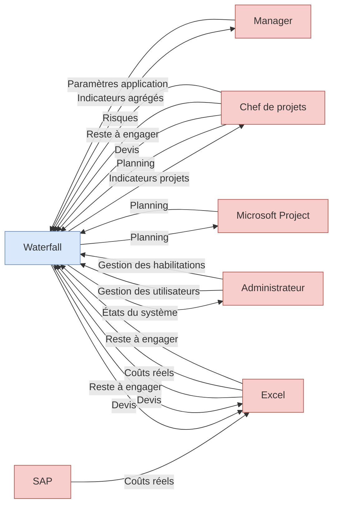
```mermaid
flowchart LR
    Waterfall["Waterfall"]
    Manager["Manager"]
    Chef_de_projets["Chef de projets"]
    Administrateur["Administrateur"]
    Microsoft_Project["Microsoft Project"]
    Excel["Excel"]
    SAP["SAP"]

    Waterfall -->|"Indicateurs projets"| Chef_de_projets
    SAP -->|"Coûts réels"| Excel
    Waterfall -->|"Indicateurs agrégés"| Manager
    Manager -->|"Paramètres application"| Waterfall
    Chef_de_projets -->|"Planning"| Waterfall
    Waterfall -->|"États du système"| Administrateur
    Administrateur -->|"Gestion des utilisateurs"| Waterfall
    Excel -->|"Devis"| Waterfall
    Microsoft_Project -->|"Planning"| Waterfall
    Waterfall -->|"Planning"| Microsoft_Project
    Waterfall -->|"Devis"| Excel
    Waterfall -->|"Reste à engager"| Excel
    Excel -->|"Coûts réels"| Waterfall
    Excel -->|"Reste à engager"| Waterfall
    Administrateur -->|"Gestion des habilitations"| Waterfall
    Chef_de_projets -->|"Devis"| Waterfall
    Chef_de_projets -->|"Reste à engager"| Waterfall
    Chef_de_projets -->|"Risques"| Waterfall

    classDef c1 fill:#dae8fc,stroke:#6c8ebf
    class Waterfall c1
    classDef c2 fill:#f8cecc,stroke:#b85450
    class Administrateur,Chef_de_projets,Excel,Manager,Microsoft_Project,SAP c2
```

*Figure 1 — Diagramme de contexte*

### 3.1.2. Flux de données

Ce paragraphe recense les échanges de Waterfall avec son environnement.

Les flux sont détaillés dans deux tableaux, l’un pour les systèmes externes, l’autre pour les acteurs. Chaque flux porte un identifiant de la forme FLX-nn, stable, que les exigences peuvent citer. Le sens est donné du point de vue de Waterfall, entrant ou sortant. La colonne « Mode d’échange » indique le support et renvoie à l’exigence qui le spécifie. La colonne « Fréquence » donne le rythme attendu en exploitation, et non une contrainte de performance.

Un flux échappe à cette lecture : FLX-08 relie l’ERP à Excel sans passer par Waterfall. Il figure au tableau pour expliquer d’où viennent les coûts réels, et porte la mention « hors périmètre ».

La table suivante définit les flux entre Waterfall et les systèmes externes. Tous les échanges par fichier, imports comme exports, sont déclenchés depuis Waterfall par un utilisateur habilité ; dans la configuration livrée, c’est le chef de projet.

| Flux                   | Source            | Destination       | Sens           | Mode d’échange                        | Fréquence                           |
|------------------------|-------------------|-------------------|----------------|---------------------------------------|-------------------------------------|
| FLX-01 Planning        | Microsoft Project | Waterfall         | Entrant        | Fichier XML MS Project (WF-INTF-0040) | À la demande                        |
| FLX-02 Planning        | Waterfall         | Microsoft Project | Sortant        | Fichier XML MS Project (WF-INTF-0050) | À la demande                        |
| FLX-03 Devis           | Excel             | Waterfall         | Entrant        | Fichier Excel (WF-INTF-0100)          | À la demande, en phase de chiffrage |
| FLX-04 Devis           | Waterfall         | Excel             | Sortant        | Fichier Excel (WF-INTF-0110)          | À la demande                        |
| FLX-05 Reste à engager | Excel             | Waterfall         | Entrant        | Fichier Excel (WF-INTF-0120)          | À chaque revue périodique           |
| FLX-06 Reste à engager | Waterfall         | Excel             | Sortant        | Fichier Excel (WF-INTF-0130)          | À chaque revue périodique           |
| FLX-07 Coûts réels     | Excel             | Waterfall         | Entrant        | Fichier Excel (WF-INTF-0140)          | À chaque revue périodique           |
| FLX-08 Coûts réels     | SAP               | Excel             | Hors périmètre | Extraction ERP, hors Waterfall        | À chaque revue périodique           |

Tableau 3 Flux avec les systèmes externes

Les acteurs de cette table sont les trois usages types de Waterfall, décrits au paragraphe suivant : le chef de projet, qui construit et pilote un projet ; le manager, qui tient le référentiel et lit le portefeuille ; l’administrateur, qui exploite la plateforme.

| Flux                             | Source         | Destination    | Sens    | Mode d’échange | Fréquence                                |
|----------------------------------|----------------|----------------|---------|----------------|------------------------------------------|
| FLX-09 Planning                  | Chef de projet | Waterfall      | Entrant | IHM            | En continu                               |
| FLX-10 Devis                     | Chef de projet | Waterfall      | Entrant | IHM            | En continu, en phase de chiffrage        |
| FLX-11 Reste à engager           | Chef de projet | Waterfall      | Entrant | IHM            | À chaque revue périodique                |
| FLX-12 Risques                   | Chef de projet | Waterfall      | Entrant | IHM            | En continu, et à chaque revue périodique |
| FLX-13 Indicateurs projet        | Waterfall      | Chef de projet | Sortant | IHM            | À la demande, recalculés à chaque revue  |
| FLX-14 Paramètres application    | Manager        | Waterfall      | Entrant | IHM            | À la demande                             |
| FLX-15 Indicateurs agrégés       | Waterfall      | Manager        | Sortant | IHM            | À la demande                             |
| FLX-16 Gestion des utilisateurs  | Administrateur | Waterfall      | Entrant | IHM            | À la demande                             |
| FLX-17 Gestion des habilitations | Administrateur | Waterfall      | Entrant | IHM            | À la demande                             |
| FLX-18 États du système          | Waterfall      | Administrateur | Sortant | IHM            | À la demande                             |

Tableau 4 Flux avec les acteurs

```yaml exigence
section: "3.1.2"
id: "WF-INTF-0150-A"
titre: "Liste fermée des échanges externes"
flexibilite: "F0"
fbs: "FBS-4.3.4, FBS-4.4, FBS-4.5, FBS-4.7"
pbs: "PBS-1.1, PBS-2.1, PBS-2.2, PBS-2.3, PBS-3.1, PBS-3.3"
corps: "Waterfall n’échange de données de projet avec des systèmes externes que par les flux FLX-01 à FLX-07 du tableau des flux. Les images exportées (WF-IHM-0130, WF-PLA-0120, WF-PLA-0140) et les sauvegardes (WF-ADM-0150, WF-ADM-0160) ne sont pas des échanges de données de projet : les premières ne se réimportent pas, les secondes ne s’adressent à aucun système externe."
motif: "Chaque échange doit être spécifié : son format, son contrôle et ses règles d’idempotence. Un échange non déclaré échappe à ces règles."
verification: "Chaque fonction d’import ou d’export de données de projet présente dans Waterfall correspond à un flux du tableau et à l’exigence que ce tableau lui associe ; les exports d’images et les sauvegardes sont les seules fonctions d’échange hors tableau."
```

### 3.1.3. Interactions avec les utilisateurs

Waterfall est utilisé par trois acteurs, repris comme tels dans le diagramme de contexte : le chef de projet, le manager et l’administrateur. Ces acteurs décrivent des usages courants, non des privilèges : toute action est soumise à une permission, et une entreprise peut répartir ces permissions différemment. Les exigences qui suivent fixent le contenu des trois rôles d’habilitation prédéfinis livrés avec la plateforme (WF-ADM-0010) ; le modèle de permissions lui-même relève de la fonction FBS-1.2.

```yaml exigence
section: "3.1.3"
id: "WF-INTF-0010-A"
titre: "Usages du chef de projet"
flexibilite: "F0"
fbs: "FBS-1.2"
pbs: "PBS-1.1, PBS-2.1, PBS-2.3, PBS-3.1"
corps: "Waterfall doit permettre à un utilisateur habilité de créer un projet et ses révisions, d’en désigner les contributeurs, d’en construire le planning, d’en structurer le devis, d’en gérer les risques, d’en estimer le reste à engager, d’en importer et d’en consulter les coûts réels, d’en lire les indicateurs, et d’importer ou d’exporter les données du projet par fichier. Le rôle prédéfini « chef de projet » accorde ces permissions."
motif: "Ces usages sont ceux de l’acteur qui connaît le contenu technique du projet et produit les données d’entrée du calcul des indicateurs. Ils fixent le contenu du rôle prédéfini correspondant, sans réserver ces actions à un acteur : dans une organisation matricielle, une partie d’entre elles peut revenir aux managers des métiers."
verification: "Un utilisateur porteur du rôle prédéfini « chef de projet » crée un projet et atteint, sur un projet où il est habilité, les fonctions de gestion des révisions (FBS-4.1), de paramétrage du projet, contributeurs compris (FBS-4.2), de planification (FBS-4.3), de chiffrage (FBS-4.4), de gestion des risques (FBS-4.6), d’estimation du reste à engager (FBS-4.5), de gestion des coûts réels (FBS-4.7), de lecture des indicateurs (FBS-4.8) et d’échange des fichiers du tableau des flux (FLX-01 à FLX-07), et les mène jusqu’à leur terme."
```

```yaml exigence
section: "3.1.3"
id: "WF-INTF-0020-A"
titre: "Usages du manager"
flexibilite: "F0"
fbs: "FBS-1.2"
pbs: "PBS-1.1, PBS-2.1, PBS-2.3, PBS-3.1"
corps: "Waterfall doit permettre à un utilisateur habilité de paramétrer l’organisation de l’entreprise, les rôles de ressources, les calendriers et les taux horaires, et de consulter les indicateurs agrégeant les données de plusieurs projets. Il peut consulter tout projet sans en être contributeur (WF-PRJ-0060). Le rôle prédéfini « manager » accorde ces permissions."
motif: "Ces paramètres sont communs à tous les projets : les regrouper sous un acteur qui raisonne au niveau de l’entreprise désigne du même coup le destinataire naturel des indicateurs consolidés."
verification: "Un utilisateur porteur du rôle prédéfini « manager » mène à leur terme le paramétrage des nœuds d’organisation, des rôles de ressources, des calendriers et des taux horaires (FBS-3), et ouvre les vues du portefeuille (FBS-2), lesquelles portent sur l’ensemble des projets, et ouvre un projet dont il n’est pas contributeur."
```

```yaml exigence
section: "3.1.3"
id: "WF-INTF-0030-A"
titre: "Usages de l’administrateur"
flexibilite: "F0"
fbs: "FBS-1.2"
pbs: "PBS-1.1, PBS-2.1, PBS-2.3, PBS-3.1"
corps: "Waterfall doit permettre à un utilisateur habilité de gérer les comptes utilisateurs et les rôles d’habilitation, de consulter l’état de fonctionnement du système, et de sauvegarder et restaurer la plateforme. Le rôle prédéfini « administrateur » accorde ces permissions."
motif: "L’administration des comptes et des habilitations est une fonction d’exploitation, sans rapport avec le contenu des projets. L’identifier comme un acteur distinct permet de la confier à une personne différente de celles qui pilotent les projets, sans préjuger de ce que le modèle d’habilitation autorisera à cumuler."
verification: "Un utilisateur porteur du rôle prédéfini « administrateur » crée un compte, lui affecte un rôle d’habilitation (FBS-1.1, FBS-1.2), ouvre l’écran d’état du système (FBS-1.3) et déclenche une sauvegarde (FBS-1.4)."
```

### 3.1.4. Interactions avec les systèmes externes

Waterfall échange avec trois systèmes externes : Microsoft Project pour les plannings, Excel pour les devis, les restes à engager et les coûts réels, et l’ERP, d’où les coûts réels proviennent par une extraction Excel. Tous ces échanges se font par fichier. Waterfall n’entretient de connexion directe avec aucun de ces systèmes, et notamment aucune avec l’ERP.

Les exigences qui suivent définissent chaque échange : ce qu’il transporte, dans quel format, et ce qu’il advient des données déjà présentes. Les formats Excel eux-mêmes sont décrits en ANNEXE B: Formats d’échanges Excel. L’inventaire des flux, avec leur sens et leur fréquence, figure au tableau des flux.

```yaml exigence
section: "3.1.4"
id: "WF-INTF-0040-A"
titre: "Imports MS Project"
flexibilite: "F0"
fbs: "FBS-4.3.4"
pbs: "PBS-1.1, PBS-2.1, PBS-2.2, PBS-2.3, PBS-3.1, PBS-3.3"
corps: "Le logiciel doit être capable d’importer des fichiers au format d’échange XML de MS Project des versions 2010 et suivantes. Pour chaque tâche sont importés son libellé, sa description, sa position dans l’arbre, sa durée et son unité, son mode de planification et, en mode manuel, ses dates ; une tâche de durée nulle devient un jalon ; une tâche portant une contrainte de date est importée en mode manuel aux dates du fichier, et le compte rendu la signale. Les liaisons sont importées avec leur type et leur décalage. L’avancement, les ressources, les calendriers, les coûts et les champs personnalisés ne sont jamais importés : les ressources et les calendriers sont gérés exclusivement par Waterfall, et le compte rendu dit ce qui a été ignoré. L’import est un aller-retour : une tâche ou une liaison du fichier qui porte l’identifiant que l’export de Waterfall y a écrit (WF-INTF-0050) met à jour l’objet existant sans toucher à sa lignée, à ses lignes de devis ni à son état ; une tâche sans identifiant Waterfall est créée, et l’identifiant que MS Project lui avait donné est conservé comme identifiant externe ; une tâche existante absente du fichier est supprimée selon WF-PLA-0070, une tâche démarrée ou terminée étant conservée et signalée. Tout import présente un compte rendu avant application (WF-INTF-0080) ; lorsque les dates ou les durées du fichier diffèrent de celles recalculées par Waterfall, le compte rendu présente l’écart. L’abandon à cette étape laisse le planning inchangé."
motif: "Les imports / exports MS Project sont présents pour faciliter l’adoption de Waterfall : le premier planning d’un projet vient souvent de MS Project. Les cibles privilégiées de Waterfall sont les entreprises qui travaillent avec un ERP, MS Project et Excel. Rapprocher les tâches par l’identifiant que l’export a écrit est ce qui permet de réimporter un planning retravaillé sans perdre les lignes de devis, les lignées et l’avancement que la révision porte déjà ; conserver l’identifiant propre à MS Project permet de rapprocher un fichier remanié avant le premier export."
verification: "Un fichier XML produit par MS Project 2013 est importé sans erreur. Après import, les tâches et leurs liaisons de prédécesseur — type FD, DD, FF ou DF, et décalage — sont identiques à celles du fichier source ; une tâche en mode manuel du fichier est en mode manuel aux mêmes dates ; une tâche portant une contrainte « Pas avant le » est en mode manuel et signalée ; une tâche à 50 % d’avancement est importée non démarrée ; aucune ressource et aucun calendrier présents dans le fichier n’a été créé dans Waterfall, et l’utilisateur est informé que ces éléments ont été ignorés. Un planning exporté, retravaillé dans MS Project puis réimporté conserve les lignes de devis et les lignées de ses tâches, et ses tâches démarrées."
```

```yaml exigence
section: "3.1.4"
id: "WF-INTF-0050-A"
titre: "Exports MS Project"
flexibilite: "F0"
fbs: "FBS-4.3.4"
pbs: "PBS-1.1, PBS-2.1, PBS-2.2, PBS-2.3, PBS-3.1"
corps: "Les plannings Waterfall doivent pouvoir être exportés au format XML MS Project. Chaque tâche y porte son identifiant Waterfall dans le champ d’identifiant unique de MS Project, et son calendrier applicable (WF-PLA-0010) comme calendrier de tâche ; aucune ressource n’étant exportée, aucun calendrier de ressource n’intervient dans le calcul de MS Project."
motif: "MS Project calcule les durées et les dates des taches en mode automatique. Il est nécessaire que MS Project et Waterfall partagent le même calendrier."
verification: "Vérifiée en recette pour l’ouverture dans MS Project ; l’égalité des dates est couverte par le corpus de WF-QUA-0080. Un planning Waterfall exporté au format XML s’ouvre sans erreur dans les versions de MS Project visées par WF-INTF-0040. Les calendriers Waterfall y figurent et sont affectés aux tâches, et chaque tâche porte son identifiant Waterfall. En mode automatique, MS Project recalcule pour chaque tâche des dates de début et de fin identiques à celles affichées par Waterfall."
```

```yaml exigence
section: "3.1.4"
id: "WF-INTF-0060-A"
titre: "Réversibilité de l’échange MS Project"
flexibilite: "F0"
fbs: "FBS-4.3.4"
pbs: "PBS-1.1, PBS-2.1, PBS-2.2, PBS-2.3, PBS-3.1"
corps: "Un planning Waterfall exporté au format XML MS Project, puis réimporté sans avoir été modifié, restitue les mêmes tâches, durées, liaisons et dates, et son compte rendu ne présente aucun écart."
motif: "L’export transmet à MS Project les calendriers nécessaires à ses calculs (WF-INTF-0050), tandis que l’import les ignore (WF-INTF-0040). L’aller-retour n’est donc neutre que si les deux outils calculent les mêmes dates à partir des mêmes durées et des mêmes calendriers. L’absence d’écart au compte rendu en est la preuve observable : sur un fichier non modifié, un écart signale une divergence entre les deux moteurs de calcul, et non une intervention de l’utilisateur."
verification: "Un planning comportant au moins une tâche récapitulative, un jalon, les quatre types de liaison, et des tâches portant des rôles de ressources aux calendriers différents, est exporté, ouvert dans MS Project sans y être modifié, puis réimporté. Le compte rendu ne présente aucun écart de dates ni de durées, et le planning obtenu est identique à celui relevé avant l’export."
```

```yaml exigence
section: "3.1.4"
id: "WF-INTF-0070-A"
titre: "Formats d’échange Excel"
flexibilite: "F0"
fbs: "FBS-4.4, FBS-4.5, FBS-4.7"
pbs: "PBS-1.1, PBS-2.1, PBS-2.2, PBS-2.3, PBS-3.1, PBS-3.3"
corps: "Les échanges par fichier Excel (FLX-03 à FLX-07) utilisent les formats définis en ANNEXE B: Formats d’échanges Excel. Chaque format porte un numéro de version inscrit dans le fichier. Waterfall refuse un fichier dont le format ou la version ne sont pas reconnus, et indique le format attendu. Les en-têtes de colonnes de ces formats sont fixes et ne dépendent pas de la langue de l'interface (WF-INTF-0180)."
motif: "Les fichiers sont préparés hors de Waterfall, souvent par un tiers ou à partir d’une extraction de l’ERP. Avec un format versionné, un fichier préparé sur un modèle périmé est détecté au lieu d’être mal interprété, et les formats peuvent évoluer sans rendre les fichiers existants illisibles."
verification: "Un fichier conforme à chacun des formats de ANNEXE B: Formats d’échanges Excel est accepté. Un fichier sans version, ou d’une version non reconnue, est refusé avec un message qui nomme le format et la version attendus. Le projet est inchangé."
```

```yaml exigence
section: "3.1.4"
id: "WF-INTF-0080-A"
titre: "Contrôle et confirmation des imports"
flexibilite: "F0"
fbs: "FBS-4.4, FBS-4.5, FBS-4.7"
pbs: "PBS-1.1, PBS-2.1, PBS-2.2, PBS-2.3, PBS-3.1, PBS-3.3"
corps: "Avant d’appliquer un import, par fichier Excel ou MS Project, Waterfall présente à l’utilisateur un compte rendu : lignes lues, lignes rejetées avec leur motif, et écarts avec les données existantes. L’import n’est appliqué qu’après confirmation, en une seule opération. Un import abandonné ou interrompu laisse le projet inchangé."
motif: "L’utilisateur voit l’effet d’un fichier avant que le projet ne soit modifié, quel que soit le format. L’application en une seule opération évite qu’un incident laisse un devis ou des coûts importés à moitié, ce qui fausserait les indicateurs sans que rien ne le signale."
verification: "Pour un fichier qui contient des lignes invalides, le compte rendu les liste avec leur motif avant la confirmation. Si l’utilisateur abandonne à cette étape, le projet reste inchangé. Si l’import est interrompu pendant son application, le projet revient à son état antérieur."
```

```yaml exigence
section: "3.1.4"
id: "WF-INTF-0090-A"
titre: "Imports et révisions marquées"
flexibilite: "F0"
fbs: "FBS-4.1"
pbs: "PBS-1.1, PBS-2.1, PBS-2.2, PBS-2.3, PBS-3.1"
corps: "Les imports de planning, de devis et de reste à engager s’appliquent à la révision en cours d’élaboration du projet. Lorsque le projet n’en comporte pas, l’import en crée une, à partir de la dernière révision marquée s’il en existe une, puis s’y applique."
motif: "Comme une étiquette dans un gestionnaire de versions, une révision marquée ne bouge plus : toute modification, y compris par import, passe par une révision en cours d’élaboration. Une révision est un instantané, figé au marquage. La révision de référence sert en plus au calcul du budget de référence et de la valeur planifiée : un import qui la modifierait fausserait l’historique et tous les indicateurs de valeur acquise."
verification: "On importe un planning MS Project, puis un devis, dans un projet qui comporte une révision marquée. Seule la révision en cours est modifiée : les tâches, les dates et les montants de la révision marquée sont identiques avant et après chaque import. Un import sur un projet dont toutes les révisions sont marquées crée une révision en cours d’élaboration et s’y applique ; les révisions marquées sont inchangées."
```

```yaml exigence
section: "3.1.4"
id: "WF-INTF-0100-A"
titre: "Import du devis (FLX-03)"
flexibilite: "F0"
fbs: "FBS-4.4"
pbs: "PBS-1.1, PBS-2.1, PBS-2.2, PBS-2.3, PBS-3.1, PBS-3.3"
corps: "Un utilisateur habilité peut importer le devis d’un projet depuis un fichier Excel au format « Devis » défini par ANNEXE B : Formats d’échanges Excel. L’import est un aller-retour fondé sur l’identifiant que porte toute ligne : une ligne du fichier qui porte l’identifiant d’une ligne de la révision en cours la met à jour — quantité, charge ou débours, rôle, sous-projet, délai de paiement — sans toucher à son montant budgété ni à sa lignée ; une ligne sans identifiant devient une ligne nouvelle, portée par la tâche qu’elle désigne et, pour une ligne de main-d’œuvre, affectée au rôle de ressource indiqué, avec un montant budgété nul si le projet porte une révision de référence (WF-RAE-0050) ; une ligne existante absente du fichier est supprimée, sauf si sa tâche est démarrée ou terminée, auquel cas elle est conservée et signalée au compte rendu."
motif: "Les devis sont souvent construits dans Excel avant l’adoption de Waterfall : l’import facilite cette adoption, pour la même raison que l’import MS Project. Fondé sur les identifiants, il se rejoue : réimporter un fichier corrigé ne crée pas de doublons, et un fichier exporté puis retravaillé se réimporte sans perdre les montants budgétés ni les lignées des lignes qu’il modifie."
verification: "On importe un fichier qui comporte des lignes de main-d’œuvre et des lignes hors main-d’œuvre. Chaque ligne se retrouve sous la tâche désignée, avec sa quantité, ses heures ou son débours, son rôle et, le cas échéant, son sous-projet. Un second import du même fichier donne un devis identique. Un fichier exporté, dont une charge a été modifiée, réimporté sur un projet en cours met à jour cette ligne sans changer son montant budgété ni sa lignée. Une ligne qui cite une tâche, un rôle ou un sous-projet inconnu est rejetée et figure au compte rendu (WF-INTF-0080)."
```

```yaml exigence
section: "3.1.4"
id: "WF-INTF-0110-A"
titre: "Export du devis (FLX-04)"
flexibilite: "F0"
fbs: "FBS-4.4"
pbs: "PBS-1.1, PBS-2.1, PBS-2.2, PBS-2.3, PBS-3.1"
corps: "Un utilisateur habilité peut exporter le devis d’une révision, en cours ou marquée, dans un fichier Excel au format « Devis » de ANNEXE B: Formats d’échanges Excel."
motif: "L’export permet de retravailler ou de diffuser le devis hors de Waterfall. Comme il utilise le même format que l’import, un devis exporté peut être réimporté."
verification: "On exporte un devis, puis on le réimporte sans modification dans la révision en cours. Le compte rendu (WF-INTF-0080) ne signale aucun écart, et les lignes obtenues sont identiques."
```

```yaml exigence
section: "3.1.4"
id: "WF-INTF-0120-A"
titre: "Import du reste à engager (FLX-05)"
flexibilite: "F0"
fbs: "FBS-4.5"
pbs: "PBS-1.1, PBS-2.1, PBS-2.2, PBS-2.3, PBS-3.1, PBS-3.3"
corps: "Un utilisateur habilité peut importer le reste à engager d’un projet depuis un fichier Excel au format « Reste à engager » de ANNEXE B: Formats d’échanges Excel. Chaque ligne du fichier qui porte l’identifiant d’une ligne de la révision en cours met à jour ses grandeurs réestimées (WF-RAE-0040) — charge, ou quantité et débours — sans toucher à son montant budgété ni à sa lignée ; une ligne sans identifiant crée une ligne non anticipée (WF-RAE-0050), portée par la tâche qu’elle désigne et, pour une ligne de main-d’œuvre, affectée au rôle indiqué ; les lignes absentes du fichier sont inchangées. Le sous-projet d’une ligne est celui de l’onglet qui la porte, le format plaçant chaque sous-projet dans un onglet."
motif: "Le reste à engager est réestimé à chaque revue périodique, souvent à partir d’estimations recueillies dans Excel auprès des responsables de lots : le fichier exporté (WF-INTF-0130) part, revient, et chaque ligne retrouve la sienne par son identifiant. Comme l’import ne touche qu’aux grandeurs réestimées, il peut être rejoué, et une ligne oubliée dans un onglet n’est pas perdue."
verification: "Même critère que WF-INTF-0100, appliqué aux grandeurs réestimées ; les montants budgétés et les lignées de toutes les lignes sont inchangés après l’import, et une ligne absente du fichier conserve son reste à engager."
```

```yaml exigence
section: "3.1.4"
id: "WF-INTF-0130-A"
titre: "Export du reste à engager (FLX-06)"
flexibilite: "F0"
fbs: "FBS-4.5"
pbs: "PBS-1.1, PBS-2.1, PBS-2.2, PBS-2.3, PBS-3.1"
corps: "Un utilisateur habilité peut exporter le reste à engager d’une révision, en cours ou marquée, dans un fichier Excel au format « Reste à engager » de ANNEXE B: Formats d’échanges Excel."
motif: "L’export du reste à engager courant sert de point de départ à la revue suivante : le fichier est envoyé aux responsables de lots, qui le mettent à jour, puis il est réimporté (WF-INTF-0120)."
verification: "Même critère d’aller-retour que WF-INTF-0110."
```

```yaml exigence
section: "3.1.4"
id: "WF-INTF-0140-A"
titre: "Import des coûts réels (FLX-07)"
flexibilite: "F0"
fbs: "FBS-4.7"
pbs: "PBS-1.1, PBS-2.1, PBS-2.2, PBS-2.3, PBS-3.1, PBS-3.3"
corps: "Un utilisateur habilité peut importer des coûts réels depuis un fichier Excel au format « Coûts réels » de l’ ANNEXE B: Formats d’échanges Excel, extrait de l’ERP sur une période donnée. Chaque ligne du fichier porte un numéro de pièce, qui l’identifie. Une ligne dont le numéro de pièce a déjà été importé met à jour la ligne de coût existante au lieu d’en créer une nouvelle, sans en modifier l’exclusion ; une ligne dont le numéro est inconnu est ajoutée. L’imputation des lignes suit WF-CRE-0020."
motif: "Les extractions se font de date à date et rien ne garantit que deux périodes successives ne se recouvrent pas. Le numéro de pièce permet de reconnaître une écriture déjà importée, donc de rejouer un import sans compter deux fois la même dépense, ce qui fausserait le coût réel, l’indice de coût et l’avancement financier."
verification: "Deux imports successifs du même fichier donnent le même total de coûts réels. Si deux fichiers ont des périodes qui se recouvrent, une ligne présente dans les deux n’est comptée qu’une fois. Une ligne déjà importée dont le montant a changé dans l’ERP est mise à jour, et son exclusion est préservée. Le compte rendu (WF-INTF-0080) présente les lignes ajoutées, mises à jour et ignorées avant confirmation."
```

### 3.1.5. Langue de l'interface

Waterfall s'adresse à des équipes qui ne travaillent pas toutes dans la même langue, parfois sur le même projet. Son interface existe donc en plusieurs langues, dont le français et l'anglais, et chaque utilisateur choisit la sienne sans que cela change rien pour les autres.

La ligne de partage est celle-ci : ce que Waterfall a fixé est traduit, ce qu'un utilisateur a saisi ne l'est pas. Les libellés de l'interface, les intitulés de colonnes, les noms des indicateurs, les messages et les libellés des états sont traduits ; les libellés de projets, de tâches, de lignes, les descriptions, les noms de version et les objets du référentiel restent dans la langue de leur saisie. Les formats d'échange, eux, ne dépendent d'aucune langue : un fichier exporté par l'un est importable par l'autre.

```yaml exigence
section: "3.1.5"
id: "WF-INTF-0160-A"
titre: "Choix de la langue de l'interface"
flexibilite: "F0"
fbs: "FBS-1.1"
pbs: "PBS-1.1, PBS-2.1, PBS-2.3, PBS-3.1"
corps: "L'interface est offerte en plusieurs langues, dont le français et l'anglais. À la première connexion d'un utilisateur, la langue retenue est celle que son navigateur demande, si elle est offerte, et à défaut la langue par défaut de l'installation. L'utilisateur peut forcer une autre langue ; ce choix est conservé dans son compte et s'applique à toutes ses connexions, quel que soit le poste. Le changement de langue est immédiat et ne demande pas de se reconnecter."
motif: "La langue du navigateur est le meilleur premier choix disponible, et elle évite un réglage avant toute utilisation. Mais elle se trompe souvent — un poste partagé, un navigateur d'entreprise installé dans une langue unique — d'où le choix explicite, qui doit alors suivre la personne et non le poste. La langue par défaut de l'installation joue le rôle que la devise unique joue pour les montants (WF-REF-0140) : elle donne une réponse quand rien d'autre ne la donne."
verification: "Un utilisateur dont le navigateur demande l'anglais obtient l'interface en anglais à sa première connexion, un autre demandant le français l'obtient en français. Un utilisateur dont le navigateur demande une langue non offerte obtient la langue par défaut de l'installation. Un utilisateur qui force le français le retrouve en se connectant depuis un autre poste dont le navigateur demande l'anglais. Le changement de langue s'applique sans reconnexion."
```

```yaml exigence
section: "3.1.5"
id: "WF-INTF-0170-A"
titre: "Périmètre de traduction"
flexibilite: "F0"
fbs: "FBS-1"
pbs: "PBS-1.1, PBS-2.1, PBS-2.3, PBS-3.1"
corps: "Sont traduits : les libellés de l'interface, les intitulés de colonnes, les noms des indicateurs, les messages d'erreur et les comptes rendus, l'aide en ligne, et les libellés des valeurs que le document fixe états d'un projet, d'une tâche, d'une révision, d'un risque et d'un compte, types de nature de coût, types de liaison, zones d'un indice. Ne sont pas traduits : les libellés et descriptions saisis par les utilisateurs, les noms de version, les objets du référentiel, les libellés des rôles d'habilitation, et les colonnes conservées des lignes de coût. Un texte saisi n'est jamais dupliqué par langue."
motif: "Un libellé saisi est une donnée : il figure dans une offre remise au client, dans un export et dans une révision marquée, et le traduire le rendrait différent selon le lecteur. Les valeurs fixées par le document, elles, portent un code : leur libellé n'est qu'un affichage, et rien n'empêche de l'afficher dans la langue du lecteur. La règle se réduit donc à une question : qui a écrit ce texte ?"
verification: "Deux utilisateurs de langues différentes ouvrant le même projet voient les mêmes libellés de tâches et de lignes, et des intitulés de colonnes et des libellés d'états différents. Aucun écran ne propose de saisir un libellé dans une seconde langue. Un projet créé par l'un est lisible par l'autre sans mention d'absence de traduction."
```

```yaml exigence
section: "3.1.5"
id: "WF-INTF-0180-A"
titre: "Formats indépendants de la langue"
flexibilite: "F0"
fbs: "FBS-1"
pbs: "PBS-1.1, PBS-2.1, PBS-2.2, PBS-2.3, PBS-3.1"
corps: "Les formats d'échange ne dépendent pas de la langue de l'interface : les en-têtes de colonnes des formats Excel de l’ANNEXE B: Formats d’échanges Excel, les noms de champs des fichiers MS Project, et les dates et nombres du contrat d'API sont fixes. La saisie d'un nombre suit le format de la langue de l'interface — virgule décimale en français, point en anglais. L'affichage, lui, suit la langue de l'utilisateur : format de date, séparateur décimal, séparateur de milliers, position du symbole monétaire et ordre alphabétique des listes. Le changement de langue ne modifie aucune donnée ni aucun montant, seulement leur présentation."
motif: "Un devis exporté par un utilisateur français doit pouvoir être réimporté par un utilisateur anglais, faute de quoi la réversibilité de WF-INTF-0060 ne vaut que pour une langue et les équipes ne peuvent plus échanger de fichiers. Fixer les en-têtes une fois pour toutes est la seule façon de le garantir. À l'inverse, afficher une date au format d'une autre langue est le moyen le plus sûr de confondre le 3 décembre et le 12 mars."
verification: "Un devis exporté par un utilisateur en français et réimporté par un utilisateur en anglais donne un devis identique, sans avertissement de format. Le même montant s'affiche « 1 234,56 » en français et « 1,234.56 » en anglais, et le total du projet est le même. Le fichier Excel exporté porte les mêmes en-têtes quelle que soit la langue de celui qui l'exporte."
```

## 3.2. Modèle conceptuel

Le modèle conceptuel décrit les objets que Waterfall manipule et les relations qui les unissent. Il ne dit ni ce que le logiciel fait de ces objets, ce qui est l’objet du découpage fonctionnel (§3.4), ni comment ils sont stockés, ce qui relève du modèle de données (§4.4). Les objets portent les noms définis en ANNEXE A: Glossaire, et aucun autre.

Le modèle est présenté en cinq grappes, du plus stable au plus vivant :

- les référentiels de l’entreprise, communs à tous les projets ;

- la structure d’un projet et ses révisions ;

- le planning, contenu dans la révision ;

- le chiffrage et les coûts, également contenus dans la révision ;

- les risques, qui s’appuient sur les deux précédents.

Chaque grappe comprend un diagramme, un texte qui explique les relations non évidentes, et la liste des fonctions qui manipulent ses objets.

Cette section ne porte aucune exigence. Les règles qu’elle fait apparaître sont portées par les exigences des blocs fonctionnels qui manipulent les objets concernés.

### 3.2.1. Conventions

Les diagrammes suivent la notation des diagrammes de classes UML, réduite à ce qui sert ici. Trois règles en limitent le contenu :

- **Un objet est défini dans une seule grappe.** Il peut réapparaître en grisé dans une autre grappe, comme point d’ancrage, sans y être décrit. Un objet qui n’appartient pas au modèle métier, comme le rôle d’habilitation, peut apparaître de la même façon lorsqu’il éclaire une relation.

- **Un diagramme ne montre que des objets, leurs relations et leurs cardinalités.** Il ne montre ni les attributs des objets, ni leurs règles de calcul, qui figurent dans les blocs fonctionnels. C’est pourquoi les cadres des objets sont vides.

- **Un objet ne figure dans un diagramme que s’il est défini en ANNEXE A: Glossaire.** Un objet nouveau est d’abord défini, puis dessiné.

Les relations se lisent ainsi :

| Représentation                     | Signification                                                                                                                                    |
|------------------------------------|--------------------------------------------------------------------------------------------------------------------------------------------------|
| Trait plein terminé par une flèche | Association. Elle se lit dans le sens de la flèche, avec le libellé du trait : « un rôle de ressource *est rattaché à* un nœud d’organisation ». |
| Trait plein partant d’un losange   | Contenance. L’objet placé du côté du losange contient les autres, par exemple un nœud et ses sous-nœuds.                                         |
| Trait pointillé                    | Relation avec un objet d’ancrage, grisé, décrit ailleurs.                                                                                        |

Tableau 5 Relations du modèle conceptuel

Une cardinalité, placée à une extrémité d’une relation, indique combien d’objets de ce côté sont liés à un objet de l’autre côté : 1 pour exactement un, 0..1 pour au plus un, \* pour un nombre quelconque, 1..\* pour au moins un. Par exemple, la relation entre rôle de ressource et nœud d’organisation porte \* du côté du rôle et 1 du côté du nœud : un rôle est rattaché à exactement un nœud, et un nœud porte un nombre quelconque de rôles.

Chaque grappe se termine par la ligne « Manipulé par », qui donne les fonctions (codes FBS) qui créent, modifient ou consultent ses objets.

### 3.2.2. Référentiel de l’entreprise

Le référentiel porte ce qui est commun à tous les projets et qu’aucun projet ne redéfinit pour lui-même. Il comprend cinq ensembles d’objets — l’arbre d’organisation, les rôles de ressources, les natures et catégories de coût, les taux horaires et les calendriers — et les paramètres communs des risques et des indicateurs (FBS-3.3, FBS-3.4) ; le modèle conceptuel ne dessine que les objets. Il est paramétré par les utilisateurs habilités (FBS-3).

<!-- source : figures/modele-referentiel.mmd — régénéré par tools/build.py -->

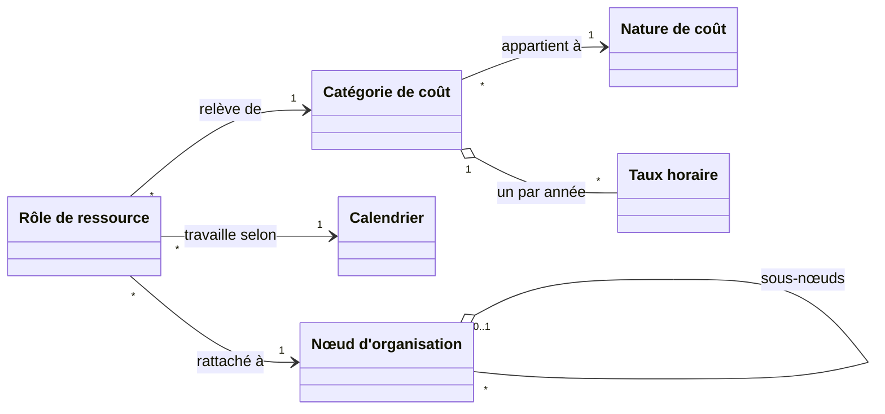
```mermaid
classDiagram
    direction LR
    class Noeud["Nœud d'organisation"]
    class Role["Rôle de ressource"]
    class Calendrier["Calendrier"]
    class Categorie["Catégorie de coût"]
    class Nature["Nature de coût"]
    class Taux["Taux horaire"]

    Noeud "0..1" o-- "*" Noeud : sous-nœuds
    Role "*" --> "1" Noeud : rattaché à
    Role "*" --> "1" Categorie : relève de
    Role "*" --> "1" Calendrier : travaille selon
    Categorie "*" --> "1" Nature : appartient à
    Categorie "1" o-- "*" Taux : un par année
```

*Figure 2 — Modèle conceptuel du référentiel de l’entreprise*

**Organisation.** L’organisation est un arbre de nœuds qui représente l’organigramme de l’entreprise. Chaque nœud est un service ou un département, et peut en contenir d’autres sans limite de profondeur. L’arbre sert à une seule chose : rattacher les rôles de ressources, et donc regrouper les postes par service ou département. Il ne porte aucune habilitation. Les permissions sont attribuées par les rôles d’habilitation (FBS-1.2), indépendamment de l’organigramme.

**Rôles de ressources.** Un rôle de ressource représente un poste positionné dans l’organigramme, par exemple « Ingénieur logiciel ». Il est rattaché à un nœud, relève d’une catégorie de coût, qui fixe son taux horaire, et travaille selon un calendrier. Les trois rattachements sont obligatoires. Un rôle porte une capacité : un nombre d’heures disponibles par mois, qui est comparé au plan de charge, et l’effectif auquel ces heures correspondent, donné à titre d’information. La capacité est unique et ne varie pas dans le temps. Cette invariance est délibérée, et non une approximation.

**Natures, catégories et taux.** Les coûts sont décrits sur deux niveaux. La nature de coût est ce que le devis ventile et affiche : main-d’œuvre, fourniture, frais ou unité d’œuvre, par exemple. Elle est paramétrable, et porte un type — main-d’œuvre, hors main-d’œuvre ou provision — qui détermine le traitement des lignes de devis qui l’emploient (WF-REF-0030). La catégorie de coût se rattache à une nature. C’est elle qui porte le taux horaire, et c’est par elle que la comptabilité nomme la dépense. Les deux niveaux ne sont pas un raffinement : un niveau unique obligerait à choisir entre une ventilation lisible et un plan comptable fidèle, et c’est la fidélité qui céderait, le plan comptable n’étant pas négociable du côté de Waterfall.

Seules les catégories de main-d’œuvre portent des taux horaires, à raison d’un par année. Le chiffrage n’emploie que le taux de son année de référence : les années suivantes sont atteintes par le taux d’inflation du projet. Le taux reste néanmoins annuel, car un chiffrage créé l’année suivante doit partir d’une base constatée, et non d’une base que l’inflation aurait projetée depuis une année de plus en plus lointaine.

**Calendriers.** Un calendrier donne, pour chacun des sept jours de la semaine, le nombre d’heures travaillées par le rôle qui l’emploie. Il ne décrit pas le temps de travail d’une personne, et ne gère ni les temps partiels ni les jours fériés. Le calendrier convertit une durée en dates, comme le taux horaire convertit des heures en coût. Un seul calendrier est désigné par défaut : il s’applique aux tâches auxquelles aucun rôle n’est affecté.

**Évolution du référentiel.** Les objets du référentiel ne se suppriment pas : ils se désactivent, et peuvent être réactivés. Un objet désactivé n’est plus proposé à la saisie, mais reste lisible partout où il est employé, et le désactiver n’impose jamais de modifier ce qui l’emploie. Désactiver un nœud désactive ses descendants et les rôles qui y sont rattachés : lors d’une réorganisation, les rôles sont recréés sous les nouveaux nœuds plutôt que déplacés. Enfin, aucune modification du référentiel ne touche une révision marquée, qui conserve les taux ayant servi à la calculer. Sans cela, un taux corrigé en cours d’année déplacerait le budget de référence de tous les projets déjà pilotés, et l’écart constaté ne se distinguerait plus d’une dérive réelle.

**Manipulé par** : FBS-3.1, FBS-3.2.

### 3.2.3. Structure d’un projet

Un projet porte deux découpages indépendants l’un de l’autre — le lotissement, qui reflète la commande, et les sous-projets, qui servent au rapprochement des coûts réels —, ses révisions, sa liste de contributeurs et le code sous lequel l’ERP le connaît.

<!-- source : figures/decoupage-projet.mmd — régénéré par tools/build.py -->

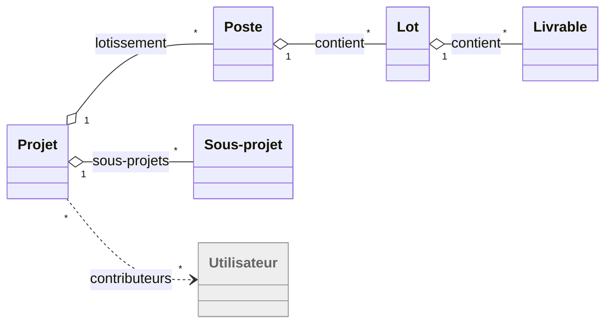
```mermaid
classDiagram
    direction LR
    class Projet["Projet"]
    class Poste["Poste"]
    class Lot["Lot"]
    class Livrable["Livrable"]
    class SousProjet["Sous-projet"]
    class Utilisateur["Utilisateur"]

    Projet "1" o-- "*" Poste : lotissement
    Poste "1" o-- "*" Lot : contient
    Lot "1" o-- "*" Livrable : contient
    Projet "1" o-- "*" SousProjet : sous-projets
    Projet "*" ..> "*" Utilisateur : contributeurs

    style Utilisateur fill:#eeeeee,stroke:#999999,color:#666666
```

*Figure 3 — Découpage d’un projet*

**Deux découpages sans lien entre eux.**

Le **lotissement** reflète le bon de commande : il découpe l’affaire en postes, qui contiennent des lots, qui contiennent des livrables. Il est facultatif. Il permet d’engendrer un squelette de planning, de filtrer le planning comme le devis par poste ou par lot, à travers la tâche rattachée à chacun (WF-PLA-0130), et il structure le fichier de devis de l’annexe B, un onglet par lot. En l’absence de saisie, il se réduit à un poste comprenant un lot sans livrable.

Les **sous-projets**, eux, portent les codes définis dans l’ERP à la saisie de la commande. Ils regroupent des lignes de devis, et c’est à cette maille que les coûts réels sont rapprochés du budget : les dépenses se font sur un code de sous-projet, jamais sur une tâche. Les entreprises les découpent selon leurs habitudes, par phase, par métier ou selon le lotissement. Waterfall n’impose rien et n’établit aucun lien entre les deux découpages.

**Le code projet vient de l’ERP.** Il n’est donc pas connu pendant le chiffrage, et n’est exigé qu’au passage du projet à l’état En cours. Il en va de même des codes de sous-projets, ce qui n’est pas gênant : avant la commande, il n’y a aucun coût réel à rapprocher. Le rattachement des lignes à un sous-projet devient nécessaire au moment précis où il devient possible.

**Les contributeurs.** Un projet porte la liste des utilisateurs qui y contribuent : le chef de projet qui le structure, et les managers des métiers qui en chiffrent la charge. Waterfall propose d’y ajouter les utilisateurs des services dont un rôle est employé par les lignes de devis ; le chef de projet confirme. Cette liste est une donnée du projet, comme son lotissement, et c’est elle qui dit qui participe à cette affaire et peut l’ouvrir, là où les rôles d’habilitation disent ce qu’un utilisateur a le droit de faire ; chacun y est inscrit comme chef de projet ou comme participant, et seuls les premiers décident de ce qui engage l’affaire. Une affaire multi-métiers ne relève d’aucun service en particulier, et sa liste de contributeurs change à chaque projet, contrairement à l’organigramme.

<!-- source : figures/revisions-structure-couts.mmd — régénéré par tools/build.py -->

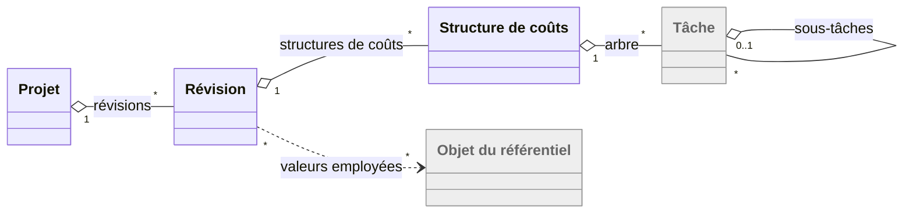
```mermaid
classDiagram
    direction LR
    class Projet["Projet"]
    class Revision["Révision"]
    class Structure["Structure de coûts"]
    class Tache["Tâche"]
    class ObjetRef["Objet du référentiel"]

    Projet "1" o-- "*" Revision : révisions
    Revision "1" o-- "*" Structure : structures de coûts
    Revision "*" ..> "*" ObjetRef : valeurs employées
    Structure "1" o-- "*" Tache : arbre
    Tache "0..1" o-- "*" Tache : sous-tâches

    style Tache fill:#eeeeee,stroke:#999999,color:#666666
    style ObjetRef fill:#eeeeee,stroke:#999999,color:#666666
```

*Figure 4 — Révisions et structure de couts*

**Une révision est un instantané.** Elle contient l’état complet du projet à un moment donné, et tout ce qui a permis de le calculer : ses structures de coûts, et les valeurs du référentiel qu’elles emploient. Une révision conserve ainsi ses taux horaires : une réorganisation ou une correction de taux ne la déplace pas. Elle porte un nom de version et une description, où l’utilisateur consigne ses hypothèses. Pendant le chiffrage, les révisions historisent les offres successives remises au client ; pendant l’exécution, elles alimentent les indicateurs qui comparent deux dates, comme le diagramme temps/temps.

**Un projet porte plusieurs structures de coûts, et non un seul devis.** Une structure est un arbre de tâches, chaque tâche portant ses lignes de devis. Une tâche récapitulative peut porter ses propres lignes, ce qui permet d’y accrocher les coûts qui ne se rattachent à aucune tâche précise : frais généraux, licences, assurances. Son coût est alors la somme de ses lignes propres et de celles de ses subordonnées. La nature d’une structure dit ce qu’elle décrit : le budget de référence, le différentiel d’un avenant, le devis propre à un risque, ou l’état courant du projet. Le caractère de référence, lui, est un attribut de la révision : c’est elle qui fait foi pour le budget de référence et les dates contractuelles.

**L’avenant fait bouger la référence.** Un avenant se prépare comme un différentiel : des tâches ajoutées, d’autres allongées ou retardées, d’autres devenues inutiles, et les lignes de devis qui les accompagnent. À sa contractualisation, le différentiel est fusionné, et la révision qui en résulte devient la nouvelle référence. Un risque ne la fait pas bouger : son devis propre est établi lors du chiffrage, reporté dans le devis principal en une ligne de provision pondérée par sa probabilité, qui compte au devis et au reste à engager mais jamais au budget de référence ; à sa survenance, ses tâches sont fusionnées dans la révision en cours avec un montant budgété nul, et leur coût se compare à la réserve pour risques de la référence. Sans cela, un projet qui consomme ses provisions paraîtrait tenir son budget.

**Les tâches et les lignes conservent leur identité d’une révision à l’autre.** C’est ce qui permet à un différentiel de désigner ce qu’il modifie, à deux révisions d’être comparées, et à une tâche d’être suivie dans le temps.

**Manipulé par** : FBS-4.1, FBS-4.2, FBS-4.6, FBS-4.7.

### 3.2.4. Planning

Le planning n’est pas un objet distinct : c’est l’arbre de tâches d’une structure de coûts, vu du côté du temps. Les mêmes tâches, vues du côté de l’argent, portent les lignes de devis du §3.2.5. C’est cette unicité qui garantit la cohérence entre les deux : déplacer une tâche déplace ce qu’elle coûte, sans qu’aucune règle n’ait à le dire.

<!-- source : figures/modele-planning.mmd — régénéré par tools/build.py -->

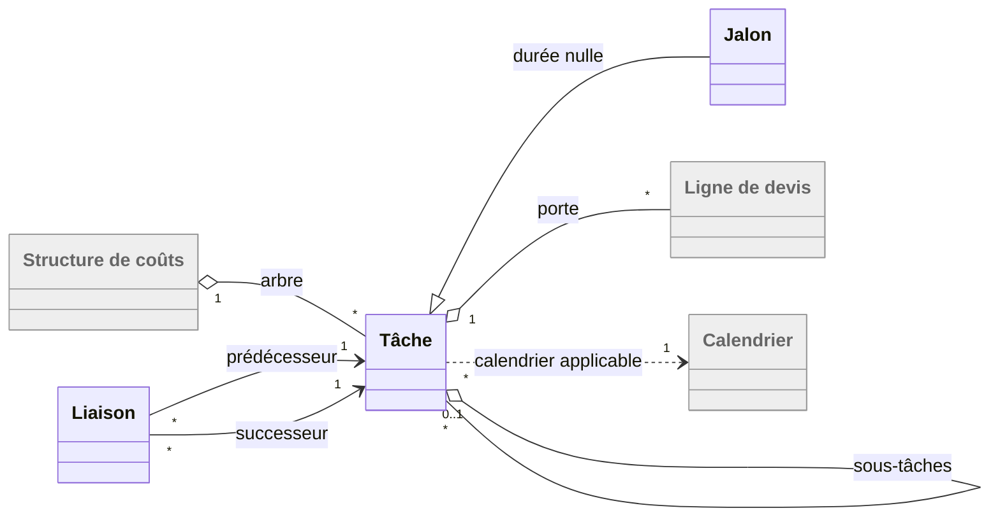
```mermaid
classDiagram
    direction LR
    class Structure["Structure de coûts"]
    class Tache["Tâche"]
    class Jalon["Jalon"]
    class Liaison["Liaison"]
    class LigneDevis["Ligne de devis"]
    class Calendrier["Calendrier"]

    Structure "1" o-- "*" Tache : arbre
    Tache "0..1" o-- "*" Tache : sous-tâches
    Tache <|-- Jalon : durée nulle
    Liaison "*" --> "1" Tache : prédécesseur
    Liaison "*" --> "1" Tache : successeur
    Tache "1" o-- "*" LigneDevis : porte
    Tache "*" ..> "1" Calendrier : calendrier applicable

    style Structure fill:#eeeeee,stroke:#999999,color:#666666
    style LigneDevis fill:#eeeeee,stroke:#999999,color:#666666
    style Calendrier fill:#eeeeee,stroke:#999999,color:#666666
```

*Figure 5 — Modèle conceptuel du planning*

**La tâche.** Une tâche porte une durée, des dates, et un mode de planification. En mode automatique, ses dates sont calculées à partir de sa durée, de ses liaisons et du calendrier applicable (WF-PLA-0010) ; en mode manuel, l’utilisateur les saisit directement. Le mode est propre à chaque tâche, comme dans Microsoft Project. Une tâche qui porte des sous-tâches est dite récapitulative, et sa durée découle des leurs ; une tâche sans sous-tâche est une tâche feuille. Ce n’est donc pas une nature qu’on lui donne, mais une conséquence de sa place dans l’arbre.

**Le jalon** est une tâche de durée nulle. Il marque un événement du projet : une validation, une livraison, une décision. Il ne porte pas de sous-tâches, mais il peut porter des lignes de devis : c’est ainsi que se chiffrent un acompte de sous-traitance ou une réception de fourniture.

**Les liaisons.** Une liaison relie une tâche prédécesseur à une tâche successeur. Elle porte son type — fin à début, début à début, fin à fin, début à fin — et un décalage. Deux tâches peuvent être reliées par plusieurs liaisons, et c’est pourquoi la liaison est un objet et non une simple flèche entre deux tâches.

**L’avancement.** Une tâche est dans l’un de trois états : non démarrée (not_started), démarrée (started), ou terminée (completed) ; ces codes sont ceux que l’API renvoie. Le passage à l’état démarré est commandé par l’utilisateur ; l’état terminé résulte de la saisie d’un reste à engager nul. Cet état commande ce que le reste à engager expose à la réestimation, et c’est lui qui fait acquérir la valeur de la tâche. Comme une révision est un instantané, elle fige l’état des tâches au moment où elle est marquée.

**Les suivis.** Une tâche peut être ajoutée ou retirée de la chronologie et du suivi temps/temps, de la même façon qu’une ligne de devis est ajoutée ou retirée d’un sous-projet. Les jalons contractuels ne sont donc pas d’une autre nature : ce sont des jalons inscrits au suivi temps/temps.

**Manipulé par** : FBS-4.3, FBS-4.5, FBS-4.8.

### 3.2.5. Chiffrage et coûts

Le devis est la vue d’une structure de coûts du côté de l’argent, comme le planning en est la vue du côté du temps. Ce sont les mêmes tâches : une ligne de devis est toujours portée par l’une d’elles, et hérite ainsi de ses dates. C'est cette inscription des lignes dans le temps qui rend possible le calcul de la valeur planifiée.

<!-- source : figures/modele-chiffrage-couts.mmd — régénéré par tools/build.py -->

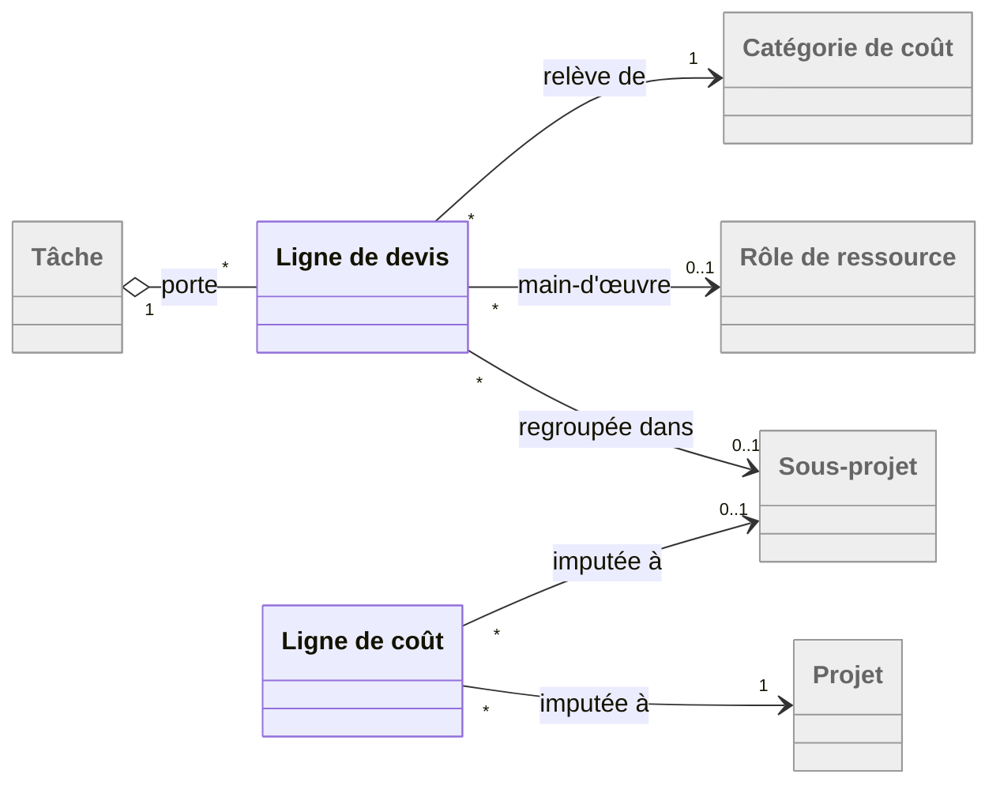
```mermaid
classDiagram
    direction LR
    class LigneDevis["Ligne de devis"]
    class LigneCout["Ligne de coût"]
    class Tache["Tâche"]
    class Categorie["Catégorie de coût"]
    class Role["Rôle de ressource"]
    class SousProjet["Sous-projet"]
    class Projet["Projet"]

    Tache "1" o-- "*" LigneDevis : porte
    LigneDevis "*" --> "1" Categorie : relève de
    LigneDevis "*" --> "0..1" Role : main-d'œuvre
    LigneDevis "*" --> "0..1" SousProjet : regroupée dans
    LigneCout "*" --> "1" Projet : imputée à
    LigneCout "*" --> "0..1" SousProjet : imputée à

    style Tache fill:#eeeeee,stroke:#999999,color:#666666
    style Categorie fill:#eeeeee,stroke:#999999,color:#666666
    style Role fill:#eeeeee,stroke:#999999,color:#666666
    style SousProjet fill:#eeeeee,stroke:#999999,color:#666666
    style Projet fill:#eeeeee,stroke:#999999,color:#666666
```

*Figure 6 — Modèle conceptuel du chiffrage et des coûts*

**La ligne de devis.** Toute ligne relève d’une catégorie de coût, et par elle d’une nature. Le chemin pour l’atteindre diffère selon la nature. Pour la main-d’œuvre, l’utilisateur traverse l’organigramme et choisit un rôle de ressource, qui détermine la catégorie ; la ligne porte alors une charge en heures, et le taux horaire de la catégorie la convertit en montant. Sinon, l’utilisateur choisit directement la catégorie, et la ligne porte une quantité et un débours. Une ligne porte en outre un délai de paiement, nul pour la main-d’œuvre, qui sert aux projections de décaissement.

**Montants d’une ligne. **Le montant budgété est celui que la référence a fixé : il ne change que lorsqu’un avenant produit une nouvelle révision de référence. Le montant réestimé est celui que les revues périodiques mettent à jour. Le budget de référence est la somme des montants budgétés hors lignes de provision ; le reste à engager se calcule sur les montants réestimés. Une ligne ajoutée après la référence — tâche non anticipée — porte un montant budgété nul : elle pèse sur le reste à engager, jamais sur le budget. Les lignes issues d’un risque survenu portent, elles aussi, un montant budgété nul : c’est à la réserve pour risques de la référence que leur coût se compare (WF-RIS-0050).

**Reste à engager. **Il ne constitue pas un objet distinct : ce sont les mêmes lignes, dans la structure principale de la révision courante, lues par leur montant réestimé, lignes de provision des risques identifiés comprises (WF-RIS-0050). Le reste à engager n’expose à la réestimation que les lignes des tâches démarrées : une tâche non démarrée garde son montant budgété, corrigé de l’inflation si elle a glissé dans le temps, et une tâche dont le reste à engager est nul est terminée.

**Valeur acquise.** Elle procède des tâches : quand le reste à engager de l’une d’elles passe à zéro, la valeur de ses lignes dans la structure de référence est acquise. C’est le montant budgété qui s’acquiert, jamais celui qui est facturé : l’écart entre les deux est précisément ce que l’indicateur de coûts mesure. Un acompte de sous-traitance s’acquiert donc au franchissement de son jalon, et une fourniture à sa réception, pour peu que l’utilisateur ait créé le jalon correspondant.

**Coûts réels.** Une ligne de coût est une ligne comptable importée de l’ERP. Elle ne se rattache à aucune tâche et à aucune révision : elle est imputée au projet, et au sous-projet lorsque son code en désigne un. Le rapprochement entre ce qui a été dépensé et ce qui avait été prévu se fait donc à la maille du sous-projet, qui regroupe des lignes de devis. C’est pourquoi le sous-projet est la granularité minimale de l’avancement financier : c’est la maille la plus fine où le prévu et le réalisé se rejoignent.

**Manipulé par** : FBS-4.4, FBS-4.5, FBS-4.7.

### 3.2.6. Risques

Un risque est porté par le projet, et non par une révision : c’est lui qui traverse le temps, tandis que chaque révision fige l’évaluation qu’on en faisait à sa date.

<!-- source : figures/modele-risques.mmd — régénéré par tools/build.py -->

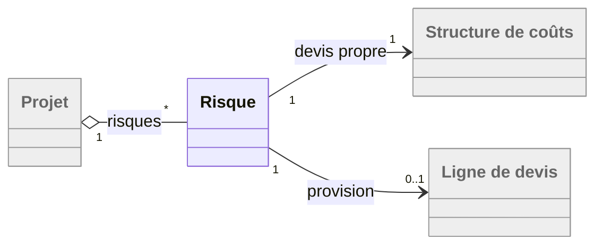
```mermaid
classDiagram
    direction LR
    class Projet["Projet"]
    class Risque["Risque"]
    class Structure["Structure de coûts"]
    class LigneDevis["Ligne de devis"]

    Projet "1" o-- "*" Risque : risques
    Risque "1" --> "1" Structure : devis propre
    Risque "1" --> "0..1" LigneDevis : provision

    style Projet fill:#eeeeee,stroke:#999999,color:#666666
    style Structure fill:#eeeeee,stroke:#999999,color:#666666
    style LigneDevis fill:#eeeeee,stroke:#999999,color:#666666
```

*Figure 7 — Modèle conceptuel des risques*

**Représentations d’un risque.** Un risque possède un **devis propre** : une structure de coûts, avec ses tâches et ses lignes, qui décrit ce qu’il coûterait s’il survenait. Cette structure reste à l’écart de la structure principale tant que le risque ne s’est pas produit. Tant qu’il est identifié, le risque est en outre représenté dans la structure principale par une ligne de provision, dont le montant est sa gravité pondérée par sa probabilité ; cette ligne compte au devis et au reste à engager, jamais au budget de référence : la révision de référence conserve la somme de ses lignes de provision à part, comme réserve pour risques (WF-RIS-0050). La gravité n’est pas saisie : c’est le total du devis propre. Qualifier un risque suppose donc de l’avoir chiffré, ce qui est voulu.

**Nature de la provision**. La ligne de provision relève d’une nature de type provision, distincte de la main-d’œuvre et du hors main-d’œuvre. La ventilation du devis montre ainsi les provisions séparément, sans règle particulière. Faute de tâche qui lui revienne naturellement, cette ligne est portée par la tâche récapitulative du projet, à moins que l’utilisateur ne la rattache à la phase que le risque menace.

**États d’un risque.** Un risque est identifié, survenu, ou écarté. Sa probabilité et son état sont réexaminés à chaque revue périodique : un risque qui ne peut plus se produire est écarté, et sa provision cesse de peser sur le devis. Son devis propre, lui, reste modifiable tout au long du projet : c’est ce qui permet de le réévaluer avant sa fusion, car un risque qui survient tardivement ne coûte pas ce qu’on avait prévu deux ans plus tôt, et le planning dans lequel il doit se fondre a changé. Ce qui est figé, ce n’est pas le devis propre mais la réserve pour risques de la révision de référence, à laquelle se comparent les provisions restantes et le coût des risques survenus.

**La survenance.** Un risque survenu n’est plus un risque mais un fait. Les tâches et les lignes de son devis propre sont fusionnées dans la structure principale de la révision en cours, comme des tâches ajoutées en cours d’exécution : elles portent un montant budgété nul, leur montant réestimé est celui du devis propre, et la ligne de provision disparaît. La survenance ne marque aucune révision et ne déplace pas la référence : le budget de référence ne bouge que par un avenant. L’écart entre ce qui avait été provisionné et ce que le risque coûte se lit dans la couverture des risques (WF-RIS-0050) et dans la projection du chef de projet, qui porte désormais ce coût. C’est ce qui empêche un projet de consommer ses provisions en donnant l’impression de tenir son budget.

**Manipulé par** : FBS-4.1, FBS-4.6.

## 3.3. Modes de fonctionnements

Ce chapitre décrit ce qui, à chaque instant, décide de ce qu’on peut faire : l’état de la plateforme et l’état de chaque projet. Les fonctions du découpage disent ce que Waterfall sait faire ; les modes de fonctionnement disent quand il accepte de le faire.

Deux cycles se superposent. Celui de la plateforme est court et ne se parcourt qu’une fois : tant que le référentiel n’a pas atteint un minimum, aucun projet ne peut être créé. Celui d’un projet se parcourt à chaque affaire, de sa création à l’un de ses trois états terminaux, et c’est lui qui commande le plus : ce qu’une révision accepte, ce qu’un import peut modifier, ce qui devient définitif. Les états d’un projet ne s’avancent jamais à la main — ils se déduisent de faits — et seules ses sorties sont des décisions humaines.

### 3.3.1. Cycle de vie de la plateforme

La plateforme ne permet de créer des projets que lorsque le référentiel commun suffit pour les planifier et les chiffrer : un calendrier pour convertir une durée en dates, des rôles de ressources et des catégories de coût pour convertir une charge en montant.

Ces prérequis se vérifient en deux temps. L’existence du référentiel se vérifie à la création du projet (WF-CYC-0120). Les taux horaires, eux, dépendent des catégories de coût qu’un devis emploie réellement : ils se vérifient au calcul du devis ou du reste à engager, pour l’année de référence seulement (WF-DEV-0010). Le taux d’inflation n’est pas un prérequis de calcul, car il est porté par le projet et vaut 0 % par défaut.

```yaml exigence
section: "3.3.1"
id: "WF-CYC-0120-A"
titre: "Référentiel minimal requis pour la création d’un projet"
flexibilite: "F0"
fbs: "FBS-3, FBS-4.9"
pbs: "PBS-1.1, PBS-2.1, PBS-2.3, PBS-3.1"
corps: "La création d’un projet est refusée tant que le référentiel commun est incomplet, c’est-à-dire tant qu’il manque l’un des éléments suivants : un calendrier par défaut actif dont au moins un jour de la semaine compte des heures travaillées ; au moins une catégorie de coût active ; au moins un rôle de ressource actif."
motif: "Si aucun jour ne compte d’heures travaillées, toute durée calculée vaut zéro. Sans catégorie de coût ni rôle, aucune ligne de devis ne peut être chiffrée. Laisser créer le projet ne ferait que déplacer l’échec vers un écran où sa cause n’est plus visible. Les taux horaires ne font pas partie de ces prérequis : ils ne sont exigés que pour les catégories de coût qu’un devis emploie réellement, et pour son année de référence (WF-DEV-0010)."
verification: "Sur une plateforme dont le référentiel est incomplet, la création d’un projet est refusée, et le refus nomme chaque prérequis manquant. La création aboutit dès que tous les prérequis sont satisfaits. Sur une installation dont le référentiel est incomplet, l’accueil énonce les prérequis manquants et mène au référentiel."
```

### 3.3.2. Cycle de vie d’un projet

La figure suivante présente le cycle de vie d’un projet. Ce cycle de vie compte six états qui sont décrits dans la suite de ce paragraphe.

<!-- source : waterfall.visuels.drawio, page « Cycle de vie projet » — régénéré par tools/build.py -->

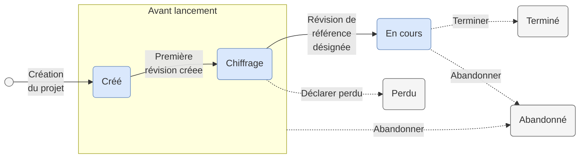
```mermaid
flowchart LR
    subgraph Avant_lancement["Avant lancement"]
        Cree("Créé")
        Chiffrage("Chiffrage")
    end
    N((" "))
    En_cours("En cours")
    Perdu("Perdu")
    Termine("Terminé")
    Abandonne("Abandonné")

    Avant_lancement -.->|"Abandonner"| Abandonne
    N -->|"Création<br>du projet"| Cree
    Cree -->|"Première<br>révision créee"| Chiffrage
    Chiffrage -->|"Révision de<br>référence<br>désignée"| En_cours
    Chiffrage -.->|"Déclarer perdu"| Perdu
    En_cours -.->|"Terminer"| Termine
    En_cours -.->|"Abandonner"| Abandonne

    classDef c1 fill:#dae8fc,stroke:#6c8ebf
    class Chiffrage,Cree,En_cours c1
    classDef c2 fill:#f5f5f5,stroke:#666666
    class Abandonne,N,Perdu,Termine c2
```

*Figure 8 — Diagramme d’état du cycle de vie d’un projet*

Les six états portent un code, que l’API renvoie et que le front rend dans la langue du lecteur (WF-ARC-0110, WF-INTF-0170). Le tableau suivant les définit ; il reprend les états de la figure 8, et aucun autre.

| Code        | État                   |
|-------------|------------------------|
| created     | Créé — Created         |
| pricing     | Chiffrage — Pricing    |
| in_progress | En cours — In progress |
| completed   | Terminé — Completed    |
| lost        | Perdu — Lost           |
| abandoned   | Abandonné — Abandoned  |

Tableau 6 États d'un projet

```yaml exigence
section: "3.3.2"
id: "WF-CYC-0010-A"
titre: "États du cycle de vie"
flexibilite: "F0"
fbs: "FBS-4.9"
pbs: "PBS-1.1, PBS-2.1, PBS-2.3, PBS-3.1"
corps: "Le cycle de vie d’un projet comporte exactement six états, dont les codes et les libellés sont ceux du tableau des états d’un projet : Créé (created), Chiffrage (pricing), En cours (in_progress), Terminé (completed), Perdu (lost), Abandonné (abandoned). Il n’existe aucun autre statut, ni aucun état intermédiaire implicite."
motif: "Un statut commande des droits d’écriture. Un état non déclaré est un trou dans la règle de lecture seule des projets terminaux."
verification: "Les listes, filtres et en-têtes de projet ne proposent que ces six statuts, avec les codes et libellés du tableau des états d’un projet. L’API ne renvoie que ces six codes."
```

```yaml exigence
section: "3.3.2"
id: "WF-CYC-0020-A"
titre: "Progression automatique"
flexibilite: "F0"
fbs: "FBS-4.9"
pbs: "PBS-1.1, PBS-2.1, PBS-2.3, PBS-3.1"
corps: "Les transitions vers Chiffrage et En cours sont déclenchées par les faits métier indiqués sur le diagramme du cycle de vie. Elles ne sont jamais proposées à l’utilisateur comme une action."
motif: "Un statut que l’on fait avancer à la main finit par décrire l’intention de celui qui a cliqué, et non l’état réel du projet. Déduit d’un fait, il reste vrai sans que personne ait à y veiller."
verification: "Aucun écran ne propose de commande menant à Chiffrage ou En cours. Chacun de ces états est atteint dès que son fait déclencheur est réalisé, sans autre action."
```

```yaml exigence
section: "3.3.2"
id: "WF-CYC-0030-A"
titre: "Conditions du passage à En cours"
flexibilite: "F0"
fbs: "FBS-4.9"
pbs: "PBS-1.1, PBS-2.1, PBS-2.3, PBS-3.1"
corps: "Le passage à En cours exige qu’une révision de référence soit désignée, qu’elle porte au moins une tâche et au moins une ligne de devis, et que le code projet soit renseigné."
motif: "Une révision de référence sans tâche laisserait le projet piloté contre un budget sans structure ; sans ligne de devis, elle donnerait un budget de référence nul, donc des indices de coût et de délai dépourvus de sens. Une seule désignation suffit, parce qu’une révision porte à la fois le planning et le devis."
verification: "La désignation comme référence d’une révision sans tâche ou sans ligne de devis ne fait pas passer le projet à En cours, et la condition manquante est nommée à l’utilisateur."
```

```yaml exigence
section: "3.3.2"
id: "WF-CYC-0050-A"
titre: "Conditions de progression consultables"
flexibilite: "F0"
fbs: "FBS-4.9"
pbs: "PBS-1.1, PBS-2.1, PBS-2.3, PBS-3.1"
corps: "Pour un projet qui n’a pas atteint En cours, l’utilisateur peut consulter à tout moment le prochain état, son fait déclencheur et, une par une, les conditions qui restent à satisfaire."
motif: "Une transition automatique qui ne se produit pas ne dit rien par elle-même : si les conditions ne sont pas énoncées, l’utilisateur ne peut pas savoir ce qui manque."
verification: "Pour un projet dans chacun des états Créé et Chiffrage, l’utilisateur consulte le prochain état, son déclencheur et les conditions restantes, sans avoir tenté d’action."
```

```yaml exigence
section: "3.3.2"
id: "WF-CYC-0060-A"
titre: "Sorties manuelles"
flexibilite: "F0"
fbs: "FBS-4.9"
pbs: "PBS-1.1, PBS-2.1, PBS-2.3, PBS-3.1"
corps: "Les seules transitions commandées par l’utilisateur sont les trois sorties : Terminé depuis En cours, Perdu depuis Chiffrage, Abandonné depuis tout état non terminal."
motif: "Les sorties sont les seules décisions humaines du cycle de vie. Elles constatent un fait que Waterfall ne peut pas déduire : la fin des travaux, la perte d’une affaire, l’arrêt d’un projet. Une affaire ne se perd que sur une offre, donc une fois le chiffrage engagé. Un projet arrêté avant ce stade, ou après son lancement, est abandonné. Cette distinction donne leur sens commercial aux statistiques de projets."
verification: "Pour chaque état non terminal, le menu des sorties ne propose que les sorties permises depuis cet état, conformément au diagramme du cycle de vie."
```

```yaml exigence
section: "3.3.2"
id: "WF-CYC-0080-A"
titre: "Irréversibilité des états terminaux"
flexibilite: "F0"
fbs: "FBS-4.9"
pbs: "PBS-1.1, PBS-2.1, PBS-2.3, PBS-3.1"
corps: "Les trois états terminaux, Terminé, Perdu et Abandonné, sont irréversibles. Aucune transition n’en part, y compris vers un autre état terminal."
motif: "Le projet devient une archive comptable. Le rouvrir invaliderait après coup les analyses qui le comptaient comme clos."
verification: "Toute tentative de transition depuis Terminé, Perdu ou Abandonné est refusée."
```

```yaml exigence
section: "3.3.2"
id: "WF-CYC-0090-A"
titre: "Confirmation des sorties"
flexibilite: "F0"
fbs: "FBS-4.9"
pbs: "PBS-1.1, PBS-2.1, PBS-2.3, PBS-3.1"
corps: "Une sortie manuelle n’est appliquée qu’après une confirmation qui énonce son caractère définitif et ce qu’elle rend non modifiable. La confirmation propose la saisie d’un motif, facultatif, que la transition conserve (WF-CYC-0130)."
motif: "C’est la seule action de l’application qu’aucun geste ultérieur ne peut annuler."
verification: "La confirmation nomme l’état visé et le passage en lecture seule du projet et de toutes ses données, et propose la saisie d’un motif ; une sortie confirmée sans motif est appliquée."
```

```yaml exigence
section: "3.3.2"
id: "WF-CYC-0130-A"
titre: "Datation des transitions"
flexibilite: "F0"
fbs: "FBS-4.9"
pbs: "PBS-1.1, PBS-2.1, PBS-2.3, PBS-3.1"
corps: "Chaque transition d’état d’un projet est datée du jour où elle se produit et porte son auteur ; une sortie manuelle conserve le motif donné à sa confirmation (WF-CYC-0090). L’historique des états, avec ces dates, ces auteurs et ces motifs, est consultable depuis le projet. Rien n’y est modifiable."
motif: "Les statistiques de portefeuille se calculent par période — projets terminés, offres perdues ou gagnées, portefeuille à une date passée — et n’ont de sens que si chaque changement d’état est situé dans le temps par le fait qui l’a produit, non par une saisie."
verification: "Après passage d’un projet à En cours puis à Terminé, l’historique présente les deux transitions avec leur date. Un projet passé à Perdu le 15 mars compte parmi les offres closes de mars et d’aucun autre mois. Une sortie à Perdu confirmée avec un motif présente ce motif dans l’historique ; une transition automatique n’en porte aucun."
```

```yaml exigence
section: "3.3.2"
id: "WF-CYC-0100-A"
titre: "Lecture seule des projets terminaux"
flexibilite: "F0"
fbs: "FBS-4.9"
pbs: "PBS-1.1, PBS-2.1, PBS-2.3, PBS-3.1"
corps: "Dans un état terminal, le projet et toutes ses données (plannings, devis, restes à engager, coûts réels) sont en lecture seule, quel que soit le point d’entrée : saisie, import de fichier ou traitement automatique."
motif: "Une protection limitée aux écrans protège l’utilisateur attentif. Elle ne protège ni d’un import, ni d’un traitement automatique."
verification: "Toute modification d’un projet terminal est refusée, qu’elle soit tentée par la saisie, par un import Excel ou MS Project, ou par un traitement automatique."
```

```yaml exigence
section: "3.3.2"
id: "WF-CYC-0110-A"
titre: "Consultation des projets terminaux"
flexibilite: "F0"
fbs: "FBS-4.9"
pbs: "PBS-1.1, PBS-2.1, PBS-2.3, PBS-3.1"
corps: "Un projet dans un état terminal reste entièrement consultable : planning, devis, coûts réels, analyses et exports."
motif: "La valeur d’un projet clos est justement d’être relu, pour chiffrer le suivant ou pour justifier le précédent."
verification: "Toutes les vues de consultation d’un projet clos s’affichent normalement, et ses exports aboutissent. Seules les modifications sont refusées."
```

## 3.4. Découpage fonctionnel

Ce chapitre spécifie les fonctions de Waterfall une à une, dans l’ordre d’une arborescence qui les recense toutes et leur donne un code.

Quatre blocs le composent :

- L’administration (FBS-1) porte l’exploitation de la plateforme : les comptes, les droits, la surveillance, les sauvegardes, le journal d’audit.

- Le portefeuille (FBS-2) porte les vues qui traversent les projets.

- Les paramètres applicatifs (FBS-3) portent le référentiel que tous les projets partagent.

- Le bloc des projets (FBS-4), de loin le plus étendu, porte tout ce qu’un projet contient et tout ce qu’on y fait, de la révision à l’indicateur.

Chaque bloc s’ouvre par un texte qui dit ce qu’il couvre et ce qu’il laisse aux autres, puis énonce ses exigences.

### 3.4.1. Arborescence fonctionnelle

L’arborescence fonctionnelle découpe Waterfall en fonctions, chacune identifiée par un code de la forme FBS-n, FBS-n.m ou FBS-n.m.p. Chaque exigence du document cite dans son champ FBS la ou les fonctions qu’elle concerne, et c’est ce lien qui permet de retrouver toutes les exigences d’une fonction, ou de vérifier qu’une fonction n’en porte aucune.

Trois règles gouvernent ces codes.

**Un code ne suit pas la numérotation des sections.** Insérer un paragraphe décale les numéros de section ; les codes FBS, eux, ne bougent pas. C’est pourquoi FBS-1 Administration est décrite au §3.4.2, et non au §3.4.1.

**Un code ne change jamais.** Une fonction déplacée dans l’arborescence garde le sien, et une fonction supprimée ne le libère pas. Une fonction nouvelle prend le prochain code libre à son niveau, même si elle s’insère au milieu : c’est ainsi que FBS-4.2.4 Contributeurs et FBS-4.3.5 Arborescence de tâches ont été ajoutées.

**Toute fonction n’a pas son paragraphe dans ce chapitre.** FBS-4.9 Cycle de vie du projet est décrite au §3.3.2, avec les modes de fonctionnement. Le découpage fonctionnel organise la rédaction ; l’arborescence, elle, recense les fonctions.

<!-- source : waterfall.visuels.drawio, page « FBS » — régénéré par tools/build.py -->


```mermaid
flowchart LR
    Waterfall["Waterfall"]
    FBS_1_Administration["FBS-1<br>Administration"]
    FBS_1_1_Gestion_des_utilisateurs["FBS-1.1<br>Gestion des utilisateurs"]
    FBS_1_2_Gestion_des_roles_d_habilitation["FBS-1.2<br>Gestion des rôles d’habilitation"]
    FBS_1_3_Surveillance_de_l_etat_du_systeme["FBS-1.3<br>Surveillance de l’état du système"]
    FBS_2_Portefeuille["FBS-2<br>Portefeuille"]
    FBS_2_1_Portefeuille_de_projets["FBS-2.1<br>Portefeuille de projets"]
    FBS_2_2_Plan_de_charge_agrege["FBS-2.2<br>Plan de charge agrégé"]
    FBS_2_3_Performance_du_portefeuille["FBS-2.3<br>Performance du portefeuille"]
    FBS_3_Parametres_applicatifs["FBS-3<br>Paramètres applicatifs"]
    FBS_3_1_Parametres_de_couts["FBS-3.1<br>Paramètres de coûts"]
    FBS_3_1_1_Nature_et_categories_de_couts["FBS-3.1.1<br>Nature et catégories de coûts"]
    FBS_3_1_2_Taux_horaires["FBS-3.1.2<br>Taux horaires"]
    FBS_3_2_Parametres_de_ressources["FBS-3.2<br>Paramètres de ressources"]
    FBS_3_2_1_Arbre_d_organisation["FBS-3.2.1<br>Arbre d’organisation"]
    FBS_3_2_2_Roles_de_ressources["FBS-3.2.2<br>Rôles de ressources"]
    FBS_3_2_3_Calendriers["FBS-3.2.3<br>Calendriers"]
    FBS_4_Projets["FBS-4<br>Projets"]
    FBS_4_1_Gestion_des_revisions["FBS-4.1<br>Gestion des révisions"]
    FBS_4_2_Parametres_de_projets["FBS-4.2<br>Paramètres de projets"]
    FBS_4_3_Planification["FBS-4.3<br>Planification"]
    FBS_4_4_Chiffrage_et_devis["FBS-4.4<br>Chiffrage et devis"]
    FBS_4_5_Estimation_du_reste_a_engager["FBS-4.5<br>Estimation du reste à engager"]
    FBS_4_6_Gestion_des_risques["FBS-4.6<br>Gestion des risques"]
    FBS_4_7_Couts_reels["FBS-4.7<br>Coûts réels"]
    FBS_4_8_Indicateurs_projets["FBS-4.8<br>Indicateurs projets"]
    FBS_4_9_Cycle_de_vie_du_projet["FBS-4.9<br>Cycle de vie du projet"]
    FBS_3_3_Parametres_de_risques["FBS-3.3<br>Paramètres de risques"]
    FBS_3_4_Parametres_d_indicateurs["FBS-3.4<br>Paramètres d'indicateurs"]
    FBS_1_4_Sauvegarde_et_restauration["FBS-1.4<br>Sauvegarde et restauration"]
    FBS_1_5_Journal_d_audit["FBS-1.5<br>Journal d’audit"]
    FBS_2_4_Structure_des_couts_du_portefeuille["FBS-2.4<br>Structure des coûts du portefeuille"]
    FBS_2_5_Risques_du_portefeuille["FBS-2.5<br>Risques du portefeuille"]
    FBS_2_6_Courbe_en_S_du_portefeuille["FBS-2.6<br>Courbe en S du portefeuille"]
    FBS_2_7_Sante_du_pilotage["FBS-2.7<br>Santé du pilotage"]

    Waterfall --> FBS_4_Projets
    Waterfall --> FBS_3_Parametres_applicatifs
    Waterfall --> FBS_2_Portefeuille
    Waterfall --> FBS_1_Administration
    FBS_1_Administration --> FBS_1_1_Gestion_des_utilisateurs
    FBS_1_Administration --> FBS_1_2_Gestion_des_roles_d_habilitation
    FBS_1_Administration --> FBS_1_3_Surveillance_de_l_etat_du_systeme
    FBS_1_Administration --> FBS_1_4_Sauvegarde_et_restauration
    FBS_1_Administration --> FBS_1_5_Journal_d_audit
    FBS_2_Portefeuille --> FBS_2_1_Portefeuille_de_projets
    FBS_2_Portefeuille --> FBS_2_2_Plan_de_charge_agrege
    FBS_2_Portefeuille --> FBS_2_3_Performance_du_portefeuille
    FBS_2_Portefeuille --> FBS_2_4_Structure_des_couts_du_portefeuille
    FBS_2_Portefeuille --> FBS_2_5_Risques_du_portefeuille
    FBS_2_Portefeuille --> FBS_2_6_Courbe_en_S_du_portefeuille
    FBS_2_Portefeuille --> FBS_2_7_Sante_du_pilotage
    FBS_3_Parametres_applicatifs --> FBS_3_1_Parametres_de_couts
    FBS_3_Parametres_applicatifs --> FBS_3_2_Parametres_de_ressources
    FBS_3_Parametres_applicatifs --> FBS_3_3_Parametres_de_risques
    FBS_3_Parametres_applicatifs --> FBS_3_4_Parametres_d_indicateurs
    FBS_3_1_Parametres_de_couts --> FBS_3_1_1_Nature_et_categories_de_couts
    FBS_3_1_Parametres_de_couts --> FBS_3_1_2_Taux_horaires
    FBS_3_2_Parametres_de_ressources --> FBS_3_2_1_Arbre_d_organisation
    FBS_3_2_Parametres_de_ressources --> FBS_3_2_2_Roles_de_ressources
    FBS_3_2_Parametres_de_ressources --> FBS_3_2_3_Calendriers
    FBS_4_Projets --> FBS_4_1_Gestion_des_revisions
    FBS_4_Projets --> FBS_4_2_Parametres_de_projets
    FBS_4_Projets --> FBS_4_3_Planification
    FBS_4_Projets --> FBS_4_4_Chiffrage_et_devis
    FBS_4_Projets --> FBS_4_5_Estimation_du_reste_a_engager
    FBS_4_Projets --> FBS_4_6_Gestion_des_risques
    FBS_4_Projets --> FBS_4_7_Couts_reels
    FBS_4_Projets --> FBS_4_8_Indicateurs_projets
    FBS_4_Projets --> FBS_4_9_Cycle_de_vie_du_projet

    classDef c1 fill:#1ba1e2,stroke:#006EAF
    class FBS_1_Administration,FBS_2_Portefeuille,FBS_3_1_Parametres_de_couts,FBS_3_2_Parametres_de_ressources,FBS_3_3_Parametres_de_risques,FBS_3_4_Parametres_d_indicateurs,FBS_3_Parametres_applicatifs,FBS_4_2_Parametres_de_projets,FBS_4_3_Planification,FBS_4_4_Chiffrage_et_devis,FBS_4_5_Estimation_du_reste_a_engager,FBS_4_6_Gestion_des_risques,FBS_4_8_Indicateurs_projets,FBS_4_Projets,Waterfall c1
    classDef c2 fill:#dae8fc,stroke:#6c8ebf
    class FBS_1_1_Gestion_des_utilisateurs,FBS_1_2_Gestion_des_roles_d_habilitation,FBS_1_3_Surveillance_de_l_etat_du_systeme,FBS_1_4_Sauvegarde_et_restauration,FBS_1_5_Journal_d_audit,FBS_2_1_Portefeuille_de_projets,FBS_2_2_Plan_de_charge_agrege,FBS_2_3_Performance_du_portefeuille,FBS_2_4_Structure_des_couts_du_portefeuille,FBS_2_5_Risques_du_portefeuille,FBS_2_6_Courbe_en_S_du_portefeuille,FBS_2_7_Sante_du_pilotage,FBS_3_1_1_Nature_et_categories_de_couts,FBS_3_1_2_Taux_horaires,FBS_3_2_1_Arbre_d_organisation,FBS_3_2_2_Roles_de_ressources,FBS_3_2_3_Calendriers,FBS_4_1_Gestion_des_revisions,FBS_4_7_Couts_reels,FBS_4_9_Cycle_de_vie_du_projet c2
```

*Figure 9 — Arborescence fonctionnelle*

### 3.4.2. FBS-1 : Administration

Ce bloc porte les fonctions d’exploitation de la plateforme : qui peut s’y connecter, ce que chacun a le droit d’y faire, ce qui s’y est fait, et si elle fonctionne. Aucune d’elles ne modifie une donnée de projet en particulier ; la restauration les remplace toutes ensemble, sans en distinguer aucune.

Le système de droits repose sur deux mécanismes qui ne se substituent pas l’un à l’autre. Les **rôles d’habilitation** disent ce qu’un utilisateur a le droit de faire ; la **liste des contributeurs** de chaque projet dit sur quels projets il le fait (WF-PRJ-0060). Le premier est administré ici ; la seconde appartient au projet.

#### 3.4.2.1. FBS-1.1 : Gestion des utilisateurs

Un compte est ce par quoi une personne existe dans Waterfall : une identité, un état, des rôles, et quelques réglages qui lui sont propres. Les comptes viennent le plus souvent de l’annuaire de l’entreprise, qui reste la source de leur identité ; Waterfall n’y ajoute que ce que l’annuaire ignore — les rôles, le rattachement à l’organisation, les préférences. Le fournisseur d’identité livré avec la plateforme les authentifie (WF-ARC-0030).

Un compte ne se supprime pas plus qu’un objet du référentiel : il se désactive. Une personne partie a marqué des révisions, exclu des lignes de coût, déclaré des risques survenus, et ces actes doivent rester attribuables.

```yaml exigence
section: "3.4.2.1"
id: "WF-ADM-0050-A"
titre: "Attributs d’un compte utilisateur"
flexibilite: "F0"
fbs: "FBS-1.1"
pbs: "PBS-1.1, PBS-2.1, PBS-2.3, PBS-3.1"
corps: "Un compte utilisateur porte : un nom, un prénom, une adresse électronique unique dans l’installation, un état — actif (active) ou désactivé (deactivated) —, zéro, un ou plusieurs rôles d’habilitation — un compte sans rôle existe mais n’a aucun droit (WF-ADM-0070) —, un rattachement facultatif à un nœud d’organisation (WF-ADM-0030), une langue d’interface (WF-INTF-0160), un avatar facultatif. son origine : compte local, compte de l’annuaire d’entreprise, ou compte venu d’un fournisseur d’identité externe (WF-ADM-0180)."
motif: "L’adresse électronique est ce qui identifie une personne d’un système à l’autre : c’est par elle que l’annuaire et Waterfall reconnaissent le même compte. L’origine dit qui fait foi pour l’identité — l’annuaire ou le fournisseur externe pour un compte fédéré, Waterfall pour un compte local — et donc ce qui est modifiable où."
verification: "La création d’un compte sans nom, sans prénom ou sans adresse est refusée, de même que celle d’un compte dont l’adresse est déjà portée par un autre. Le nom, le prénom et l’adresse d’un compte de l’annuaire ou d’un fournisseur externe ne sont pas modifiables dans Waterfall."
```

```yaml exigence
section: "3.4.2.1"
id: "WF-ADM-0060-A"
titre: "Cycle de vie d’un compte"
flexibilite: "F0"
fbs: "FBS-1.1"
pbs: "PBS-1.1, PBS-2.1, PBS-2.3, PBS-2.5, PBS-5.4, PBS-3.1"
corps: "Un compte se crée, se modifie et se désactive ; il ne se supprime pas. Un compte désactivé ne peut plus se connecter, n’est plus proposé comme contributeur, et reste affiché partout où il a agi. Il peut être réactivé."
motif: "Un compte a marqué des révisions, exclu des lignes de coût, déclaré des risques survenus : ces actes doivent rester attribuables après le départ de la personne. C’est la même règle que pour le référentiel, et pour la même raison."
verification: "Aucun écran ne propose de supprimer un compte. La connexion d’un compte désactivé est refusée. Une révision marquée par un compte depuis désactivé affiche toujours son auteur. Un compte réactivé se connecte de nouveau avec ses rôles d’avant."
```

```yaml exigence
section: "3.4.2.1"
id: "WF-ADM-0070-A"
titre: "Lecture des comptes du fournisseur d’identité"
flexibilite: "F0"
fbs: "FBS-1.1"
pbs: "PBS-1.1, PBS-2.1, PBS-2.2, PBS-2.3, PBS-2.5, PBS-5.4, PBS-3.1, PBS-5.3"
corps: "Les comptes de l’annuaire d’entreprise sont connus de Waterfall avant la première connexion de leur porteur : Waterfall lit les comptes du fournisseur d’identité, qui fédère l’annuaire, par son API d’administration, à la demande et à intervalle régulier. La lecture crée les comptes absents avec leur nom, leur prénom et leur adresse électronique, met à jour ces trois attributs sur les comptes existants, et désactive les comptes que le fournisseur ne connaît plus. Un compte que WF-ADM-0120 interdit de désactiver est conservé actif et signalé dans le compte rendu de la synchronisation. La lecture n’attribue aucun rôle d’habilitation : un compte ainsi créé n’a aucun droit tant qu’un rôle ne lui a pas été donné dans Waterfall. Un compte local se crée depuis Waterfall, qui le crée dans le fournisseur par la même API."
motif: "L’annuaire est la source de vérité de l’identité, et personne ne doit ressaisir des noms qu’il connaît déjà. Waterfall doit pourtant connaître un compte avant sa première connexion, pour l’inscrire comme contributeur. L’annuaire ne sait rien des rôles de Waterfall, et une lecture qui en attribuerait donnerait des droits que personne n’a décidés. Désactiver plutôt que supprimer les comptes disparus conserve leurs actes."
verification: "Après synchronisation, chaque personne de l’annuaire retenue a un compte actif dans Waterfall, sans rôle si elle n’en avait pas, avant toute connexion. Une personne retirée de l’annuaire voit son compte désactivé à la synchronisation suivante, et ses actes restent consultables. Le dernier compte administrateur, retiré de l’annuaire, reste actif et la synchronisation le signale. Un compte local créé depuis Waterfall existe dans le fournisseur d’identité."
```

```yaml exigence
section: "3.4.2.1"
id: "WF-ADM-0140-A"
titre: "Authentification et mot de passe"
flexibilite: "F0"
fbs: "FBS-1.1"
pbs: "PBS-1.1, PBS-2.1, PBS-2.3, PBS-2.5, PBS-5.4, PBS-3.1"
corps: "L’authentification est assurée par le fournisseur d’identité livré avec la plateforme (WF-ARC-0030) : un compte de l’annuaire s’authentifie auprès de l’annuaire, un compte local auprès du fournisseur, et Waterfall ne conserve aucun mot de passe. La configuration livrée du fournisseur impose aux comptes locaux un mot de passe d’au moins douze caractères, qui ne peut être ni l’adresse électronique ni le nom ; verrouille le compte quinze minutes après dix échecs consécutifs ; fixe et réinitialise le mot de passe par un lien envoyé à l’adresse du compte, valable une heure et à usage unique ; et n’impose aucune expiration périodique. Un compte local nouvellement créé n’a pas de mot de passe et ne peut pas se connecter avant que son porteur n’en ait fixé un par ce lien, qu’un utilisateur habilité peut renvoyer. Un utilisateur habilité peut aussi obtenir ce lien depuis Waterfall, pour le remettre au porteur par un autre canal ; c’est par ce moyen que le premier administrateur fixe son mot de passe à l’installation (WF-EXP-0020), et que la réinitialisation se fait sur une installation sans messagerie (WF-CMP-0030)."
motif: "Déléguer l’authentification à un fournisseur éprouvé retire du code de sécurité au projet, et fédérer l’annuaire évite deux mots de passe pour une même personne en laissant à l’entreprise la politique qu’elle applique déjà. Pour les comptes locaux, la longueur protège mieux que la complexité imposée, et l’expiration périodique pousse aux mots de passe faibles et notés : les recommandations actuelles y ont renoncé. Le verrouillage temporaire arrête la force brute sans permettre de bloquer un compte à volonté."
verification: "Un compte importé n’a pas d’écran de mot de passe et se connecte avec ses identifiants d’annuaire. Un mot de passe de onze caractères est refusé, de même que l’adresse du compte. Dix échecs verrouillent le compte, qui se déverrouille après quinze minutes. Un lien de réinitialisation utilisé une fois, ou après une heure, est refusé. Un compte créé par un administrateur ne peut pas se connecter avant que son porteur n’ait fixé son mot de passe par le lien reçu ou remis. Aucun écran de Waterfall ne demande, n’affiche ni ne permet de saisir un mot de passe ; le lien de fixation est le seul élément d’authentification qu’il présente."
```

```yaml exigence
section: "3.4.2.1"
id: "WF-ADM-0180-A"
titre: "Fournisseurs d’authentification"
flexibilite: "F0"
fbs: "FBS-1.1"
pbs: "PBS-1.1, PBS-2.1, PBS-2.3, PBS-2.5, PBS-5.4, PBS-3.1"
corps: "Le fournisseur d’identité livré avec la plateforme porte toujours les comptes locaux. Il peut en outre fédérer un annuaire d’entreprise — LDAP, dont Active Directory — et relayer vers un fournisseur d’identité externe, avec les paramètres de connexion qu’ils exigent ; ces raccordements se paramètrent dans la console du fournisseur, non dans les écrans de Waterfall. Avec un fournisseur externe, un compte est créé dans Waterfall à la première connexion de la personne, avec le nom, le prénom et l’adresse transmis, et sans aucun rôle d’habilitation. La désactivation d’un raccordement ne supprime ni ne désactive les comptes qui en viennent."
motif: "Toutes les entreprises n’ont pas d’annuaire ni de fournisseur d’identité, et celles qui en ont n’ont pas le même : le compte local est le socle qui fonctionne partout, l’annuaire ou le fournisseur externe s’y ajoute. Les raccorder dans la console du fournisseur, après coup, évite de réinstaller et d’écrire dans Waterfall des écrans qui existent déjà."
verification: "Sur une installation sans annuaire ni fournisseur externe, un compte local se connecte. Après fédération d’un annuaire, un compte de l’annuaire se connecte avec ses identifiants d’annuaire et un compte local avec son mot de passe. Avec un fournisseur externe, la première connexion d’une personne inconnue crée son compte, sans rôle, et elle n’a aucun droit tant qu’un rôle ne lui est pas donné. Après retrait de l’annuaire, les comptes qui en venaient existent toujours et ne peuvent plus se connecter tant qu’aucun fournisseur ne les reconnaît. Aucun écran de Waterfall ne paramètre un annuaire."
```

```yaml exigence
section: "3.4.2.1"
id: "WF-ADM-0030-A"
titre: "Rattachement d’un utilisateur à l’organisation"
flexibilite: "F0"
fbs: "FBS-1.1"
pbs: "PBS-1.1, PBS-2.1, PBS-2.3, PBS-3.1"
corps: "Un compte utilisateur peut être rattaché à un nœud d’organisation. Ce rattachement n’accorde aucune permission."
motif: "Il sert à proposer les contributeurs d’un projet à partir des rôles employés par les lignes de son devis (WF-PRJ-0070). Le laisser sans effet sur les droits est essentiel : c’est ce qui distingue ce rattachement d’une habilitation portée par l’organigramme, que nous avons écartée."
verification: "Un utilisateur rattaché à un nœud ne dispose d’aucun accès supplémentaire. Le retrait du rattachement ne modifie aucune habilitation."
```

```yaml exigence
section: "3.4.2.1"
id: "WF-ADM-0040-A"
titre: "Préférences d’affichage"
flexibilite: "F1"
fbs: "FBS-1.1"
pbs: "PBS-1.1, PBS-2.1, PBS-2.3, PBS-3.1"
corps: "Un utilisateur règle ses propres préférences d’affichage. Elles lui sont personnelles, il les modifie lui-même, et elles ne portent que sur la présentation : aucune n’affecte les données d’un projet, les calculs ni les permissions. Une préférence d’affichage permet de distinguer visuellement les tâches ajoutées après la révision de référence La langue de l'interface (WF-INTF-0160) est l'une de ces préférences."
motif: "Les habitudes de lecture diffèrent d’un utilisateur à l’autre, et imposer le même affichage à tous conduit chacun à refaire les mêmes réglages à chaque ouverture. Les cantonner à la présentation garantit qu’un réglage personnel ne change jamais ce que les autres voient des données, ni ce que son auteur a le droit de faire."
verification: "Un utilisateur modifie ses préférences et ne peut pas modifier celles d’un autre. Deux utilisateurs ouvrant le même projet voient les mêmes données présentées selon leurs réglages respectifs."
```

```yaml exigence
section: "3.4.2.1"
id: "WF-ADM-0080-A"
titre: "Avatar"
flexibilite: "F0"
fbs: "FBS-1.1"
pbs: "PBS-1.1, PBS-2.1, PBS-2.3, PBS-3.1"
corps: "Un utilisateur peut ajouter, remplacer ou retirer l’image qui lui sert d’avatar. Cette image lui est propre, il la gère lui-même, et elle n’apparaît que là où son compte est cité."
motif: "L’avatar rend lisible d’un coup d’œil qui a marqué une révision ou inscrit un contributeur, dans des listes où les noms se ressemblent. C’est un réglage personnel, comme les préférences d’affichage (WF-ADM-0040), et il relève du même principe : l’utilisateur en décide seul."
verification: "Un utilisateur ajoute, remplace et retire son avatar sans intervention d’un administrateur. Il ne peut pas modifier celui d’un autre. Un compte sans avatar est affiché avec une image par défaut."
```

#### 3.4.2.2. FBS-1.2 : Gestion des rôles d’habilitation

Waterfall applique un contrôle d’accès par rôles. Une **permission** est le droit d’accomplir une action ; un **rôle** est un ensemble de permissions ; un utilisateur porte un ou plusieurs rôles et dispose de l’union de leurs permissions. Trois rôles sont livrés avec la plateforme (WF-ADM-0010), et une entreprise peut en composer d’autres : aucune action n’est réservée à un acteur (WF-ADM-0020).

Les permissions ne portent que sur ce qu’on peut faire, jamais sur quel projet : c’est la liste des contributeurs qui restreint la consultation et la saisie à ceux qui participent à l’affaire, et la qualité de chef de projet qui y réserve les décisions structurantes. Une seule permission échappe à la liste, « consulter tous les projets » : un manager qui la porte lit tous les projets, et ne saisit que sur ceux où il est inscrit.

```yaml exigence
section: "3.4.2.2"
id: "WF-ADM-0010-A"
titre: "Rôles d’habilitation prédéfinis"
flexibilite: "F0"
fbs: "FBS-1.2"
pbs: "PBS-1.1, PBS-2.1, PBS-2.3, PBS-3.1"
corps: "Waterfall est livré avec trois rôles d’habilitation prédéfinis — chef de projet, manager et administrateur — dont les permissions couvrent respectivement les usages décrits par WF-INTF-0010, WF-INTF-0020 et WF-INTF-0030. Ces rôles sont modifiables et supprimables par un administrateur."
motif: "Les trois acteurs décrits par WF-INTF-0010 à WF-INTF-0030 couvrent l’organisation la plus courante ; les livrer préconfigurés évite d’imposer la construction d’un modèle d’habilitation avant la première utilisation. Les rendre modifiables préserve la capacité de chaque entreprise à définir sa propre répartition, conformément au périmètre exclu du §2.2 qui écarte l’imposition de processus internes."
verification: "Sur une installation neuve, les trois rôles existent et leurs permissions couvrent les usages des exigences citées. Un administrateur en renomme un, en modifie les permissions et le supprime, sans erreur."
```

```yaml exigence
section: "3.4.2.2"
id: "WF-ADM-0020-A"
titre: "Aucune action réservée à un acteur"
flexibilite: "F0"
fbs: "FBS-1.2"
pbs: "PBS-1.1, PBS-2.1, PBS-2.3, PBS-3.1"
corps: "Toute action de Waterfall est soumise à une permission portée par un rôle d’habilitation. Aucune action n’est réservée à un acteur ni à un utilisateur particulier, et tout jeu de permissions peut être composé."
motif: "Les organisations diffèrent : dans une organisation matricielle, le chef de projet affecte les rôles aux lignes de devis et les managers des métiers saisissent les charges, alors qu’ailleurs le chef de projet fait les deux. Les acteurs décrits par WF-INTF-0010 à WF-INTF-0030 décrivent la configuration livrée, pas une limite du logiciel. Le périmètre exclu pose d’ailleurs que Waterfall n’impose aucun processus interne."
verification: "Un rôle d’habilitation composé sur mesure permet à un utilisateur de cumuler des permissions relevant de deux acteurs différents. Réciproquement, un rôle privé d’une permission empêche l’action correspondante, quel que soit l’acteur auquel l’utilisateur ressemble."
```

```yaml exigence
section: "3.4.2.2"
id: "WF-ADM-0090-A"
titre: "Rôles et permissions"
flexibilite: "F0"
fbs: "FBS-1.2"
pbs: "PBS-1.1, PBS-2.1, PBS-2.3, PBS-3.1, PBS-3.2"
corps: "Une permission est le droit d’accomplir une action de Waterfall. Un rôle d’habilitation est un ensemble nommé de permissions. Un utilisateur porte zéro, un ou plusieurs rôles, et dispose de l’union de leurs permissions ; sans rôle, il n’a aucune permission. Un utilisateur habilité peut créer, modifier, renommer et supprimer des rôles, et attribuer ou retirer des rôles aux comptes. Un rôle ne peut être supprimé tant qu’un compte le porte. La modification d’un rôle s’applique immédiatement à tous les comptes qui le portent."
motif: "L’union des permissions est ce qui permet à une personne de cumuler deux fonctions — chef de projet sur ses affaires, manager de son service — sans qu’un rôle composite ait été créé pour elle. L’application immédiate évite qu’un droit retiré reste exercé jusqu’à une prochaine connexion."
verification: "Un utilisateur portant deux rôles dispose des permissions des deux. Le retrait d’une permission à un rôle en prive tous ses porteurs sans qu’ils aient à se reconnecter. La suppression d’un rôle est refusée tant qu’un compte le porte."
```

```yaml exigence
section: "3.4.2.2"
id: "WF-ADM-0100-A"
titre: "Catalogue des permissions"
flexibilite: "F0"
fbs: "FBS-1.2"
pbs: "PBS-1.1, PBS-2.1, PBS-2.3, PBS-3.1"
corps: "Les permissions sont définies par fonction de second niveau de l’arborescence fonctionnelle (FBS-x.y), à deux niveaux — consulter, modifier —, la permission d’une fonction couvrant ses sous-fonctions. Pour les fonctions d’administration et de référentiel (FBS-1 et FBS-3), la permission de modifier tient lieu de permission de gérer. S’y ajoutent des permissions distinctes pour les actions irréversibles ou structurantes : créer un projet, marquer une révision, abandonner une révision en cours, désigner la révision de référence, fusionner un différentiel (WF-REV-0050), déclarer une sortie du cycle de vie, déclarer un risque survenu, exclure une ligne de coût du périmètre suivi, restaurer la plateforme, et la permission de consulter tous les projets (WF-PRJ-0060). La déclaration de survenance d’un risque emporte la fusion qu’elle déclenche et n’exige pas la permission de fusionner. Le catalogue est livré avec la plateforme et n’est pas modifiable."
motif: "Deux niveaux par fonction suffisent au quotidien et gardent le catalogue lisible. Les actions irréversibles méritent une permission propre parce qu’on veut pouvoir les confier à moins de monde que la saisie : un chiffreur modifie le devis sans pour autant marquer la révision. Un catalogue fixe est ce qui garantit qu’une permission a le même sens sur toutes les installations."
verification: "Chaque fonction de second niveau de l’arborescence est représentée par ses deux permissions. Un rôle disposant de la modification du chiffrage mais non du marquage permet de modifier un devis et refuse de marquer la révision ; un rôle disposant du marquage mais non de la fusion refuse de fusionner un différentiel. Un utilisateur sans la permission de créer un projet n’en crée pas. Aucun écran ne permet de créer une permission."
```

```yaml exigence
section: "3.4.2.2"
id: "WF-ADM-0110-A"
titre: "Évaluation d’une action"
flexibilite: "F0"
fbs: "FBS-1.2"
pbs: "PBS-1.1, PBS-2.1, PBS-2.3, PBS-3.1, PBS-3.2"
corps: "Une action est autorisée si l’utilisateur dispose de la permission correspondante et, lorsqu’elle modifie les données d’un projet, s’il est contributeur de ce projet et, pour une action structurante ou le paramétrage du projet, s’il y est chef de projet (WF-PRJ-0060). La consultation d’un projet exige la permission de consulter et la qualité de contributeur, ou la permission « consulter tous les projets ». Une action refusée l’est quel que soit le point d’entrée — écran, import ou traitement automatique — et le refus nomme la condition manquante. Les permissions effectives d'un utilisateur lui sont connues, de sorte que l'interface puisse ne pas présenter ce qu'il n'a pas le droit de faire (WF-IHM-0090). Les connaître ne dispense d'aucune évaluation : chaque action est évaluée au moment où elle est demandée. L’interface présente le même écran pour un objet inexistant et pour un objet dont la consultation n’est pas permise."
motif: "Les deux conditions répondent à deux questions distinctes : la permission dit ce que l’utilisateur sait faire, la liste des contributeurs dit sur quelle affaire, et sa qualité de chef de projet ou de participant ce qu’il peut y décider. Les combiner à l’évaluation de chaque action, et non seulement à l’affichage des écrans, est ce qui rend la règle valable pour les imports et les traitements de fond."
verification: "Un utilisateur habilité à modifier le planning et porteur de « consulter tous les projets », mais non contributeur d’un projet, voit ce planning et ne peut pas le modifier, ni par la grille ni par import. Inscrit comme contributeur, il le modifie. Un utilisateur sans la permission de consultation ne voit pas le projet, même contributeur ; un contributeur sans « consulter tous les projets » ne voit que ses projets. Une adresse d’objet inexistant et une adresse d’objet non consultable mènent au même écran. Un utilisateur connaît la liste de ses permissions effectives, et elle change immédiatement lorsqu'un de ses rôles est modifié."
```

```yaml exigence
section: "3.4.2.2"
id: "WF-ADM-0120-A"
titre: "Dernier administrateur"
flexibilite: "F0"
fbs: "FBS-1.2"
pbs: "PBS-1.1, PBS-2.1, PBS-2.3, PBS-3.1"
corps: "Au moins un compte actif porte toujours les permissions de modifier la gestion des utilisateurs et celle des rôles d’habilitation (FBS-1.1, FBS-1.2). Le retrait de l’une de ces permissions au dernier compte qui les porte, sa désactivation, ou la suppression de son rôle sont refusés."
motif: "Sans cette garde, une installation peut se retrouver sans personne pour attribuer des droits, et le seul recours est une intervention technique."
verification: "La désactivation du dernier compte administrateur est refusée, de même que le retrait de son rôle. Elle est acceptée dès qu’un second compte actif porte la permission."
```

#### 3.4.2.3. FBS-1.3 : Surveillance de l’état du système

L’écran d’état répond à une question simple : la plateforme fonctionne-t-elle, et sinon, qu’est-ce qui ne va pas ? Il s’adresse à celui qui exploite Waterfall, non à ceux qui l’utilisent, et il ne montre que ce qu’un exploitant peut faire de ses mains. Les métriques qui l’alimentent relèvent de l’architecture technique.

```yaml exigence
section: "3.4.2.3"
id: "WF-ADM-0130-A"
titre: "Écran d’état du système"
flexibilite: "F0"
fbs: "FBS-1.3"
pbs: "PBS-1.1, PBS-2.1, PBS-2.3, PBS-3.1, PBS-4.1, PBS-4.3"
corps: "Un écran d’état présente, pour chaque composant de la plateforme : sa disponibilité et la date de la dernière vérification ; l’espace de stockage utilisé et disponible ; la version installée de Waterfall ; la date et le résultat de la dernière lecture des comptes du fournisseur d’identité ; la date et le résultat de la dernière sauvegarde ; la date et le résultat du dernier test de restauration ; les alertes en cours. Il est accessible sans qu’aucun projet ne soit ouvert."
motif: "Un exploitant a besoin de savoir en quelques secondes si un composant est tombé, si le disque se remplit, et si l’annuaire répond encore. Rendre l’écran indépendant des projets permet de le consulter quand plus rien d’autre ne s’affiche."
verification: "L’arrêt d’un composant apparaît sur l’écran d’état à la vérification suivante. L’écran indique la version installée et la date de la dernière lecture des comptes du fournisseur d’identité. Il s’affiche pour un utilisateur habilité qui n’est contributeur d’aucun projet. L'écran indique la date du dernier test de restauration."
```

#### 3.4.2.4. FBS-1.4 : Sauvegarde et restauration

Une sauvegarde de Waterfall porte sur la base, qui contient tout ce que la plateforme sait : les projets, leurs révisions, le référentiel, les comptes. Les fichiers importés ne vivent que le temps de leur import et n’ont pas à être sauvegardés. Ce paragraphe décrit ce qu’un administrateur en voit et en fait ; la façon dont elle est réalisée, où elle est conservée et à quelle perte de données on consent relèvent de l’architecture technique.

```yaml exigence
section: "3.4.2.4"
id: "WF-ADM-0150-A"
titre: "Sauvegarde"
flexibilite: "F0"
fbs: "FBS-1.4"
pbs: "PBS-1.1, PBS-2.1, PBS-2.2, PBS-2.3, PBS-3.1, PBS-3.3"
corps: "Un utilisateur habilité peut déclencher une sauvegarde complète de la plateforme, qui couvre l’intégralité de la base de données de Waterfall et celle du fournisseur d’identité, chacune dans un état cohérent. Chaque sauvegarde est datée, vérifiée après sa production, et présentée dans une liste avec sa date, sa taille et le résultat de sa vérification. Une sauvegarde peut être copiée hors de la plateforme."
motif: "La vérification est ce qui distingue une sauvegarde d’un fichier qu’on espère restaurable. La copie hors plateforme est ce qui protège d’une perte de la plateforme elle-même."
verification: "Une sauvegarde déclenchée apparaît dans la liste avec sa date, sa taille et une vérification réussie. Elle peut être téléchargée ou copiée vers un emplacement externe."
```

```yaml exigence
section: "3.4.2.4"
id: "WF-ADM-0160-A"
titre: "Restauration"
flexibilite: "F0"
fbs: "FBS-1.4"
pbs: "PBS-1.1, PBS-2.1, PBS-2.2, PBS-2.3, PBS-3.1, PBS-3.3"
corps: "Un utilisateur habilité peut restaurer la plateforme depuis une sauvegarde de la liste, ou depuis une sauvegarde copiée hors de la plateforme. La restauration remplace l’intégralité des deux bases — Waterfall et fournisseur d’identité — par leur contenu sauvegardé, déconnecte les utilisateurs pendant sa durée, et n’est appliquée qu’après une confirmation qui énonce la date de la sauvegarde et le caractère irréversible de l’opération. Elle ne porte pas sur un projet isolé."
motif: "Une restauration est l’acte le plus destructeur de la plateforme : tout ce qui a été saisi après la sauvegarde disparaît. La confirmation doit dire ce qu’on perd. Restaurer un seul projet supposerait de réconcilier son référentiel avec celui du reste de la plateforme, ce qui n’est pas un acte d’exploitation mais une reprise de données."
verification: "Après restauration d’une sauvegarde, la plateforme présente exactement les projets, révisions et comptes qu’elle contenait à la date de la sauvegarde, et rien de postérieur. La confirmation nomme la date de la sauvegarde. Aucune restauration partielle n’est proposée."
```

```yaml exigence
section: "3.4.2.4"
id: "WF-ADM-0170-A"
titre: "Planification et rétention des sauvegardes"
flexibilite: "F0"
fbs: "FBS-1.4"
pbs: "PBS-1.1, PBS-2.1, PBS-2.2, PBS-2.3, PBS-3.1, PBS-3.3, PBS-5.3"
corps: "Les sauvegardes peuvent être planifiées à une fréquence et une heure choisie par un utilisateur habilité. Le nombre de sauvegardes conservées sur la plateforme est paramétrable ; au-delà, les plus anciennes sont supprimées, à l’exception de celles que l’utilisateur a marquées à conserver. Une sauvegarde planifiée peut être copiée automatiquement vers un emplacement externe paramétré ; l’échec de la copie est signalé comme celui de la sauvegarde. L’échec d’une sauvegarde planifiée est signalé sur l’écran d’état du système."
motif: "Une sauvegarde qu’il faut penser à lancer n’est pas faite le jour où l’on en a besoin. La rétention borne l’espace consommé ; les sauvegardes marquées — avant une migration, à la clôture d’un exercice — échappent à la rotation parce qu’on sait déjà qu’on y reviendra."
verification: "Une sauvegarde planifiée quotidiennement est présente chaque jour dans la liste. Avec une rétention de sept, la huitième supprime la plus ancienne non marquée. Une sauvegarde marquée survit à la rotation. Une sauvegarde planifiée avec copie externe se retrouve sur l’emplacement paramétré. Un échec planifié, de sauvegarde ou de copie, apparaît comme alerte sur l’écran d’état."
```

#### 3.4.2.5. FBS-1.5 : Journal d’audit

Le journal d’audit garde la trace des actions irréversibles ou structurantes ; ce qu’il inscrit, et combien de temps il le conserve, sont fixés par WF-SEC-0030. Cette fonction en est la consultation : un utilisateur habilité parcourt les inscriptions du journal et les filtre par période, auteur, action, projet et objet. Elle est en lecture seule : elle ne modifie ni ne supprime jamais une inscription.

### 3.4.3. FBS-2 : Portefeuille

Ce bloc regarde tous les projets à la fois. Il ne porte aucune donnée en propre : tout ce qu’il montre existe déjà dans les projets, et il ne fait que le sélectionner, le sommer et le rapporter. Il donne à l’entreprise la vue d’ensemble de sa production : la valeur du carnet, la tenue des budgets et des délais, l’adéquation de la charge à la capacité, l’exposition aux risques et l’argent dans le temps, ainsi que la santé du pilotage lui-même.

Trois règles valent pour tout le bloc. Le périmètre se choisit explicitement, par état de projet et par date (WF-PTF-0010). On somme d’abord, on divise ensuite : un indice de portefeuille est un rapport de sommes, jamais une moyenne d’indices (WF-PTF-0020). Et rien ne s’y saisit : ces vues consolident, elles ne modifient pas (WF-PTF-0030).

Deux limites viennent des blocs amont et il vaut mieux les connaître d’emblée. Le coût réel ne se ventile pas par nature, faute de correspondance avec l’ERP : les parts de main-d’œuvre, de matière et de sous-traitance se lisent sur le budget et le reste à engager, jamais sur la dépense. Et un projet n’appartient à aucun service : le filtre par nœud d’organisation ne sélectionne pas des projets, il ne découpe que leur main-d’œuvre, à travers les rôles.

```yaml exigence
section: "3.4.3"
id: "WF-PTF-0010-A"
titre: "Périmètre et date de calcul du portefeuille"
flexibilite: "F0"
fbs: "FBS-2"
pbs: "PBS-1.1, PBS-2.1, PBS-2.3, PBS-3.1"
corps: "Toute vue du portefeuille se calcule sur un périmètre choisi par l’utilisateur : les projets en cours, auxquels il peut ajouter les projets en chiffrage, et les projets terminés d’une période qu’il fixe. Elle se calcule à une date. Au jour courant, chaque projet contribue par sa révision en cours et ses indicateurs au jour courant. À une date passée, chaque projet contribue par sa dernière révision marquée antérieure à cette date, avec les indicateurs de cette révision tels que WF-IND-0010 les fixe à sa date de marquage, et il est retenu dans le périmètre selon l’état qu’il avait à cette date (WF-CYC-0130). Le filtre par nœud d’organisation ne restreint que les lignes de main-d’œuvre dont le rôle relève du nœud."
motif: "Un portefeuille sans périmètre explicite mélange des offres qui ne se feront peut-être jamais et des projets clos depuis des années. La date de calcul par révision marquée est ce qui rend le portefeuille historisable : on peut tracer son indice de coût trimestre par trimestre. Le filtre par nœud ne peut pas faire plus que ce que le modèle permet, puisqu’un projet n’appartient à aucun service."
verification: "Le même portefeuille calculé avec et sans les projets en chiffrage donne des valeurs différentes, et la différence égale la contribution pondérée de ces projets. Calculé à une date passée, il ne change pas quand une révision est marquée après cette date. Un projet terminé aujourd’hui, en cours à une date passée, compte parmi les projets en cours du portefeuille calculé à cette date. Le filtre par nœud laisse inchangés les totaux hors main-d’œuvre."
```

```yaml exigence
section: "3.4.3"
id: "WF-PTF-0020-A"
titre: "Règle d’agrégation"
flexibilite: "F0"
fbs: "FBS-2"
pbs: "PBS-1.1, PBS-2.1, PBS-2.3, PBS-3.1"
corps: "Une grandeur de portefeuille est la somme des grandeurs correspondantes des projets du périmètre. Un indice ou un pourcentage de portefeuille est le rapport de ces sommes, jamais la moyenne des indices des projets. Un projet en chiffrage contribue à toute somme pour son montant pondéré par sa probabilité de gain (WF-PRJ-0090), à la seule exception du pipeline brut (WF-PTF-0050), qui est précisément la somme non pondérée ; un projet en cours ou terminé contribue pour tout."
motif: "Une moyenne d’indices donne le même poids à une affaire de cinquante et à une affaire d’un million : elle ne mesure rien. Le rapport des sommes est la seule agrégation qui conserve le sens de l’indice — l’indice de coût du portefeuille est celui qu’aurait un projet unique qui les réunirait tous. La pondération par la probabilité de gain fait compter une offre pour ce qu’elle vaut."
verification: "Deux projets de valeur acquise 100 et 1 000, de coût réel 200 et 1 000, donnent un indice de coût de portefeuille de 0,917, et non de 0,75. Une offre à 40 % de probabilité et 100 000 de devis contribue pour 40 000 à la valeur du pipeline."
```

```yaml exigence
section: "3.4.3"
id: "WF-PTF-0030-A"
titre: "Vues en consultation seule"
flexibilite: "F0"
fbs: "FBS-2"
pbs: "PBS-1.1, PBS-2.1, PBS-2.3, PBS-3.1"
corps: "Les vues du portefeuille ne permettent aucune saisie. Elles sont accessibles à tout utilisateur qui en porte la permission, qu’il soit ou non contributeur des projets qu’elles agrègent, et donnent accès à chaque projet du périmètre que l’utilisateur peut consulter (WF-ADM-0110) ; un projet qu’il ne peut pas ouvrir compte dans les totaux et figure dans les listes sous son libellé et son code, sans lien."
motif: "Le portefeuille est fait pour ceux qui décident sans faire : un manager y lit des projets auxquels il ne contribue pas, et c’est précisément pour cela que la liste des contributeurs ne restreint que la saisie (WF-PRJ-0060). Ouvrir le projet depuis la vue est ce qui permet de passer du constat à la cause."
verification: "Un utilisateur habilité au portefeuille mais contributeur d’aucun projet consulte toutes les vues. Aucune vue ne propose de modifier une donnée. Un utilisateur habilité au portefeuille sans « consulter tous les projets », contributeur d’un seul projet du périmètre, voit les totaux de tous et n’ouvre que le sien."
```

#### 3.4.3.1. FBS-2.1 : Portefeuille de projets

La liste des projets est la porte d’entrée du bloc : elle dit ce qu’il y a, dans quel état, et ce que cela vaut. Sa première fonction est d’établir la valeur du portefeuille, en distinguant ce qui est signé de ce qui ne l’est pas.

```yaml exigence
section: "3.4.3.1"
id: "WF-PTF-0040-A"
titre: "Liste des projets"
flexibilite: "F0"
fbs: "FBS-2.1"
pbs: "PBS-1.1, PBS-2.1, PBS-2.3, PBS-3.1"
corps: "La liste des projets présente, pour chaque projet du périmètre, son libellé, son code, son état, son budget de référence ou, en chiffrage, son devis courant et sa probabilité de gain, ses indices de coût et de délai avec leur zone, et la date de sa dernière révision marquée. Elle se filtre par état, par période et par recherche sur le libellé, se trie sur chaque colonne, et ouvre chaque projet que l’utilisateur peut consulter (WF-PTF-0030). Pour un projet en cours, la liste présente en outre la projection du chef de projet (WF-IND-0050) et son écart au budget de référence."
motif: "Un portefeuille se lit d’abord comme une liste triée : les projets en alerte en tête, les revues en retard, les gros devis en attente. Les colonnes retenues sont celles qui permettent ce tri sans ouvrir un projet."
verification: "Chacune des colonnes citées est présente. Le tri par indice de coût place les projets en alerte en tête. Un projet en chiffrage affiche son devis et sa probabilité là où un projet en cours affiche son budget de référence. Un projet en cours de budget 1 000, de coût réel 500 et de reste à engager 550 affiche une projection de 1 050 et un écart de 50."
```

```yaml exigence
section: "3.4.3.1"
id: "WF-PTF-0050-A"
titre: "Valeur du portefeuille"
flexibilite: "F0"
fbs: "FBS-2.1"
pbs: "PBS-1.1, PBS-2.1, PBS-2.3, PBS-3.1"
corps: "Le portefeuille présente trois valeurs, calculées sur le périmètre : le carnet, somme des budgets de référence des projets en cours ; le pipeline, somme des devis courants des projets en chiffrage, présentée brute et pondérée par les probabilités de gain ; et le réalisé, somme des coûts réels du périmètre suivi des projets terminés sur la période choisie. Il présente en outre le taux de transformation : la part des offres sorties de l’état Chiffrage sur la période — vers En cours ou vers Perdu, qu’elles appartiennent ou non au périmètre — qui sont passées à En cours."
motif: "Ces trois valeurs répondent à trois questions distinctes — ce qui est signé, ce qui pourrait l’être, ce qui a été livré — et les confondre est l’erreur la plus courante d’un tableau de bord. Le pipeline brut et pondéré côte à côte disent d’un regard si l’entreprise est optimiste. Le taux de transformation est ce que la probabilité de gain, figée à la contractualisation, permet de mesurer après coup."
verification: "Le carnet ne compte que les projets en cours, le pipeline que les projets en chiffrage. Une offre à 40 % de probabilité contribue pour tout au pipeline brut et pour 40 % au pipeline pondéré. Sur dix offres closes dans la période, dont quatre gagnées, le taux de transformation vaut 40 %."
```

#### 3.4.3.2. FBS-2.2 : Plan de charge agrégé

Le plan de charge agrégé somme les plans de charge des projets pour mesurer le besoin en ressources, rôle par rôle et mois par mois. Il se compare à la capacité, et le taux de charge indique s’il faut embaucher, sous-traiter ou arbitrer.

```yaml exigence
section: "3.4.3.2"
id: "WF-PTF-0060-A"
titre: "Plan de charge agrégé"
flexibilite: "F0"
fbs: "FBS-2.2"
pbs: "PBS-1.1, PBS-2.1, PBS-2.3, PBS-3.1"
corps: "Le plan de charge agrégé présente, par rôle de ressource et par mois, la somme des charges des projets du périmètre : sur le reste à engager pour les projets en cours, sur le devis pondéré par la probabilité de gain pour les projets en chiffrage lorsqu’ils sont inclus. Il présente en regard la capacité de chaque rôle et le taux de charge, rapport de la charge à la capacité, en signalant les mois où il dépasse 100 % et ceux où il est inférieur à un seuil que l’utilisateur choisit. Il se filtre par nœud d’organisation et s’étend sur un horizon choisi. Le seuil, le filtre et l’horizon sont des préférences d’affichage (WF-ADM-0040), conservées d’une consultation à l’autre comme les réglages d’une grille (WF-IHM-0060)."
motif: "La charge d’un projet en cours est ce qu’il reste à faire, pas ce qui était prévu : d’où le reste à engager. Celle d’une offre ne vaut que ce qu’on a de chances de la gagner. La sous-capacité mérite d’être signalée autant que la surcharge : un rôle à 40 % pendant six mois est un problème de plan de charge, pas une bonne nouvelle."
verification: "Sur deux projets en cours dont les restes à engager portent 100 et 150 heures d’un même rôle le même mois, le plan agrégé porte 250 heures. Une offre à 50 % avec 100 heures ajoute 50 heures quand le chiffrage est inclus, rien sinon. Un mois à 120 % de la capacité est signalé."
```

#### 3.4.3.3. FBS-2.3 : Performance du portefeuille

La performance du portefeuille mesure la tenue des budgets et des délais sur l’ensemble des projets, avec les mêmes indices qu’un projet, agrégés par sommes. Elle y ajoute ce qu’un projet seul ne peut pas montrer : la répartition des projets par zone de leurs indices — nominale, vigilance ou alerte, d’après les seuils du référentiel (WF-REF-0170) —, et l’évolution de l’ensemble dans le temps.

```yaml exigence
section: "3.4.3.3"
id: "WF-PTF-0070-A"
titre: "Indices et projections du portefeuille"
flexibilite: "F0"
fbs: "FBS-2.3"
pbs: "PBS-1.1, PBS-2.1, PBS-2.3, PBS-3.1"
corps: "La performance du portefeuille présente, sur les projets en cours du périmètre : les indices de coût et de délai agrégés, avec leur zone ; les écarts de coût et de délai cumulés ; les trois projections à terminaison agrégées face au budget de référence agrégé ; la répartition des projets par zone de chaque indice ; et l’évolution des deux indices agrégés par trimestre, calculée aux dates passées selon WF-PTF-0010."
motif: "Un indice agrégé dit où en est l’entreprise ; la répartition par zone dit combien de projets tirent vers le bas ; l’évolution trimestrielle dit si cela s’améliore. Les trois lectures sont nécessaires : un indice à 0,95 stable et un indice à 0,95 en chute libre n’appellent pas la même décision."
verification: "L’indice de coût agrégé est le rapport de la somme des valeurs acquises à la somme des coûts réels des projets du périmètre. La répartition par zone compte chaque projet une fois. L’évolution trimestrielle à une date passée ne change pas quand une révision est marquée après cette date."
```

#### 3.4.3.4. FBS-2.4 : Structure des coûts du portefeuille

La structure des coûts dit de quoi le portefeuille est fait : quelle part de main-d’œuvre, de matière, de sous-traitance, de provisions. Elle se lit sur ce qui a été budgété et sur ce qui reste à engager — jamais sur la dépense, que l’ERP ne ventile pas par nature.

```yaml exigence
section: "3.4.3.4"
id: "WF-PTF-0080-A"
titre: "Structure des coûts du portefeuille"
flexibilite: "F0"
fbs: "FBS-2.4"
pbs: "PBS-1.1, PBS-2.1, PBS-2.3, PBS-3.1"
corps: "La structure des coûts présente la ventilation par nature de coût du budget de référence agrégé et du reste à engager agrégé, en montant et en pourcentage, et la ventilation de la main-d’œuvre par nœud d’organisation. Elle ne présente aucune ventilation du coût réel par nature."
motif: "La part de sous-traitance, la part de matière et la part de main-d’œuvre sont les trois nombres qu’une direction demande pour savoir de quoi dépend sa production. Les lire sur le budget dit ce qu’on a promis ; sur le reste à engager, ce qu’on va faire. Le coût réel ne peut pas les donner, et l’écrire évite qu’on le cherche."
verification: "La somme des parts par nature vaut cent pour cent, sur le budget comme sur le reste à engager. La ventilation par nœud ne porte que sur la main-d’œuvre. Aucune vue ne propose de ventilation du coût réel par nature."
```

#### 3.4.3.5. FBS-2.5 : Risques du portefeuille

Les risques du portefeuille montrent ce que l’entreprise porte d’incertain, tous projets confondus : combien elle provisionne, quels risques pèsent le plus, et ce que ses provisions sont devenues.

```yaml exigence
section: "3.4.3.5"
id: "WF-PTF-0090-A"
titre: "Risques du portefeuille"
flexibilite: "F0"
fbs: "FBS-2.5"
pbs: "PBS-1.1, PBS-2.1, PBS-2.3, PBS-3.1"
corps: "La vue des risques présente, sur le périmètre : le total des provisions des risques identifiés ; les risques identifiés les plus lourds, tous projets confondus, classés par montant de provision, avec leur projet ; la matrice de risques remplie par le portefeuille, chaque case donnant le nombre de risques qu’elle contient ; et la couverture des risques agrégée (WF-RIS-0050) : la réserve de référence, face aux provisions restantes et au coût des risques survenus."
motif: "Un risque à 200 000 € pèse sur l’entreprise quel que soit le projet qui le porte : les voir tous ensemble est ce qui permet d’en discuter au bon niveau. Le rapport entre provisions survenues et provisions écartées dit, après coup, si l’entreprise provisionne juste, trop ou pas assez."
verification: "Le total des provisions identifiées égale la somme des provisions des risques identifiés des projets du périmètre. La matrice compte chaque risque identifié une fois. La réserve agrégée est la somme des réserves des projets en cours, et l’écart de couverture agrégé la différence des sommes."
```

#### 3.4.3.6. FBS-2.6 : Courbe en S du portefeuille

La courbe en S du portefeuille est la seule vue de ce bloc qui montre l’argent dans le temps, tous projets confondus : ce qu’ils devaient coûter, ce qu’ils ont coûté, ce qu’ils coûteront — et, sur demande, quand l’argent sortira. C’est la somme des courbes en S des projets (WF-IND-0100), et rien d’autre.

```yaml exigence
section: "3.4.3.6"
id: "WF-PTF-0100-A"
titre: "Courbe en S du portefeuille"
flexibilite: "F0"
fbs: "FBS-2.6"
pbs: "PBS-1.1, PBS-2.1, PBS-2.3, PBS-3.1"
corps: "La courbe en S du portefeuille présente, mois par mois et sur l’horizon choisi, la somme des courbes de coûts cumulés des projets du périmètre (WF-IND-0100) : le budget de référence cumulé, le coût réel cumulé jusqu’à la date de calcul et, au-delà, la projection du chef de projet. Sur demande, elle présente les décaissements, passés et à venir, par la même règle que WF-IND-0100 appliquée à chaque projet. Pour un projet en chiffrage, lorsqu’il est inclus, les courbes sont celles de son devis courant, pondérées par sa probabilité de gain."
motif: "La trésorerie et la tenue du budget se pilotent au niveau de l’entreprise, pas du projet : c’est la somme qui intéresse, et le mois où elle culmine. Ne rien recalculer ici, seulement sommer, garantit que le portefeuille et les projets racontent la même histoire, et que la vue du portefeuille a les mêmes modes que celle du projet."
verification: "Chaque point de la courbe agrégée égale la somme des points de ce mois sur les projets du périmètre, pour chacune des trois courbes et en mode décaissement. Un projet en chiffrage à 40 % contribue pour 40 % de ses courbes lorsqu’il est inclus."
```

#### 3.4.3.7. FBS-2.7 : Santé du pilotage

Tous les indicateurs précédents valent ce que valent les revues qui les alimentent. Cette vue dit si le pilotage lui-même est tenu : qui n’a pas fait sa revue, qui n’a pas réexaminé ses risques, qui n’a pas importé ses coûts. C’est la vue qui permet de faire confiance aux autres.

```yaml exigence
section: "3.4.3.7"
id: "WF-PTF-0110-A"
titre: "Santé du pilotage"
flexibilite: "F0"
fbs: "FBS-2.7"
pbs: "PBS-1.1, PBS-2.1, PBS-2.3, PBS-3.1"
corps: "La vue de santé du pilotage présente, sur les projets en cours du périmètre : ceux dont la dernière révision marquée est plus ancienne que le délai maximal entre deux revues (WF-REF-0180) ; ceux dont des risques identifiés n’ont pas été réexaminés depuis leur dernière révision marquée ; ceux dont aucun coût réel n’a été importé depuis leur dernière révision marquée ; et les jalons inscrits au suivi temps/temps dont la date de référence est dépassée sans qu’ils soient terminés. Chaque signal ouvre le projet concerné, lorsque l’utilisateur peut le consulter (WF-ADM-0110)."
motif: "Un indice de coût calculé sur une revue vieille de six mois ne dit rien : la santé du pilotage est la condition de validité de tout le reste. Les quatre signaux sont ceux dont l’absence rend les autres vues trompeuses, et ils se constatent sans jugement — une date est dépassée ou ne l’est pas."
verification: "Un projet en cours sans révision marquée depuis plus que le délai maximal apparaît dans la vue, et en disparaît au marquage suivant. Un jalon contractuel dont la date de référence est passée et qui n’est pas terminé apparaît, et disparaît à sa terminaison."
```

### 3.4.4. FBS-3 : Paramètres applicatifs

Ce bloc porte le référentiel commun de l’entreprise : ce qui est partagé par tous les projets et qu’aucun projet ne redéfinit pour lui-même. Il se divise en deux familles :

- les **paramètres de coûts** définissent la nature des dépenses et le coût d’une heure ;

- les **paramètres de ressources** définissent les rôles, leur rattachement dans l’organisation et leur calendrier.

Deux règles valent pour tout le bloc : rien ne se supprime, tout se désactive (WF-REF-0010), et une modification du référentiel n’impose jamais de retoucher un projet (WF-REF-0020, WF-REF-0130). Enfin, le référentiel doit atteindre un minimum avant qu’un projet puisse être créé : c’est l’objet de WF-CYC-0120.

```yaml exigence
section: "3.4.4"
id: "WF-REF-0010-A"
titre: "Désactivation des objets du référentiel"
flexibilite: "F0"
fbs: "FBS-3"
pbs: "PBS-1.1, PBS-2.1, PBS-2.3, PBS-3.1"
corps: "Les nœuds d’organisation, rôles de ressources, natures de coût, catégories de coût et calendriers ne se suppriment pas : ils se désactivent, et peuvent être réactivés. Une ligne de devis ou de reste à engager qui emploie un objet désactivé le signale visuellement. Un objet désactivé n’est plus proposé à la saisie, et reste lisible partout où il est employé."
motif: "Le référentiel doit pouvoir être nettoyé sans toucher aux projets qui l’emploient. Supprimer un objet laisserait des lignes sans rôle, sans catégorie ou sans calendrier."
verification: "Aucun écran ne propose de supprimer un objet du référentiel. Un objet désactivé n’apparaît plus dans les listes de choix, mais reste affiché sur les éléments qui l’emploient. Une fois réactivé, il est de nouveau proposé. Après désactivation d’un rôle de ressource, les lignes qui le portent sont signalées dans la grille de devis et dans celle du reste à engager, et restent lisibles."
```

```yaml exigence
section: "3.4.4"
id: "WF-REF-0020-A"
titre: "Désactivation sans effet sur les projets"
flexibilite: "F0"
fbs: "FBS-3"
pbs: "PBS-1.1, PBS-2.1, PBS-2.3, PBS-3.1"
corps: "La désactivation d’un objet du référentiel n’impose aucune modification aux données de projet qui l’emploient : révisions, tâches, lignes de devis et de reste à engager."
motif: "Une réorganisation de l’entreprise ne doit pas obliger les chefs de projet à réaffecter les lignes de leurs projets en cours."
verification: "On désactive un rôle de ressource et une catégorie de coût employés par une révision en cours. La révision reste calculable et peut être marquée sans que ses lignes soient modifiées."
```

```yaml exigence
section: "3.4.4"
id: "WF-REF-0130-A"
titre: "Modification sans effet rétroactif"
flexibilite: "F0"
fbs: "FBS-3"
pbs: "PBS-1.1, PBS-2.1, PBS-2.3, PBS-3.1"
corps: "La modification d’un objet du référentiel — libellé, rattachement, capacité, taux — n’affecte aucune révision marquée, qui conserve les valeurs employées au moment de son marquage."
motif: "Un taux corrigé en cours d’année déplacerait sinon le budget de référence de tous les projets déjà pilotés, et l’écart constaté le mois suivant ne se distinguerait plus d’une dérive réelle. C’est la condition pour qu’un budget de référence reste une référence."
verification: "Après correction d’un taux horaire et changement de la catégorie d’un rôle, les montants d’une révision marquée qui les employait sont identiques à ceux relevés avant la modification."
```

```yaml exigence
section: "3.4.4"
id: "WF-REF-0150-A"
titre: "Affichage des objets désactivés"
flexibilite: "F0"
fbs: "FBS-3"
pbs: "PBS-1.1, PBS-2.1, PBS-2.3, PBS-3.1"
corps: "Les listes du référentiel ne présentent que les objets actifs, et permettent d’afficher également les objets désactivés."
motif: "Un référentiel dont rien ne se supprime accumule les objets désactivés au fil des réorganisations. Les afficher par défaut rendrait les listes inutilisables ; les cacher complètement empêcherait de réactiver ce qui a été désactivé par erreur."
verification: "Un objet désactivé n’apparaît pas dans la liste par défaut, apparaît lorsque l’affichage des objets désactivés est demandé, et peut y être réactivé."
```

#### 3.4.4.1. FBS-3.1 : Paramètres de coûts

Deux paramétrages distincts, souvent confondus. Les natures et les catégories décrivent ce qu’est une dépense : elles servent à la ventiler dans le devis et à la nommer en comptabilité. Les taux horaires disent combien elle coûte, année par année.

```yaml exigence
section: "3.4.4.1"
id: "WF-REF-0140-A"
titre: "Devise de l’installation"
flexibilite: "F0"
fbs: "FBS-3.1"
pbs: "PBS-1.1, PBS-2.1, PBS-2.3, PBS-3.1"
corps: "Tous les montants de l’installation sont exprimés dans une devise unique, choisie à l’installation. Waterfall ne convertit aucun montant."
motif: "La devise ne sert qu’à l’affichage. Gérer plusieurs devises supposerait des taux de change et leur historisation, c’est-à-dire de la gestion financière, que le périmètre exclu écarte."
verification: "La devise apparaît partout où un montant est affiché ou exporté, et aucun écran ne propose d’en changer ni d’en saisir une seconde."
```

##### 3.4.4.1.1. FBS-3.1.1 : Nature et catégories de coûts

La nature est le niveau que l’utilisateur voit dans son devis : main-d’œuvre, fourniture, frais, unité d’œuvre, provision. La catégorie est le niveau que la comptabilité reconnaît, et c’est elle qui porte le taux horaire. Les deux se paramètrent ici, avec leurs codes (WF-REF-0030, WF-REF-0040).

Le type d’une nature — main-d’œuvre, hors main-d’œuvre ou provision — commande la façon dont ses lignes se saisissent et se chiffrent. C’est pourquoi il se fige dès qu’une catégorie de la nature est employée.

```yaml exigence
section: "3.4.4.1.1"
id: "WF-REF-0030-A"
titre: "Natures de coût"
flexibilite: "F0"
fbs: "FBS-3.1.1"
pbs: "PBS-1.1, PBS-2.1, PBS-2.3, PBS-3.1"
corps: "Une nature de coût porte un code unique, un nom, et un type parmi main-d’œuvre, hors main-d’œuvre et provision. Ce type ne peut plus être modifié dès qu’une catégorie rattachée à la nature est employée. Une nature de type provision et une catégorie qui lui est rattachée sont créées à l’amorçage de l’installation (WF-EXP-0020) ; c’est cette catégorie que portent les lignes de provision des risques."
motif: "La nature est ce que le devis ventile et affiche. Son type détermine le traitement des lignes de devis : en heures chiffrées par un taux horaire, en quantité et débours, ou en montant calculé à partir d’un risque. Le modifier après coup rendrait incohérentes les lignes déjà saisies."
verification: "Une nature de chacun des trois types peut être créée. La création d’une nature dont le code existe déjà est refusée. La modification du type est refusée pour une nature dont une catégorie est employée. Sur une installation neuve, la nature de type provision et sa catégorie existent, et la déclaration d’un risque aboutit sans autre saisie du référentiel."
```

```yaml exigence
section: "3.4.4.1.1"
id: "WF-REF-0040-A"
titre: "Catégories de coût"
flexibilite: "F0"
fbs: "FBS-3.1.1"
pbs: "PBS-1.1, PBS-2.1, PBS-2.3, PBS-3.1"
corps: "Une catégorie de coût est rattachée à une nature de coût, et porte un code comptable unique. Ce code est documentaire : il n’intervient dans aucun calcul ni dans aucun import."
motif: "La catégorie est ce par quoi la comptabilité nomme la dépense, et elle porte le taux horaire. Distinguer la catégorie de la nature permet d’avoir à la fois une ventilation lisible au devis et une correspondance avec le plan comptable, même si l’import des coûts réels ne s’en sert pas : le code permet à un contrôleur de gestion de retrouver la catégorie dans ses propres outils."
verification: "La création d’une catégorie sans nature est refusée. La création d’une catégorie dont le code comptable existe déjà est refusée."
```

##### 3.4.4.1.2. FBS-3.1.2 : Taux horaires

Les taux se présentent comme une grille : une ligne par catégorie de main-d’œuvre, une colonne par année (WF-REF-0050). Ils sont exprimés dans la devise de l’installation (WF-REF-0140).

Un taux est une valeur constatée, jamais projetée : le chiffrage n’emploie que celui de l’année de référence, et le taux d’inflation du projet se charge des années suivantes. Un utilisateur habilité ajoute la colonne de la nouvelle année et la renseigne (WF-REF-0060) ; aucune colonne n’apparaît d’elle-même. Un taux déjà saisi reste corrigible, sans qu’aucune révision marquée n’en soit affectée (WF-REF-0130).

```yaml exigence
section: "3.4.4.1.2"
id: "WF-REF-0050-A"
titre: "Taux horaires annuels"
flexibilite: "F0"
fbs: "FBS-3.1.2"
pbs: "PBS-1.1, PBS-2.1, PBS-2.3, PBS-3.1"
corps: "Une catégorie de coût dont la nature relève de la main-d’œuvre porte au plus un taux horaire par année, exprimé dans la devise de l’installation. Les catégories des autres natures ne portent pas de taux."
motif: "Le taux est annuel pour que tout chiffrage parte d’une base constatée, et non d’une base projetée par l’inflation depuis une année de plus en plus lointaine."
verification: "La saisie d’un second taux pour une même catégorie et une même année est refusée. Aucun taux ne peut être saisi pour une catégorie hors main-d’œuvre."
```

```yaml exigence
section: "3.4.4.1.2"
id: "WF-REF-0060-A"
titre: "Taux de l’année en cours"
flexibilite: "F0"
fbs: "FBS-3.1.2"
pbs: "PBS-1.1, PBS-2.1, PBS-2.3, PBS-3.1"
corps: "Un utilisateur habilité peut ajouter à la grille des taux une colonne pour une année qui n’en a pas encore, et la renseigner. Aucune colonne n’est créée automatiquement."
motif: "Les taux d’une année nouvelle sont des valeurs constatées, souvent connues après le début de l’année, parfois négociées. Créer la colonne à la demande évite qu’une grille se remplisse de colonnes vides au fil des ans, et laisse l’initiative à qui détient l’information."
verification: "L’ajout d’une colonne pour une année déjà présente est refusé. Une colonne ajoutée est vide, et les taux des années précédentes sont inchangés."
```

#### 3.4.4.2. FBS-3.2 : Paramètres de ressources

Trois paramétrages qui se complètent :

- l’arbre d’organisation dit où se situe un poste,

- le rôle de ressource décrit ce poste et ce qu’il coûte,

- le calendrier dit quand il travaille.

##### 3.4.4.2.1. FBS-3.2.1 : Arbre d’organisation

L’arbre reproduit l’organigramme de l’entreprise, sans limite de profondeur (WF-REF-0070). Il sert à classer les rôles de ressources et à les regrouper par service ou département dans le plan de charge. Une réorganisation se traduit par des désactivations en cascade : les rôles ne se déplacent pas d’un nœud à l’autre, ils sont recréés sous les nouveaux nœuds (WF-REF-0080). Un nœud, lui, peut être déplacé dans l’arbre. Les regroupements par service, notamment le plan de charge agrégé, sont toujours lus à travers l’organigramme courant : déplacer un nœud change donc la présentation des données passées, sans en changer les valeurs.

```yaml exigence
section: "3.4.4.2.1"
id: "WF-REF-0070-A"
titre: "Arbre d’organisation"
flexibilite: "F0"
fbs: "FBS-3.2.1"
pbs: "PBS-1.1, PBS-2.1, PBS-2.3, PBS-3.1"
corps: "L’organisation est un arbre de nœuds sans limite de profondeur. Chaque nœud porte un code unique et un libellé."
motif: "L’arbre représente l’organigramme de l’entreprise, dont la profondeur varie d’une entreprise à l’autre. Il sert à rattacher les rôles de ressources, et à les regrouper par service ou département."
verification: "Un arbre de six niveaux peut être créé. La création d’un nœud dont le code existe déjà est refusée."
```

```yaml exigence
section: "3.4.4.2.1"
id: "WF-REF-0080-A"
titre: "Désactivation en cascade"
flexibilite: "F0"
fbs: "FBS-3.2.1, FBS-3.2.2"
pbs: "PBS-1.1, PBS-2.1, PBS-2.3, PBS-3.1"
corps: "Désactiver un nœud désactive ses descendants et les rôles de ressources qui y sont rattachés. Un nœud ne peut être réactivé que si son parent est actif, et un rôle que si son nœud est actif."
motif: "Lors d’une réorganisation, les services changent de périmètre et les rôles sont redistribués. Ils sont recréés sous les nouveaux nœuds plutôt que déplacés. La règle garantit qu’aucun objet actif ne subsiste dans un service fermé."
verification: "La désactivation d’un nœud portant deux niveaux de descendants et des rôles les désactive tous. La réactivation d’un rôle dont le nœud est désactivé est refusée."
```

##### 3.4.4.2.2. FBS-3.2.2 : Rôles de ressources

Un rôle représente un poste, par exemple « Ingénieur logiciel », et non une personne. Ses trois rattachements sont obligatoires, car chacun sert à quelque chose : le nœud le place dans l’organigramme, la catégorie fixe son taux, le calendrier donne ses jours travaillés (WF-REF-0090). Sa capacité, unique et invariable, est ce que le plan de charge confronte à la charge des projets (WF-REF-0100).

```yaml exigence
section: "3.4.4.2.2"
id: "WF-REF-0090-A"
titre: "Rattachements d’un rôle de ressource"
flexibilite: "F0"
fbs: "FBS-3.2.2"
pbs: "PBS-1.1, PBS-2.1, PBS-2.3, PBS-3.1"
corps: "Un rôle de ressource est rattaché à un nœud d’organisation, à une catégorie de coût dont la nature relève de la main-d’œuvre, et à un calendrier. Les trois rattachements sont obligatoires, et désignent des objets actifs au moment où ils sont faits."
motif: "Chaque rattachement a un usage : le nœud place le rôle dans l’organigramme, la catégorie fixe son taux horaire, et le calendrier convertit les durées en dates. Une catégorie hors main-d’œuvre ne porte pas de taux : elle ne pourrait pas chiffrer le rôle."
verification: "La création d’un rôle auquel manque l’un des trois rattachements est refusée, de même que son rattachement à une catégorie hors main-d’œuvre ou à un objet désactivé."
```

```yaml exigence
section: "3.4.4.2.2"
id: "WF-REF-0100-A"
titre: "Capacité d’un rôle"
flexibilite: "F0"
fbs: "FBS-3.2.2"
pbs: "PBS-1.1, PBS-2.1, PBS-2.3, PBS-3.1"
corps: "Un rôle de ressource porte une capacité unique : un nombre d’heures disponibles par mois, et l’effectif auquel elles correspondent. La capacité ne varie pas dans le temps. Seul le nombre d’heures est comparé au plan de charge."
motif: "Le plan de charge compare une charge à une capacité stable. Une capacité datée ferait de Waterfall un outil de gestion du personnel, ce que le périmètre exclu écarte."
verification: "Un rôle ne porte qu’une capacité, sans date de validité. Le plan de charge agrégé compare la charge mensuelle de chaque rôle à son nombre d’heures."
```

##### 3.4.4.2.3. FBS-3.2.3 : Calendriers

Un calendrier se résume à sept valeurs, une par jour de la semaine (WF-REF-0110). Il décrit le rythme d’un rôle, pas d’une personne : ni jours fériés, ni temps partiels. L’un d’eux est désigné par défaut et s’applique aux tâches qui ne portent aucune ligne de main-d’œuvre (WF-REF-0120, WF-PLA-0010).

```yaml exigence
section: "3.4.4.2.3"
id: "WF-REF-0110-A"
titre: "Contenu d’un calendrier"
flexibilite: "F0"
fbs: "FBS-3.2.3"
pbs: "PBS-1.1, PBS-2.1, PBS-2.3, PBS-3.1"
corps: "Un calendrier donne, pour chacun des sept jours de la semaine, un nombre d’heures travaillées par le rôle qui l’emploie. Il ne gère ni les jours fériés ni les temps partiels."
motif: "Le calendrier ne sert qu’à convertir une durée en dates. Il décrit la semaine de travail d’un rôle, pas celle d’une personne."
verification: "Un calendrier se saisit par sept valeurs d’heures, du lundi au dimanche, et aucune autre donnée n’est demandée."
```

```yaml exigence
section: "3.4.4.2.3"
id: "WF-REF-0120-A"
titre: "Calendrier par défaut"
flexibilite: "F0"
fbs: "FBS-3.2.3"
pbs: "PBS-1.1, PBS-2.1, PBS-2.3, PBS-3.1"
corps: "Un et un seul calendrier actif est désigné par défaut. Il ne peut être désactivé qu’après qu’un autre calendrier a été désigné par défaut."
motif: "Le calendrier par défaut s’applique aux tâches auxquelles aucun rôle n’est affecté, et la création d’un projet l’exige (WF-CYC-0120). Sans lui, aucune durée ne pourrait être convertie en dates."
verification: "Désigner un calendrier par défaut retire cette désignation au précédent. La désactivation du calendrier par défaut est refusée tant qu’un autre n’a pas été désigné."
```

#### 3.4.4.3. FBS-3.3 : Paramètres de risques

Ce paragraphe ne porte aujourd’hui qu’un seul paramètre : les bornes de la matrice qui classe les risques d’un projet (WF-REF-0160). Elles sont communes à tous les projets parce qu’elles traduisent la politique de risques de l’entreprise : le niveau à partir duquel un risque devient préoccupant ne dépend pas de l’affaire, mais de ce que l’entreprise accepte de porter. Exprimées en pourcentage du budget de référence, elles restent comparables d’un projet à l’autre, quelle que soit sa taille.

```yaml exigence
section: "3.4.4.3"
id: "WF-REF-0160-A"
titre: "Matrice de risques"
flexibilite: "F0"
fbs: "FBS-3.3"
pbs: "PBS-1.1, PBS-2.1, PBS-2.3, PBS-3.1"
corps: "Le référentiel porte les bornes de la matrice de risques : trois bornes de probabilité, en pourcentage, et trois bornes de gravité, exprimées en pourcentage de l’assiette du projet — son budget de référence ou, tant qu’il n’en a pas, le total hors provisions du devis de sa révision courante. Elles délimitent quatre niveaux sur chaque axe."
motif: "Une gravité est un montant, et un même montant ne pèse pas de la même façon sur une affaire d’un million et sur une affaire de cinquante : la rapporter au budget de référence est ce qui rend la matrice comparable d’un projet à l’autre. Paramétrer les bornes plutôt que les fixer laisse chaque entreprise retrouver l’échelle de sa politique de risques."
verification: "Les six bornes sont saisissables et ordonnées. Un même risque, rapporté à deux projets de budgets différents, ne tombe pas dans le même niveau de gravité. Sur un projet en chiffrage, un risque est classé d’après le total de son devis courant ; la désignation de la révision de référence ne change pas son niveau si ce total égale le budget de référence."
```

#### 3.4.4.4. FBS-3.4 : Paramètres d’indicateurs

Les indices de coût et de délai n’ont de sens que comparés à des seuils : à partir de quel écart un projet mérite-t-il l’attention, puis l’alerte ? Ces seuils traduisent la tolérance de l’entreprise, non celle d’un projet, et se paramètrent donc ici, comme les bornes de la matrice de risques.

```yaml exigence
section: "3.4.4.4"
id: "WF-REF-0170-A"
titre: "Seuils d’alerte des indices"
flexibilite: "F0"
fbs: "FBS-3.4"
pbs: "PBS-1.1, PBS-2.1, PBS-2.3, PBS-3.1"
corps: "Le référentiel porte, pour l’indice de coût et pour l’indice de délai, deux seuils : un seuil de vigilance et un seuil d’alerte, exprimés comme des valeurs de l’indice inférieures à 1. Un indice au-dessus du seuil de vigilance est nominal, entre les deux seuils il est en vigilance, en dessous du seuil d’alerte il est en alerte."
motif: "Un indice à 0,95 est acceptable pour certaines entreprises et préoccupant pour d’autres. Paramétrer les seuils plutôt que les fixer laisse chaque entreprise retrouver sa propre tolérance, et les rend communs à tous les projets, ce qui rend les projets comparables entre eux."
verification: "Les quatre seuils sont saisissables, et le seuil d’alerte de chaque indice est inférieur à son seuil de vigilance. Un indice traverse les trois zones lorsque sa valeur décroît de 1 à 0,5, avec des seuils fixés à 0,9 et 0,8."
```

```yaml exigence
section: "3.4.4.4"
id: "WF-REF-0180-A"
titre: "Délai maximal entre deux revues"
flexibilite: "F0"
fbs: "FBS-3.4"
pbs: "PBS-1.1, PBS-2.1, PBS-2.3, PBS-3.1"
corps: "Le référentiel porte le délai maximal attendu entre deux révisions marquées d’un projet en cours, exprimé en semaines. Un projet dont la dernière révision marquée est plus ancienne est signalé par la vue de santé du pilotage (WF-PTF-0110)."
motif: "Le rythme des revues est une règle de l’entreprise, non d’un projet : c’est elle qui décide qu’une revue mensuelle est due, ou trimestrielle. Le porter au référentiel rend le signal commun à tous les projets."
verification: "Le délai est saisissable en semaines. Un projet dont la dernière révision marquée date de plus que ce délai est signalé ; il ne l’est plus après un marquage."
```

### 3.4.5. FBS-4 : Projets

Ce bloc est le cœur du travail quotidien : tout ce qu’un projet porte et tout ce qu’on y fait, de sa création à sa clôture. Il suit l’ordre dans lequel un projet se construit — ses révisions, ses paramètres, son planning, son chiffrage —, puis celui dans lequel il se pilote — son reste à engager, ses risques, ses coûts réels, ses indicateurs.

Deux choses conditionnent tout le reste. Ce qui est modifiable dépend de l’état du projet et de celui de ses révisions : une révision marquée ne bouge plus, un projet terminal non plus. Et le planning et le devis ne sont pas deux ouvrages distincts mais deux vues d’un même arbre, ce qui explique qu’une action dans l’un se répercute dans l’autre.

#### 3.4.5.1. FBS-4.1 : Gestion des révisions

Une révision est la mémoire du projet. Tant qu’elle est en cours d’élaboration, elle est l’endroit où tout se passe : la saisie, les imports, la réestimation. Une fois marquée, elle ne bouge plus, et le travail continue dans la suivante.

Ce paragraphe porte ce qui fait vivre cette chaîne : créer une révision, la marquer, désigner celle qui fait référence, et y fusionner ce qu’un avenant apporte. Les structures de coûts qu’elle contient sont décrites au §3.2.3, leur contenu aux paragraphes FBS-4.3 à FBS-4.6.

```yaml exigence
section: "3.4.5.1"
id: "WF-REV-0010-A"
titre: "Unicité de la révision en cours"
flexibilite: "F0"
fbs: "FBS-4.1"
pbs: "PBS-1.1, PBS-2.1, PBS-2.2, PBS-2.3, PBS-3.1"
corps: "Un projet comporte au plus une révision en cours d’élaboration. Sa création reprend les structures de la dernière révision marquée, s’il en existe une, ainsi que les valeurs du référentiel qu’elles emploient. Une révision en cours peut être abandonnée tant qu’elle n’est pas marquée ; le projet revient alors à son état à la dernière révision marquée."
motif: "Toutes les exigences du document parlent de « la » révision en cours : les imports s’y appliquent, les saisies et les réestimations aussi. Plusieurs brouillons simultanés obligeraient à dire lequel reçoit quoi. Partir de la dernière révision marquée évite par ailleurs de ressaisir ce qui n’a pas changé."
verification: "La création d’une seconde révision en cours est refusée tant que la première n’est pas marquée. Une révision créée à partir d’une révision marquée porte les mêmes tâches, les mêmes lignes et les mêmes valeurs de référentiel. Après abandon d’une révision en cours, le projet présente les données de la dernière révision marquée, et une nouvelle révision peut être créée."
```

```yaml exigence
section: "3.4.5.1"
id: "WF-REV-0020-A"
titre: "Marquage d’une révision"
flexibilite: "F0"
fbs: "FBS-4.1"
pbs: "PBS-1.1, PBS-2.1, PBS-2.2, PBS-2.3, PBS-3.1, PBS-3.2"
corps: "Le marquage d’une révision exige un nom de version, et permet d’y joindre une description. Une révision marquée n’est plus modifiable, par aucun moyen : ni saisie, ni import, ni traitement automatique. Le nom de version est unique parmi les révisions marquées du projet."
motif: "Le nom de version est ce que le client connaît : c’est lui qui relie une révision à l’offre qui lui a été remise. La description recueille les hypothèses de chiffrage, qui expliquent des écarts qu’aucun montant ne raconte. L’immuabilité, elle, est ce qui donne son sens au budget de référence."
verification: "Le marquage est refusé tant que le nom de version n’est pas renseigné. Toute tentative de modification d’une révision marquée est refusée, quel que soit le point d’entrée. Le marquage d'une révision sous un nom de version déjà employé dans le projet est refusé."
```

```yaml exigence
section: "3.4.5.1"
id: "WF-REV-0030-A"
titre: "Contenu de l’instantané"
flexibilite: "F0"
fbs: "FBS-4.1"
pbs: "PBS-1.1, PBS-2.1, PBS-2.3, PBS-3.1"
corps: "Une révision conserve les valeurs du référentiel employées par ses structures — rôles de ressources, calendriers, catégories de coût et taux horaires — ainsi que les paramètres qui ont servi à la calculer ou à la qualifier : son année de référence, le taux d’inflation et la probabilité de gain du projet."
motif: "Une révision doit rester lisible et recalculable des années plus tard, après des réorganisations et des corrections de taux. Conserver les seules valeurs employées, et non le référentiel entier, suffit à cela sans dupliquer ce que personne ne regardera. L’absence d’effet des modifications ultérieures est posée par WF-REF-0130. Le taux d’inflation entre dans le montant de chaque ligne : sans lui, la révision ne se recalcule pas. La probabilité de gain dit ce qu’on pensait de l’offre au moment de la remettre, ce que l’historique des offres perdues ou gagnées permettra de confronter au résultat."
verification: "Après désactivation d’un rôle et correction de son taux horaire, une révision marquée qui les employait affiche toujours le rôle et les montants d’origine. La modification du taux d’inflation ou de la probabilité de gain du projet laisse inchangées les valeurs conservées par une révision marquée."
```

```yaml exigence
section: "3.4.5.1"
id: "WF-REV-0040-A"
titre: "Désignation de la révision de référence"
flexibilite: "F0"
fbs: "FBS-4.1"
pbs: "PBS-1.1, PBS-2.1, PBS-2.3, PBS-3.1, PBS-3.2"
corps: "La révision de référence est désignée par l’utilisateur parmi les révisions marquées, à la contractualisation. Cette désignation peut être corrigée tant que le projet n’a reçu aucun coût réel et qu’aucune révision n’a été marquée depuis. Au-delà, la référence ne se déplace plus qu’à la contractualisation d’un avenant."
motif: "Pendant le chiffrage, plusieurs offres coexistent et l’utilisateur seul sait laquelle a été retenue. Une fois le projet lancé, déplacer la référence à la main déplacerait le budget de référence et les jalons contractuels sans qu’aucun acte contractuel ne le justifie : le seul événement qui les déplace est l’avenant. Une désignation erronée — l’offre v2 au lieu de la v3 effectivement contractualisée — fausserait le budget de référence, les jalons contractuels et tous les indicateurs de valeur acquise. La corriger doit rester possible tant qu’elle n’a eu aucune conséquence, c’est-à-dire tant qu’aucun coût réel n’est arrivé et qu’aucune revue n’a été marquée."
verification: "La désignation manuelle est proposée tant que le projet n’a ni coût réel ni révision marquée postérieure à la référence, et refusée au-delà. Après contractualisation d’un avenant, la révision produite est la référence sans intervention de l’utilisateur, et l’ancienne reste consultable."
```

```yaml exigence
section: "3.4.5.1"
id: "WF-REV-0050-A"
titre: "Fusion d’un différentiel"
flexibilite: "F0"
fbs: "FBS-4.1"
pbs: "PBS-1.1, PBS-2.1, PBS-2.2, PBS-2.3, PBS-3.1, PBS-3.2"
corps: "La contractualisation d’un avenant fusionne le différentiel dans la structure principale : les tâches et les lignes ajoutées y sont créées, les tâches modifiées prennent leurs nouvelles valeurs, les tâches devenues inutiles en sont retirées. La fusion ne modifie que les montants budgétés des lignes que le différentiel désigne ; les montants réestimés de toutes les lignes sont conservés. Une tâche déjà démarrée n’est jamais retirée : son reste à engager est porté à zéro, ce qui la termine et fige la valeur acquise sur ce qui a été fait. La fusion s’applique à la révision en cours et la marque dans la même opération ; elle exige à ce titre un nom de version, comme tout marquage (WF-REV-0020). Lorsque le projet ne comporte pas de révision en cours, elle en crée une au préalable. La révision marquée qui en résulte devient la référence. La survenance d’un risque ne passe pas par cette fusion : elle relève de WF-RIS-0060."
motif: "Un avenant se négocie sur un écart, pas sur un planning complet. Fusionner l’écart plutôt que remplacer la structure conserve l’identité des tâches, donc l’historique de chacune et la comparaison entre révisions. Retirer une tâche commencée ferait disparaître de la valeur déjà acquise et des coûts réels déjà imputés. Un avenant qui annule un travail engagé ne le supprime pas : il ramène son budget à ce qui a été fait."
verification: "Après fusion, la structure principale comporte les tâches ajoutées, les valeurs modifiées et plus aucune des tâches retirées. Les tâches inchangées conservent leur identité et leur état. Une tâche démarrée désignée comme retirée par un différentiel est conservée, son reste à engager est nul, et sa valeur acquise est inchangée après la fusion. Une ligne réestimée à 140 pour un montant budgété de 100, non désignée par le différentiel, porte toujours 100 et 140 après la fusion. Une ligne ajoutée en revue périodique, non désignée par le différentiel, garde un montant budgété nul. La fusion demande un nom de version, et la révision produite le porte. Après fusion, le projet ne comporte plus de révision en cours."
```

```yaml exigence
section: "3.4.5.1"
id: "WF-REV-0060-A"
titre: "Année de référence et mise à jour des taux à la création d’une révision"
flexibilite: "F0"
fbs: "FBS-4.1, FBS-4.5"
pbs: "PBS-1.1, PBS-2.1, PBS-2.3, PBS-3.1"
corps: "La création d’une révision retient pour année de référence l’année courante, qu’elle conserve (WF-REV-0030). Lorsqu’elle diffère de celle de la révision précédente, Waterfall présente, catégorie par catégorie, le taux conservé et le taux du référentiel pour la nouvelle année ; l’utilisateur accepte ou refuse chaque mise à jour. Une catégorie refusée, ou sans taux pour la nouvelle année, conserve son taux précédent, projeté par le taux d’inflation du projet jusqu’à la nouvelle année de référence. La mise à jour n’est jamais imposée."
motif: "Le premier reste à engager de l’année doit pouvoir passer aux taux constatés, sans quoi la projection vieillit. Mais un changement de référentiel ne doit jamais forcer un chef de projet à réaffecter ses lignes : c’est pourquoi la mise à jour se fait catégorie par catégorie, et qu’une catégorie désactivée ou sans taux nouveau ne bloque rien."
verification: "Une révision créée en 2027 porte l’année de référence 2027. À sa création, lorsque la précédente portait 2026, l’écart est présenté catégorie par catégorie et la mise à jour peut être refusée. Une catégorie refusée ou sans taux pour 2027 est chiffrée au taux de 2026 corrigé d’une année d’inflation."
```

```yaml exigence
section: "3.4.5.1"
id: "WF-REV-0070-A"
titre: "Historique des révisions"
flexibilite: "F0"
fbs: "FBS-4.1"
pbs: "PBS-1.1, PBS-2.1, PBS-2.3, PBS-3.1"
corps: "L’historique des révisions marquées d’un projet est consultable : nom de version, description, date de marquage, et, le cas échéant, caractère de référence. Chacune est consultable dans son intégralité."
motif: "C’est l’historique qui donne sa valeur au versionnement : retrouver ce qui avait été promis dans l’offre v1.0, ou l’état du projet à la revue précédente. Sans lui, marquer des révisions ne servirait qu’à empêcher les modifications."
verification: "La liste des révisions marquées est accessible depuis le projet, et l’ouverture de l’une d’elles affiche son planning, son devis et ses montants tels qu’ils étaient au marquage."
```

```yaml exigence
section: "3.4.5.1"
id: "WF-REV-0080-A"
titre: "Comparaison de deux révisions"
flexibilite: "F1"
fbs: "FBS-4.1"
pbs: "PBS-1.1, PBS-2.1, PBS-2.3, PBS-3.1"
corps: "Deux révisions marquées d’un même projet peuvent être comparées. La comparaison présente les tâches ajoutées, retirées et modifiées — dates, durée, état — ainsi que les écarts de montants par nature de coût et par sous-projet."
motif: "Deux usages le demandent : instruire un avenant, en montrant ce qu’il change par rapport à la référence, et justifier auprès du client l’écart entre deux offres successives. Sans elle, l’écart se reconstitue à la main, en ouvrant deux révisions côte à côte."
verification: "La comparaison de deux révisions dont l’une a été obtenue par fusion d’un différentiel restitue exactement les tâches et les montants de ce différentiel."
```

```yaml exigence
section: "3.4.5.1"
id: "WF-REV-0090-A"
titre: "Attributs d’une révision"
flexibilite: "F0"
fbs: "FBS-4.1"
pbs: "PBS-1.1, PBS-2.1, PBS-2.3, PBS-3.1"
corps: "Une révision porte un nom de version, une description facultative, son état — en cours d’élaboration (draft) ou marquée (marked) —, la date de son marquage, son année de référence (WF-REV-0060), et le cas échéant son caractère de révision de référence."
motif: "Ces attributs sont ceux qui identifient une révision dans l’historique et permettent de la retrouver des années plus tard. Les énoncer ici évite que chaque vue définisse les siens : l’historique de WF-REV-0070 ne fait que les afficher."
verification: "Chacun de ces attributs est présent dans l’historique des révisions. Le nom de version et la description sont ceux saisis au marquage, et l’état d’une révision marquée ne redevient jamais « en cours »."
```

```yaml exigence
section: "3.4.5.1"
id: "WF-REV-0100-A"
titre: "Structures de coûts d'une révision"
flexibilite: "F0"
fbs: "FBS-4.1"
pbs: "PBS-1.1, PBS-2.1, PBS-2.3, PBS-3.1"
corps: "Une révision porte une structure de coûts principale, et le cas échéant des structures différentielles et une structure propre par risque. Chaque structure porte une nature — principale, différentielle, ou devis de risque —, un libellé, et l'arbre de tâches et de lignes qui la compose. La structure principale existe dès la création de la révision. Une structure différentielle est créée par un utilisateur habilité pour préparer un avenant ; plusieurs peuvent coexister, et chacune est fusionnée ou abandonnée indépendamment. Une structure propre de risque existe tant que le risque existe, et chaque révision en fige une version."
motif: "C'est la seule règle de composition du modèle qui ne figurait que dans le glossaire, alors que tout en dépend : ce qu'un import modifie, ce qu'une fusion consomme, ce qu'une révision copie. Permettre plusieurs différentiels à la fois est ce qui rend possible la préparation de deux avenants en parallèle, cas courant sur un projet de dix ans. Lier la structure propre d'un risque à chaque révision est ce qui permet de relire, des années plus tard, ce qu'on pensait qu'un risque coûterait."
verification: "Une révision nouvellement créée comporte une structure principale et aucune autre. Deux structures différentielles coexistent dans une même révision, et la fusion de l'une laisse l'autre intacte. Un risque déclaré ajoute une structure propre, présente dans chaque révision marquée postérieure."
```

#### 3.4.5.2. FBS-4.2 : Paramètres de projets

Un projet porte peu de paramètres, et aucun n’est réellement bloquant : le lotissement a une valeur par défaut, le taux d’inflation vaut zéro, les codes viennent de l’ERP quand la commande arrive. C’est ce qui permet de créer un projet et de commencer à chiffrer sans rien avoir décidé.

Ces paramètres ne se ressemblent pas. Le **lotissement** décrit la commande et sert à amorcer le planning. Le **taux d’inflation** est une hypothèse de chiffrage. Les **codes de sous-projets** sont la clé qui permettra de rapprocher les coûts réels du budget. Le code du projet lui-même est celui sous lequel l’ERP le connaît (WF-PRJ-0010). La liste des contributeurs dit qui travaille sur cette affaire. La **probabilité de gain**, enfin, pondère la valeur de l’offre tant qu’elle n’est pas gagnée : c’est elle qui permet au portefeuille de compter un projet en chiffrage pour ce qu’il pèse, et non pour tout ou rien.

<!-- source : waterfall.visuels.drawio, page « FBS-4.2 » — régénéré par tools/build.py -->

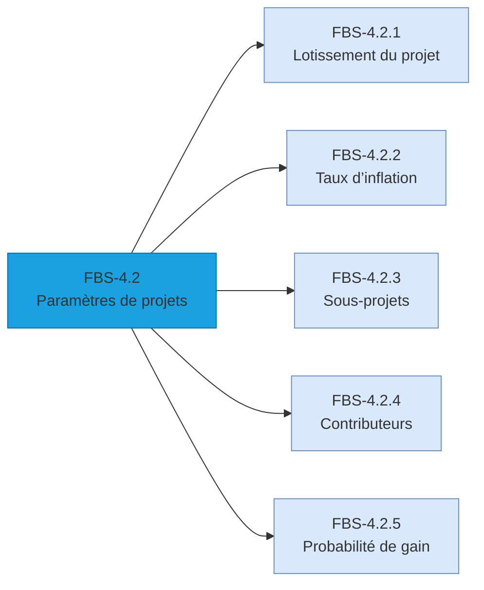
```mermaid
flowchart LR
    FBS_4_2_Parametres_de_projets["FBS-4.2<br>Paramètres de projets"]
    FBS_4_2_1_Lotissement_du_projet["FBS-4.2.1<br>Lotissement du projet"]
    FBS_4_2_2_Taux_d_inflation["FBS-4.2.2<br>Taux d’inflation"]
    FBS_4_2_3_Sous_projets["FBS-4.2.3<br>Sous-projets"]
    FBS_4_2_4_Contributeurs["FBS-4.2.4<br>Contributeurs"]
    FBS_4_2_5_Probabilite_de_gain["FBS-4.2.5<br>Probabilité de gain"]

    FBS_4_2_Parametres_de_projets --> FBS_4_2_1_Lotissement_du_projet
    FBS_4_2_Parametres_de_projets --> FBS_4_2_2_Taux_d_inflation
    FBS_4_2_Parametres_de_projets --> FBS_4_2_3_Sous_projets
    FBS_4_2_Parametres_de_projets --> FBS_4_2_4_Contributeurs
    FBS_4_2_Parametres_de_projets --> FBS_4_2_5_Probabilite_de_gain

    classDef c1 fill:#1ba1e2,stroke:#006EAF
    class FBS_4_2_Parametres_de_projets c1
    classDef c2 fill:#dae8fc,stroke:#6c8ebf
    class FBS_4_2_1_Lotissement_du_projet,FBS_4_2_2_Taux_d_inflation,FBS_4_2_3_Sous_projets,FBS_4_2_4_Contributeurs,FBS_4_2_5_Probabilite_de_gain c2
```

*Figure 10 — Arborescence fonctionnelle des paramètres de projets*

```yaml exigence
section: "3.4.5.2"
id: "WF-PRJ-0010-A"
titre: "Code projet"
flexibilite: "F0"
fbs: "FBS-4.2"
pbs: "PBS-1.1, PBS-2.1, PBS-2.3, PBS-3.1"
corps: "Un projet porte un code projet, unique dans l’installation, qui est celui sous lequel l’ERP le connaît. Il peut être renseigné à tout moment, et il est exigé pour le passage du projet à l’état En cours."
motif: "Le code est attribué par l’ERP à la saisie de la commande : il ne peut donc pas être exigé pendant le chiffrage, qui la précède. Mais sans lui, aucun coût réel ne peut être imputé au projet, et le pilotage n’aurait rien à rapprocher."
verification: "Un projet se crée et se chiffre sans code projet. Le passage à En cours est refusé tant qu’il n’est pas renseigné. La saisie d’un code déjà porté par un autre projet est refusée."
```

```yaml exigence
section: "3.4.5.2"
id: "WF-PRJ-0080-A"
titre: "Attributs d’un projet"
flexibilite: "F0"
fbs: "FBS-4.2"
pbs: "PBS-1.1, PBS-2.1, PBS-2.3, PBS-3.1"
corps: "Un projet porte : un libellé, une description facultative, un code projet (WF-PRJ-0010), un état du cycle de vie (WF-CYC-0010) et les dates de ses transitions d’état (WF-CYC-0130), un taux d’inflation (WF-PRJ-0040), une probabilité de gain (WF-PRJ-0090), facultativement, la date de réception de sa commande. Le libellé est obligatoire dès la création."
motif: "Le libellé est ce sous quoi le projet apparaît dans le portefeuille. La date de réception de la commande marque le début du pilotage ; elle ne fixe pas l’année de référence des chiffrages, qui suit la création des révisions (WF-REV-0060)."
verification: "La création d’un projet sans libellé est refusée. La date de réception de la commande est saisissable à tout moment et n’est exigée par aucune transition."
```

##### 3.4.5.2.1. FBS-4.2.1 : Lotissement du projet

Le lotissement reproduit le découpage du bon de commande en postes, lots et livrables (WF-PRJ-0020). Il ne conditionne ni le chiffrage ni le pilotage, qui se font sans lui ; il structure en revanche le fichier de devis de l’annexe B, qui présente une synthèse puis un onglet par lot.

Il rend deux services. Il permet d’engendrer un squelette de planning, qui évite de ressaisir la structure de l’affaire (WF-PRJ-0030). Et comme ce squelette crée une tâche récapitulative par poste et par lot, rattachée à chacun, filtrer le planning ou le devis sur l’un d’eux revient à filtrer le sous-arbre correspondant : le lotissement sert alors de grille de lecture, par ce seul rattachement, que l’utilisateur peut déplacer ou retirer (WF-PLA-0130).

```yaml exigence
section: "3.4.5.2.1"
id: "WF-PRJ-0020-A"
titre: "Lotissement"
flexibilite: "F0"
fbs: "FBS-4.2.1"
pbs: "PBS-1.1, PBS-2.1, PBS-2.3, PBS-3.1"
corps: "Le lotissement découpe la commande en postes, chaque poste contenant des lots, chaque lot contenant des livrables. Sa saisie est facultative : en son absence, le lotissement vaut un poste comprenant un lot sans livrable. Chaque poste, lot et livrable porte un libellé."
motif: "Le lotissement reflète le bon de commande, qui n’existe pas encore au début du chiffrage. Lui donner une valeur par défaut évite d’en faire un préalable, tout en garantissant qu’il y a toujours quelque chose à afficher et à filtrer."
verification: "Un projet sans lotissement saisi présente un poste, un lot et aucun livrable. Un lot peut être créé sans livrable."
```

```yaml exigence
section: "3.4.5.2.1"
id: "WF-PRJ-0030-A"
titre: "Squelette de planning"
flexibilite: "F1"
fbs: "FBS-4.2.1, FBS-4.3"
pbs: "PBS-1.1, PBS-2.1, PBS-2.3, PBS-3.1"
corps: "Waterfall peut engendrer un planning à partir du lotissement : une tâche récapitulative par poste et par lot, rattachée au poste ou au lot qu’elle représente (WF-PLA-0130), une tâche feuille par livrable, et un jalon de fin par lot et par poste. Le jalon de fin de lot a pour prédécesseurs les livrables de son lot, et le jalon de fin de poste a pour prédécesseurs les jalons de fin de ses lots. La génération n’est proposée que sur une structure sans tâche, et ne crée d’autre lien entre le lotissement et le planning que ce rattachement : modifier ensuite le lotissement ne déplace ni ne supprime aucune tâche."
motif: "C’est une aide à la saisie, au même titre que l’import MS Project : elle évite de ressaisir une structure que le bon de commande donne déjà. La génération est unique et sans lien durable, faute de quoi il faudrait dire ce que devient une tâche dont le lot a été renommé, déplacé ou supprimé."
verification: "La génération sur un lotissement de deux postes et trois lots produit les récapitulatives, rattachées à leur poste ou à leur lot, les feuilles et les jalons attendus, avec leurs liaisons. Elle n’est plus proposée dès que la structure comporte une tâche. Renommer ou supprimer un lot ensuite ne change ni ne supprime aucune tâche."
```

##### 3.4.5.2.2. FBS-4.2.2 : Taux d’inflation

Le chiffrage n’emploie que les taux horaires de l’année de référence. Le taux d’inflation du projet est ce qui les projette sur les années suivantes, dont les taux ne sont pas encore connus (WF-PRJ-0040).

```yaml exigence
section: "3.4.5.2.2"
id: "WF-PRJ-0040-A"
titre: "Taux d’inflation du projet"
flexibilite: "F0"
fbs: "FBS-4.2.2"
pbs: "PBS-1.1, PBS-2.1, PBS-2.3, PBS-3.1"
corps: "Un projet porte un taux d’inflation annuel, exprimé en pourcentage et valant 0 % par défaut. Il est modifiable à tout moment. Sa modification n’affecte aucune révision marquée ; elle s’applique à la révision en cours, pour les charges dont l’année de consommation est postérieure à l’année de référence."
motif: "Le taux d’inflation projette les taux horaires connus sur les années à venir. Le modifier en cours de projet est légitime — l’inflation constatée n’est pas celle qu’on avait prévue — mais cela ne doit pas déplacer un budget de référence déjà figé : seule la projection à venir en tient compte."
verification: "La modification du taux d’inflation laisse inchangés les montants des révisions marquées. Dans la révision en cours, les charges dont l’année de consommation suit l’année de référence sont rechiffrées, les autres non."
```

##### 3.4.5.2.3. FBS-4.2.3 : Sous-projets

Les codes de sous-projets viennent de l’ERP, à la saisie de la commande : ils ne sont donc pas connus pendant le chiffrage (WF-PRJ-0050). Leur découpage est une affaire d’habitude — par phase, par métier, ou selon le lotissement — et Waterfall n’en impose aucune.

Ils sont la granularité des coûts réels : les pointages et les factures s’imputent sur un code de sous-projet, jamais sur une tâche. C’est pourquoi le sous-projet est la maille la plus fine où le budget et la dépense se rejoignent, et donc celle de l’avancement financier.

```yaml exigence
section: "3.4.5.2.3"
id: "WF-PRJ-0050-A"
titre: "Sous-projets"
flexibilite: "F1"
fbs: "FBS-4.2.3"
pbs: "PBS-1.1, PBS-2.1, PBS-2.3, PBS-3.1"
corps: "Un projet porte des sous-projets, identifiés par le code sous lequel l’ERP les connaît et uniques au sein du projet. Leur saisie est facultative. Un sous-projet auquel des coûts réels sont imputés ne peut plus être supprimé."
motif: "Les codes viennent de l’ERP à la commande et ne sont pas connus pendant le chiffrage, d’où leur caractère facultatif. En revanche, supprimer un sous-projet auquel des coûts sont déjà imputés rendrait ces coûts orphelins, et l’avancement financier incalculable pour la part concernée."
verification: "Un projet se chiffre sans aucun sous-projet. La création de deux sous-projets de même code dans un même projet est refusée. La suppression d’un sous-projet portant des coûts réels est refusée."
```

##### 3.4.5.2.4. FBS-4.2.4 : Contributeurs

Une affaire multi-métiers ne relève d’aucun service en particulier : le chef de projet la structure, et les managers des métiers en chiffrent la charge. La liste des contributeurs dit qui participe à cette affaire-là (WF-PRJ-0060). Elle est une donnée du projet, au même titre que son lotissement, et change à chaque affaire — contrairement à l’organigramme, qui décrit l’entreprise et ne bouge qu’aux réorganisations.

Elle ne remplace pas les habilitations et ne s’y substitue pas : un rôle d’habilitation dit ce qu’un utilisateur a le droit de faire, la liste dit sur quels projets il le fait. Comme l’emploi d’un rôle par une ligne de devis révèle le service concerné, Waterfall propose les contributeurs plutôt que de les faire chercher (WF-PRJ-0070).

```yaml exigence
section: "3.4.5.2.4"
id: "WF-PRJ-0060-A"
titre: "Liste des contributeurs"
flexibilite: "F0"
fbs: "FBS-4.2.4"
pbs: "PBS-1.1, PBS-2.1, PBS-2.3, PBS-3.1"
corps: "Un projet porte la liste des utilisateurs qui y contribuent, dont son créateur, chacun avec sa qualité : chef de projet ou participant. La consultation et la saisie sur un projet sont réservées à ses contributeurs, chacune sous sa permission ; la permission « consulter tous les projets » ouvre à la consultation les projets dont l’utilisateur n’est pas contributeur. Les actions structurantes du catalogue (WF-ADM-0100) et le paramétrage du projet (FBS-4.2) sont réservés à ses chefs de projet. Les vues du portefeuille agrègent tous les projets du périmètre, qu’ils soient ou non ouvrables par l’utilisateur."
motif: "Dans une organisation matricielle, un projet réunit des contributeurs de plusieurs services, et cette composition change à chaque affaire. La porter par le projet évite de la déduire de l’organigramme, qui décrit l’entreprise et non les affaires. Réserver la seule saisie préserve les vues multi-projets des managers, qui doivent consulter des projets auxquels ils ne contribuent pas."
verification: "La liste d’un projet nouvellement créé comporte son créateur, chef de projet, qui peut y inscrire d’autres utilisateurs. Un utilisateur habilité à consulter les projets, non contributeur d’un projet et sans la permission « consulter tous les projets », ne l’ouvre pas et ne le trouve pas par son adresse ; le carnet du portefeuille le compte pourtant. Inscrit comme participant, il l’ouvre et saisit le devis, mais ne marque pas de révision même s’il en porte la permission ; inscrit comme chef de projet, il la marque."
```

```yaml exigence
section: "3.4.5.2.4"
id: "WF-PRJ-0070-A"
titre: "Proposition des contributeurs"
flexibilite: "F1"
fbs: "FBS-4.2.4"
pbs: "PBS-1.1, PBS-2.1, PBS-2.3, PBS-3.1"
corps: "Waterfall propose d’inscrire comme contributeurs les utilisateurs rattachés aux nœuds d’organisation des rôles de ressources employés par les lignes de devis. La proposition n’est jamais appliquée sans confirmation, et la liste reste modifiable à la main."
motif: "Employer un rôle sur une ligne de devis révèle le service concerné : le chef de projet n’a pas à chercher qui inscrire. Mais il est le seul à savoir qui participe réellement, et une inscription automatique donnerait des droits de saisie que personne n’aurait décidés."
verification: "Après création d’une ligne de main-d’œuvre portant un rôle relevant d’un service dont aucun utilisateur n’est contributeur, Waterfall propose les utilisateurs de ce service. Tant que la proposition n’est pas confirmée, la liste est inchangée."
```

##### 3.4.5.2.5. FBS-4.2.5 : Probabilité de gain

Une offre en chiffrage n’est pas un projet : elle peut ne jamais se faire. Compter son devis pour tout dans le portefeuille surestime le carnet ; ne pas le compter le sous-estime. La probabilité de gain est le poids que le chef de projet donne à son offre, et c’est par elle que le portefeuille et le plan de charge agrégé comptent les projets en chiffrage pour ce qu’ils valent (FBS-2).

```yaml exigence
section: "3.4.5.2.5"
id: "WF-PRJ-0090-A"
titre: "Probabilité de gain"
flexibilite: "F1"
fbs: "FBS-4.2.5"
pbs: "PBS-1.1, PBS-2.1, PBS-2.3, PBS-3.1"
corps: "Un projet porte une probabilité de gain, exprimée en pourcentage et valant 0 % par défaut. Elle est modifiable tant que le projet est à l’état Créé ou Chiffrage. Elle n’a plus d’effet à partir de l’état En cours, où le projet compte pour tout, ni dans les états terminaux. Elle n’intervient dans aucun calcul propre au projet : elle ne sert qu’aux vues du portefeuille, qui pondèrent par elle le devis et la charge des projets en chiffrage."
motif: "Le pipeline d’offres vaut ce qu’on a de chances de gagner, pas la somme de ses devis. Laisser la probabilité à zéro par défaut fait qu’une offre ne pèse rien tant que personne ne l’a estimée : c’est plus honnête qu’un poids arbitraire, et cela oblige à se poser la question. La cantonner aux vues du portefeuille garantit qu’elle ne modifie ni le devis, ni le budget, ni aucun indicateur du projet."
verification: "Une offre à 40 % de probabilité et 100 000 € de devis pèse 40 000 € dans le pipeline pondéré et 40 % de sa charge dans le plan de charge agrégé pondéré. Le devis et les indicateurs du projet lui-même sont identiques à 0 % et à 100 %. La modification de la probabilité est refusée à partir de l’état En cours."
```

#### 3.4.5.3. FBS-4.3 : Planification

Le planning est l’arbre de tâches d’une structure de coûts, vu du côté du temps (§3.2.4). Ce bloc décrit comment il se construit et se consulte : une grille pour saisir, un diagramme de Gantt pour voir les enchaînements, une chronologie pour communiquer, une arborescence pour montrer le découpage. Toutes ces vues montrent les mêmes tâches.

Trois chemins mènent à un planning : la saisie directe, la génération d’un squelette à partir du lotissement (WF-PRJ-0030), ou l’import d’un fichier MS Project (WF-INTF-0040). Waterfall ne gère pas de contraintes de date du type « ne pas commencer avant le » : le mode manuel en tient lieu.

Sur la planification, Waterfall suit délibérément le fonctionnement de Microsoft Project : modes de planification par tâche, types de liaisons et décalages, marges et chemin critique. Les plannings s’échangent entre les deux outils, et les utilisateurs viennent le plus souvent du second.

<!-- source : waterfall.visuels.drawio, page « FBS-4.3 » — régénéré par tools/build.py -->

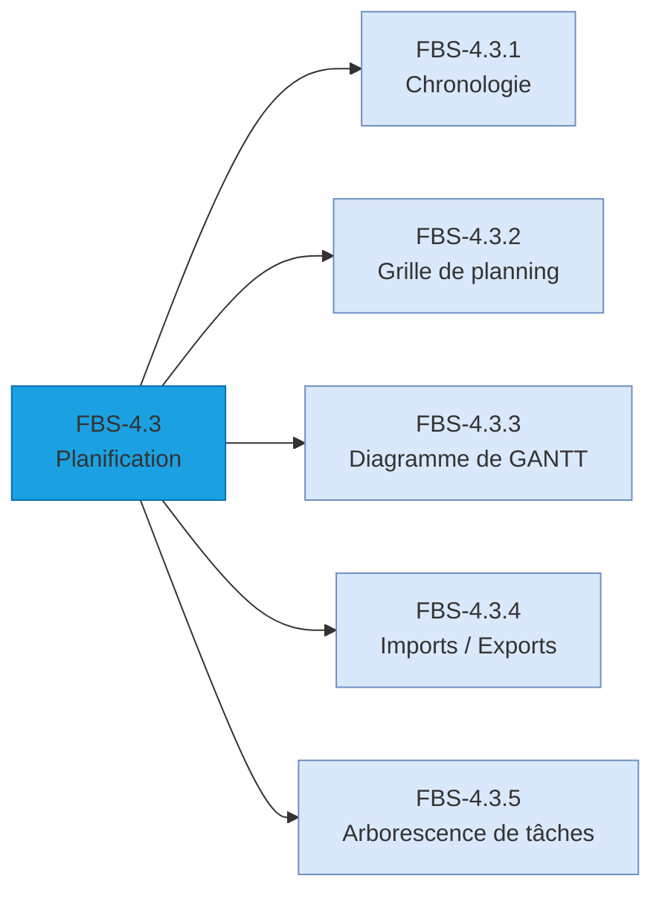
```mermaid
flowchart LR
    FBS_4_3_Planification["FBS-4.3<br>Planification"]
    FBS_4_3_1_Chronologie["FBS-4.3.1<br>Chronologie"]
    FBS_4_3_2_Grille_de_planning["FBS-4.3.2<br>Grille de planning"]
    FBS_4_3_3_Diagramme_de_GANTT["FBS-4.3.3<br>Diagramme de GANTT"]
    FBS_4_3_4_Imports_Exports["FBS-4.3.4<br>Imports / Exports"]
    FBS_4_3_5_Arborescence_de_taches["FBS-4.3.5<br>Arborescence de tâches"]

    FBS_4_3_Planification --> FBS_4_3_1_Chronologie
    FBS_4_3_Planification --> FBS_4_3_2_Grille_de_planning
    FBS_4_3_Planification --> FBS_4_3_3_Diagramme_de_GANTT
    FBS_4_3_Planification --> FBS_4_3_4_Imports_Exports
    FBS_4_3_Planification --> FBS_4_3_5_Arborescence_de_taches

    classDef c1 fill:#1ba1e2,stroke:#006EAF
    class FBS_4_3_Planification c1
    classDef c2 fill:#dae8fc,stroke:#6c8ebf
    class FBS_4_3_1_Chronologie,FBS_4_3_2_Grille_de_planning,FBS_4_3_3_Diagramme_de_GANTT,FBS_4_3_4_Imports_Exports,FBS_4_3_5_Arborescence_de_taches c2
```

*Figure 11 — Arborescence fonctionnelle de la planification*

```yaml exigence
section: "3.4.5.3"
id: "WF-PLA-0010-A"
titre: "Calendrier applicable à une tâche"
flexibilite: "F0"
fbs: "FBS-4.3"
pbs: "PBS-1.1, PBS-2.1, PBS-2.3, PBS-3.1"
corps: "Le calendrier applicable à une tâche donne, pour chaque jour de la semaine, le plus petit des nombres d’heures travaillées que les calendriers des rôles de ses lignes de main-d’œuvre accordent ce jour-là. Une tâche qui ne porte aucune ligne de main-d’œuvre relève du calendrier par défaut. Une saisie qui laisserait une tâche sans aucune heure travaillée dans la semaine — ligne de main-d’œuvre ajoutée, rôle d’une ligne changé, calendrier d’un rôle modifié — est refusée, en nommant les rôles et les tâches en cause. Les dates d’une tâche en mode automatique se calculent en heures de travail sur son calendrier applicable : sa durée et les décalages de ses liaisons, convertis en heures (WF-PLA-0160), s’y placent heure après heure. La charge de chaque ligne se répartit dans le temps selon le calendrier de son propre rôle."
motif: "MS Project place les durées en heures sur le calendrier de la tâche : un calcul en jours donnerait d’autres dates dès qu’un calendrier compte moins de huit heures un jour, et l’aller-retour de WF-INTF-0060 ne serait plus neutre. Retenir le plus petit nombre d’heures revient à ne planifier que les heures où tous les rôles travaillent : c’est la règle la plus contraignante, donc la plus sûre. Une tâche dont les rôles ne travaillent jamais ensemble ne peut pas se placer ; la planifier sur un calendrier de repli donnerait des dates que personne n’a voulues, d’où le refus, au moment où la saisie se fait et où l’on peut la corriger. Les écarts dus aux jours fériés et aux temps partiels, que le calendrier ignore, restent assumés."
verification: "Une tâche de seize heures en mode automatique, commencée un lundi matin sur un calendrier de huit heures du lundi au vendredi, finit le mardi ; sur un calendrier de quatre heures, elle finit le jeudi. Une tâche dont les deux rôles travaillent huit et six heures le lundi est planifiée sur six heures ce jour-là. Une tâche sans ligne de main-d’œuvre est planifiée sur le calendrier par défaut. L’ajout, à une tâche dont un rôle travaille du lundi au vendredi, d’une ligne d’un rôle qui ne travaille que le week-end est refusé en nommant les deux rôles, et la tâche reste inchangée. La répartition mensuelle de la charge d’une ligne suit les heures du calendrier de son rôle."
```

```yaml exigence
section: "3.4.5.3"
id: "WF-PLA-0020-A"
titre: "Mode de planification"
flexibilite: "F0"
fbs: "FBS-4.3"
pbs: "PBS-1.1, PBS-2.1, PBS-2.3, PBS-3.1"
corps: "Chaque tâche est en mode manuel ou en mode automatique. En mode automatique, ses dates sont calculées à partir de sa durée, de ses liaisons et du calendrier applicable, et recalculées à chaque modification d’une durée, d’une liaison, d’un calendrier ou de la structure de l’arbre. En mode manuel, l’utilisateur saisit ses dates et Waterfall ne les recalcule jamais, y compris lorsque ses prédécesseurs se déplacent."
motif: "C’est le fonctionnement de Microsoft Project, que les utilisateurs connaissent. Le mode manuel sert aux tâches dont la date est imposée de l’extérieur — une livraison client, une fenêtre d’intervention — et que le recalcul ne doit pas déplacer. Il tient lieu de contrainte de date."
verification: "Le déplacement d’une tâche prédécesseur déplace ses successeurs en mode automatique et laisse inchangés ceux en mode manuel. Les dates d’une tâche en mode automatique ne sont pas saisissables."
```

```yaml exigence
section: "3.4.5.3"
id: "WF-PLA-0030-A"
titre: "Liaisons entre tâches"
flexibilite: "F0"
fbs: "FBS-4.3"
pbs: "PBS-1.1, PBS-2.1, PBS-2.3, PBS-3.1"
corps: "Une liaison relie une tâche prédécesseur à une tâche successeur. Elle porte l’un des quatre types — fin à début, début à début, fin à fin, début à fin — et un décalage, positif ou négatif, exprimé en temps de travail ou en temps écoulé, dans l’une des unités de WF-PLA-0160, ou en pourcentage de la durée du prédécesseur. L’unité est indiquée par un suffixe selon la convention de Microsoft Project. Deux tâches peuvent être reliées par plusieurs liaisons. Une liaison qui créerait un cycle est refusée, de même qu’une liaison entre une tâche récapitulative et l’une de ses subordonnées."
motif: "Les quatre types et le décalage sont ceux de Microsoft Project, avec lequel les plannings s’échangent : les restreindre rendrait l’import infidèle. Le refus des cycles garantit que le calcul des dates aboutit. Une liaison à l’intérieur de sa propre hiérarchie n’aurait aucun sens, puisqu’une récapitulative tire déjà ses dates de ses subordonnées."
verification: "Les quatre types et un décalage négatif sont importés, saisis et exportés sans perte. La création d’une liaison fermant un cycle, ou reliant une récapitulative à l’une de ses subordonnées, est refusée, et la raison en est nommée à l’utilisateur. Un décalage saisi en semaines ou en mois est conservé dans son unité, importé et exporté sans conversion. Un décalage de 50 % sur un prédécesseur de dix jours vaut cinq jours de travail."
```

```yaml exigence
section: "3.4.5.3"
id: "WF-PLA-0160-A"
titre: "Unités de durée"
flexibilite: "F0"
fbs: "FBS-4.3"
pbs: "PBS-1.1, PBS-2.1, PBS-2.2, PBS-2.3, PBS-3.1"
corps: "Une durée ou un décalage se saisit en minutes, heures, jours, semaines ou mois de travail, et se conserve en temps de travail avec l’unité de sa saisie. Les jours, les semaines et les mois se convertissent en heures par trois constantes de l’installation — heures par jour, heures par semaine, jours par mois —, qui valent par défaut 8, 40 et 20, et que l’export MS Project transporte. Une durée ou un décalage se saisit aussi en temps écoulé — minutes, heures, jours, semaines ou mois civils, suffixes emin, eh, ej, esem et em —, qui se convertit sans calendrier : un jour écoulé vaut vingt-quatre heures, une semaine sept jours, un mois trente jours."
motif: "Ce sont les conventions de MS Project, avec ses valeurs par défaut : une unité qui ne vaudrait pas la même chose dans les deux outils changerait la durée d’une tâche à chaque aller-retour. Porter les constantes par l’installation plutôt que par le projet garde à une unité le même sens sur tous les projets, comme la devise le garde à un montant. Accepter le temps écoulé est ce qui permet d’importer un planning réel sans le convertir."
verification: "Avec les valeurs par défaut, une durée saisie « 2 j » vaut seize heures, « 1 sem » quarante heures et « 1 m » cent soixante heures. Un décalage saisi « 1 sem » est exporté puis réimporté sans changer d’unité. Un décalage de 2 ej placé un vendredi soir fait commencer le successeur le dimanche soir. Un fichier MS Project dont les constantes diffèrent de celles de l’installation est importé avec les mêmes durées en heures, et le compte rendu signale la différence."
```

```yaml exigence
section: "3.4.5.3"
id: "WF-PLA-0040-A"
titre: "Hiérarchie des tâches"
flexibilite: "F0"
fbs: "FBS-4.3"
pbs: "PBS-1.1, PBS-2.1, PBS-2.3, PBS-3.1"
corps: "Une tâche récapitulative tire de ses subordonnées ses dates, sa durée et son état : elle est démarrée dès que l’une d’elles l’est, terminée quand toutes le sont et que le reste à engager de ses lignes propres est nul, et son état n’est pas saisissable. Tant que ce reste n’est pas nul, elle reste démarrée et ses lignes propres sont exposées à la réestimation, signalées comme seules lignes ouvertes de la phase ; leur valeur s’acquiert quand elle est terminée. Déplacer une tâche dans l’arbre emporte ses subordonnées, ainsi que les lignes de devis que toutes portent."
motif: "C’est l’unicité de l’arbre qui garantit la cohérence entre le planning et le devis : réorganiser un planning ne doit jamais demander de retoucher un chiffrage. L’état d’une récapitulative ne peut être qu’une conséquence de celui de ses subordonnées, sans quoi une phase pourrait être déclarée terminée avec des tâches ouvertes. Ses lignes propres — provisions, licences, frais — suivent le même sort que la phase qu’elles couvrent."
verification: "Après déplacement d’une récapitulative portant deux niveaux de subordonnées, les tâches et les lignes déplacées sont inchangées, et le devis totalise le même montant. Les dates et l’état d’une récapitulative ne sont pas saisissables. Une récapitulative dont une subordonnée est démarrée est démarrée ; elle n’est terminée qu’après la dernière. Une récapitulative dont toutes les subordonnées sont terminées et dont une ligne propre porte un reste à engager de 500 est démarrée et signalée ; la saisie d’un reste nul sur cette ligne la termine."
```

```yaml exigence
section: "3.4.5.3"
id: "WF-PLA-0050-A"
titre: "Jalons"
flexibilite: "F0"
fbs: "FBS-4.3"
pbs: "PBS-1.1, PBS-2.1, PBS-2.3, PBS-3.1"
corps: "Un jalon est une tâche de durée nulle. Il ne porte pas de sous-tâches, mais il peut porter des lignes de devis. Son état passe directement de non démarré à terminé, par le Kanban (WF-RAE-0030) ou, s’il porte des lignes, par la saisie d’un reste à engager nul."
motif: "Le jalon marque un événement : une validation, une livraison, un acompte de sous-traitance. L’état démarré n’a pas de sens pour un événement instantané, et lui interdire les lignes empêcherait de chiffrer les acomptes au moment où leur valeur s’acquiert."
verification: "Une tâche de durée nulle ne peut recevoir de sous-tâche. Un jalon portant une ligne de devis passe de non démarré à terminé par la saisie d’un reste à engager nul ; un jalon sans ligne est terminé depuis le Kanban."
```

```yaml exigence
section: "3.4.5.3"
id: "WF-PLA-0070-A"
titre: "Suppression d’une tâche"
flexibilite: "F0"
fbs: "FBS-4.3"
pbs: "PBS-1.1, PBS-2.1, PBS-2.3, PBS-3.1"
corps: "La suppression d’une tâche supprime ses subordonnées, les lignes de devis qu’elles portent, et les liaisons qui s’y rattachent. Une tâche démarrée ou terminée ne peut pas être supprimée."
motif: "Une tâche démarrée porte de la valeur acquise et un reste à engager réestimé : la supprimer effacerait de l’avancement déjà constaté. C’est le même raisonnement qu’à la fusion d’un avenant, où une tâche démarrée n’est jamais retirée mais ramenée à zéro (WF-REV-0050)."
verification: "La suppression d’une récapitulative supprime ses subordonnées et leurs lignes, et le devis diminue d’autant. La suppression d’une tâche démarrée est refusée, et l’utilisateur est renvoyé vers la mise à zéro de son reste à engager."
```

```yaml exigence
section: "3.4.5.3"
id: "WF-PLA-0130-A"
titre: "Attributs d’une tâche"
flexibilite: "F0"
fbs: "FBS-4.3"
pbs: "PBS-1.1, PBS-2.1, PBS-2.3, PBS-3.1"
corps: "Une tâche porte : un libellé, une description facultative, une durée, une date de début, une date de fin, un mode de planification et un état — non démarrée, démarrée, terminée. Elle porte en outre la date à laquelle elle a été démarrée et celle à laquelle elle a été terminée, renseignées lors du changement d’état, avec la date du jour par défaut. Lorsque le changement d’état résulte d’une saisie de reste à engager, la date est demandée à la validation de la cellule, au jour courant par défaut ; lorsqu’il résulte d’un import ou d’une fusion, la date est le jour de l’application de l’import ou de la fusion, et le compte rendu nomme les tâches ainsi terminées ; une tâche récapitulative prend pour date de démarrage celle de la première de ses subordonnées démarrées, et pour date de terminaison la plus tardive de celles de ses subordonnées et de la mise à zéro de ses lignes propres. La durée d’un jalon est nulle ; celles d’une tâche récapitulative, comme ses dates et son état, sont calculées à partir de ses subordonnées. Une tâche, récapitulative ou feuille, peut porter le rattachement à un poste ou à un lot du lotissement, jamais aux deux ; ce rattachement est posé par le squelette (WF-PRJ-0030), modifiable et retirable, et un poste ou un lot n’est porté que par une tâche à la fois. Lorsque le poste d’un lot est rattaché, la tâche de ce lot se trouve dans le sous-arbre de la tâche de ce poste : un rattachement ou un déplacement qui l’en sortirait est refusé. Elle porte en outre trois valeurs calculées, qui ne sont pas saisissables : sa marge totale, son appartenance au chemin critique (WF-PLA-0100), pour une récapitulative, son avancement physique (WF-IND-0060). La description est transportée par les imports et les exports MS Project."
motif: "Ce sont les attributs que toutes les vues affichent et que les échanges MS Project transportent. Les dates de démarrage et de terminaison sont ce qui situe la valeur acquise dans le temps : sans elles, elle ne serait connue qu’aux dates de revue, et l’indice de délai serait faux de la durée d’une revue. Ouvrir le rattachement à une feuille évite d’inventer une récapitulative pour un lot sans livrable, et une récapitulative qui perd sa dernière subordonnée garde ce qu’elle représente ; garder la tâche d’un lot sous celle de son poste conserve au planning, et au total par poste du devis (WF-DEV-0060), le découpage de la commande."
verification: "Chacun de ces attributs est affiché dans la grille de planning, et ceux que MS Project connaît sont transportés par l’export. Le passage à l’état démarré ou terminé demande une date, proposée au jour courant et modifiable. Un import de reste à engager qui met une tâche à zéro la date du jour de l’application ; une récapitulative porte la date de terminaison de sa dernière subordonnée. La durée d’un jalon est nulle et n’est pas modifiable ; les dates d’une récapitulative ne sont pas saisissables. Une feuille peut être rattachée à un lot ; une récapitulative rattachée dont on supprime la dernière subordonnée garde son rattachement. Le rattachement d’une tâche à un lot déjà porté par une autre est refusé, comme celui d’une même tâche à un poste et à un lot. Le déplacement de la tâche d’un lot hors du sous-arbre de la tâche de son poste est refusé. La marge totale, la criticité et l’avancement physique s’affichent et ne sont pas saisissables."
```

```yaml exigence
section: "3.4.5.3"
id: "WF-PLA-0150-A"
titre: "Horizon d’un projet"
flexibilite: "F0"
fbs: "FBS-4.3"
pbs: "PBS-1.1, PBS-2.1, PBS-2.3, PBS-3.1"
corps: "La durée d’un projet, de la date de début de sa première tâche à la date de fin de sa dernière, ne dépasse pas quinze ans, dans aucune de ses structures de coûts. Une saisie ou un import qui la porterait au-delà est refusé, et le refus nomme la tâche en cause."
motif: "Quinze ans est la borne au-delà de laquelle ni les taux horaires archivés, ni la projection par le taux d’inflation, ni le rythme mensuel des revues n’ont plus de sens. La borne donne aussi aux volumes de la plateforme un maximum connu : cent quatre-vingts révisions marquées au plus par projet."
verification: "Le déplacement d’une tâche qui porterait la fin du projet à quinze ans et un jour de son début est refusé, et la tâche est nommée. Un import MS Project dont le planning s’étend sur seize ans est rejeté au compte rendu."
```

##### 3.4.5.3.1. FBS-4.3.1 : Chronologie

Une chronologie est une vue synthétique destinée à être montrée : elle ne présente que les tâches et les jalons qui y ont été inscrits. Un projet peut en porter plusieurs, chacune nommée et conservée, afin de présenter à un comité de direction, à un client ou à une équipe la vue qui lui convient.

```yaml exigence
section: "3.4.5.3.1"
id: "WF-PLA-0060-A"
titre: "Inscription aux suivis"
flexibilite: "F0"
fbs: "FBS-4.3.1, FBS-4.8.6"
pbs: "PBS-1.1, PBS-1.3, PBS-2.1, PBS-2.3, PBS-3.1"
corps: "Une tâche peut être inscrite à une chronologie, ou en être retirée. Un jalon peut de la même façon être inscrit au suivi temps/temps."
motif: "La chronologie et le suivi temps/temps ne montrent qu’une sélection : tout afficher les rendrait illisibles. L’inscription se fait depuis le planning, là où l’utilisateur sait ce qui mérite d’être suivi, et les jalons contractuels ne sont rien d’autre que des jalons inscrits au suivi temps/temps."
verification: "Une tâche inscrite apparaît dans la chronologie et disparaît lorsqu’elle est retirée. Le diagramme temps/temps ne suit que les jalons inscrits."
```

```yaml exigence
section: "3.4.5.3.1"
id: "WF-PLA-0140-A"
titre: "Chronologies nommées"
flexibilite: "F0"
fbs: "FBS-4.3.1"
pbs: "PBS-1.1, PBS-1.3, PBS-2.1, PBS-2.3, PBS-3.1"
corps: "Un projet peut porter plusieurs chronologies. Chacune porte un nom, conserve la liste des tâches et des jalons qui y sont inscrits, peut être supprimée, et peut être exportée au format PNG."
motif: "Une chronologie est un support de communication, et l’on ne montre pas le même découpage à un comité de direction, à un client ou à une équipe. Les conserver évite de refaire la sélection à chaque réunion."
verification: "Deux chronologies d’un même projet portent des sélections distinctes et se retrouvent d’une session à l’autre. L’export produit un fichier PNG de la chronologie affichée."
```

##### 3.4.5.3.2. FBS-4.3.2 : Grille de planning

La grille est l’outil de saisie du planning. Son objectif est d’offrir à un utilisateur de Microsoft Project des fonctions et une ergonomie qui lui soient familières : arbre pliable, indentation au clavier, recalcul immédiat, recherche sur les libellés.

```yaml exigence
section: "3.4.5.3.2"
id: "WF-PLA-0080-A"
titre: "Grille de planning"
flexibilite: "F0"
fbs: "FBS-4.3.2"
pbs: "PBS-1.1, PBS-1.3, PBS-2.1, PBS-2.3, PBS-3.1"
corps: "La grille de planning présente les tâches sous forme d’arbre pliable et dépliable, avec pour chacune : son libellé, sa description, sa durée, ses dates, son mode de planification, son état, signalé par une marque visuelle et non par une colonne, pour une récapitulative, son avancement physique, sa marge totale, ses prédécesseurs. Elle permet de créer, modifier, déplacer et supprimer des tâches, d’indenter et de désindenter une tâche ou un groupe de tâches, de filtrer sur le sous-arbre d’une récapitulative ou sur les tâches démarrées, et de rechercher sur les libellés. Les jalons, les tâches feuilles et les tâches récapitulatives y sont visuellement distincts."
motif: "La grille est l’outil de saisie du planning, et ses utilisateurs viennent de Microsoft Project : retrouver l’arbre pliable, l’indentation et la recherche leur évite de réapprendre un geste par fonction. La distinction visuelle des trois sortes de tâches est ce qui rend un planning de plusieurs centaines de lignes lisible d’un coup d’œil."
verification: "Chacune des colonnes citées est présente. L’indentation d’un groupe de tâches déplace le groupe entier sous la tâche précédente. La recherche sur un libellé ne laisse voir que les tâches correspondantes et leurs parents. Les trois sortes de tâches se distinguent sans lire leur durée. Une tâche terminée se distingue d’une tâche démarrée sans lire de colonne ; une feuille ne porte pas d’avancement physique."
```

##### 3.4.5.3.3. FBS-4.3.3 : Diagramme de GANTT

Le Gantt montre les tâches sur un axe temporel, avec leurs liaisons et leur hiérarchie. À la différence de Microsoft Project, il se consulte mais ne se modifie pas : toute saisie passe par la grille. Une seule façon de modifier un planning évite les gestes dont l’effet dépend de la vue où on les fait.

```yaml exigence
section: "3.4.5.3.3"
id: "WF-PLA-0090-A"
titre: "Diagramme de Gantt"
flexibilite: "F0"
fbs: "FBS-4.3.3"
pbs: "PBS-1.1, PBS-1.3, PBS-2.1, PBS-2.3, PBS-3.1"
corps: "Le diagramme de Gantt présente les tâches sur un axe temporel, avec leur hiérarchie et leurs liaisons. Il est en lecture seule : aucune tâche n’y est modifiable, et toute saisie passe par la grille de planning. Le diagramme et la grille de planning présentent le même arbre, plié de la même façon : plier ou déplier une récapitulative dans l’un le fait dans l’autre."
motif: "Le Gantt sert à comprendre les enchaînements, ce qu’une grille ne montre pas. En faire une vue de consultation concentre la saisie en un seul endroit : le déplacement direct d’une barre, dans Microsoft Project, produit des effets que l’utilisateur ne prévoit pas toujours."
verification: "Les liaisons et la hiérarchie sont visibles, ainsi que le chemin critique. Aucune action de la souris ou du clavier ne modifie une tâche depuis le Gantt. Une récapitulative pliée dans la grille l’est dans le Gantt, et réciproquement."
```

```yaml exigence
section: "3.4.5.3.3"
id: "WF-PLA-0100-A"
titre: "Chemin critique"
flexibilite: "F0"
fbs: "FBS-4.3.3"
pbs: "PBS-1.1, PBS-1.3, PBS-2.1, PBS-2.3, PBS-3.1"
corps: "Waterfall calcule, pour chaque tâche en mode automatique, ses dates au plus tôt et au plus tard, et la marge totale qui les sépare. Le chemin critique est l’ensemble des tâches de marge totale nulle ou négative. Il est mis en évidence dans le diagramme de Gantt, et la marge totale est consultable dans la grille de planning. Les tâches en mode manuel sont traitées comme des dates imposées : elles bornent le calcul des marges de leurs successeurs et de leurs prédécesseurs, et ne portent pas de marge. Un prédécesseur qui ne peut pas finir à temps pour une tâche manuelle porte une marge négative, et le conflit est signalé (WF-PLA-0020)."
motif: "Le chemin critique est ce qu’un chef de projet regarde en premier pour savoir quel retard décale la livraison. Sans lui, le Gantt ne montre que des barres, et l’effet d’un glissement se devine. Une tâche manuelle porte une date que quelqu’un a fixée : elle borne ce qui la précède comme ce qui la suit, et un retard qui la menace se lit dans une marge négative plutôt que de rester caché."
verification: "Sur un planning à deux branches parallèles de durées différentes, la branche la plus longue est critique et l’autre porte une marge égale à leur écart. Allonger une tâche de la branche courte au-delà de sa marge la rend critique à son tour. Une tâche en mode manuel n’affiche aucune marge et n’apparaît jamais sur le chemin critique, alors que ses successeurs automatiques voient leurs marges calculées à partir de ses dates. Un prédécesseur automatique qui ne peut pas finir avant le début d’une tâche manuelle porte une marge négative, apparaît sur le chemin critique et est signalé."
```

##### 3.4.5.3.4. FBS-4.3.4 : Imports / Exports

Les échanges MS Project sont décrits avec les autres interactions externes : l’import par WF-INTF-0040, l’export par WF-INTF-0050, et leur réversibilité par WF-INTF-0060. Ce paragraphe n’en est que le point d’accès depuis le planning.

##### 3.4.5.3.5. FBS-4.3.5 : Arborescence de tâches (WBS)

Le WBS présente la structure de l’affaire plutôt que son calendrier : il montre comment le travail se découpe, sans axe temporel ni liaisons. C’est la vue qu’on met dans un dossier de revue ou qu’on montre au client, là où le Gantt sert à travailler.

Deux choses le rendent utilisable : le choix du niveau de profondeur, qui décide de ce qu’on montre (WF-PLA-0110), et une mise en page pensée pour la page A4 (WF-PLA-0120). Un planning de plusieurs centaines de tâches ne se montre pas ; ses trois premiers niveaux, si. Le WBS ne représente que les tâches récapitulatives : ni les jalons, ni les tâches feuilles, qui relèvent du travail à faire et non du découpage de l’affaire.

```yaml exigence
section: "3.4.5.3.5"
id: "WF-PLA-0110-A"
titre: "Vue en arborescence de tâches"
flexibilite: "F0"
fbs: "FBS-4.3.5"
pbs: "PBS-1.1, PBS-1.3, PBS-2.1, PBS-2.3, PBS-3.1"
corps: "Waterfall présente les tâches récapitulatives sous forme d’arborescence graphique, sous un nœud racine qui représente le projet. Les jalons et les tâches feuilles n’y figurent pas. L’utilisateur choisit le niveau de profondeur affiché : au-delà de ce niveau, les tâches subordonnées ne sont pas représentées. Un planning sans tâche récapitulative produit une arborescence réduite au seul nœud du projet."
motif: "Le WBS sert à montrer la structure d’une affaire, en revue ou au client. Un planning complet est illisible dans cet usage, et c’est le choix du niveau qui décide de ce qu’on montre. Les jalons et les tâches feuilles en sont exclus parce qu’ils décrivent le travail à faire, non le découpage de l’affaire."
verification: "Sur un planning de quatre niveaux, l’affichage demandé au niveau 2 ne représente que les récapitulatives des deux premiers niveaux, sous le nœud du projet. Aucun jalon ni aucune tâche feuille n’apparaît, quel que soit le niveau demandé. Un planning composé uniquement de tâches feuilles produit une arborescence réduite au nœud du projet."
```

```yaml exigence
section: "3.4.5.3.5"
id: "WF-PLA-0120-A"
titre: "Export de l’arborescence de tâches"
flexibilite: "F0"
fbs: "FBS-4.3.5"
pbs: "PBS-1.1, PBS-1.3, PBS-2.1, PBS-2.3, PBS-3.1"
corps: "L’arborescence de tâches peut être exportée au format PNG. Sa mise en page dispose le premier niveau horizontalement et les niveaux suivants verticalement sous leur parent, de manière à tenir sur une page A4. Aucune pagination ni réduction automatique n’est appliquée : c’est le niveau de profondeur qui règle l’encombrement."
motif: "Le WBS est fait pour être imprimé ou inséré dans un document. Une arborescence entièrement horizontale déborde dès le troisième niveau ; disposer le premier niveau en largeur et les suivants en hauteur est ce qui la fait tenir sur une page. Si l’image déborde malgré tout, c’est que le niveau demandé est trop fin ou que le découpage est trop large : le remède appartient à l’utilisateur, non au logiciel."
verification: "L’export d’un planning de trois niveaux produit un fichier PNG dont le premier niveau est disposé horizontalement et les suivants verticalement. Le contenu ne dépend que du niveau demandé."
```

#### 3.4.5.4. FBS-4.4 : Chiffrage et devis

Le devis est la vue financière d’une structure de coûts : ses lignes sont portées par les tâches du planning, et en héritent leurs dates. Chiffrer consiste donc à accrocher des lignes aux tâches, non à construire un second arbre.

Ce bloc décrit comment ces lignes se saisissent, comment elles se convertissent en montants, ce que le chiffrage totalise et la charge qu’il représente dans le temps. La grille de devis et celle du planning agissent sur le même arbre : ce qui structure l’un structure l’autre.

<!-- source : waterfall.visuels.drawio, page « FBS-4.4 » — régénéré par tools/build.py -->

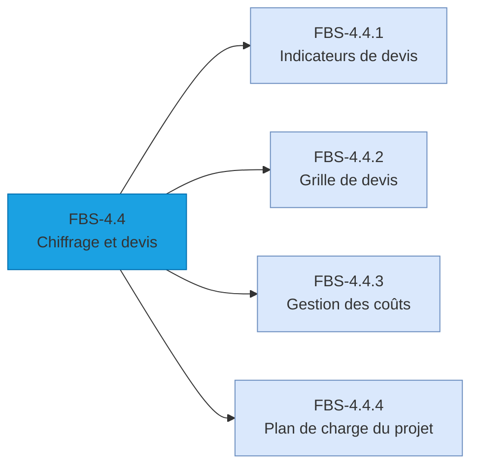
```mermaid
flowchart LR
    FBS_4_4_Chiffrage_et_devis["FBS-4.4<br>Chiffrage et devis"]
    FBS_4_4_1_Indicateurs_de_devis["FBS-4.4.1<br>Indicateurs de devis"]
    FBS_4_4_2_Grille_de_devis["FBS-4.4.2<br>Grille de devis"]
    FBS_4_4_3_Gestion_des_couts["FBS-4.4.3<br>Gestion des coûts"]
    FBS_4_4_4_Plan_de_charge_du_projet["FBS-4.4.4<br>Plan de charge du projet"]

    FBS_4_4_Chiffrage_et_devis --> FBS_4_4_1_Indicateurs_de_devis
    FBS_4_4_Chiffrage_et_devis --> FBS_4_4_2_Grille_de_devis
    FBS_4_4_Chiffrage_et_devis --> FBS_4_4_3_Gestion_des_couts
    FBS_4_4_Chiffrage_et_devis --> FBS_4_4_4_Plan_de_charge_du_projet

    classDef c1 fill:#1ba1e2,stroke:#006EAF
    class FBS_4_4_Chiffrage_et_devis c1
    classDef c2 fill:#dae8fc,stroke:#6c8ebf
    class FBS_4_4_1_Indicateurs_de_devis,FBS_4_4_2_Grille_de_devis,FBS_4_4_3_Gestion_des_couts,FBS_4_4_4_Plan_de_charge_du_projet c2
```

*Figure 12 — Arborescence fonctionnelle des chiffrages et devis*

```yaml exigence
section: "3.4.5.4"
id: "WF-DEV-0010-A"
titre: "Taux horaires requis pour le calcul à la création d’un chiffrage"
flexibilite: "F0"
fbs: "FBS-4.4, FBS-4.5"
pbs: "PBS-1.1, PBS-2.1, PBS-2.3, PBS-3.1"
corps: "Le calcul d’un devis ou d’un reste à engager est refusé tant qu’une catégorie de coût employée n’a pas de taux horaire pour l’année de référence de sa révision (WF-REV-0060), ou de taux conservé projeté pour celle-ci. Les catégories concernées sont nommées une par une."
motif: "Un taux manquant remplacé par zéro produit un budget faux sans rien signaler. L’exigence s’arrête à l’année de référence : demander un taux pour chaque année future exigerait une donnée qui n’existe pas, et c’est précisément le rôle de l’inflation de projeter le taux connu sur les années à venir."
verification: "Le refus énumère les catégories de coût sans taux horaire pour l’année de référence. Le calcul aboutit dès que ces taux sont renseignés."
```

```yaml exigence
section: "3.4.5.4"
id: "WF-DEV-0020-A"
titre: "Attributs d’une ligne de devis"
flexibilite: "F0"
fbs: "FBS-4.4"
pbs: "PBS-1.1, PBS-2.1, PBS-2.3, PBS-3.1"
corps: "Une ligne de devis porte : un libellé, une catégorie de coût, une quantité, un délai de paiement, un montant budgété, fixé par la révision de référence et nul pour une ligne ajoutée après elle, un montant réestimé, mis à jour par les revues périodiques. Elle appartient facultativement à un sous-projet. Lorsque sa catégorie relève d’une nature de main-d’œuvre, elle porte en outre un rôle de ressource et une charge en heures ; lorsqu’elle relève d’une nature hors main-d’œuvre, elle porte un débours unitaire. La charge, la quantité et le débours sont saisis ; les deux montants sont calculés : le montant budgété depuis les grandeurs de la ligne dans la révision de référence, le montant réestimé depuis ses grandeurs courantes. Réestimer une ligne, c’est modifier ses grandeurs courantes. Une ligne dont la catégorie relève d’une nature de type provision n’est créée que par la déclaration d’un risque (WF-RIS-0010) et porte un montant calculé, qui n’est pas saisi ; la grille de devis ne propose pas cette nature à la saisie. À la création d’une ligne, Waterfall compose son libellé à partir de celui de la tâche qui la porte et, s’il existe, de celui de son rôle de ressource ; ce libellé reste modifiable."
motif: "La catégorie est ce que toute ligne a en commun : elle porte le code comptable, et sa nature commande la façon dont la ligne se saisit et se chiffre. Le délai de paiement, nul pour la main-d’œuvre, est ce qui sépare la date de la tâche de celle du décaissement. La composition du libellé évite de recopier à la main, du planning vers le devis, des centaines de libellés que l’utilisateur y reproduirait de toute façon. Les deux montants sont ce qui permet à un budget de rester une référence : le réestimé bouge à chaque revue, le budgété ne bouge qu’avec le contrat. Sans cette distinction, chaque nouvelle référence reconstruirait le budget sur la dernière estimation, et la dérive accumulée disparaîtrait de l’indice de coût."
verification: "Une ligne de main-d’œuvre refuse la saisie d’un débours ; une ligne hors main-d’œuvre refuse celle d’une charge et d’un rôle. Le montant d’une ligne de main-d’œuvre est le produit de sa quantité, de sa charge et du taux horaire de sa catégorie pour l’année de référence ; aucun des deux montants n’est saisissable. La saisie d’une charge de 80 heures sur une ligne budgétée à 100 heures donne un montant réestimé de 80 fois le taux et laisse le montant budgété inchangé. La création à la main d’une ligne de nature provision est refusée. Une ligne créée dans la révision de référence porte des montants budgété et réestimé égaux ; une ligne créée après porte un montant budgété nul."
```

##### 3.4.5.4.1. FBS-4.4.1 : Indicateurs de devis

Un devis ne se lit pas ligne à ligne. Ces indicateurs donnent, pendant le chiffrage, les totaux qui permettent d’arbitrer : par nature de coût, pour voir la part de la main-d’œuvre, par sous-projet, pour préparer le rapprochement comptable, et par poste du lotissement, pour répondre au client dans les termes de sa commande.

```yaml exigence
section: "3.4.5.4.1"
id: "WF-DEV-0060-A"
titre: "Indicateurs de devis"
flexibilite: "F0"
fbs: "FBS-4.4.1"
pbs: "PBS-1.1, PBS-2.1, PBS-2.3, PBS-3.1, PBS-3.2"
corps: "Le devis présente son total général, ainsi que des totaux par nature de coût, en montant et en pourcentage du total, et par sous-projet. Pour chaque poste du lotissement porté par une tâche rattachée (WF-PLA-0130), il présente le total du sous-arbre de cette tâche ; un poste sans tâche rattachée est présenté sans total. Lorsque le projet porte une révision de référence, il présente en outre l’écart entre le devis en cours et celui de la référence."
motif: "La part de chaque nature dans le total est ce qu’un chiffreur regarde en premier : une affaire à 80 % de main-d’œuvre ne se pilote pas comme une affaire à 80 % de fournitures, et cette lecture se fait en pourcentage. Les totaux par poste se lisent par le rattachement d’une récapitulative au poste, posé par le squelette ou à la main : sans lui, rien ne dit quelle tâche est le poste 2 une fois le planning remanié."
verification: "La somme des totaux par nature égale le total général, et la somme de leurs pourcentages vaut cent. Sur un planning importé dont aucune récapitulative n’est rattachée à un poste, les totaux par poste sont absents plutôt que nuls ; après rattachement d’une récapitulative au poste 1, son total apparaît."
```

##### 3.4.5.4.2. FBS-4.4.2 : Grille de devis

La grille est l’outil de saisie du chiffrage. Elle présente les lignes sous l’arbre des tâches qui les portent, ce qui rend visible d’un coup d’œil ce que coûte chaque partie du planning.

```yaml exigence
section: "3.4.5.4.2"
id: "WF-DEV-0050-A"
titre: "Grille de devis"
flexibilite: "F0"
fbs: "FBS-4.4.2"
pbs: "PBS-1.1, PBS-1.3, PBS-2.1, PBS-2.3, PBS-3.1"
corps: "La grille de devis présente les lignes sous l’arbre des tâches qui les portent, dans une présentation proche de celle de la grille de planning, avec pour chaque ligne son libellé, sa catégorie de coût, son rôle de ressource, sa quantité, sa charge ou son débours, son sous-projet, son délai de paiement, son montant réestimé à l’année de référence et corrigé de l’inflation (WF-DEV-0040) ; sur un projet sans révision de référence, montant réestimé et montant budgété sont confondus. Elle permet de créer, modifier, déplacer et supprimer des lignes, de créer et de déplacer des tâches récapitulatives, et de filtrer sur une nature de coût, un sous-projet ou le sous-arbre d’une récapitulative. Le montant d’une tâche récapitulative n’est pas saisissable : il est la somme des montants qu’elle porte et de ceux de ses subordonnées."
motif: "La grille de devis et celle du planning agissent sur le même arbre : structurer depuis l’une ou depuis l’autre doit produire le même résultat, et un chiffreur qui regroupe des lignes crée en réalité une tâche récapitulative. Une présentation proche évite d’apprendre deux outils pour un seul arbre. Seules les récapitulatives peuvent être créées depuis cette grille : elles n’ont ni durée propre ni prédécesseur, et leur création n’appelle donc aucune saisie de planification. Créer une tâche feuille ou un jalon depuis le devis laisserait au contraire une tâche sans durée ni liaison, donc des lignes que ni l’inflation, ni le plan de charge, ni la valeur planifiée ne sauraient situer dans le temps."
verification: "La création d’une tâche récapitulative depuis la grille de devis la fait apparaître dans la grille de planning, et le déplacement d’un sous-arbre depuis l’une se répercute dans l’autre. Le montant d’une récapitulative suit celui de ses subordonnées et n’est pas modifiable. La grille de devis ne présente pas le montant budgété ; une ligne dont la tâche se place deux ans après l’année de référence, avec une inflation de 2 %, affiche un montant corrigé supérieur de 4,04 % à son montant."
```

##### 3.4.5.4.3. FBS-4.4.3 : Gestion des coûts

La gestion des coûts convertit les lignes en montants, par deux voies selon la nature de la catégorie : la main-d’œuvre se chiffre par un taux horaire, le reste par un débours. Dans les deux cas, le montant est celui de l’année de référence, projeté sur l’année où la charge sera consommée.

```yaml exigence
section: "3.4.5.4.3"
id: "WF-DEV-0030-A"
titre: "Calcul du montant d’une ligne"
flexibilite: "F0"
fbs: "FBS-4.4.3"
pbs: "PBS-1.1, PBS-2.1, PBS-2.3, PBS-3.1"
corps: "Le montant d’une ligne de main-d’œuvre est le produit de sa quantité, de sa charge et du taux horaire de sa catégorie pour l’année de référence du chiffrage. Le montant d’une ligne hors main-d’œuvre est le produit de sa quantité et de son débours. Dans les deux cas, ce montant est ensuite projeté sur l’année de consommation de la ligne par application composée du taux d’inflation du projet, à raison d’une fois par année écoulée depuis l’année de référence."
motif: "Un chiffrage ne connaît que les taux de l’année où il est établi. L’inflation projette ce montant connu sur les années où la charge sera réellement consommée, ce qui évite d’exiger des taux futurs qui n’existent pas. La composition annuelle traduit le fait qu’une hausse de 3 % s’applique chaque année au montant de l’année précédente. L’inflation vaut aussi pour les lignes hors main-d’œuvre : une fourniture achetée dans trois ans coûtera plus cher, et l’en exempter créerait un biais entre les natures de coût."
verification: "Une même ligne consommée deux ans après l’année de référence, avec un taux d’inflation de 3 %, vaut 1,03 x 1,03 fois son montant de base. Une ligne consommée dans l’année de référence vaut son montant de base."
```

```yaml exigence
section: "3.4.5.4.3"
id: "WF-DEV-0040-A"
titre: "Année de consommation d’une ligne"
flexibilite: "F0"
fbs: "FBS-4.4.3"
pbs: "PBS-1.1, PBS-2.1, PBS-2.3, PBS-3.1"
corps: "L’année de consommation d’une ligne est celle de la tâche qui la porte. Lorsque la tâche s’étend sur plusieurs années, le montant de la ligne est réparti entre ces années au prorata de ses heures travaillées dans chaque année — sur le calendrier de son rôle pour une ligne de main-d’œuvre, sur le calendrier applicable de la tâche sinon (WF-PLA-0010) —, et chaque part est projetée sur son année."
motif: "Une tâche de dix-huit mois consomme sa charge de part et d’autre d’un changement d’année, et l’inflation ne s’applique pas de la même façon aux deux parts. La répartition est linéaire sur la durée de la tâche : elle suppose une consommation régulière, ce qui est rarement exact, mais l’écart qui en résulte est sans conséquence sur les décisions qu’une projection sert à prendre."
verification: "Une ligne portée par une tâche à cheval sur deux années est chiffrée en deux parts, dont le rapport est celui des heures travaillées dans chacune. Deux lignes d’une même tâche, portées par des rôles aux calendriers différents, sont réparties entre les années selon leur propre calendrier. La somme des parts égale le montant total de la ligne avant inflation."
```

```yaml exigence
section: "3.4.5.4.3"
id: "WF-DEV-0080-A"
titre: "Valeur planifiée"
flexibilite: "F0"
fbs: "FBS-4.4.3"
pbs: "PBS-1.1, PBS-2.1, PBS-2.3, PBS-3.1"
corps: "La valeur planifiée à une date est la part du budget de référence qui aurait dû être acquise à cette date. Elle se calcule sur les lignes comptées au budget de référence — hors lignes de provision —, à leur montant budgété, étalé sur la durée de leur tâche au prorata des heures travaillées — sur le calendrier de son rôle pour une ligne de main-d’œuvre, sur le calendrier applicable de la tâche sinon — telle que la révision de référence la date ; une ligne portée par un jalon est comptée entière à la date du jalon. La valeur planifiée se calcule toujours sur la révision de référence en vigueur : lorsqu’un avenant en produit une nouvelle, la courbe est recalculée intégralement sur celle-ci."
motif: "La valeur planifiée est le repère de l’indice de délai : elle doit totaliser exactement le budget de référence en fin de projet, sans quoi l’indice ne vaut jamais 1 quand tout est fait. Elle se lit sur les dates de la référence et non sur celles de la révision courante, sinon un retard la déplacerait avec lui et l’indice ne mesurerait plus rien. Le recalcul à chaque nouvelle référence est cohérent avec le déplacement du budget qu’elle opère ; les valeurs mesurées aux revues précédentes restent lisibles dans les révisions marquées."
verification: "Sur un projet dont le budget de référence est de 1 000, la valeur planifiée vaut 1 000 à la date de fin de la dernière tâche de la référence, et 0 avant le début de la première. Une ligne portée par une tâche de deux mois comptant autant d’heures travaillées contribue pour moitié à la fin du premier mois. Retarder une tâche dans la révision courante ne change pas la valeur planifiée. Après contractualisation d’un avenant, la valeur planifiée totalise le nouveau budget de référence."
```

##### 3.4.5.4.4. FBS-4.4.4 : Plan de charge du projet

Le plan de charge traduit le devis en besoin de ressources : combien d’heures, de quel rôle, et quel mois. C’est la vue que le manager consolide ensuite sur plusieurs projets (FBS-2.2).

```yaml exigence
section: "3.4.5.4.4"
id: "WF-DEV-0070-A"
titre: "Plan de charge du projet"
flexibilite: "F0"
fbs: "FBS-4.4.4"
pbs: "PBS-1.1, PBS-1.3, PBS-2.1, PBS-2.3, PBS-3.1"
corps: "Le plan de charge du projet présente, par rôle de ressource et par mois, la charge des lignes de main-d’œuvre, calculée, au choix, sur les montants budgétés de la révision de référence, sur les montants réestimés d’une révision marquée, ou sur ceux de la révision en cours. La charge d’une ligne est répartie sur la durée de la tâche qui la porte au prorata des heures travaillées du calendrier de son rôle. La capacité de chaque rôle y est présentée en regard de sa charge. Le plan de charge peut être filtré par nœud d’organisation."
motif: "Le plan de charge sert à anticiper les besoins en ressources : embauche, sous-traitance, arbitrage entre projets. La capacité affichée en regard est ce qui rend la lecture immédiate, et le filtre par nœud permet à un service de ne voir que ce qui le concerne. Pendant l’exécution, c’est la charge restante qui intéresse, d’où le calcul sur le reste à engager ; les plans de charge agrégés du portefeuille s’appuient sur cette même base."
verification: "La charge d’une ligne portée par une tâche de deux mois apparaît sur ces deux mois, au prorata des heures travaillées de la tâche dans chacun. La capacité de chaque rôle est affichée. Le filtre par nœud d’organisation ne laisse voir que les rôles qui en relèvent. Le plan de charge calculé sur le reste à engager ignore les lignes des tâches terminées. Les trois bases sont proposées ; sur un projet sans révision de référence, seule la révision en cours l’est."
```

#### 3.4.5.5. FBS-4.5 : Estimation du reste à engager

Le reste à engager est la projection de ce qu’il reste à dépenser pour terminer le projet. Il n’introduit aucun objet : ce sont les lignes de devis de la structure principale de la révision courante, vues sous un autre angle.

Trois cas se présentent, selon l’état de la tâche qui porte les lignes. Une tâche non démarrée vaut ce que la référence prévoyait ; une tâche démarrée vaut ce que le chef de projet réestime ; une tâche terminée vaut zéro. C’est le Kanban qui fait passer une tâche du premier cas au deuxième (§3.4.5.5.2), et la saisie d’un reste à engager nul qui la fait passer au troisième.

<!-- source : waterfall.visuels.drawio, page « FBS-4.5 » — régénéré par tools/build.py -->

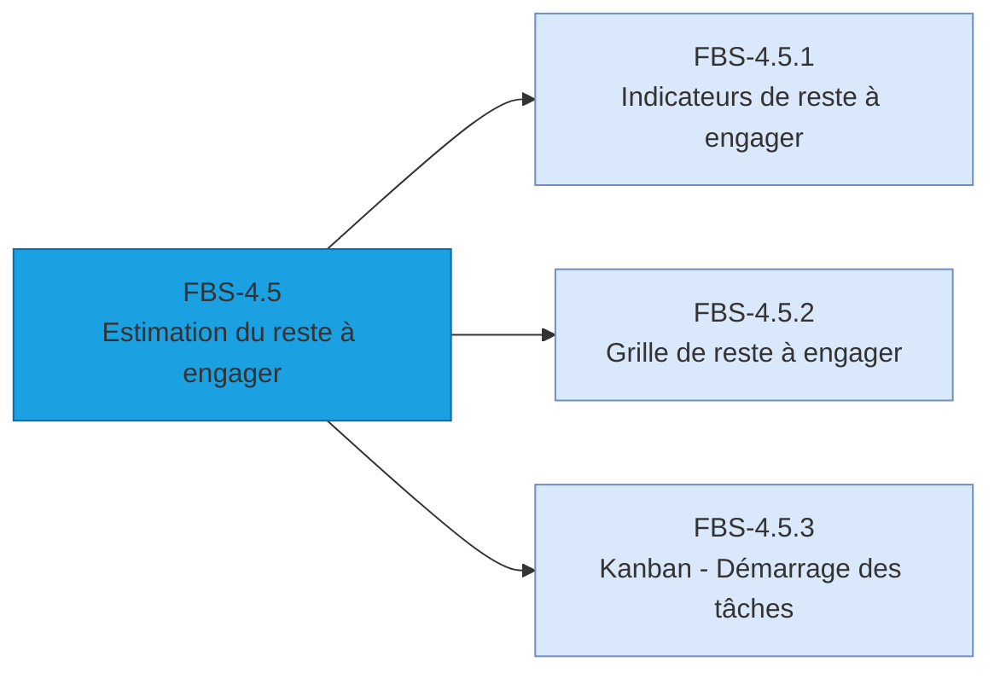
```mermaid
flowchart LR
    FBS_4_5_Estimation_du_reste_a_engager["FBS-4.5<br>Estimation du reste à engager"]
    FBS_4_5_1_Indicateurs_de_reste_a_engager["FBS-4.5.1<br>Indicateurs de reste à engager"]
    FBS_4_5_2_Grille_de_reste_a_engager["FBS-4.5.2<br>Grille de reste à engager"]
    FBS_4_5_3_Kanban_Demarrage_des_taches["FBS-4.5.3<br>Kanban - Démarrage des tâches"]

    FBS_4_5_Estimation_du_reste_a_engager --> FBS_4_5_1_Indicateurs_de_reste_a_engager
    FBS_4_5_Estimation_du_reste_a_engager --> FBS_4_5_2_Grille_de_reste_a_engager
    FBS_4_5_Estimation_du_reste_a_engager --> FBS_4_5_3_Kanban_Demarrage_des_taches

    classDef c1 fill:#1ba1e2,stroke:#006EAF
    class FBS_4_5_Estimation_du_reste_a_engager c1
    classDef c2 fill:#dae8fc,stroke:#6c8ebf
    class FBS_4_5_1_Indicateurs_de_reste_a_engager,FBS_4_5_2_Grille_de_reste_a_engager,FBS_4_5_3_Kanban_Demarrage_des_taches c2
```

*Figure 13 — Arborescence fonctionnelle de l’estimation du RAE*

```yaml exigence
section: "3.4.5.5"
id: "WF-RAE-0010-A"
titre: "Composition du reste à engager"
flexibilite: "F0"
fbs: "FBS-4.5"
pbs: "PBS-1.1, PBS-2.1, PBS-2.3, PBS-3.1"
corps: "Le reste à engager d’un projet est la somme, pour chaque tâche de la structure principale de la révision courante : de zéro si la tâche est terminée, du montant réestimé de ses lignes si elle est démarrée, et du montant budgété de ses lignes, projeté sur son année de consommation courante, si elle n’est pas démarrée ; et des lignes de provision des risques identifiés à la date de calcul, pour leur montant. Une ligne dont le montant budgété est nul — ajoutée après la référence — compte pour son montant réestimé quel que soit l’état de sa tâche."
motif: "Une tâche non démarrée n’a pas de raison d’être réestimée : sa valeur de référence reste la meilleure estimation, corrigée seulement de l’inflation si elle a glissé dans le temps. Ne soumettre à la réestimation que les tâches démarrées, concentre le travail de la revue là où l’information existe."
verification: "Sur un projet dont une tâche est terminée, une démarrée et une non démarrée, le reste à engager vaut la somme des deux dernières, la démarrée pour son montant réestimé et l’autre pour son montant de référence projeté, plus les provisions des risques identifiés. Le décalage d’une tâche non démarrée d’une année modifie son montant du taux d’inflation. Écarter un risque de provision 40 diminue le reste à engager de 40 ; en identifier un nouveau l’augmente de sa provision."
```

##### 3.4.5.5.1. FBS-4.5.1 : Indicateurs de reste à engager

Ces indicateurs situent la réestimation par rapport à deux repères : ce qui avait été promis, c’est-à-dire la référence, et ce qui avait été estimé à la revue précédente.

```yaml exigence
section: "3.4.5.5.1"
id: "WF-RAE-0020-A"
titre: "Indicateurs de reste à engager"
flexibilite: "F0"
fbs: "FBS-4.5.1"
pbs: "PBS-1.1, PBS-2.1, PBS-2.3, PBS-3.1, PBS-3.2"
corps: "Le reste à engager présente son total général, ses totaux par nature de coût et par sous-projet, ainsi que ses écarts avec le budget de référence et avec le reste à engager de la révision marquée précédente, et la couverture des risques (WF-RIS-0050). Pour chaque sous-projet, il présente l’écart entre le budget du sous-projet et la somme de son coût réel et de son reste à engager. Un code de couleur signale les sous-projets dont le budget est dépassé. Les lignes de devis sans sous-projet et les lignes de coût imputées au seul projet forment un ensemble « hors sous-projet », présenté comme un sous-projet de plus dans toutes les ventilations, de sorte que les totaux par sous-projet s’additionnent au total du projet."
motif: "Un reste à engager ne se juge pas dans l’absolu. L’écart avec la référence dit où en est le projet par rapport à son engagement, celui avec la revue précédente dit ce que cette revue a changé. La comparaison par sous-projet est la seule maille où le budget et la dépense se rejoignent, et c’est là que se voit un dépassement avant qu’il ne remonte au total."
verification: "Les écarts sont présents et signés. Un sous-projet dont le coût réel augmenté du reste à engager dépasse son budget est signalé par la couleur, les autres non. Sur un projet sans revue précédente, l’écart correspondant est absent plutôt que nul. La couverture des risques présente la réserve de référence, les provisions restantes, le coût des risques survenus et l’écart de couverture."
```

##### 3.4.5.5.2. FBS-4.5.3 : Kanban – Démarrage des tâches

Le Kanban est la vue par laquelle le chef de projet déclare qu’une tâche a commencé. Ce geste n’a pas d’autre effet que d’exposer les lignes de la tâche à la réestimation, dans la grille de reste à engager de la même révision.

```yaml exigence
section: "3.4.5.5.2"
id: "WF-RAE-0030-A"
titre: "Démarrage d’une tâche"
flexibilite: "F0"
fbs: "FBS-4.5.3"
pbs: "PBS-1.1, PBS-1.3, PBS-2.1, PBS-2.3, PBS-3.1"
corps: "Une vue Kanban présente les tâches de la structure principale de la révision courante réparties selon leur état — non démarrée, démarrée, terminée — et permet de faire passer une tâche à l’état démarré, y compris une tâche terminée que l’on rouvre, et un jalon directement à l’état terminé, en saisissant la date de l’événement (WF-PLA-0130). Elle signale les jalons dont tous les prédécesseurs sont terminés, pour inviter à ce geste ; rien ne se termine seul. Les lignes des tâches démarrées sont exposées par défaut à la réestimation du reste à engager ; celles des tâches non démarrées le sont à la demande (WF-RAE-0040). Aucun geste ne ramène une tâche à l’état non démarré : une tâche démarrée par erreur se corrige en annulant la saisie (WF-IHM-0110), et passé ce délai elle reste démarrée."
motif: "Waterfall ne suit pas l’exécution du travail au jour le jour, ce que le périmètre exclu écarte. Il a besoin d’une seule information : la tâche a-t-elle commencé ? C’est elle qui décide de ce que la revue périodique demande de réestimer. Rouvrir une tâche terminée libère la valeur qu’elle avait acquise : ce doit être un acte explicite, et non la conséquence d’une saisie."
verification: "Une tâche passée à l’état démarré voit ses lignes apparaître dans la grille de reste à engager. Une tâche non démarrée n’y apparaît qu’à la demande. Le passage direct de non démarrée à terminée n’est possible que pour un jalon ; un jalon sans ligne de devis est terminé depuis le Kanban, à une date saisie. Un jalon dont tous les prédécesseurs sont terminés est signalé et reste non démarré tant que personne ne le termine. Aucune commande ne fait passer une tâche démarrée à l’état non démarré."
```

##### 3.4.5.5.3. FBS-4.5.2 : Grille de reste à engager

Une revue périodique est un re-chiffrage, non une simple relecture. Le cas courant est celui d’un projet qui se déroule comme prévu : seules les tâches démarrées sont réestimées, et la grille n’expose qu’elles pour éviter de noyer le chef de projet sous des centaines de lignes inchangées. Mais un projet ne se déroule pas toujours comme prévu : des tâches non anticipées apparaissent, d’autres doivent être réestimées avant même d’avoir commencé. La grille permet les deux.

Ces ajouts ne changent pas le budget de référence, qui n’est déplacé que par un avenant ou par un risque survenu. Ils augmentent le reste à engager, donc la projection à terminaison, et dégradent l’indice de coût : c’est exactement ce qu’ils doivent faire.

```yaml exigence
section: "3.4.5.5.3"
id: "WF-RAE-0040-A"
titre: "Grille de reste à engager"
flexibilite: "F0"
fbs: "FBS-4.5.2"
pbs: "PBS-1.1, PBS-1.3, PBS-2.1, PBS-2.3, PBS-3.1"
corps: "La grille de reste à engager présente les lignes sous l’arbre des tâches, avec pour chacune : son montant budgété, ses grandeurs — charge, ou quantité et débours — et son montant réestimé au reste à engager précédent, et ses grandeurs et son montant réestimé courants. La réestimation se saisit sur les grandeurs, et le montant suit (WF-DEV-0020). Elle expose par défaut les seules lignes des tâches démarrées ; l’utilisateur peut y faire apparaître les tâches non démarrées pour les réestimer. Les lignes des tâches terminées ne sont pas modifiables. La saisie d’un reste à engager nul pour toutes les lignes d’une tâche la fait passer à l’état terminé, à une date demandée à la validation (WF-PLA-0130) ; la rouvrir ensuite passe par le Kanban (WF-RAE-0030). Une préférence d’affichage permet de distinguer visuellement les lignes dont le montant budgété est nul (WF-ADM-0040). La grille présente la date de fin de chaque tâche, sans la rendre saisissable, et signale les tâches démarrées dont la fin est antérieure à la date de calcul."
motif: "Réestimer suppose de voir ce à quoi l’on se compare. N’exposer par défaut que les tâches démarrées évite de noyer le chef de projet sous des lignes inchangées quand le projet se déroule bien ; pouvoir ouvrir les autres est nécessaire dès que ce n’est plus le cas, car une tâche non commencée peut déjà se savoir sous-estimée."
verification: "Les montants et les grandeurs sont présents pour chaque ligne, au reste à engager précédent et courant. La saisie d’une charge de 80 heures sur une ligne budgétée à 100 heures donne un montant réestimé de 80 fois le taux ; le montant n’est pas saisissable. Les tâches non démarrées n’apparaissent qu’à la demande, et sont alors modifiables. La modification d’une ligne portée par une tâche terminée est refusée. Une tâche démarrée dont la fin est dépassée est signalée ; sa date n’est pas modifiable depuis cette grille."
```

```yaml exigence
section: "3.4.5.5.3"
id: "WF-RAE-0050-A"
titre: "Tâches ajoutées en cours d’exécution"
flexibilite: "F0"
fbs: "FBS-4.5, FBS-4.3"
pbs: "PBS-1.1, PBS-2.1, PBS-2.3, PBS-3.1"
corps: "Des tâches et des lignes peuvent être ajoutées à la structure principale au cours d’une revue périodique, pour le travail qui n’avait pas été anticipé. Elles augmentent le reste à engager et la projection à terminaison, et n’entrent pas dans le budget de référence, que seuls un avenant ou un risque survenu déplacent. Ces tâches et ces lignes portent un montant budgété nul."
motif: "Aucun chiffrage n’est complet : du travail non prévu apparaît toujours. L’exclure du reste à engager donnerait une projection fausse ; l’inclure au budget de référence ferait disparaître le dépassement qu’il constitue. Le porter au reste à engager seul est ce qui fait apparaître l’écart là où il doit se voir, dans l’indice de coût."
verification: "Après ajout d’une tâche chiffrée en revue périodique, le reste à engager et la projection à terminaison augmentent de son montant, le budget de référence est inchangé, et l’indice de coût se dégrade."
```

#### 3.4.5.6. FBS-4.6 : Gestion des risques

Un risque est un événement incertain qui, s’il se produit, coûtera de l’argent et du temps. Waterfall le traite comme un devis à part, pondéré par sa probabilité : le chiffrer suppose de décrire ce qu’il coûterait, et c’est ce chiffrage qui donne sa gravité.

Deux représentations coexistent donc, et elles ne servent pas à la même chose.

- Le **devis propre** décrit le risque en détail — des tâches, des lignes — mais reste à l’écart du projet tant que le risque ne s’est pas produit.

- La **ligne de provision**, elle, est dans la structure principale et pèse sur le devis et sur le reste à engager dès l’identification du risque, à hauteur de la gravité pondérée par la probabilité, sans jamais entrer au budget de référence.

<!-- source : waterfall.visuels.drawio, page « FBS-4.6 » — régénéré par tools/build.py -->

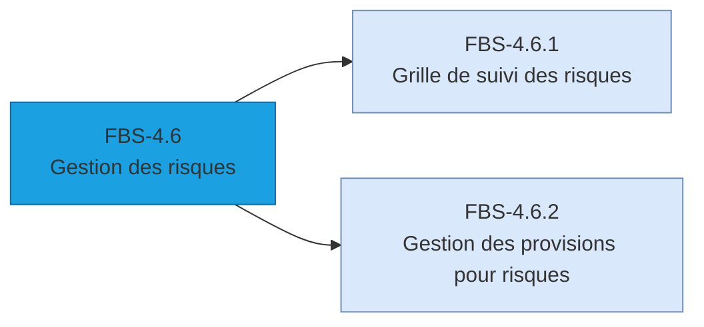
```mermaid
flowchart LR
    FBS_4_6_Gestion_des_risques["FBS-4.6<br>Gestion des risques"]
    FBS_4_6_1_Grille_de_suivi_des_risques["FBS-4.6.1<br>Grille de suivi des risques"]
    FBS_4_6_2_Gestion_des_provisions_pour_risques["FBS-4.6.2<br>Gestion des provisions pour risques"]

    FBS_4_6_Gestion_des_risques --> FBS_4_6_1_Grille_de_suivi_des_risques
    FBS_4_6_Gestion_des_risques --> FBS_4_6_2_Gestion_des_provisions_pour_risques

    classDef c1 fill:#1ba1e2,stroke:#006EAF
    class FBS_4_6_Gestion_des_risques c1
    classDef c2 fill:#dae8fc,stroke:#6c8ebf
    class FBS_4_6_1_Grille_de_suivi_des_risques,FBS_4_6_2_Gestion_des_provisions_pour_risques c2
```

*Figure 14 — Arborescence fonctionnelle de la gestion des risques*

```yaml exigence
section: "3.4.5.6"
id: "WF-RIS-0010-A"
titre: "Attributs d’un risque"
flexibilite: "F0"
fbs: "FBS-4.6"
pbs: "PBS-1.1, PBS-2.1, PBS-2.3, PBS-3.1"
corps: "Un risque porte : un libellé, une description, une note d’actions de mitigation, une probabilité d’occurrence exprimée en pourcentage, un état parmi identifié, survenu et écarté. Il conserve l’historique de ses réexamens : la date de chacun, et la probabilité, la gravité et l’état retenus. Un réexamen est l’acte par lequel un utilisateur confirme ou modifie la probabilité et l’état d’un risque ; il est daté du jour où il est fait. Il porte en outre une structure de coûts qui lui est propre et, tant qu’il est identifié, une ligne de provision dans la structure principale. Sa gravité est le total de sa structure propre, et le montant de sa provision est cette gravité pondérée par sa probabilité : ni l’une ni l’autre ne sont saisies."
motif: "Qualifier un risque suppose de l’avoir chiffré : c’est ce qui empêche une gravité d’être affirmée sans être justifiée. Calculer la provision plutôt que la saisir garantit qu’elle suit toute réévaluation du risque ou de sa probabilité."
verification: "La gravité et le montant de la provision ne sont pas saisissables, et suivent toute modification de la structure propre ou de la probabilité. Les trois états sont atteignables, et un risque écarté ne pèse plus sur le devis. La confirmation d’un risque sans modification produit un réexamen daté."
```

```yaml exigence
section: "3.4.5.6"
id: "WF-RIS-0020-A"
titre: "États d’un risque"
flexibilite: "F0"
fbs: "FBS-4.6"
pbs: "PBS-1.1, PBS-2.1, PBS-2.3, PBS-3.1"
corps: "Un risque identifié peut être écarté, et un risque écarté peut redevenir identifié. Un risque identifié peut être déclaré survenu ; cette transition est définitive. Un risque qu’aucune révision marquée ne cite encore peut être supprimé ; au-delà, il s’écarte. La probabilité et l’état de chaque risque sont réexaminés à chaque revue périodique. La création, le réexamen et la suppression d’un risque sont des saisies de la révision en cours ; lorsque le projet n’en comporte pas, la saisie en crée une au préalable."
motif: "Un risque écarté peut réapparaître : une hypothèse qu’on croyait levée ne l’est pas toujours. La survenance, elle, ne se défait pas, puisqu’elle a fusionné des tâches dans le projet. Le réexamen à chaque revue est ce qui empêche un registre des risques de vieillir sans que personne ne s’en aperçoive. Chaque révision fige une version des risques (WF-RIS-0030) : les saisir dans la révision en cours les fait suivre le même chemin que le devis, abandon et annulation compris."
verification: "Les transitions entre identifié et écarté sont possibles dans les deux sens. Toute transition depuis l’état survenu est refusée. La suppression d’un risque cité par une révision marquée est refusée. La revue périodique présente les risques dont la probabilité n’a pas été réexaminée."
```

```yaml exigence
section: "3.4.5.6"
id: "WF-RIS-0030-A"
titre: "Devis propre d’un risque"
flexibilite: "F0"
fbs: "FBS-4.6"
pbs: "PBS-1.1, PBS-2.1, PBS-2.3, PBS-3.1"
corps: "Le devis propre d’un risque se saisit comme celui du projet : des tâches portant des lignes, dans une structure de coûts qui lui est réservée. Il reste modifiable tout au long du projet, y compris après la réception de la commande, et chaque révision en fige une version."
motif: "Chiffrer un risque, c’est décrire ce qu’il faudrait faire s’il se produisait : c’est le même travail que chiffrer une partie du projet, et il mérite le même outil. Le laisser modifiable est nécessaire à la fusion : un risque qui survient tardivement ne coûte pas ce qu’on avait prévu deux ans plus tôt, et le planning dans lequel il doit se fondre a changé. Ce qui doit rester stable n’est pas le devis propre, mais la provision retenue au budget de référence (WF-RIS-0050)."
verification: "La grille de devis d’un risque offre les mêmes opérations que celle du projet. La modification du devis propre d’un risque identifié ne change ni le budget de référence ni les indicateurs du projet."
```

##### 3.4.5.6.1. FBS-4.6.1 : Grille de suivi des risques

La grille de suivi est le registre des risques du projet. C’est elle qu’on parcourt à chaque revue pour réexaminer les probabilités et les états.

```yaml exigence
section: "3.4.5.6.1"
id: "WF-RIS-0040-A"
titre: "Grille de suivi des risques"
flexibilite: "F0"
fbs: "FBS-4.6.1"
pbs: "PBS-1.1, PBS-1.3, PBS-2.1, PBS-2.3, PBS-3.1"
corps: "La grille de suivi des risques présente, pour chaque risque du projet : son libellé, sa probabilité, sa gravité, le montant de sa provision, son état et la date de son dernier réexamen. Elle donne accès : à la description du risque, à ses actions de mitigation et à l’historique de ses réexamens, qui montre l’évolution de sa probabilité et de sa gravité. Elle se trie par montant de provision et se filtre par état. Chaque ligne porte une couleur donnée par une matrice de risques à quatre niveaux de probabilité et quatre niveaux de gravité. Le total des provisions y figure, en distinguant les risques identifiés, pour leur provision courante, et les risques survenus et écartés, pour la provision qu’ils portaient dans la révision de référence, en regard de la réserve pour risques (WF-RIS-0050)."
motif: "Un registre des risques se lit par ordre d’importance, et l’importance d’un risque est le montant qu’il fait peser sur le projet. L’historique montre si le risque s’aggrave ou se résorbe, ce qu’un état instantané ne dit pas. Les actions de mitigation sont ce sur quoi la revue porte réellement : on ne discute pas d’une probabilité, on discute de ce qu’on fait pour la réduire. La matrice donne la lecture visuelle attendue d’un registre des risques."
verification: "Les six colonnes sont présentes, ainsi que l’accès aux deux notes et à l’historique. Le tri par provision classe les risques du plus lourd au plus léger. Un risque dont la probabilité augmente change de couleur conformément à la matrice. Les trois totaux sont distincts, et la réserve pour risques de la référence est affichée en regard."
```

##### 3.4.5.6.2. FBS-4.6.2 : Gestion des provisions pour risques

C’est ici que se joue la mécanique qui empêche un projet de consommer ses provisions sans que cela se voie. Une provision pèse sur le devis et sur le reste à engager dès l’identification du risque, et n’entre jamais dans le budget de référence : la réserve pour risques de la référence est ce à quoi on compare ce que les risques ont réellement coûté.

```yaml exigence
section: "3.4.5.6.2"
id: "WF-RIS-0050-A"
titre: "Réserve pour risques et couverture"
flexibilite: "F0"
fbs: "FBS-4.6.2"
pbs: "PBS-1.1, PBS-2.1, PBS-2.3, PBS-3.1"
corps: "Les lignes de provision ne font jamais partie du budget de référence. La révision de référence conserve, comme réserve pour risques, la somme de ses lignes de provision. À chaque revue, Waterfall présente la couverture des risques : la réserve de référence, face à la somme des provisions des risques identifiés dans la révision courante et du montant réestimé des lignes issues des risques survenus. La différence, signée, est l’écart de couverture."
motif: "Une provision couvre un risque qui ne s’est pas produit : l’inclure au budget reviendrait à se donner un budget pour un travail qu’on espère ne pas faire, et l’y faire entrer à la survenance ferait du budget de référence une grandeur que les risques déplacent sans acte contractuel. Garder la réserve à part, figée à la valeur de la révision de référence, rend l’écart mesurable : la réévaluation d’un risque, son écart ou sa survenance ne peuvent plus déplacer ce à quoi on les compare. Les risques identifiés après la référence n’ont pas de part dans la réserve, et l’écart de couverture les fait apparaître aussitôt, ce qui est voulu."
verification: "Sur un projet chiffré à 1 000 portant un risque de gravité 200 à 30 %, le devis totalise 1 060, le budget de référence 1 000 et la réserve 60. Après survenance, réévalué à 250, le budget de référence vaut toujours 1 000, les provisions restantes 0, le coût des survenus 250, et l’écart de couverture −190. Un second risque de provision 40, écarté, fait passer les provisions restantes de 40 à 0 sans toucher le budget de référence ; un risque identifié après la référence, de provision 30, porte les provisions restantes à 30 et l’écart de couverture à −30."
```

```yaml exigence
section: "3.4.5.6.2"
id: "WF-RIS-0060-A"
titre: "Survenance d’un risque"
flexibilite: "F0"
fbs: "FBS-4.6.2"
pbs: "PBS-1.1, PBS-2.1, PBS-2.3, PBS-3.1"
corps: "La déclaration de survenance d’un risque fusionne les tâches et les lignes de son devis propre dans la structure principale de la révision en cours, comme des tâches ajoutées en cours d’exécution (WF-RAE-0050) : chaque ligne fusionnée porte un montant budgété nul et, pour montant réestimé, son montant dans le devis propre ; sa ligne de provision est retirée. La survenance ne marque aucune révision et ne déplace pas la référence. Elle est définitive. Lorsque le projet ne comporte pas de révision en cours, elle en crée une au préalable."
motif: "Un risque survenu n’est plus un risque mais un fait : ses tâches deviennent du travail comme un autre, qui se planifie, se réestime et se termine. Comme elles ne comptent pas dans le budget de référence, elles n’acquièrent pas de valeur : leur coût est une dérive au sens de l’indice de coût, et la projection du chef de projet le porte dès la survenance. C’est la couverture des risques (WF-RIS-0050) qui dit si la réserve y suffisait."
verification: "Après déclaration de survenance d’un risque dont le devis propre porte deux lignes de 120 et 80, ces lignes figurent dans la structure principale de la révision en cours avec des montants budgétés nuls et des montants réestimés de 120 et 80 ; la ligne de provision a disparu ; le budget de référence et la révision de référence sont inchangés ; le reste à engager a augmenté de 200 moins la provision retirée ; la terminaison de ces tâches n’acquiert aucune valeur."
```

#### 3.4.5.7. FBS-4.7 : Coûts réels

Les coûts réels ne sont pas produits par Waterfall : ils viennent de l’ERP, par extraction périodique. Ce bloc ne décrit donc pas leur production, mais ce que Waterfall en fait une fois importés : à quoi il les rattache, ce qu’il en compte, et ce qu’il en écarte.

Deux périmètres se rencontrent ici, et ils ne coïncident jamais tout à fait. La comptabilité enregistre tout ce qui est imputé à un projet ; le pilotage ne suit que ce qui a été budgété. Une écriture peut donc être parfaitement légitime du côté comptable et n’avoir aucune place dans un indicateur de performance. C’est pourquoi toute ligne importée est conservée, mais que certaines sont exclues des calculs (WF-CRE-0030).

Le rapprochement entre la dépense et le budget se fait à la maille du sous-projet, la seule où les deux mondes se rejoignent : les lignes de coût portent un élément d’OTP, les lignes de devis appartiennent à un sous-projet. Il ne se fait ni par tâche, puisque les pointages ne s’y rattachent pas, ni par nature de coût, puisque le fichier de l’ERP n’en porte pas d’équivalent exploitable. Les lignes de coût imputées au seul projet, faute de sous-projet connu, rejoignent l’ensemble « hors sous-projet », où elles se rapprochent des lignes de devis qui n’en ont pas non plus.

```yaml exigence
section: "3.4.5.7"
id: "WF-CRE-0010-A"
titre: "Attributs d’une ligne de coût"
flexibilite: "F0"
fbs: "FBS-4.7"
pbs: "PBS-1.1, PBS-2.1, PBS-2.3, PBS-3.1"
corps: "Une ligne de coût porte : un numéro de pièce, une date de pièce, un montant signé, le projet ainsi que le sous-projet auxquels elle est imputée, et le code de sous-projet lu dans son élément d’OTP, qu’il corresponde ou non à un sous-projet déclaré. Les autres colonnes du fichier d’import sont conservées à titre d’information et restituées à la consultation, sans intervenir dans aucun calcul."
motif: "Quatre données suffisent aux indicateurs : l’identité de la ligne, sa date, son montant et son imputation. Conserver le reste — le fournisseur, le texte de la commande, la référence, le document d’achat — permet de justifier une dépense devant un client ou un contrôleur de gestion sans retourner dans l’ERP."
verification: "Les quatre attributs significatifs sont renseignés pour chaque ligne importée. Les colonnes conservées sont restituées à la consultation. Une ligne de montant négatif est acceptée et diminue le coût réel."
```

```yaml exigence
section: "3.4.5.7"
id: "WF-CRE-0020-A"
titre: "Imputation d’une ligne de coût"
flexibilite: "F0"
fbs: "FBS-4.7"
pbs: "PBS-1.1, PBS-2.1, PBS-2.2, PBS-2.3, PBS-3.1"
corps: "Le projet et le sous-projet d’une ligne de coût sont déduits de son élément d’OTP, de la forme préfixe.code projet/code sous-projet. Une ligne dont le code projet ne correspond pas au projet importé est rejetée et signalée au compte rendu. Une ligne sans partie sous-projet est imputée au seul projet. Une ligne dont le code de sous-projet ne correspond à aucun sous-projet du projet, ou à un sous-projet marqué supprimé (WF-DAT-0080), est importée et imputée au seul projet, en conservant ce code, et signalée. La création d’un sous-projet portant ce code lui impute aussitôt les lignes qui l’attendaient, et la mise à jour d’une ligne par un réimport (WF-INTF-0140) recalcule son imputation."
motif: "L’élément d’OTP est la seule colonne qui porte l’imputation, et elle porte les deux niveaux à la fois. Rejeter les lignes d’un autre projet évite qu’une extraction trop large ne pollue un projet, et le dire au compte rendu évite qu’une extraction mal filtrée passe pour vide. Accepter celles dont le sous-projet est inconnu est nécessaire : les codes de sous-projets sont créés dans l’ERP, et Waterfall peut les découvrir avant que quelqu’un ne les y ait déclarés ; conserver le code est ce qui permet de les imputer le jour où ils le sont."
verification: "Une ligne dont l’élément d’OTP ne respecte pas la forme attendue est signalée au compte rendu et n’est pas importée. Une ligne d’un autre projet est rejetée et signalée. Une ligne dont le sous-projet est inconnu est importée, imputée au projet, et apparaît comme telle à la consultation avec son code. Après création du sous-projet dont dix lignes portaient le code, ces dix lignes lui sont imputées sans réimport, et l’ensemble hors sous-projet diminue d’autant. Une ligne réimportée avec un autre élément d’OTP change d’imputation."
```

```yaml exigence
section: "3.4.5.7"
id: "WF-CRE-0030-A"
titre: "Exclusion du périmètre suivi"
flexibilite: "F0"
fbs: "FBS-4.7"
pbs: "PBS-1.1, PBS-2.1, PBS-2.3, PBS-3.1"
corps: "Une ligne de coût peut être exclue du périmètre suivi, et réintégrée. Une ligne exclue reste consultable mais n’entre dans aucun indicateur. L’exclusion est conservée lors des imports ultérieurs, y compris lorsque la ligne est rapportée par une extraction dont la période recouvre la précédente."
motif: "La comptabilité impute au projet des dépenses qui n’ont pas été budgétées et n’ont donc rien à faire dans un indicateur de performance. Les supprimer fausserait le rapprochement avec l’ERP ; les compter fausserait les indicateurs. Les exclure est la seule voie qui préserve les deux. Conserver l’exclusion au réimport est indispensable : sans cela, chaque extraction annulerait le travail de tri de la précédente."
verification: "Une ligne exclue n’apparaît dans aucun total d’indicateur, et reste visible dans la consultation des coûts réels. Après un second import couvrant la même période, elle est toujours exclue."
```

```yaml exigence
section: "3.4.5.7"
id: "WF-CRE-0040-A"
titre: "Consultation des coûts réels"
flexibilite: "F0"
fbs: "FBS-4.7"
pbs: "PBS-1.1, PBS-2.1, PBS-2.3, PBS-3.1"
corps: "Les coûts réels d’un projet sont consultables sous forme de liste, filtrable par sous-projet, par période et selon l’exclusion. La liste présente le total du périmètre suivi, le total exclu, et le total général. Elle permet d’exclure ou de réintégrer une ligne."
motif: "Le tri du périmètre est un travail de lecture : il suppose de parcourir les lignes, de reconnaître celles qui n’ont pas été budgétées et de les écarter. Les trois totaux donnent la mesure de ce qui a été écarté, ce qui est la première question qu’un contrôleur de gestion posera."
verification: "Les trois totaux sont présents et leur somme est cohérente. L’exclusion d’une ligne depuis la liste modifie immédiatement les deux premiers totaux."
```

```yaml exigence
section: "3.4.5.7"
id: "WF-CRE-0050-A"
titre: "Journal des imports"
flexibilite: "F0"
fbs: "FBS-4.7"
pbs: "PBS-1.1, PBS-2.1, PBS-2.2, PBS-2.3, PBS-3.1"
corps: "Chaque import de coûts réels est journalisé avec sa date, son auteur, la période extraite et le nombre de lignes créées, mises à jour et ignorées. La date du dernier import est présentée dans la consultation des coûts réels."
motif: "La date d’une pièce dit quand la dépense a eu lieu, celle de l’import dit de quand datent les chiffres qu’on lit. Ce sont deux questions différentes, et la seconde est celle que pose la santé du pilotage (WF-PTF-0110)."
verification: "Après un import, le journal présente une entrée datée du jour avec ses comptes de lignes, et la consultation des coûts réels affiche cette date comme celle du dernier import."
```

#### 3.4.5.8. FBS-4.8 : Indicateurs projets

Les indicateurs sont ce pour quoi tout le reste existe. Ils mettent en relation quatre grandeurs que les blocs précédents ont construites :

- Le budget de référence, ce qui a été promis ;

- La valeur planifiée, ce qui aurait dû être fait à une date ;

- La valeur acquise, ce qui l’a été ;

- Le coût réel, ce que cela a coûté.

Le reste à engager y ajoute le regard du chef de projet sur ce qui reste.

Trois règles valent pour tous. Un indicateur se calcule à une date, celle du marquage pour une révision marquée, le jour courant pour la révision en cours (WF-IND-0010). Tout ce qui est monétaire se calcule par sous-projet et au niveau du projet (WF-IND-0020). Et rien ne se calcule avant la contractualisation : sans budget de référence, il n’y a ni indice ni avancement, seulement les indicateurs de devis.

Les courbes montreront des sauts, et il faut les lire comme tels. Le budget de référence change à chaque avenant, et à rien d’autre : ni la survenance ni l’écart d’un risque ne le déplacent (WF-RIS-0050). Ce ne sont pas des anomalies : ce sont les événements du contrat, et les courbes les datent.

<!-- source : waterfall.visuels.drawio, page « FBS-4.8 » — régénéré par tools/build.py -->

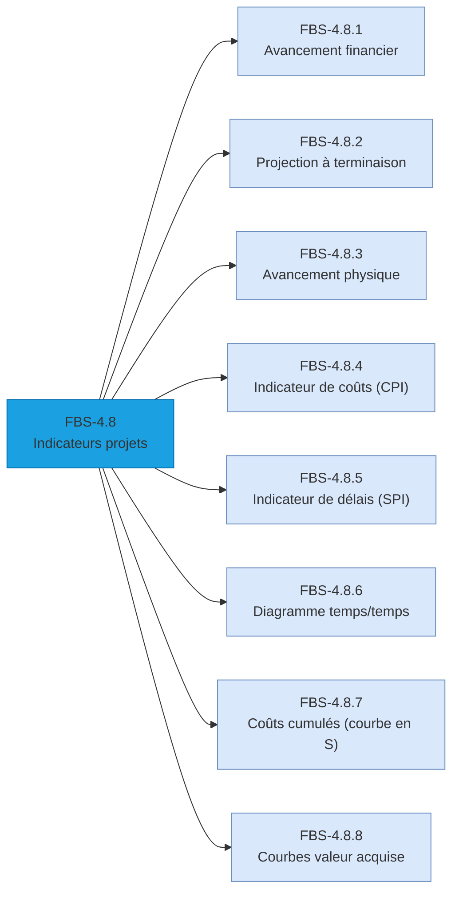
```mermaid
flowchart LR
    FBS_4_8_Indicateurs_projets["FBS-4.8<br>Indicateurs projets"]
    FBS_4_8_2_Projection_a_terminaison["FBS-4.8.2<br>Projection à terminaison"]
    FBS_4_8_3_Avancement_physique["FBS-4.8.3<br>Avancement physique"]
    FBS_4_8_4_Indicateur_de_couts_CPI["FBS-4.8.4<br>Indicateur de coûts (CPI)"]
    FBS_4_8_5_Indicateur_de_delais_SPI["FBS-4.8.5<br>Indicateur de délais (SPI)"]
    FBS_4_8_6_Diagramme_temps_temps["FBS-4.8.6<br>Diagramme temps/temps"]
    FBS_4_8_7_Couts_cumules_courbe_en_S["FBS-4.8.7<br>Coûts cumulés (courbe en S)"]
    FBS_4_8_8_Courbes_valeur_acquise["FBS-4.8.8<br>Courbes valeur acquise"]
    FBS_4_8_1_Avancement_financier["FBS-4.8.1<br>Avancement financier"]

    FBS_4_8_Indicateurs_projets --> FBS_4_8_1_Avancement_financier
    FBS_4_8_Indicateurs_projets --> FBS_4_8_2_Projection_a_terminaison
    FBS_4_8_Indicateurs_projets --> FBS_4_8_3_Avancement_physique
    FBS_4_8_Indicateurs_projets --> FBS_4_8_4_Indicateur_de_couts_CPI
    FBS_4_8_Indicateurs_projets --> FBS_4_8_5_Indicateur_de_delais_SPI
    FBS_4_8_Indicateurs_projets --> FBS_4_8_6_Diagramme_temps_temps
    FBS_4_8_Indicateurs_projets --> FBS_4_8_7_Couts_cumules_courbe_en_S
    FBS_4_8_Indicateurs_projets --> FBS_4_8_8_Courbes_valeur_acquise

    classDef c1 fill:#1ba1e2,stroke:#006EAF
    class FBS_4_8_Indicateurs_projets c1
    classDef c2 fill:#dae8fc,stroke:#6c8ebf
    class FBS_4_8_1_Avancement_financier,FBS_4_8_2_Projection_a_terminaison,FBS_4_8_3_Avancement_physique,FBS_4_8_4_Indicateur_de_couts_CPI,FBS_4_8_5_Indicateur_de_delais_SPI,FBS_4_8_6_Diagramme_temps_temps,FBS_4_8_7_Couts_cumules_courbe_en_S,FBS_4_8_8_Courbes_valeur_acquise c2
```

*Figure 15 — Arborescence fonctionnelle des indicateurs projets*

```yaml exigence
section: "3.4.5.8"
id: "WF-IND-0010-A"
titre: "Date et périmètre de calcul"
flexibilite: "F0"
fbs: "FBS-4.8"
pbs: "PBS-1.1, PBS-2.1, PBS-2.3, PBS-3.1"
corps: "Les indicateurs d’une révision marquée se calculent à sa date de marquage, et ceux de la révision en cours au jour courant. Le coût réel à une date est la somme des lignes de coût du périmètre suivi dont la date de pièce est antérieure ou égale à cette date. Les indicateurs projets ne sont calculés qu’à partir de l’état En cours ; avant, seuls les indicateurs de devis sont disponibles. Un indicateur dont une grandeur est nulle au dénominateur est présenté comme non calculable, jamais comme zéro ni comme infini."
motif: "Les révisions marquées donnent l’historique, la révision en cours donne la vue vivante entre deux revues : les deux se calculent de la même façon, seule la date change. Avant la contractualisation, il n’y a pas de budget de référence, donc rien à quoi comparer. Afficher zéro pour un indice non calculable serait lu comme une catastrophe, et l’infini comme une plaisanterie."
verification: "Les indicateurs d’une révision marquée ne changent pas après son marquage, même après import de coûts réels postérieurs. Une ligne de coût datée après la date de marquage n’entre pas dans le coût réel de cette révision. Sur un projet à l’état Chiffrage, aucun indicateur projet n’est proposé. Un indice de coût sans coût réel est affiché non calculable."
```

```yaml exigence
section: "3.4.5.8"
id: "WF-IND-0020-A"
titre: "Granularité des indicateurs"
flexibilite: "F0"
fbs: "FBS-4.8"
pbs: "PBS-1.1, PBS-2.1, PBS-2.3, PBS-3.1"
corps: "La valeur planifiée, la valeur acquise, le coût réel, le reste à engager et les indicateurs qui en dérivent se calculent pour le projet et pour chacun de ses sous-projets, l’ensemble « hors sous-projet » compris. Le diagramme temps/temps se calcule pour le seul projet : il suit des jalons, qu’un sous-projet n’a pas."
motif: "Le sous-projet est la maille où le budget et la dépense se rejoignent : c’est là qu’un dépassement se voit avant de remonter au total. Les jalons, eux, n’ont pas de sous-projet."
verification: "La somme des valeurs acquises des sous-projets, ensemble « hors sous-projet » compris, égale celle du projet, de même pour le coût réel, la valeur planifiée et le reste à engager."
```

```yaml exigence
section: "3.4.5.8"
id: "WF-IND-0030-A"
titre: "Valeur acquise"
flexibilite: "F0"
fbs: "FBS-4.8"
pbs: "PBS-1.1, PBS-2.1, PBS-2.3, PBS-3.1"
corps: "La valeur acquise à une date est la somme des montants budgétés des lignes portées par les tâches terminées à cette date, la date de terminaison de la tâche faisant foi. Les lignes propres d’une tâche récapitulative s’acquièrent quand elle est terminée."
motif: "La valeur acquise mesure le travail fait au prix où il avait été promis, jamais au prix qu’il a coûté : c’est ce qui rend l’écart avec le coût réel lisible. L’acquisition tâche par tâche, à la terminaison, est le choix fait au §3.2.5 ; la date de terminaison la situe dans le temps, ce qui permet les courbes et l’indice de délai entre deux revues."
verification: "Une tâche terminée le 12 du mois contribue à la valeur acquise dès cette date, non à la revue suivante. Une tâche dont le coût réel dépasse le montant budgété contribue pour le montant budgété. La valeur acquise d’un projet dont toutes les tâches sont terminées égale son budget de référence ; les tâches issues d’un risque survenu n’y contribuent pas."
```

##### 3.4.5.8.1. FBS-4.8.1 : Avancement financier

L’avancement financier dit où en est la dépense par rapport à ce qu’elle finira par être : le coût réel rapporté au projeté du chef de projet. Il se lit avec la consommation du budget, qui rapporte le même coût réel au budget de référence : les deux ensemble disent si l’on dépense vite, et si l’on dépense trop.

```yaml exigence
section: "3.4.5.8.1"
id: "WF-IND-0040-A"
titre: "Avancement financier et consommation du budget"
flexibilite: "F0"
fbs: "FBS-4.8.1"
pbs: "PBS-1.1, PBS-2.1, PBS-2.3, PBS-3.1, PBS-3.2"
corps: "L’avancement financier est le rapport du coût réel à la somme du coût réel et du reste à engager. La consommation du budget est le rapport du coût réel au budget de référence. Tous deux sont exprimés en pourcentage et calculés par sous-projet et pour le projet. L’avancement financier est non calculable lorsque le coût réel et le reste à engager sont tous deux nuls."
motif: "L’avancement financier est le seul indicateur qui ne dépende pas de la valeur acquise : il ne demande que la dépense et l’estimation du reste, ce qui le rend disponible même sur une tâche à moitié faite. La consommation du budget le complète : un avancement financier de 50 % avec une consommation de 70 % annonce un dépassement de 40 %."
verification: "Sur un sous-projet de budget 100, de coût réel 70 et de reste à engager 70, l’avancement financier vaut 50 % et la consommation 70 %. Un sous-projet sans coût réel ni reste à engager affiche un avancement financier non calculable."
```

##### 3.4.5.8.2. FBS-4.8.2 : Projection à terminaison

Trois projections estiment le coût final du projet, selon trois hypothèses. La projection au budget suppose que le reste coûtera ce qui était prévu ; celle du chef de projet, ce qu’il estime ; celle au rythme constaté, ce que le réalisé a coûté en proportion. Aucune n’est plus vraie que les autres : c’est leur écart qui renseigne. Une projection du chef de projet inférieure à celle du rythme constaté suppose que la dérive va s’arrêter ; c’est cette hypothèse que la revue doit examiner.

```yaml exigence
section: "3.4.5.8.2"
id: "WF-IND-0050-A"
titre: "Projections à terminaison"
flexibilite: "F0"
fbs: "FBS-4.8.2"
pbs: "PBS-1.1, PBS-2.1, PBS-2.3, PBS-3.1, PBS-3.2"
corps: "Waterfall présente trois projections à terminaison, par sous-projet et pour le projet. La projection au budget est la somme du coût réel et de la part du budget de référence non encore acquise. La projection du chef de projet est la somme du coût réel et du reste à engager. La projection au rythme constaté est le budget de référence divisé par l’indice de coût ; elle est non calculable tant que l’indice ne l’est pas. Les trois sont présentées ensemble, avec leur écart au budget de référence."
motif: "Chaque projection repose sur une hypothèse sur le travail restant : qu’il coûtera le prix prévu, le prix estimé, ou le prix constaté sur ce qui est fait. Les nommer par leur hypothèse et non par un jugement — optimiste, réaliste — évite un contresens : sur un projet qui dépense moins que prévu, c’est la projection au budget qui est la plus pessimiste. Les présenter ensemble fait de leur écart un indicateur en soi."
verification: "Sur un projet de budget 1 000, de valeur acquise 400, de coût réel 500 et de reste à engager 550, les projections valent 1 100 au budget, 1 050 pour le chef de projet et 1 250 au rythme constaté. Avant tout coût réel, la projection au rythme constaté est non calculable et les deux autres sont affichées."
```

##### 3.4.5.8.3. FBS-4.8.3 : Avancement physique

L’avancement physique dit quelle part du travail promis est faite, indépendamment de ce qu’elle a coûté. Il s’acquiert tâche par tâche, à la terminaison, et se lit donc par paliers : sa finesse est celle du découpage du planning. C’est une conséquence assumée du modèle, non un défaut de calcul.

```yaml exigence
section: "3.4.5.8.3"
id: "WF-IND-0060-A"
titre: "Avancement physique"
flexibilite: "F0"
fbs: "FBS-4.8.3"
pbs: "PBS-1.1, PBS-2.1, PBS-2.3, PBS-3.1, PBS-3.2"
corps: "L’avancement physique est le rapport de la valeur acquise au budget de référence, exprimé en pourcentage, calculé par sous-projet et pour le projet. Il se calcule aussi pour toute tâche récapitulative, comme le rapport des montants budgétés portés par les tâches terminées de son sous-arbre au total budgété de ce sous-arbre ; c’est cette valeur que la grille de planning affiche."
motif: "La valeur acquise s’obtient par tâche terminée, jamais par pourcentage saisi : l’avancement physique progresse par paliers et sa finesse est celle du planning. C’est ce qui le rend incontestable — une tâche est finie ou ne l’est pas — au prix d’une lecture grossière sur les plannings peu découpés. Le calcul par récapitulative donne à chaque phase son propre avancement, sans saisie."
verification: "Sur un budget de 1 000 dont 400 sont portés par des tâches terminées, l’avancement physique vaut 40 %. Une tâche démarrée à 90 % de son temps ne contribue pas. Une récapitulative dont deux subordonnées sur trois sont terminées, de montants budgétés 100, 100 et 200, affiche 50 %."
```

##### 3.4.5.8.4. FBS-4.8.4 : Indicateur de coûts (CPI)

```yaml exigence
section: "3.4.5.8.4"
id: "WF-IND-0070-A"
titre: "Indice de coût"
flexibilite: "F0"
fbs: "FBS-4.8.4"
pbs: "PBS-1.1, PBS-2.1, PBS-2.3, PBS-3.1, PBS-3.2"
corps: "L’indice de coût est le rapport de la valeur acquise au coût réel, calculé par sous-projet et pour le projet. Il est non calculable tant que le coût réel est nul. Il est présenté avec la zone où il se trouve — nominal, vigilance ou alerte — d’après les seuils du référentiel (WF-REF-0170). Il est présenté avec l’écart de coût, différence de la valeur acquise et du coût réel."
motif: "Un indice inférieur à 1 dit que le travail fait a coûté plus que promis. La zone donne au lecteur le jugement de l’entreprise sur cette valeur, sans qu’il ait à se souvenir des seuils."
verification: "Une valeur acquise de 400 pour un coût réel de 500 donne 0,8. L’indice change de zone quand il franchit un seuil, dans un sens comme dans l’autre. Avant le premier import de coûts réels, il est affiché non calculable. Une valeur acquise de 400 pour un coût réel de 500 donne un écart de coût de −100."
```

##### 3.4.5.8.5. FBS-4.8.5 : Indicateur de délais (SPI)

```yaml exigence
section: "3.4.5.8.5"
id: "WF-IND-0080-A"
titre: "Indice de délai"
flexibilite: "F0"
fbs: "FBS-4.8.5"
pbs: "PBS-1.1, PBS-2.1, PBS-2.3, PBS-3.1, PBS-3.2"
corps: "L’indice de délai est le rapport de la valeur acquise à la valeur planifiée à la même date, calculé par sous-projet et pour le projet. Il est non calculable tant que la valeur planifiée à la date de calcul est nulle, c’est-à-dire avant le début de la première tâche de la référence. Il est présenté avec sa zone d’après les seuils du référentiel (WF-REF-0170). Il est présenté avec l’écart de délai, différence de la valeur acquise et de la valeur planifiée."
motif: "Un indice inférieur à 1 dit que moins de travail a été fait que la référence n’en prévoyait à cette date. Comme la valeur planifiée se lit sur les dates de la référence et la valeur acquise sur les dates de terminaison réelles, l’indice mesure un retard sans qu’aucune date de la révision courante n’intervienne."
verification: "Une valeur acquise de 400 pour une valeur planifiée de 500 donne 0,8. Avant la date de début de la première tâche de la référence, l’indice est non calculable. Un projet dont toutes les tâches sont terminées à la date de fin prévue par la référence affiche 1. Une valeur acquise de 400 pour une valeur planifiée de 500 donne un écart de délai de −100."
```

```yaml exigence
section: "3.4.5.8.5"
id: "WF-IND-0130-A"
titre: "Évolution des indices"
flexibilite: "F1"
fbs: "FBS-4.8.4, FBS-4.8.5"
pbs: "PBS-1.1, PBS-1.3, PBS-2.1, PBS-2.3, PBS-3.1, PBS-3.2"
corps: "Waterfall présente, pour le projet et pour chaque sous-projet, l’évolution de l’indice de coût et de l’indice de délai : un point par révision marquée, à sa date de marquage, et le dernier point au jour courant pour la révision en cours, avec les seuils de vigilance et d’alerte du référentiel (WF-REF-0170)."
motif: "Un indice ne se lit qu’avec sa tendance : 0,9 qui remonte et 0,9 qui descend ne demandent pas la même décision. Les indicateurs des révisions marquées sont conservés (§4.4.2) ; les montrer dans le temps ne coûte rien de plus."
verification: "Sur un projet de trois révisions marquées à partir de l’état En cours, chaque courbe porte quatre points, le dernier au jour courant ; une révision marquée pendant le chiffrage n’en donne aucun (WF-DAT-0040) ; les deux seuils sont tracés ; un sous-projet a ses courbes."
```

##### 3.4.5.8.6. FBS-4.8.6 : Diagramme temps/temps

Le diagramme temps/temps montre comment les dates prévues des jalons ont glissé d’une revue à l’autre. Chaque revue est un point sur l’axe horizontal ; la date alors prévue pour chaque jalon, un point sur l’axe vertical. Un jalon dont la date ne bouge pas trace une horizontale ; un jalon qui glisse monte ; quand il est franchi, sa courbe touche la diagonale et s’arrête.

```yaml exigence
section: "3.4.5.8.6"
id: "WF-IND-0090-A"
titre: "Diagramme temps/temps"
flexibilite: "F0"
fbs: "FBS-4.8.6"
pbs: "PBS-1.1, PBS-1.3, PBS-2.1, PBS-2.3, PBS-3.1, PBS-3.2"
corps: "Le diagramme temps/temps présente, pour chaque jalon inscrit au suivi, la date que chaque révision marquée prévoyait pour lui, en fonction de la date de marquage de cette révision. La diagonale des dates égales y figure, et la courbe d’un jalon s’arrête à sa terminaison. La révision en cours fournit le dernier point, au jour courant."
motif: "Un jalon qui glisse à chaque revue se voit sur ce diagramme avant que quiconque ne l’ait dit : la pente de sa courbe est la vitesse de son glissement. Les révisions marquées sont ce qui rend ce diagramme possible, puisque chacune conserve les dates qu’on prévoyait à sa date."
verification: "Un jalon prévu au 30 juin dans trois revues successives trace une horizontale. Un jalon repoussé d’un mois à chaque revue trace une droite de pente 1. Un jalon terminé n’a plus de point après sa terminaison, et son dernier point est sur la diagonale."
```

##### 3.4.5.8.7. FBS-4.8.7 : Coûts cumulés (courbe en S)

La courbe en S est la vue budgétaire du projet : ce qu’il devait coûter, ce qu’il a coûté, ce qu’il coûtera. Elle ne parle pas d’avancement, seulement d’argent dans le temps, et c’est ce qui la distingue des courbes de valeur acquise. Décalée des délais de paiement, elle devient la projection des décaissements : quand l’argent sortira-t-il.

```yaml exigence
section: "3.4.5.8.7"
id: "WF-IND-0100-A"
titre: "Courbe de coûts cumulés"
flexibilite: "F0"
fbs: "FBS-4.8.7"
pbs: "PBS-1.1, PBS-1.3, PBS-2.1, PBS-2.3, PBS-3.1, PBS-3.2"
corps: "La courbe de coûts cumulés présente sur un même axe temporel : le budget de référence cumulé selon les dates de la référence ; le coût réel cumulé selon les dates de pièce, jusqu’à la date de calcul ; et, au-delà, la projection du chef de projet, le reste à engager étant étalé sur les dates de la révision courante. Les changements du budget de référence — les avenants — y apparaissent comme des marches, datées. Sur demande, chaque montant est décalé du délai de paiement de sa ligne, et les provisions des risques identifiés s’ajoutent à la date de la tâche qui les porte : la courbe présente alors les décaissements, passés et à venir, par mois."
motif: "C’est la courbe que l’on montre en comité : elle dit d’un regard si le projet dépense au rythme prévu et où il atterrira. Dater les marches du budget évite qu’un saut soit lu comme une dérive alors qu’il est un avenant."
verification: "La courbe du budget de référence atteint le budget de référence à la date de fin de la référence. Celle du coût réel s’arrête à la date de calcul, et la projection part de ce point pour atteindre la projection du chef de projet. Après contractualisation d’un avenant, la courbe du budget présente une marche à sa date. Avec un délai de paiement de 60 jours sur toutes les lignes, la courbe décalée est la courbe de référence translatée de 60 jours ; la somme des décaissements à venir égale le reste à engager."
```

##### 3.4.5.8.8. FBS-4.8.8 : Courbes valeur acquise

Les courbes de valeur acquise sont la vue de performance : trois courbes, valeur planifiée, valeur acquise et coût réel, dont les écarts verticaux sont les écarts de coût et de délai, et les écarts horizontaux le retard en temps. Là où la courbe en S dit combien, celles-ci disent si l’on a fait ce qu’on devait, et à quel prix.

```yaml exigence
section: "3.4.5.8.8"
id: "WF-IND-0110-A"
titre: "Courbes de valeur acquise"
flexibilite: "F0"
fbs: "FBS-4.8.8"
pbs: "PBS-1.1, PBS-1.3, PBS-2.1, PBS-2.3, PBS-3.1, PBS-3.2"
corps: "Les courbes de valeur acquise présentent sur un même axe temporel la valeur planifiée cumulée, la valeur acquise cumulée selon les dates de terminaison, et le coût réel cumulé selon les dates de pièce, jusqu’à la date de calcul. La valeur planifiée se prolonge jusqu’à la fin de la référence."
motif: "L’écart vertical entre valeur acquise et coût réel est l’écart de coût ; entre valeur acquise et valeur planifiée, l’écart de délai en valeur ; et l’écart horizontal entre les deux dernières est le retard en temps. Les trois se lisent sur une seule figure, ce qu’aucun indice ne permet."
verification: "À la date de calcul, l’écart vertical entre la courbe de valeur acquise et celle du coût réel égale la différence des deux grandeurs. La courbe de valeur planifiée atteint le budget de référence à la fin de la référence. Une tâche terminée produit une marche dans la valeur acquise à sa date de terminaison."
```

## 3.5. Interactions entre fonctions

Les paragraphes précédents décrivent les fonctions une à une. Celui-ci décrit ce qui les relie : la structure qu’elles partagent, et l’ordre dans lequel elles s’enchaînent au cours de la vie d’un projet.

### 3.5.1. Arbre commun

Le planning et le devis ne sont pas deux objets que Waterfall tiendrait synchronisés : ce sont deux vues d’un même arbre. Les tâches en forment la charpente et portent le temps ; les lignes de devis y sont accrochées et portent l’argent. Le reste à engager n’ajoute rien à cette structure : ce sont les mêmes lignes, dans la structure principale de la révision courante.

La cohérence entre planification et chiffrage n’a donc besoin d’aucune règle de synchronisation. Déplacer un groupe de tâches déplace ce qu’il coûte, parce qu’il s’agit du même arbre. Un retard décale les dépenses qu’il porte. Aucune conversion n’existe entre une durée et une charge : la durée est saisie sur la tâche, la charge sur la ligne, et le calendrier ne sert qu’à convertir l’une en dates et l’autre en répartition mensuelle.

Quatre calculs découlent de cette structure sans rien demander de plus.

- La **valeur planifiée** s’obtient en étalant les montants budgétés sur les dates de leurs tâches dans la référence (WF-DEV-0080).

- Le **taux d’inflation** s’applique à chaque ligne selon l’année où sa tâche la consomme.

- La lecture en décaissements de **la courbe en S** (WF-IND-0100) suit les mêmes dates, décalées du délai de paiement.

- Et la **valeur acquise** s’acquiert tâche par tâche, quand le reste à engager de l’une d’elles tombe à zéro.

Le détail de cette structure est au §3.2 : la structure de coûts et ses natures au §3.2.3, l’arbre vu du temps au §3.2.4, vu de l’argent au §3.2.5.

### 3.5.2. Flux de travail principal

La figure suivante présente l’enchaînement des fonctions au cours de la vie d’un projet. Les traits pleins sont le cours normal ; les pointillés, les événements contractuels qui déplacent la référence.

<!-- source : waterfall.visuels.drawio, page « Flux de travail » — régénéré par tools/build.py -->

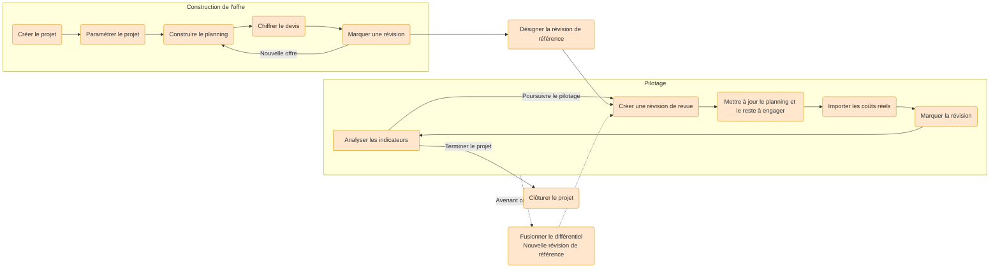
```mermaid
flowchart LR
    subgraph Pilotage["Pilotage"]
        Analyser_les_indicateurs["Analyser les indicateurs"]
        Creer_une_revision_de_revue("Créer une révision de revue")
        Mettre_a_jour_le_planning_et_le_reste_a_engager("Mettre à jour le planning et le reste à engager")
        Importer_les_couts_reels("Importer les coûts réels")
        Marquer_la_revision("Marquer la révision")
    end
    subgraph Construction_de_l_offre["Construction de l'offre"]
        Creer_le_projet("Créer le projet")
        Parametrer_le_projet("Paramétrer le projet")
        Construire_le_planning("Construire le planning")
        Chiffrer_le_devis("Chiffrer le devis")
        Marquer_une_revision("Marquer une révision")
    end
    Designer_la_revision_de_reference("Désigner la révision de référence")
    Cloturer_le_projet("Clôturer le projet")
    Fusionner_le_differentiel_Nouvelle_revision_de_reference("Fusionner le différentiel<br>Nouvelle révision de référence")

    Pilotage -.->|"Avenant contractualisé"| Fusionner_le_differentiel_Nouvelle_revision_de_reference
    Analyser_les_indicateurs -->|"Poursuivre le pilotage"| Creer_une_revision_de_revue
    Analyser_les_indicateurs -->|"Terminer le projet"| Cloturer_le_projet
    Creer_le_projet --> Parametrer_le_projet
    Parametrer_le_projet --> Construire_le_planning
    Construire_le_planning --> Chiffrer_le_devis
    Chiffrer_le_devis --> Marquer_une_revision
    Marquer_une_revision -->|"Nouvelle offre"| Construire_le_planning
    Marquer_une_revision --> Designer_la_revision_de_reference
    Designer_la_revision_de_reference --> Creer_une_revision_de_revue
    Creer_une_revision_de_revue --> Mettre_a_jour_le_planning_et_le_reste_a_engager
    Mettre_a_jour_le_planning_et_le_reste_a_engager --> Importer_les_couts_reels
    Importer_les_couts_reels --> Marquer_la_revision
    Fusionner_le_differentiel_Nouvelle_revision_de_reference -.-> Creer_une_revision_de_revue
    Marquer_la_revision --> Analyser_les_indicateurs

    classDef c1 fill:#ffe6cc,stroke:#d79b00
    class Analyser_les_indicateurs,Chiffrer_le_devis,Cloturer_le_projet,Construire_le_planning,Creer_le_projet,Creer_une_revision_de_revue,Designer_la_revision_de_reference,Fusionner_le_differentiel_Nouvelle_revision_de_reference,Importer_les_couts_reels,Marquer_la_revision,Marquer_une_revision,Mettre_a_jour_le_planning_et_le_reste_a_engager,Parametrer_le_projet c1
```

*Figure 16 — Flux de travail principal*

**Pendant la construction de l’offre**, le cycle planning-devis-révision se répète à chaque version remise au client. Chaque révision marquée conserve les hypothèses et les taux qui l’ont produite.

**La contractualisation** désigne parmi ces révisions celle qui fait référence, et le projet passe à l’état En cours. Cette désignation est unique, et ne se corrige que tant qu’elle n’a eu aucune conséquence (WF-REV-0040).

**Pendant le pilotage**, chaque revue périodique crée une révision, met à jour le planning et le reste à engager, importe les coûts réels, puis marque la révision. Les indicateurs se recalculent, et l’analyse décide de poursuivre ou de clôturer.

**Un avenant contractualisé** interrompt ce cours : son différentiel est fusionné, et la révision produite devient la nouvelle référence (WF-REV-0050). Le budget de référence et les jalons contractuels se déplacent alors — le seul événement qui le permette. Un risque survenu, lui, entre dans la révision en cours de la revue, comme du travail non anticipé (WF-RIS-0060).

## 3.6. Principes d'interface

Ce chapitre a décrit ce que Waterfall sait faire ; ce paragraphe dit comment il se présente. Il ne fixe ni écran ni mise en page : une interface se dessine et se reprend, et une spécification qui décrirait la place des boutons serait fausse avant la première livraison. Il fixe des invariants — ce qui doit être vrai sur tous les écrans, et qui ne se négocie pas au moment de dessiner.

Ils tiennent à une particularité du produit. Ce que Waterfall affiche n'a de sens que rapporté à trois choses : le projet, la révision dans laquelle on lit, et ce qui est calculé plutôt que saisi. Un montant lu sans savoir s'il vient de la référence ou de la dernière réestimation ne veut rien dire. La plupart des exigences qui suivent protègent cette lisibilité.

Deux familles d'écrans se distinguent, et leurs contraintes ne sont pas les mêmes. Les écrans de saisie — grilles, planning, formulaires — se travaillent sur un poste de travail, au clavier, sur de grandes largeurs. Les vues d'indicateurs, elles, se consultent aussi en réunion ou en déplacement, depuis un téléphone ou une tablette, sans rien y saisir (WF-CMP-0010).

Les trois grilles — planning, devis, reste à engager — et celle des risques sont le cœur de l'usage : c'est là que le chef de projet passe ses journées, sur des centaines de lignes. Elles méritent leurs propres invariants, et ce sont les plus contraignants du paragraphe.

```yaml exigence
section: "3.6"
id: "WF-IHM-0010-A"
titre: "Navigation et contexte du projet"
flexibilite: "F0"
fbs: "FBS-1"
pbs: "PBS-1.1, PBS-2.1, PBS-2.3, PBS-3.1"
corps: "Les fonctions qui ne relèvent d'aucun projet — portefeuille, référentiel, administration, état du système — sont accessibles sans qu'aucun projet ne soit ouvert. Un projet ouvert le reste d'un écran à l'autre : depuis n'importe laquelle de ses fonctions, l'utilisateur atteint les autres sans repasser par une liste, et sans perdre la révision affichée, le sous-projet filtré ni la date de calcul en cours."
motif: "Une revue périodique enchaîne le reste à engager, les risques, les indicateurs et le planning du même projet : repasser par la liste des projets à chaque fois, ou retrouver son filtre à chaque écran, transforme une heure de travail en deux. Rendre les fonctions hors projet indépendantes d'un projet ouvert est ce qui permet de consulter l'état du système quand plus rien d'autre ne fonctionne (WF-ADM-0130)."
verification: "Un utilisateur qui n'a ouvert aucun projet atteint le portefeuille, le référentiel, l'administration et l'écran d'état. Dans un projet, le passage du reste à engager aux risques puis aux indicateurs conserve la révision affichée et le sous-projet filtré. Le retour au projet précédent depuis une fonction hors projet retrouve le même contexte."
```

```yaml exigence
section: "3.6"
id: "WF-IHM-0020-A"
titre: "Contexte de lecture affiché"
flexibilite: "F0"
fbs: "FBS-1"
pbs: "PBS-1.1, PBS-2.1, PBS-2.3, PBS-3.1"
corps: "Tout écran qui présente des données de projet affiche le projet, la révision dans laquelle il lit — son nom de version, son état marquée ou en cours, et son caractère de référence le cas échéant — et, lorsqu'un filtre est actif, ce qu'il restreint. Un écran qui présente une révision marquée le montre et n'offre aucune commande de modification. Un indicateur affiche la date à laquelle il est calculé."
motif: "Un budget, un reste à engager et un montant réestimé se ressemblent à l'écran et ne veulent pas dire la même chose : seule la révision dit lequel on lit. Une capture d'écran de comité sans ces mentions est inexploitable, et un écart constaté sans date de calcul ne se rejoue pas. Montrer qu'une révision est marquée plutôt que refuser silencieusement la saisie évite de chercher pourquoi rien ne répond."
verification: "Chaque écran de données de projet nomme le projet et la révision affichée. L'ouverture d'une révision marquée présente cet état et ne propose aucune commande de modification. Un indicateur affiché porte sa date de calcul. Un filtre actif est visible sans avoir à ouvrir le panneau de filtres."
```

```yaml exigence
section: "3.6"
id: "WF-IHM-0030-A"
titre: "Valeur calculée et valeur saisie"
flexibilite: "F0"
fbs: "FBS-1"
pbs: "PBS-1.1, PBS-2.1, PBS-2.3, PBS-3.1"
corps: "Une valeur calculée par Waterfall se distingue visuellement d'une valeur saisie, et n'est jamais saisissable. Cela vaut notamment pour le montant d'une ligne, la gravité et la provision d'un risque, les dates d'une tâche en mode automatique, les dates et la durée d'une tâche récapitulative, l'avancement physique, et tous les indicateurs. Une tentative de saisie sur une valeur calculée est refusée en nommant ce dont elle dépend."
motif: "Le produit calcule presque tout ce qu'il affiche, et la question « pourquoi ce montant n'est-il pas celui que j'ai tapé ? » est celle qui revient le plus souvent dans un outil de chiffrage. Y répondre par l'apparence coûte moins qu'une aide en ligne. Nommer ce dont la valeur dépend transforme un refus en explication."
verification: "Dans une grille de devis, le montant d'une ligne de main-d'œuvre n'est pas saisissable, et son apparence diffère de celle de la charge en heures. La gravité et la provision d'un risque ne sont pas saisissables. La tentative de modifier la date de fin d'une tâche récapitulative est refusée en nommant ses subordonnées."
```

```yaml exigence
section: "3.6"
id: "WF-IHM-0040-A"
titre: "Saisie au clavier dans les grilles"
flexibilite: "F0"
fbs: "FBS-4.3.2, FBS-4.4.2, FBS-4.5.2, FBS-4.6.1"
pbs: "PBS-1.1, PBS-1.3, PBS-2.1, PBS-2.3, PBS-3.1"
corps: "Toute saisie dans une grille se fait au clavier seul : déplacement de cellule en cellule et de ligne en ligne, entrée en saisie, validation, abandon de la saisie en cours, et passage à la cellule suivante à la validation. Aucune opération de saisie n'exige la souris. Une cellule non saisissable est traversée sans être proposée à la saisie. La validation d'une cellule n'attend pas la validation de la ligne entière."
motif: "Chiffrer, c'est remplir des centaines de cellules d'affilée : une saisie qui demande la souris à chaque ligne multiplie le temps par trois et décourage l'usage de l'outil au profit d'un tableur. C'est la raison pour laquelle le chiffrage se fait souvent hors des outils de gestion de projet, et le point sur lequel Waterfall doit être au niveau d'un tableur. Valider cellule par cellule plutôt que ligne par ligne est ce qui permet de ne jamais perdre une saisie."
verification: "Une ligne de devis complète — libellé, catégorie, rôle, quantité, charge — se saisit sans toucher la souris, et la validation de la dernière cellule place le curseur sur la ligne suivante. L'abandon d'une saisie en cours laisse la cellule à sa valeur antérieure. Les cellules calculées sont traversées sans entrer en saisie."
```

```yaml exigence
section: "3.6"
id: "WF-IHM-0050-A"
titre: "Collage depuis un tableur"
flexibilite: "F0"
fbs: "FBS-4.3.2, FBS-4.4.2, FBS-4.5.2"
pbs: "PBS-1.1, PBS-1.3, PBS-2.1, PBS-2.3, PBS-3.1"
corps: "Un bloc de cellules copié depuis un tableur peut être collé dans une grille, sur plusieurs lignes et plusieurs colonnes à la fois. Avant application, Waterfall présente ce qui sera écrit et ce qui sera refusé, avec le motif de chaque refus ; le collage n'est appliqué qu'après confirmation, en une seule opération. Un collage abandonné ou partiellement invalide laisse la grille inchangée."
motif: "Les données de chiffrage arrivent presque toujours d'un tableur — un devis fournisseur, une estimation d'atelier, une liste de livrables — et l'import Excel de FLX-03 suppose un fichier complet au bon format, ce qu'un extrait de quelques lignes n'est pas. Le collage est la voie courte, et il mérite le même contrôle avant application que l'import, pour la même raison : on ne veut pas découvrir après coup qu'une colonne était décalée."
verification: "Un bloc de trois lignes et quatre colonnes collé depuis un tableur produit un compte rendu avant écriture, puis les trois lignes attendues après confirmation. Un bloc dont une cellule porte une catégorie inconnue signale cette ligne et, en cas d'abandon, ne modifie aucune ligne. Un collage plus large que la grille est refusé en le disant."
```

```yaml exigence
section: "3.6"
id: "WF-IHM-0060-A"
titre: "Lecture d'une grille"
flexibilite: "F0"
fbs: "FBS-4.3.2, FBS-4.4.2, FBS-4.5.2, FBS-4.6.1"
pbs: "PBS-1.1, PBS-1.3, PBS-2.1, PBS-2.3, PBS-3.1"
corps: "Une table plate se trie sur chacune de ses colonnes. Une grille arborescente — planning, devis, reste à engager — ne se trie pas : l’ordre des tâches est celui de l’arbre, et le tri n’y est qu’un tri des lignes de devis sous chaque tâche. Toute grille se filtre sur chacune de ses colonnes (WF-IHM-0130) ; dans une grille arborescente, le filtre laisse visibles les parents des lignes retenues (WF-PLA-0080). L’utilisateur choisit les colonnes visibles et leur largeur. Pendant le défilement vertical, les totaux et les en-têtes restent visibles ; pendant le défilement horizontal, les colonnes qui identifient la ligne restent visibles. Le choix des colonnes, des largeurs, du tri et des filtres est une préférence d’affichage (WF-ADM-0040), conservée par grille."
motif: "Sur mille lignes, une grille dont l'en-tête ou le total disparaît au défilement oblige à remonter pour savoir ce qu'on lit, et une colonne d'identification qui part à gauche fait perdre la ligne en cours. Conserver les réglages par grille évite de refaire les mêmes choix à chaque ouverture, et les cantonner aux préférences garantit qu'ils ne changent rien pour les autres."
verification: "Chaque colonne d’une table plate se trie dans les deux sens. Dans la grille de planning, aucun en-tête de colonne ne propose de tri ; dans la grille de devis, le tri par montant réordonne les lignes sous chaque tâche sans déplacer les tâches. Après défilement de mille lignes, en-têtes et totaux sont toujours visibles, de même que la colonne de libellé après défilement horizontal. Les colonnes masquées et les largeurs choisies sont retrouvées à la réouverture, et un autre utilisateur ouvrant la même grille voit ses propres réglages."
```

```yaml exigence
section: "3.6"
id: "WF-IHM-0070-A"
titre: "Une échelle de signalement commune, lisible sans couleur"
flexibilite: "F0"
fbs: "FBS-1"
pbs: "PBS-1.1, PBS-1.3, PBS-2.1, PBS-2.3, PBS-3.1"
corps: "Les signalements de Waterfall — zones d'un indice (WF-REF-0170), dépassement du budget d'un sous-projet (WF-RAE-0020), cases de la matrice de risques (WF-RIS-0040), dépassement ou sous-charge d'un rôle (WF-PTF-0060), signaux de santé du pilotage (WF-PTF-0110) — emploient une même échelle dans toute l'application. Chaque signalement est porté par au moins un indice non coloré : forme, symbole ou libellé. La couleur ne porte jamais seule une information."
motif: "Deux échelles différentes dans deux écrans du même produit rendent les deux illisibles : le rouge doit signifier la même chose partout. Et un signalement porté par la seule couleur disparaît pour un utilisateur daltonien, à l'impression en noir et blanc, et sur le vidéoprojecteur d'une salle de comité — c'est-à-dire précisément là où ces indicateurs servent."
verification: "Une copie d'écran en niveaux de gris laisse identifier chaque signalement. La même zone d'indice porte la même couleur dans la liste des projets, dans les indicateurs du projet et dans la performance du portefeuille. Aucun écran ne distingue deux états par la seule couleur."
```

```yaml exigence
section: "3.6"
id: "WF-IHM-0080-A"
titre: "Traitements longs"
flexibilite: "F0"
fbs: "FBS-1"
pbs: "PBS-1.1, PBS-2.1, PBS-2.2, PBS-2.3, PBS-3.1"
corps: "Une action confiée à un traitement de fond (WF-ARC-0090) rend la main immédiatement : l'utilisateur voit qu'elle est en cours, peut continuer à travailler ailleurs, et retrouve son avancement en revenant. Son aboutissement comme son échec sont signalés même si l'utilisateur a changé d'écran entre-temps, et l'échec nomme ce qui a échoué."
motif: "Un marquage de révision ou un import de dix-huit mille lignes prend des minutes (§4.6.2) : immobiliser l'écran pendant ce temps est inacceptable, et le laisser sans nouvelle est pire — l'utilisateur relance, et se retrouve avec deux imports. Signaler l'aboutissement après un changement d'écran est ce qui permet de lancer un traitement et de passer à autre chose, ce qui est l'usage normal pendant une revue."
verification: "Le marquage d'une révision de dix mille objets laisse l'écran utilisable et présente son avancement. Un utilisateur qui change d'écran pendant un import est informé de son aboutissement. L'échec d'un traitement de fond est signalé avec son motif, et le même traitement peut être relancé."
```

```yaml exigence
section: "3.6"
id: "WF-IHM-0090-A"
titre: "Refus et commandes indisponibles"
flexibilite: "F0"
fbs: "FBS-1"
pbs: "PBS-1.1, PBS-2.1, PBS-2.3, PBS-3.1"
corps: "Une commande qu'un état du projet, d'une révision ou d'une tâche rend momentanément impossible est présentée indisponible, avec la condition qui manque ; une commande que les habilitations de l'utilisateur ne permettent pas n'est pas présentée. Tout refus nomme la condition manquante et, lorsqu'elle est atteignable par l'utilisateur, ce qu'il faut faire pour la satisfaire."
motif: "La distinction n'est pas cosmétique : une condition d'état s'apprend et se lève — désigner une révision de référence, terminer une tâche —, donc la montrer enseigne le produit et évite un appel au support ; une habilitation manquante ne se lève pas par l'utilisateur, et l'afficher ne ferait que lui montrer ce qu'il n'a pas le droit de faire. C'est la traduction à l'écran de WF-ADM-0110 et de WF-CYC-0050."
verification: "Sur un projet en chiffrage, la commande de terminaison est présentée indisponible en nommant la condition manquante. Un utilisateur sans la permission de marquer une révision ne voit pas cette commande. Un refus de saisie sur un projet dont l'utilisateur n'est pas contributeur nomme cette condition."
```

```yaml exigence
section: "3.6"
id: "WF-IHM-0100-A"
titre: "Accessibilité minimale"
flexibilite: "F0"
fbs: "FBS-1"
pbs: "PBS-1.1, PBS-1.3, PBS-2.1, PBS-2.3, PBS-3.1"
corps: "Toute action de l'interface est atteignable au clavier, sans piège de focus. Le contraste des textes et des signalements atteint le niveau AA des recommandations d'accessibilité du Web. Chaque champ de saisie porte un libellé associé, et chaque image porteuse d'information porte une description. L'interface reste utilisable jusqu'à un agrandissement de 150 %. Ces quatre points sont exigés ; aucune conformité complète à un référentiel d'accessibilité n'est visée ni déclarée (§2.2)."
motif: "Ces quatre points couvrent l'essentiel de ce qui empêche quelqu'un d'utiliser un outil interne, ils se vérifient par des contrôles automatisés, et ils ne coûtent presque rien s'ils sont tenus dès le début — contrairement à une reprise d'accessibilité après coup. La navigation au clavier sert d'ailleurs tout le monde, puisque c'est déjà ce qu'exige WF-IHM-0040 pour les grilles."
verification: "Chaque écran se parcourt entièrement au clavier et le focus reste visible. Un contrôle automatisé de contraste ne relève aucun écart au niveau AA. À 150 % d'agrandissement, aucune commande ne devient inatteignable."
```

```yaml exigence
section: "3.6"
id: "WF-IHM-0110-A"
titre: "Annulation et rétablissement des saisies"
flexibilite: "F0"
fbs: "FBS-4.3.2, FBS-4.4.2, FBS-4.5.2, FBS-4.6.1"
pbs: "PBS-1.1, PBS-1.3, PBS-2.1, PBS-2.3, PBS-3.1"
corps: "Un utilisateur peut annuler ses modifications d’une révision en cours, une par une et dans l’ordre inverse de leur saisie, puis rétablir ce qu’il vient d’annuler. L’annulation porte sur les saisies directes : valeurs de cellules, création, modification, déplacement et suppression de tâches et de lignes, création, réexamen et suppression de risques (WF-RIS-0020). Elle ne porte ni sur l’application d’un import, ni sur les actions irréversibles — marquage d’une révision, fusion d’un différentiel, désignation de la référence, sortie du cycle de vie, déclaration d’un risque survenu, exclusion d’une ligne de coût. Elle est refusée, en nommant l’objet en conflit, lorsqu’une modification postérieure porte sur le même objet. L’historique annulable couvre au moins les cinquante dernières modifications de la session."
motif: "Une grille de mille lignes se remplit vite et se casse vite : un bloc collé une colonne trop à droite, une tâche supprimée avec ses lignes. Sans annulation, la seule issue est de ressaisir, ou d'abandonner la révision en cours pour repartir de la dernière révision marquée (WF-REV-0010), ce qui fait perdre bien plus que la faute. Une annulation est une modification comme une autre : elle passe par l'API, subit les mêmes règles et s'inscrit dans les colonnes d'audit (WF-DAT-0070) — ce n'est pas un retour dans le temps, et c'est ce qui la rend compatible avec plusieurs contributeurs sur un même projet (WF-PRJ-0060). Le refus en cas de modification postérieure est ce qui évite qu'une annulation défasse le travail d'un autre."
verification: "La suppression d’une tâche puis son annulation restituent la tâche, ses lignes et ses liaisons. Le réexamen d’un risque puis son annulation lui rendent sa probabilité et son état précédents. Cinquante modifications successives s’annulent une par une, puis se rétablissent dans l’ordre. L’annulation d’une modification qu’un autre contributeur a depuis reprise est refusée en nommant l’objet en conflit. Aucune commande n’annule un marquage, un import appliqué, une déclaration de survenance ou une exclusion de ligne de coût."
```

```yaml exigence
section: "3.6"
id: "WF-IHM-0120-A"
titre: "Écran d’accueil"
flexibilite: "F0"
fbs: "FBS-2.1, FBS-4"
pbs: "PBS-1.1, PBS-2.1, PBS-2.3, PBS-3.1"
corps: "À la connexion, l’utilisateur voit la liste des projets dont il est contributeur. Ce filtre est visible et peut être levé pour voir les projets que ses habilitations lui permettent d’ouvrir sans en être contributeur (WF-PRJ-0060). Sur une installation dont le référentiel est incomplet, l’accueil énonce les prérequis manquants et mène au référentiel (WF-CYC-0120)."
motif: "Un utilisateur arrive pour travailler sur ses affaires : les lui présenter d’abord évite une recherche à chaque connexion, et le filtre reste levable pour que la liste ne soit jamais prise pour une restriction de lecture. Une installation neuve dont l’accueil serait vide sans explication serait une impasse."
verification: "Un contributeur de deux projets les voit à sa connexion ; la levée du filtre montre aussi les projets qu’il peut ouvrir sans en être contributeur, et aucun autre. Sur une installation au référentiel incomplet, l’accueil nomme les prérequis manquants et mène au référentiel."
```

```yaml exigence
section: "3.6"
id: "WF-IHM-0130-A"
titre: "Filtrage des tables et export des graphiques"
flexibilite: "F0"
fbs: "FBS-1, FBS-2, FBS-3, FBS-4"
pbs: "PBS-1.1, PBS-1.3, PBS-2.1, PBS-2.3, PBS-3.1"
corps: "Toute table se filtre sur chacune de ses colonnes, et le filtre s’applique aux totaux qu’elle présente. Toute courbe et tout diagramme — Gantt, plan de charge, courbes d’indicateurs, matrice des risques — s’exportent en image PNG, avec leur titre, leur légende, le nom du projet, la révision et la date de calcul."
motif: "Un filtre commun évite qu’une table l’ait et l’autre non ; une image exportée entre dans un compte rendu de revue sans copie d’écran, et dit d’elle-même d’où elle vient."
verification: "La liste des projets filtrée sur un état ne compte que les projets de cet état dans ses totaux. Le plan de charge exporté est une image PNG qui porte le nom du projet, la révision et la date de calcul."
```

```yaml exigence
section: "3.6"
id: "WF-IHM-0140-A"
titre: "Aide en ligne"
flexibilite: "F1"
fbs: "FBS-1, FBS-2, FBS-3, FBS-4"
pbs: "PBS-1.1, PBS-1.3"
corps: "Chaque écran donne accès à une aide qui décrit ce qu’il montre, ses commandes et les conditions qui les rendent indisponibles. Chaque intitulé de colonne et chaque valeur calculée porte une infobulle qui dit ce qu’il désigne et, pour une valeur calculée, de quoi elle dépend. L’aide est traduite comme le reste de l’interface (WF-INTF-0170)."
motif: "Le produit calcule presque tout ce qu’il affiche, et la question « d’où vient ce nombre ? » est celle qui revient le plus souvent dans un outil de chiffrage. Une aide à portée de l’écran, et une infobulle sur la colonne, y répondent sans quitter le travail en cours ni appeler le support."
verification: "Chaque écran ouvre une aide qui le concerne. Dans la grille de devis, l’intitulé de la colonne du montant corrigé de l’inflation porte une infobulle qui nomme l’année de référence et le taux d’inflation. L’aide s’affiche dans la langue de l’utilisateur."
```

# 4. Architecture technique

## 4.1. Principes d’architecture

Trois principes commandent tout ce que ce chapitre décrit. Ils ne sont pas des choix de confort : chacun ferme une classe entière de défauts, et chacun se vérifie.

### 4.1.1. Le contrat fait foi

L’interface entre le front et les services est décrite par un document OpenAPI, versionné avec le code. Ce document n’est pas une documentation produite après coup : c’est la référence dont le client du front est engendré (PBS-1.2) et contre laquelle les réponses des services sont vérifiées par la chaîne CI/CD. Une évolution de l’interface est une évolution du contrat, et elle se voit dans une revue de code comme le reste.

```yaml exigence
section: "4.1.1"
id: "WF-ARC-0060-A"
titre: "Contrat OpenAPI"
flexibilite: "F0"
fbs: "FBS-4"
pbs: "PBS-2.4"
corps: "L’interface du service d’API est décrite par un document OpenAPI versionné qui fait foi : tout endpoint, tout schéma de données et toute erreur qu’un client peut rencontrer y figurent. Le client du front est engendré à partir de ce document. La chaîne CI/CD rejette une version des services dont une réponse s’écarte du schéma déclaré, et un endpoint absent du contrat n’est pas exposé."
motif: "Deux descriptions d’une même interface finissent toujours par diverger, et l’écart se découvre en production. Un seul document qui fait foi, dont le client est engendré et contre lequel les services sont vérifiés, supprime la classe entière de ces écarts. Le rejet par la chaîne est ce qui distingue une règle d’une intention."
verification: "Le client du front est régénéré à partir du contrat sans retouche à la main. Une réponse de l’API qui ne correspond pas au schéma déclaré fait échouer la chaîne. Aucun endpoint ne répond qui ne figure au contrat."
```

### 4.1.2. Le serveur est l’autorité

Toute règle métier est appliquée par les services : le cycle de vie du projet et ses transitions, les permissions et la liste des contributeurs, l’immuabilité des révisions marquées, la lecture seule des projets terminaux, et tous les calculs — dates du planning, montants, restes à engager, indicateurs. Le front ne les applique pas : il les reflète. Qu’il grise un bouton ou masque un écran est une commodité de lecture, jamais une protection.

Le §3 le demande déjà en plusieurs endroits, et toujours dans les mêmes termes : une action refusée l’est « quel que soit le point d’entrée » (WF-ADM-0110), un projet terminal est en lecture seule « qu’elle soit tentée par la saisie, par un import Excel ou MS Project, ou par un traitement automatique » (WF-CYC-0100), les transitions automatiques ne sont jamais des actions offertes à l’utilisateur (WF-CYC-0020). Ce paragraphe dit où cela s’applique : dans les services, à chaque action, sans exception pour l’appel direct.

```yaml exigence
section: "4.1.2"
id: "WF-ARC-0070-A"
titre: "Autorité du serveur"
flexibilite: "F0"
fbs: "FBS-4"
pbs: "PBS-2.1, PBS-2.3"
corps: "Les services évaluent toute règle métier à chaque action, quel que soit son point d’entrée : écran, import, tâche de fond ou appel direct à l’API. Aucune règle n’est appliquée par le front seul, et aucune n’est contournable par un client qui n’en tiendrait pas compte. Les valeurs affichées — dates, montants, indices, états — sont celles que les services calculent."
motif: "Une interface qui masque un bouton protège l’utilisateur attentif, pas la plateforme : le jour où quelqu’un appelle l’API directement, seule la règle portée par le serveur tient. C’est la condition pour que WF-ADM-0110, WF-CYC-0100 et l’immuabilité des révisions marquées valent ce qu’ils disent."
verification: "Un appel direct à l’API qui tente de modifier une révision marquée, un projet terminal, ou un projet dont l’utilisateur n’est pas contributeur est refusé, alors même que le front n’en propose pas l’action. Un indicateur affiché est identique à celui que l’API renvoie pour la même date et le même périmètre."
```

### 4.1.3. Les services sont sans état

Ni le service d’API ni le worker ne gardent quoi que ce soit entre deux requêtes ou deux tâches : pas de session en mémoire, pas de fichier de travail sur leur disque local, pas de compteur. Tout ce qui doit survivre vit dans PostgreSQL, Redis ou le stockage objet (WF-ARC-0040). C’est cette propriété qui permet d’ajouter une instance sous la charge, d’en arrêter une pour une mise à jour, et de redémarrer sans prévenir.

```yaml exigence
section: "4.1.3"
id: "WF-ARC-0080-A"
titre: "Services sans état"
flexibilite: "F0"
fbs: "FBS-4"
pbs: "PBS-2.1, PBS-2.2"
corps: "Le service d’API et le worker ne conservent aucun état en mémoire ni sur leur disque local entre deux requêtes ou deux tâches. Toute requête peut être servie par n’importe quelle instance, sans affinité. L’arrêt d’une instance ne perd que les requêtes qu’elle traitait et remet en file les tâches qu’elle n’a pas terminées."
motif: "L’absence d’état est ce qui rend les instances interchangeables : sans elle, on ne peut ni monter en charge, ni mettre à jour sans interruption, ni survivre à la perte d’un nœud. Elle impose en retour que tout ce qui est partagé soit explicitement rangé dans un composant de données, ce qui est la règle de WF-ARC-0040."
verification: "Deux requêtes successives d’un même utilisateur, servies par deux instances différentes, donnent le même résultat sans qu’il ait à se reconnecter. L’arrêt brutal d’une instance du worker pendant une tâche laisse la base inchangée, et la tâche est reprise par une autre instance. Aucun service ne lit un fichier que lui-même a écrit sur son disque local lors d’une requête antérieure."
```

```yaml exigence
section: "4.1.3"
id: "WF-ARC-0110-A"
titre: "Le texte est rendu au plus près du lecteur"
flexibilite: "F0"
fbs: "FBS-1"
pbs: "PBS-1.1, PBS-2.1, PBS-2.2"
corps: "L'API ne renvoie pas de phrase destinée à être lue : elle renvoie un code et ses données, et le front rend le texte dans la langue du lecteur. Lorsqu'un service produit lui-même un texte destiné à une personne — courriel, fichier engendré, document exporté —, il le rend dans la langue du compte destinataire. Les courriels d'authentification — lien de mot de passe, réinitialisation — partent du fournisseur d'identité, dans la langue du compte. Un message conservé — compte rendu d'import, journal des imports, journal d'audit, alerte — est conservé sous forme de code et de données, et rendu à la lecture dans la langue de celui qui le lit."
motif: "Une phrase engendrée par le serveur ne se traduit plus : elle arrive telle quelle dans une langue qui n'est pas forcément celle du lecteur. Conserver un message déjà rédigé produit un journal en plusieurs langues, illisible d'un bout à l'autre et impossible à relire dix ans plus tard. Les modèles de courriel du fournisseur d'identité existent en français et en anglais, et c'est lui qui connaît la langue du compte."
verification: "Aucune réponse de l'API ne contient de phrase destinée à l'utilisateur. Un import fait par un utilisateur en français, relu par un utilisateur en anglais, présente son compte rendu en anglais. Le journal d'audit d'une même action se lit dans la langue de chaque lecteur. Un courriel de réinitialisation part du fournisseur d'identité, dans la langue du compte."
```

## 4.2. Découpage technique

Waterfall est livré comme un produit : une application web, un service d’API, un worker, un fournisseur d’identité, et les composants de données et d’exploitation qu’ils exigent. Le découpage ci-dessous nomme chaque composant d’un code PBS, comme le §3.4.1 nomme chaque fonction d’un code FBS, et les mêmes règles valent : un code ne change jamais, un composant nouveau prend le prochain code libre. La matrice du §4.2.2 relie les deux arborescences, et c’est d’elle que se déduit le champ PBS des exigences du §3.

Trois décisions commandent ce découpage, et il vaut mieux les énoncer avant l’arbre.

Un service, pas plusieurs. Les règles métier — machine d’état, révisions, calculs de planning, de chiffrage et d’indicateurs — vivent dans un seul noyau, exposé par un seul service d’API et exécuté aussi par le worker. Le marquage d’une révision est une transaction unique qui copie des structures et calcule des indicateurs (WF-DAT-0040) : elle ne survivrait pas à un découpage en services. Le noyau est modulaire, un module par bloc fonctionnel, avec des dépendances orientées et sans accès croisé aux tables : c’est ce qui permettra d’extraire un module en service le jour où la charge ou l’équipe le demanderont, et ce jour n’est pas celui du MVP.

Pas de couche intermédiaire entre le front et l’API. Next.js rend les pages et appelle l’API par le client engendré du contrat OpenAPI (§4.1.1). Il ne porte aucune règle, aucun calcul, aucune agrégation : une vue qui a besoin de données de plusieurs modules est un endpoint de l’API. Le contrat est le seul contrat.

Trois composants de données, chacun pour ce qu’il sait faire. PostgreSQL est la source de vérité, et la seule. Redis porte le cache des indicateurs de la révision en cours et la file de tâches, et rien d'autre : ce qu'on y met doit pouvoir se recalculer, faute de quoi sa perte devient une panne. Un stockage objet compatible S3 reçoit les fichiers en transit pendant un import et les sauvegardes. Les services eux-mêmes ne portent aucun état (§4.1.3) : c’est ce qui permet à Kubernetes de les multiplier.

### 4.2.1. Arborescence produit

<!-- source : waterfall.visuels.drawio, page « PBS » — régénéré par tools/build.py -->


```mermaid
flowchart LR
    Waterfall["Waterfall"]
    PBS_1_Frontend["PBS-1<br>Frontend"]
    PBS_1_1_Application_web["PBS-1.1<br>Application web"]
    PBS_2_Services_backend["PBS-2<br>Services backend"]
    PBS_3_Donnees["PBS-3<br>Données"]
    PBS_4_Observabilite["PBS-4<br>Observabilité"]
    PBS_5_Plateforme["PBS-5<br>Plateforme"]
    PBS_1_2_Client_API_engendre["PBS-1.2<br>Client API engendré"]
    PBS_1_3_Composants_d_interface["PBS-1.3<br>Composants d'interface"]
    PBS_2_1_Service_d_API["PBS-2.1<br>Service d'API"]
    PBS_2_2_Worker["PBS-2.2<br>Worker"]
    PBS_2_3_Noyau_metier["PBS-2.3<br>Noyau métier"]
    PBS_2_4_Contrat_OpenAPI["PBS-2.4<br>Contrat OpenAPI"]
    PBS_2_5_Integration_du_fournisseur_d_identite["PBS-2.5<br>Intégration du fournisseur d'identité"]
    PBS_3_1_PostgreSQL["PBS-3.1<br>PostgreSQL"]
    PBS_3_2_Redis["PBS-3.2<br>Redis"]
    PBS_3_3_Stockage_objet_S3["PBS-3.3<br>Stockage objet S3"]
    PBS_4_1_Metriques["PBS-4.1<br>Métriques"]
    PBS_4_2_Journaux["PBS-4.2<br>Journaux"]
    PBS_4_3_Tableau_de_bord_et_alertes["PBS-4.3<br>Tableau de bord et alertes"]
    PBS_5_1_Empaquetage_et_deploiement["PBS-5.1<br>Empaquetage et déploiement"]
    PBS_5_2_Chaine_CI_CD["PBS-5.2<br>Chaîne CI/CD"]
    PBS_5_3_Taches_planifiees["PBS-5.3<br>Tâches planifiées"]
    PBS_5_4_Fournisseur_d_identite["PBS-5.4<br>Fournisseur d'identité"]

    Waterfall --> PBS_1_Frontend
    Waterfall --> PBS_2_Services_backend
    Waterfall --> PBS_3_Donnees
    Waterfall --> PBS_4_Observabilite
    Waterfall --> PBS_5_Plateforme
    PBS_1_Frontend --> PBS_1_1_Application_web
    PBS_1_Frontend --> PBS_1_2_Client_API_engendre
    PBS_1_Frontend --> PBS_1_3_Composants_d_interface
    PBS_2_Services_backend --> PBS_2_1_Service_d_API
    PBS_2_Services_backend --> PBS_2_2_Worker
    PBS_2_Services_backend --> PBS_2_3_Noyau_metier
    PBS_2_Services_backend --> PBS_2_4_Contrat_OpenAPI
    PBS_2_Services_backend --> PBS_2_5_Integration_du_fournisseur_d_identite
    PBS_3_Donnees --> PBS_3_1_PostgreSQL
    PBS_3_Donnees --> PBS_3_2_Redis
    PBS_3_Donnees --> PBS_3_3_Stockage_objet_S3
    PBS_4_Observabilite --> PBS_4_1_Metriques
    PBS_4_Observabilite --> PBS_4_2_Journaux
    PBS_4_Observabilite --> PBS_4_3_Tableau_de_bord_et_alertes
    PBS_5_Plateforme --> PBS_5_1_Empaquetage_et_deploiement
    PBS_5_Plateforme --> PBS_5_2_Chaine_CI_CD
    PBS_5_Plateforme --> PBS_5_3_Taches_planifiees
    PBS_5_Plateforme --> PBS_5_4_Fournisseur_d_identite

    classDef c1 fill:#E6D0DE,stroke:#b85450
    class PBS_1_1_Application_web,PBS_1_2_Client_API_engendre,PBS_1_3_Composants_d_interface,PBS_2_1_Service_d_API,PBS_2_2_Worker,PBS_2_3_Noyau_metier,PBS_2_4_Contrat_OpenAPI,PBS_2_5_Integration_du_fournisseur_d_identite,PBS_3_1_PostgreSQL,PBS_3_2_Redis,PBS_3_3_Stockage_objet_S3,PBS_4_1_Metriques,PBS_4_2_Journaux,PBS_4_3_Tableau_de_bord_et_alertes,PBS_5_1_Empaquetage_et_deploiement,PBS_5_2_Chaine_CI_CD,PBS_5_3_Taches_planifiees,PBS_5_4_Fournisseur_d_identite c1
    classDef c2 fill:#f8cecc,stroke:#b85450
    class PBS_1_Frontend,PBS_2_Services_backend,PBS_3_Donnees,PBS_4_Observabilite,PBS_5_Plateforme,Waterfall c2
```

*Figure 17 — Arborescence produit*

#### 4.2.1.1. PBS-1 : Frontend

L’application web (Next.js).

**PBS-1.1 Application web** : les pages, le rendu, la navigation, les préférences d’affichage.

**PBS-1.2 Client API engendré** : le client TypeScript produit à partir du contrat OpenAPI à chaque version du contrat ; aucun appel à l’API ne le contourne.

**PBS-1.3 Composants d’interface** : ce qui est partagé entre les pages — grilles de planning, de devis et de reste à engager, diagramme de Gantt, courbes d’indicateurs, badges d’état, matrice de risques.

#### 4.2.1.2. PBS-2 : Services backend

Les services (Python, FastAPI).

**PBS-2.1 Service d’API** : le processus qui expose le contrat, applique les permissions et répond aux requêtes ; sans état, multipliable.

**PBS-2.2 Worker** : le processus qui exécute les tâches de fond prises dans la file — analyse et application des imports, marquage des révisions, exports, sauvegardes, lecture des comptes du fournisseur d’identité ; même code que l’API, autre processus.

**PBS-2.3 Noyau métier** : la bibliothèque partagée par les deux — le modèle, la machine d’état, les règles d’immuabilité, les calculs de planning, de chiffrage et d’indicateurs — découpée en modules calqués sur les blocs FBS.

**PBS-2.4 Contrat OpenAPI** : le document de contrat, versionné, dont sont dérivés le client du front et les tests de conformité.

**PBS-2.5 Intégration du fournisseur d’identité** : le module qui valide les jetons d’accès par les clés publiques du fournisseur (WF-ARC-0030), fait correspondre l’identité qu’ils portent au compte Waterfall, et lit et crée les comptes par l’API d’administration du fournisseur (WF-ADM-0070).

#### 4.2.1.3. PBS-3 : Données

**PBS-3.1 PostgreSQL** : toutes les données métier, selon le §4.4, dans une base dont PostgreSQL est la seule source de vérité ; et, dans une base séparée de la même instance, les données du fournisseur d’identité (PBS-5.4), que le worker sauvegarde et restaure avec la première (WF-ADM-0150) par le même flux TFX-03.

**PBS-3.2 Redis** : le cache des indicateurs de la révision en cours, les sessions du front et la file de tâches ; rien n'y est durable, et tout s'y reconstruit depuis PostgreSQL.

**PBS-3.3 Stockage objet S3** : le stockage objet compatible S3 qui reçoit les fichiers en transit pendant un import, supprimés à l’application ou à l’expiration (WF-ARC-0100), et les sauvegardes (WF-ADM-0150) ; c’est de lui qu’elles se copient hors de la plateforme.

#### 4.2.1.4. PBS-4 : Observabilité

**PBS-4.1 Métriques** : l’exposition par chaque composant de ses métriques au format Prometheus, et leur collecte.

**PBS-4.2 Journaux** : les journaux structurés des services, dont le journal d’audit des actions irréversibles (§4.6.1).

**PBS-4.3 Tableau de bord et alertes** : la vue de l’exploitant et les alertes, dont celles que l’écran d’état du système reprend (WF-ADM-0130).

#### 4.2.1.5. PBS-5 : Plateforme

**PBS-5.1 Empaquetage et déploiement** : les images de conteneurs et leurs deux empaquetages — un chart Helm pour Kubernetes, qui décrit les déploiements, les services, l’ingress, les secrets et les volumes, et permet de substituer aux composants de données livrés ceux que la DSI opère déjà ; un fichier Compose pour le développement, les tests et une installation sur une machine seule.

**PBS-5.2 Chaîne CI/CD** : la construction des images, l’exécution des tests et des contrôles de conformité au contrat, la publication des versions.

**PBS-5.3 Tâches planifiées** : les sauvegardes planifiées (WF-ADM-0170) et la lecture périodique des comptes du fournisseur d'identité, déclenchées par la plateforme, qui dépose la tâche en file à l'heure convenue ; le worker la prend comme les autres.

**PBS-5.4 Fournisseur d’identité** : Keycloak, livré et déployé avec la plateforme, qui porte les comptes locaux, fédère l’annuaire d’entreprise et relaie vers un fournisseur externe (WF-ADM-0180) ; il émet les jetons que l’API valide, et sa base est sauvegardée avec celle de Waterfall.

### 4.2.2. Allocation des fonctions

La matrice donne, pour chaque fonction de l’arborescence fonctionnelle, les composants qui la réalisent. Toute fonction est réalisée au moins par PBS-1.1, PBS-2.1, PBS-2.3 et PBS-3.1 : la colonne ne cite que ce qui s’y ajoute. Une fonction absente de la matrice est réalisée par le socle seul ; une exigence qui cite un code parent hérite de la ligne la plus large qui le couvre. Le champ PBS d’une exigence du §3 reprend le socle et, parmi les composants de la ligne de sa fonction, ceux qu’elle engage ; la ligne de la matrice est l’union des composants de ses exigences. Les invariants d’interface du §3.6 s’ajoutent à toutes les fonctions : ils engagent les composants partagés (PBS-1.3), quelle que soit la fonction affichée.

| Fonction                                                                     | Composants                                                  |
|------------------------------------------------------------------------------|-------------------------------------------------------------|
| FBS-1.1 Gestion des utilisateurs                                             | PBS-2.5, PBS-5.4, PBS-2.2 (lecture des comptes), PBS-5.3    |
| FBS-1.2 Gestion des rôles d’habilitation                                     | PBS-2.5, PBS-3.2 (autorisations évaluées)                   |
| FBS-1.3 Surveillance de l’état du système                                    | PBS-4.1, PBS-4.3                                            |
| FBS-1.4 Sauvegarde et restauration                                           | PBS-2.2, PBS-3.3, PBS-5.3                                   |
| FBS-2.1 à FBS-2.7 Portefeuille                                               | — (lit les indicateurs conservés, WF-DAT-0040)              |
| FBS-3.1 à FBS-3.4 Paramètres applicatifs                                     | —                                                           |
| FBS-4.1 Gestion des révisions                                                | PBS-2.2 (marquage), PBS-3.2 (cache de la révision en cours) |
| FBS-4.2 Paramètres de projets                                                | —                                                           |
| FBS-4.3.1 Chronologie                                                        | PBS-1.3                                                     |
| FBS-4.3.2 Grille de planning                                                 | PBS-1.3                                                     |
| FBS-4.3.3 Diagramme de Gantt                                                 | PBS-1.3                                                     |
| FBS-4.3.4 Imports / Exports                                                  | PBS-2.2, PBS-3.3                                            |
| FBS-4.3.5 Arborescence de tâches                                             | PBS-1.3                                                     |
| FBS-4.4 et FBS-4.5 (imports et exports Excel du devis et du reste à engager) | PBS-2.2, PBS-3.3                                            |
| FBS-4.4.1 Indicateurs de devis                                               | PBS-3.2                                                     |
| FBS-4.4.2 Grille de devis                                                    | PBS-1.3                                                     |
| FBS-4.4.3 Gestion des coûts                                                  | —                                                           |
| FBS-4.4.4 Plan de charge du projet                                           | PBS-1.3                                                     |
| FBS-4.5.1 Indicateurs de reste à engager                                     | PBS-3.2                                                     |
| FBS-4.5.2 Grille de reste à engager                                          | PBS-1.3                                                     |
| FBS-4.5.3 Kanban – Démarrage des tâches                                      | PBS-1.3                                                     |
| FBS-4.6.1 Grille de suivi des risques                                        | PBS-1.3                                                     |
| FBS-4.6.2 Gestion des provisions pour risques                                | —                                                           |
| FBS-4.7 Coûts réels                                                          | PBS-2.2 (import), PBS-3.3                                   |
| FBS-4.8.1 à FBS-4.8.5 Indicateurs projets                                    | PBS-3.2 (révision en cours)                                 |
| FBS-4.8.6 à FBS-4.8.8 Diagrammes et courbes                                  | PBS-1.3, PBS-3.2                                            |
| FBS-4.9 Cycle de vie du projet                                               | —                                                           |

Tableau 7 Correspondances FBS – PBS

```yaml exigence
section: "4.2.2"
id: "WF-ARC-0010-A"
titre: "Un noyau, un service, un worker"
flexibilite: "F0"
fbs: "FBS-4"
pbs: "PBS-2"
corps: "Toute règle métier est implémentée une seule fois, dans le noyau métier (PBS-2.3), découpé en modules calqués sur les blocs de l’arborescence fonctionnelle ; un module n’accède aux données d’un autre que par l’interface de celui-ci, jamais par ses tables. Le noyau est exécuté par un seul service d’API (PBS-2.1) et par le worker (PBS-2.2), qui partagent le même code et la même version."
motif: "Une règle écrite deux fois diverge ; un service par bloc fonctionnel ferait éclater des transactions que le §3 exige unitaires, comme le marquage d’une révision. Les modules à frontières explicites sont ce qui gardera possible un découpage ultérieur, quand le produit aura grossi, sans le payer dès le MVP."
verification: "Le dépôt ne contient qu’une implémentation de la machine d’état, des calculs de planning, de chiffrage et d’indicateurs, partagée par l’API et le worker. Un module qui lit une table d’un autre module est rejeté par les contrôles de la chaîne CI/CD. L’API et le worker d’une installation portent la même version."
```

```yaml exigence
section: "4.2.2"
id: "WF-ARC-0020-A"
titre: "Le contrat est le seul contrat"
flexibilite: "F0"
fbs: "FBS-4"
pbs: "PBS-1, PBS-2.4"
corps: "Le front appelle l’API exclusivement par le client engendré du contrat OpenAPI (PBS-1.2). Il ne porte aucune règle métier, aucun calcul et aucune agrégation de données : une vue qui combine des données de plusieurs modules est servie par un endpoint de l’API. Aucun composant intermédiaire ne s’interpose entre le front et l’API."
motif: "Un calcul fait dans le front finit par différer de celui du serveur, et un écran par mentir. Une couche d’agrégation intermédiaire est un second contrat à maintenir, sans autre bénéfice que de déplacer du code que l’API peut porter."
verification: "Le front ne contient aucun appel http vers l’API hors du client engendré. Les montants, dates et indices affichés sont ceux que l’API renvoie, sans recalcul. Le diagramme de déploiement (§4.3.1) ne montre aucun composant entre le front et l’API."
```

```yaml exigence
section: "4.2.2"
id: "WF-ARC-0030-A"
titre: "Authentification déléguée"
flexibilite: "F0"
fbs: "FBS-1.1"
pbs: "PBS-2.5, PBS-5.4"
corps: "L’authentification est déléguée à un fournisseur d’identité OpenID Connect livré avec la plateforme, qui porte les comptes locaux, la fédération d’un annuaire LDAP — dont Active Directory — et, le cas échéant, le relais vers un fournisseur d’identité externe. Le front obtient les jetons par le flux du code d’autorisation, côté serveur, et ne les transmet jamais au navigateur. L’API valide chaque jeton d’accès par les clés publiques du fournisseur et n’en tire que l’identité de l’appelant : l’état de son compte, ses rôles et ses permissions sont lus dans Waterfall à chaque requête. Un jeton d’accès vit au plus cinq minutes ; un jeton de rafraîchissement ne sert qu’une fois, et son emploi en délivre un nouveau."
motif: "Un seul serveur d’autorisation sert le front et les applications voisines, et leur donne une seule connexion ; confier les mots de passe, le verrouillage et la fédération à un produit éprouvé retire du code de sécurité au projet. Ne tirer du jeton que l’identité garde aux permissions et à la désactivation leur effet immédiat (WF-ADM-0090, WF-SEC-0020), qu’un jeton porteur de rôles retarderait jusqu’à son expiration."
verification: "Un compte local, un compte de l’annuaire et un compte venu d’un fournisseur externe obtiennent chacun un jeton, et agissent selon leurs rôles dans Waterfall. Un jeton d’accès expiré, ou signé par une autre clé, est refusé. Un jeton de rafraîchissement déjà employé est refusé. Le retrait d’un rôle prend effet à la requête suivante, sans attendre l’expiration du jeton. Le navigateur ne détient aucun jeton."
```

```yaml exigence
section: "4.2.2"
id: "WF-ARC-0040-A"
titre: "Rôles des composants de données"
flexibilite: "F0"
fbs: "FBS-4"
pbs: "PBS-3"
corps: "PostgreSQL est la seule source de vérité des données de Waterfall ; les identifiants des comptes vivent dans la base du fournisseur d’identité (WF-ARC-0030), base séparée de la même instance PostgreSQL, et aucune session n’est conservée en base. Redis ne porte que des données reconstructibles — le cache des indicateurs de la révision en cours, et la correspondance que le front garde entre le témoin du navigateur et les jetons, qu'une reconnexion reconstruit — et la file de tâches. Le stockage objet ne porte que les fichiers en transit pendant un import et les sauvegardes. Aucune donnée métier n'existe ailleurs que dans PostgreSQL."
motif: "Un composant qui porte de la vérité doit être sauvegardé, restauré et surveillé comme tel : n'en avoir qu'un est ce qui rend la sauvegarde (WF-ADM-0150) et la restauration complètes. Redis et le stockage objet peuvent être vidés sans perte : c'est cette propriété qui définit ce qu'on y met, et une session du front s'y trouve parce que sa perte ne coûte qu'une reconnexion."
verification: "Après vidage de Redis, la plateforme fonctionne, les utilisateurs se reconnectent et aucune donnée de projet ne manque. Une sauvegarde puis une restauration de PostgreSQL et de la base du fournisseur d'identité restituent tous les projets, révisions et comptes. Aucun import n'est appliqué depuis un fichier absent du stockage objet."
```

```yaml exigence
section: "4.2.2"
id: "WF-ARC-0050-A"
titre: "Empaquetage et déploiement"
flexibilite: "F0"
fbs: "FBS-1"
pbs: "PBS-5.1"
corps: "Waterfall est livré sous forme d’images de conteneurs — front, API, worker — et de deux empaquetages qui déploient les mêmes images : un chart Helm pour Kubernetes, où le front, l’API et le worker sont des déploiements distincts, l’API et le worker étant multipliables horizontalement, et où PostgreSQL, Redis et le stockage objet sont déployés avec Waterfall ou remplacés par des instances que l’exploitant opère déjà, par simple paramétrage ; et un fichier Compose qui déploie l’ensemble, composants de données compris, sur une machine seule, pour le développement, les tests et les petites installations."
motif: "La production est exploitée par une DSI qui dispose d’un Kubernetes et, le plus souvent, de bases et de stockages déjà opérés : Waterfall doit s’y installer sans imposer les siens, et les déploiements distincts permettent de dimensionner le worker et l’API indépendamment. Mais un développeur, une recette ou une petite entreprise n’ont pas de cluster : Compose leur donne la même plateforme en une commande, à partir des mêmes images, ce qui garantit qu’on teste ce qu’on livre."
verification: "Le chart s’installe sur un cluster vierge avec ses composants de données, et sur un cluster où PostgreSQL, Redis et le stockage objet sont fournis par des adresses et des secrets externes. Le passage de une à trois instances de l’API ne demande qu’un changement de paramètre et aucune interruption. Le fichier Compose démarre une plateforme complète sur une machine seule, à partir des mêmes images que le chart, et les tests de la chaîne CI/CD s’exécutent contre elle."
```

## 4.3. Interactions techniques

### 4.3.1. Diagramme de déploiement

Le déploiement compte trois processus applicatifs — le front, le service d’API et le worker — et trois composants de données, tous dans le cluster ou fournis par l’exploitant (WF-ARC-0050). Le navigateur ne parle qu’au front et, le cas échéant, au fournisseur d’identité ; aucun composant de données n’est joignable de l’extérieur.

<!-- source : figures/deploiement.mmd — régénéré par tools/build.py -->

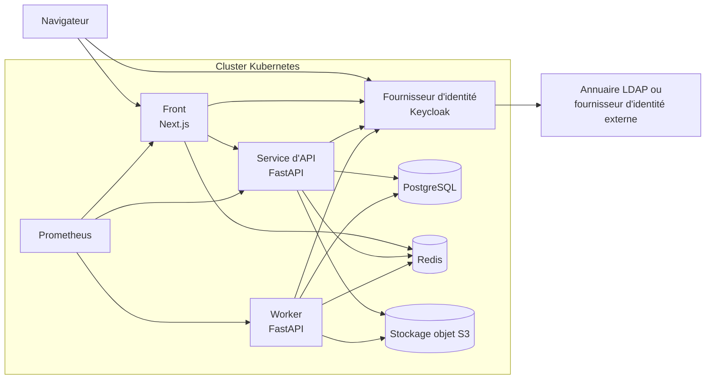
```mermaid
flowchart LR
    Navigateur["Navigateur"]
    subgraph Cluster["Cluster Kubernetes"]
        Front["Front<br>Next.js"]
        API["Service d'API<br>FastAPI"]
        Worker["Worker<br>FastAPI"]
        IdP["Fournisseur d'identité<br>Keycloak"]
        PG[("PostgreSQL")]
        Redis[("Redis")]
        S3[("Stockage objet S3")]
        Prometheus["Prometheus"]
    end
    Annuaire["Annuaire LDAP ou<br>fournisseur d'identité externe"]
    Navigateur --> Front
    Navigateur --> IdP
    Front --> API
    Front --> IdP
    Front --> Redis
    API --> IdP
    API --> PG
    API --> Redis
    API --> S3
    Worker --> PG
    Worker --> Redis
    Worker --> IdP
    Worker --> S3
    IdP --> Annuaire
    Prometheus --> API
    Prometheus --> Worker
    Prometheus --> Front
```

*Figure 18 — Diagramme de déploiement*

### 4.3.2. Tableau des flux techniques

Chaque flux technique porte un identifiant de la forme TFX-nn, stable, sur le modèle des flux fonctionnels du §3.1.2. Le sens est donné du demandeur vers le fournisseur.

| Flux   | Source                       | Destination                                   | Protocole                                                                                   | Authentification                  |
|--------|------------------------------|-----------------------------------------------|---------------------------------------------------------------------------------------------|-----------------------------------|
| TFX-01 | Navigateur                   | Front                                         | HTTPS                                                                                       | Témoin de session du front        |
| TFX-02 | Front                        | Service d’API                                 | HTTPS, REST/JSON selon le contrat (WF-ARC-0060)                                             | Jeton d’accès (WF-ARC-0030)       |
| TFX-03 | Service d’API, worker        | PostgreSQL                                    | Connexion chiffrée                                                                          | Secret de la plateforme           |
| TFX-04 | Front, service d’API, worker | Redis                                         | Connexion chiffrée                                                                          | Secret de la plateforme           |
| TFX-05 | Service d’API, worker        | Stockage objet                                | S3 sur HTTPS                                                                                | Clés d’accès                      |
| TFX-06 | Fournisseur d’identité       | Annuaire LDAP                                 | LDAPS                                                                                       | Compte de service                 |
| TFX-07 | Navigateur                   | Fournisseur d’identité                        | HTTPS, redirections OIDC                                                                    | —                                 |
| TFX-08 | Front, service d’API, worker | Fournisseur d’identité                        | HTTPS : échange du code (front), clés publiques (API), API d’administration (API et worker) | Secret client ; compte de service |
| TFX-09 | Prometheus                   | Front, API, worker                            | HTTP, point /metrics                                                                        | Réseau interne au cluster         |
| TFX-10 | Plateforme                   | Redis                                         | Dépôt en file des tâches planifiées                                                         | Secret de la plateforme           |
| TFX-11 | Fournisseur d’identité       | Fournisseur d’identité externe, annuaire LDAP | HTTPS et OIDC ; LDAPS                                                                       | Secret client ; compte de service |

Tableau 8 Tableau des flux techniques

### 4.3.3. Réalisation des flux fonctionnels

Les flux fonctionnels avec les acteurs (FLX-09 à FLX-18) empruntent tous le même chemin : TFX-01 puis TFX-02, et rien d’autre. Les flux par fichier, eux, se déroulent en deux temps et passent par le worker.

| Flux fonctionnel               | Chemin technique                                                                                                                                                                                                                                |
|--------------------------------|-------------------------------------------------------------------------------------------------------------------------------------------------------------------------------------------------------------------------------------------------|
| FLX-01 Planning entrant        | Dépôt par TFX-02, fichier écrit sur le stockage objet (TFX-05), tâche mise en file (TFX-04), analyse par le worker, compte rendu (WF-INTF-0080), confirmation de l’utilisateur, application en une transaction (TFX-03), suppression du fichier |
| FLX-02 Planning sortant        | Demande par TFX-02, engendrement du fichier par le worker à partir de la révision, transmission à l’utilisateur, aucun stockage (WF-DAT-0120)                                                                                                   |
| FLX-03 Devis entrant           | Comme FLX-01                                                                                                                                                                                                                                    |
| FLX-04 Devis sortant           | Comme FLX-02                                                                                                                                                                                                                                    |
| FLX-05 Reste à engager entrant | Comme FLX-01                                                                                                                                                                                                                                    |
| FLX-06 Reste à engager sortant | Comme FLX-02                                                                                                                                                                                                                                    |
| FLX-07 Coûts réels entrants    | Comme FLX-01, l’application se faisant par insertion ou mise à jour sur le numéro de pièce (WF-DAT-0110)                                                                                                                                        |

Tableau 9 Réalisation des flux fonctionnels

### 4.3.4. Diagrammes de séquence

Deux enchaînements méritent d’être suivis de bout en bout, parce qu’ils engagent plusieurs composants et une décision de l’utilisateur.

**L’import en deux temps.** Le fichier est déposé, analysé, et rien n’est écrit tant que l’utilisateur n’a pas vu le compte rendu et confirmé. L’abandon, comme l’expiration, mène au même endroit que l’application : la suppression du fichier.

<!-- source : figures/import-deux-temps.mmd — régénéré par tools/build.py -->

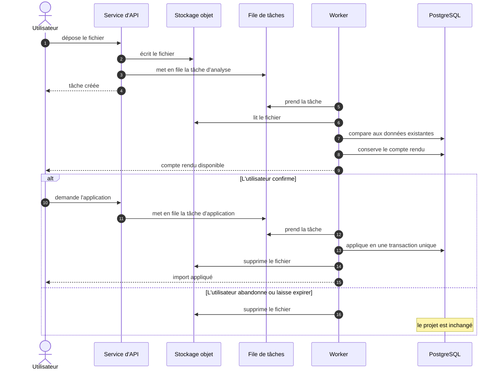
```mermaid
sequenceDiagram
    autonumber
    actor U as Utilisateur
    participant A as Service d'API
    participant S as Stockage objet
    participant F as File de tâches
    participant W as Worker
    participant B as PostgreSQL

    U->>A: dépose le fichier
    A->>S: écrit le fichier
    A->>F: met en file la tâche d'analyse
    A-->>U: tâche créée
    W->>F: prend la tâche
    W->>S: lit le fichier
    W->>B: compare aux données existantes
    W->>B: conserve le compte rendu
    W-->>U: compte rendu disponible
    alt L'utilisateur confirme
        U->>A: demande l'application
        A->>F: met en file la tâche d'application
        W->>F: prend la tâche
        W->>B: applique en une transaction unique
        W->>S: supprime le fichier
        W-->>U: import appliqué
    else L'utilisateur abandonne ou laisse expirer
        W->>S: supprime le fichier
        Note over B: le projet est inchangé
    end
```

*Figure 19 — Diagramme de séquence des imports*

**Le marquage d'une révision.** Les deux écritures se font dans une transaction unique : figer la révision, puis calculer et conserver ses indicateurs (WF-DAT-0040). Si l'une échoue, aucune n'a eu lieu. La révision suivante n'est créée qu'à la demande, ou par le premier import qui survient (WF-REV-0010, WF-INTF-0090), et c'est alors qu'a lieu la copie.

<!-- source : figures/marquage-revision.mmd — régénéré par tools/build.py -->

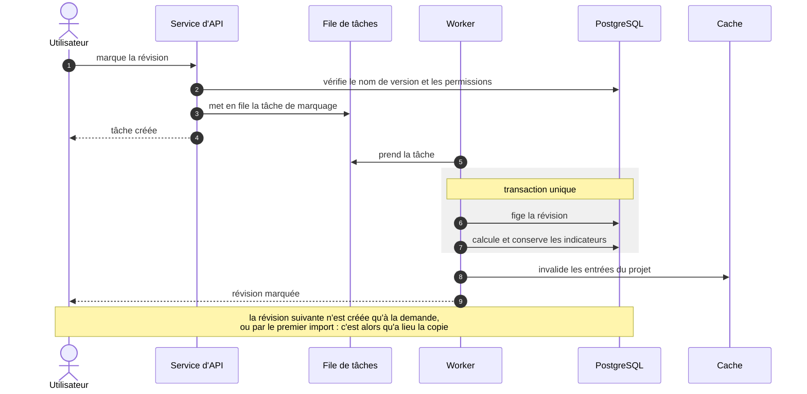
```mermaid
sequenceDiagram
    autonumber
    actor U as Utilisateur
    participant A as Service d'API
    participant F as File de tâches
    participant W as Worker
    participant B as PostgreSQL
    participant C as Cache

    U->>A: marque la révision
    A->>B: vérifie le nom de version et les permissions
    A->>F: met en file la tâche de marquage
    A-->>U: tâche créée
    W->>F: prend la tâche
    rect rgb(240, 240, 240)
        Note over W,B: transaction unique
        W->>B: fige la révision
        W->>B: calcule et conserve les indicateurs
    end
    W->>C: invalide les entrées du projet
    W-->>U: révision marquée
    Note over U,B: la révision suivante n'est créée qu'à la demande,<br/>ou par le premier import : c'est alors qu'a lieu la copie
```

*Figure 20 — Diagramme de séquence du marquage de révision*

```yaml exigence
section: "4.3.4"
id: "WF-ARC-0090-A"
titre: "Traitements longs confiés au worker"
flexibilite: "F0"
fbs: "FBS-4"
pbs: "PBS-2.2, PBS-3.2"
corps: "Les traitements dont la durée dépend du volume des données — analyse et application d’un import, marquage d’une révision, engendrement d’un export, sauvegarde et restauration, lecture des comptes du fournisseur d’identité — sont exécutés par le worker à partir d’une file de tâches, et non dans la requête qui les demande. La requête rend la main en désignant la tâche créée, dont l’utilisateur suit l’avancement et le résultat. Une tâche interrompue est reprise ou échoue sans laisser d’état intermédiaire."
motif: "Le marquage d’une révision de dix mille objets et l’import d’un fichier de dix mille lignes (§4.6.2) ne tiennent pas dans le temps d’une requête : les tenir quand même immobilise une instance, expose aux délais du proxy et à l’abandon du navigateur, et interdit toute reprise. La file donne en prime la reprise après incident, que WF-ARC-0080 exige."
verification: "Le marquage d’une révision de dix mille objets n’immobilise aucune requête au-delà de la création de la tâche, et l’utilisateur en voit l’aboutissement. L’arrêt du worker pendant une tâche laisse la base inchangée, et la tâche est reprise après redémarrage. Aucun de ces traitements n’est joignable par un endpoint qui répondrait après l’avoir exécuté."
```

```yaml exigence
section: "4.3.4"
id: "WF-ARC-0100-A"
titre: "Import en deux temps"
flexibilite: "F0"
fbs: "FBS-4.3.4, FBS-4.4, FBS-4.5, FBS-4.7"
pbs: "PBS-2.2, PBS-3.3"
corps: "Un import se déroule en deux temps séparés par la décision de l’utilisateur. L’analyse lit le fichier, contrôle son format et sa version (WF-INTF-0070), compare son contenu aux données existantes et produit le compte rendu de WF-INTF-0080, sans rien modifier. L’application, demandée depuis ce compte rendu, écrit en une seule transaction. Un compte rendu non confirmé expire sans effet au terme de vingt-quatre heures, et le fichier est supprimé dès que l’import est appliqué, abandonné ou expiré. L'application d'un import revérifie, au moment où elle s'exécute, la permission et la qualité de contributeur de l'utilisateur qui l'a demandée, ainsi que l'état du projet : un import confirmé n'est pas appliqué si l'une de ces conditions a cessé d'être vraie depuis l'analyse."
motif: "Séparer la lecture de l’écriture est ce qui permet à WF-INTF-0080 d’exister : on ne peut présenter un écart avant application que si l’analyse n’a rien appliqué. La transaction unique est ce qui rend vraie la phrase « un import interrompu laisse le projet inchangé ». L’expiration évite qu’un fichier déposé et oublié reste indéfiniment sur le stockage."
verification: "Entre l’analyse et la confirmation, aucune donnée du projet n’a changé. L’interruption de l’application laisse le projet dans son état antérieur. Un compte rendu expiré ne peut plus être appliqué, et son fichier n’est plus sur le stockage objet. Un import confirmé par un utilisateur dont la permission est retirée avant l'exécution n'est pas appliqué, et le refus nomme la condition manquante. Il en va de même si le projet est passé dans un état terminal entre-temps."
```

## 4.4. Données

### 4.4.1. Modèle de données et conventions

Le modèle conceptuel du §3.2 dit ce que sont les objets ; ce paragraphe dit comment ils sont rangés. Le schéma physique lui-même — le DDL — vit dans le dépôt de code, sous forme de migrations (§4.4.6) : la spécification n’en fixe que les conventions et la correspondance avec les objets du §3, de sorte qu’un lecteur du §3 retrouve chaque objet dans une table qui porte son nom.

**Quatre régimes de données.** Toute table appartient à l’un d’eux, et c’est le régime qui fixe ses conventions d’identité, d’audit et de suppression.

- Le **référentiel** : nœuds d’organisation, rôles de ressources, calendriers, natures et catégories de coût, taux horaires, seuils. Commun à tous les projets, jamais supprimé, désactivable (WF-REF-0130).

- La **plateforme** : comptes, rôles d’habilitation, permissions, sauvegardes. Sans lien avec les projets.

- Le **projet** : ce qu’un projet porte en propre et qui ne fait pas partie de ses révisions — le projet lui-même et l’historique de ses états, le lotissement, les sous-projets, les contributeurs, les risques et leurs réexamens, les lignes de coût et le journal des imports, les chronologies et leurs inscriptions.

- Le **révisionné** : ce qu’une révision contient en propre (WF-DAT-0010) — structures de coûts, tâches, liaisons, lignes de devis, valeurs du référentiel employées, indicateurs conservés. Chaque ligne porte l’identifiant de son projet, qui est la clé de partitionnement (WF-DAT-0050), et celui de sa révision.

**Correspondance entre objets et tables.** Le code est écrit en anglais — tables, colonnes, variables, contrat d’API — et le document en français : le tableau ci-dessous est ce qui relie les deux, et c’est la traduction de référence de chaque objet du glossaire. Les tables portent le nom anglais de l’objet, au singulier. Un jalon est une tâche de durée nulle (WF-PLA-0050) : il n’a pas de table. Les valeurs du référentiel employées par une révision sont conservées dans quatre tables images des tables du référentiel — rôle, calendrier, catégorie, taux — rattachées à la révision. L’avatar d’un compte est conservé en base avec lui, et non sur le stockage objet : c’est ce qui le fait entrer dans la sauvegarde. La session du front, elle, vit dans Redis (WF-ARC-0040) et n’est pas sauvegardée : sa perte ne coûte qu’une reconnexion. La taille d'un avatar est bornée par l'application.

| Objet (§3.2, glossaire)                                            | Table                                                              | Régime      |
|--------------------------------------------------------------------|--------------------------------------------------------------------|-------------|
| Nœud d’organisation                                                | org_node                                                           | référentiel |
| Rôle de ressource                                                  | resource_role                                                      | référentiel |
| Calendrier                                                         | calendar                                                           | référentiel |
| Nature de coût                                                     | cost_type                                                          | référentiel |
| Catégorie de coût                                                  | cost_category                                                      | référentiel |
| Taux horaire                                                       | hourly_rate                                                        | référentiel |
| Seuils d’alerte, délai maximal entre revues                        | reference_setting                                                  | référentiel |
| Utilisateur                                                        | user_account                                                       | plateforme  |
| Rôle d’habilitation                                                | access_role                                                        | plateforme  |
| Permission                                                         | permission                                                         | plateforme  |
| Sauvegarde                                                         | backup                                                             | plateforme  |
| Avatar                                                             | attribut de user_account                                           | plateforme  |
| Session du front                                                   | — (Redis, WF-ARC-0040)                                             | plateforme  |
| Projet                                                             | project                                                            | projet      |
| Transition d’état d’un projet (WF-CYC-0130)                        | project_state_transition                                           | projet      |
| Contributeur                                                       | contributor                                                        | projet      |
| Poste, Lot, Livrable                                               | order_item, work_package, deliverable                              | projet      |
| Sous-projet                                                        | subproject                                                         | projet      |
| Risque                                                             | risk                                                               | projet      |
| Réexamen d’un risque (WF-RIS-0010)                                 | risk_review                                                        | projet      |
| Ligne de coût                                                      | cost_line                                                          | projet      |
| Import de coûts réels (WF-CRE-0050)                                | cost_import                                                        | projet      |
| Chronologie, inscription à une chronologie ou au suivi temps/temps | timeline, tracking_entry                                           | projet      |
| Révision                                                           | revision                                                           | projet      |
| Structure de coûts                                                 | cost_structure                                                     | révisionné  |
| Tâche (et jalon)                                                   | task                                                               | révisionné  |
| Liaison                                                            | task_link                                                          | révisionné  |
| Ligne de devis                                                     | estimate_line                                                      | révisionné  |
| Valeurs du référentiel employées                                   | revision_role, revision_calendar, revision_category, revision_rate | révisionné  |
| Indicateurs d’une révision (WF-DAT-0040)                           | revision_indicator                                                 | révisionné  |

Tableau 10 Correspondance entre objets et tables

**Identifiants.** Toute ligne est identifiée par un UUID engendré par le serveur, ordonné dans le temps. Les codes que les utilisateurs connaissent — code projet, code de sous-projet, adresse électronique, numéro de pièce — sont des contraintes d’unicité, jamais des clés : un code se corrige, une clé non. Les objets révisionnés portent en outre leur identifiant de lignée (WF-DAT-0030).

**Audit.** Toute table dont les lignes se modifient porte quatre colonnes : la date de création et son auteur, la date de dernière modification et son auteur. L’auteur est un compte, qui reste référencé après sa désactivation (WF-ADM-0060). Ces colonnes disent qui a touché une ligne en dernier ; le journal des actions irréversibles — marquage, désignation de la référence, sorties du cycle de vie, survenance, exclusion, restauration — relève de la sécurité (§4.6.1) et n’est pas une colonne.

**Suppression.** Trois régimes, et aucun quatrième :

- le référentiel et la plateforme ne suppriment jamais : un objet se désactive (WF-REF-0130, WF-ADM-0060) ;

- le contenu d’une révision en cours se supprime physiquement — une tâche retirée disparaît, avec ses lignes et ses liaisons — et celui d’une révision marquée jamais (WF-DAT-0020) ;

- un objet du régime projet se supprime physiquement tant qu’aucune révision marquée ni aucune ligne de coût ne le référence ; au-delà, il est marqué supprimé et conservé. C’est ce qui donne à WF-PRJ-0050 sa mise en œuvre : un sous-projet auquel des coûts sont imputés n’est pas supprimable, et un sous-projet référencé par une révision marquée ne l’est pas davantage.

**Intégrité.** Toutes les relations des diagrammes du §3.2 sont des clés étrangères déclarées, en refus par défaut : la base n’efface jamais une ligne pour en suivre une autre, sauf à l’intérieur d’une révision en cours, où la suppression d’une tâche entraîne ses lignes et ses liaisons. Les états — du projet, d’une tâche, d’un risque, d’une révision, d’un compte — sont des contraintes de vérification sur des valeurs énumérées, et les unicités que le §3 impose sont déclarées en base. Les montants sont des décimaux à deux chiffres dans la devise unique de l’installation (WF-REF-0140) ; les heures, des décimaux ; le début et la fin d’une tâche, une date sans heure et des heures de travail écoulées ce jour-là ; les dates des pièces, des dates sans heure ; les horodatages, en temps universel.

```yaml exigence
section: "4.4.1"
id: "WF-DAT-0060-A"
titre: "Identifiants"
flexibilite: "F0"
fbs: "FBS-4"
pbs: "PBS-3"
corps: "Toute ligne de la base est identifiée par un UUID engendré par le serveur et ordonné dans le temps. Les codes connus des utilisateurs — code projet, code de sous-projet, adresse électronique, numéro de pièce, nom de version — sont des contraintes d’unicité et jamais des clés. Un identifiant n’est jamais réutilisé."
motif: "Un code se corrige — un code projet mal saisi, une adresse qui change — et une clé ne le peut pas sans propager la correction partout. L’UUID engendré par le serveur rend les identifiants indépendants de l’ordre d’insertion et de l’instance qui insère (§4.1.3) ; l’ordonnancement dans le temps préserve la localité des index."
verification: "La modification du code d’un projet ou de l’adresse d’un compte n’affecte aucune ligne qui les référence. Deux instances des services insérant simultanément ne produisent jamais le même identifiant. Un identifiant n’apparaît dans aucune URL sous une forme séquentielle."
```

```yaml exigence
section: "4.4.1"
id: "WF-DAT-0070-A"
titre: "Colonnes d’audit"
flexibilite: "F0"
fbs: "FBS-4"
pbs: "PBS-3"
corps: "Toute table dont les lignes peuvent être modifiées porte la date de création et son auteur, la date de dernière modification et son auteur. Ces colonnes sont renseignées par les services à chaque écriture, l’auteur étant le compte à l’origine de l’action, ou la plateforme pour un traitement automatique."
motif: "Savoir qui a touché une ligne en dernier est la première question d’un diagnostic, et elle ne doit dépendre d’aucun journal externe. Les actions irréversibles ont en plus leur journal d’audit (§4.6.1) : les colonnes disent l’état, le journal dit l’histoire."
verification: "Après modification d’une tâche par un utilisateur, la ligne porte son compte et l’horodatage de la modification. Une ligne créée par un import porte le compte qui l’a confirmé. Une ligne mise à jour par un traitement automatique porte la plateforme comme auteur."
```

```yaml exigence
section: "4.4.1"
id: "WF-DAT-0080-A"
titre: "Régimes de suppression"
flexibilite: "F0"
fbs: "FBS-4"
pbs: "PBS-3"
corps: "Les objets du référentiel et de la plateforme ne sont jamais supprimés ; ils se désactivent. Le contenu d’une révision en cours se supprime physiquement, celui d’une révision marquée jamais. Un objet du projet — sous-projet, poste, lot, livrable, chronologie, risque — se supprime physiquement tant qu’aucune révision marquée ni aucune ligne de coût ne le référence ; au-delà, il est marqué supprimé, conservé, et n’est plus proposé à la saisie."
motif: "Trois régimes suffisent, et chacun découle du §3 : le référentiel est immuable par désactivation (WF-REF-0130), la révision marquée par construction (WF-DAT-0020), et un objet du projet ne peut disparaître sous une révision qui le cite sans la rendre illisible."
verification: "La suppression d’un sous-projet non référencé le retire de la base. Celle d’un sous-projet référencé par une révision marquée le marque supprimé : la révision l’affiche toujours, la saisie ne le propose plus. Aucune commande ne supprime physiquement un rôle de ressource ou un compte."
```

```yaml exigence
section: "4.4.1"
id: "WF-DAT-0090-A"
titre: "Intégrité déclarée en base"
flexibilite: "F0"
fbs: "FBS-4"
pbs: "PBS-3"
corps: "Toute relation du modèle conceptuel est une clé étrangère déclarée, en refus par défaut ; la suppression en cascade n’est autorisée qu’à l’intérieur d’une révision en cours, d’une tâche vers ses lignes et ses liaisons. Les états sont des contraintes de vérification sur des valeurs énumérées. Les unicités imposées par le §3 — adresse électronique, code projet, code de sous-projet par projet, nom de version par projet, numéro de pièce par projet — sont déclarées en base."
motif: "Une contrainte déclarée est vérifiée quel que soit le chemin d’écriture, y compris celui qu’on n’avait pas prévu. Le refus par défaut est ce qui empêche une suppression d’en entraîner une autre en silence."
verification: "L’insertion d’une ligne de devis référençant une catégorie inexistante est rejetée par la base. L’insertion de deux sous-projets de même code dans un projet est rejetée par la base, avant toute règle des services. La suppression d’une tâche de la révision en cours entraîne ses lignes et ses liaisons, et rien d’autre."
```

```yaml exigence
section: "4.4.1"
id: "WF-DAT-0100-A"
titre: "Types des grandeurs"
flexibilite: "F0"
fbs: "FBS-4"
pbs: "PBS-3"
corps: "Les montants sont des décimaux exacts à deux chiffres après la virgule, dans la devise unique de l’installation, jamais des flottants. Les heures et les quantités sont des décimaux exacts. Les dates des pièces sont des dates sans heure. Le début et la fin d’une tâche sont une date sans heure et un nombre d’heures de travail écoulées ce jour-là, sans fuseau. Les horodatages d’audit et de marquage sont en temps universel. Les pourcentages sont conservés comme des décimaux exacts, non arrondis avant les calculs. Un horodatage s’affiche dans l’heure locale du poste ; une date de planning s’affiche telle quelle."
motif: "Un budget de référence est une somme de milliers de lignes : en flottant, deux sommes des mêmes lignes dans deux ordres différents ne donnent pas le même total, et l’indice de coût diffère entre deux écrans. Les dates sans heure évitent qu’un fuseau ne décale un jalon d’un jour."
verification: "La somme des montants budgétés d’une révision est identique quel que soit l’ordre de sommation. Une tâche planifiée au 30 juin s’affiche au 30 juin sur tout poste client, quel que soit son fuseau. Un montant de 0,10 additionné dix fois donne exactement 1,00. Deux tâches de quatre heures liées fin à début, sur un calendrier de huit heures, commencent et finissent le même jour."
```

### 4.4.2. Historisation et immuabilité des révisions

Le §3 pose qu’une révision est un instantané complet (WF-REV-0030) et qu’une révision marquée ne bouge plus (WF-REV-0020). Ce paragraphe dit comment la base le garantit, et ce que cela coûte.

**Chaque révision possède ses lignes.** Une révision est une ligne de la table des révisions, et tout ce qu’elle contient — structures de coûts, tâches, liaisons, lignes de devis, valeurs du référentiel employées — est un jeu de lignes qui lui appartient en propre, marqué de son identifiant. Il n’y a ni « version courante » partagée entre révisions, ni journal de différences à rejouer : lire une révision, c’est lire ses lignes, et rien d’autre. La création d’une révision en cours copie les lignes de la dernière révision marquée (WF-REV-0010) ; le marquage ne copie rien, il change l’état de la révision ; l’abandon d’une révision en cours supprime ses lignes. La révision en cours et les révisions marquées vivent dans les mêmes tables : une révision en cours est une révision comme une autre, que l’on peut encore modifier.

Ce choix a été fait contre le versionnement ligne à ligne, qui n’aurait conservé que ce qui change entre deux revues. Il coûte de l’espace — dix mille lignes par révision, cent quatre-vingts révisions par projet au plus, de l’ordre du milliard de lignes sur la durée de rétention, soit 150 à 200 Go (§4.6.2) — et il achète la simplicité de tout ce qui lit : une révision se lit par une requête, deux révisions se comparent par une jointure, et aucun indicateur ne dépend d’une reconstitution. Les tables qui portent le contenu des révisions sont partitionnées par projet, parce qu’aucune requête n’a besoin de traverser deux projets à la fois : le portefeuille ne lit que les indicateurs conservés.

**L’immuabilité est tenue par la base, pas seulement par les services.** Le §4.1.2 fait des services l’autorité sur les règles métier, et c’est là que le refus de modifier une révision marquée est d’abord appliqué. Mais une règle qui n’existe que dans le code est à la merci d’une migration, d’un script d’exploitation ou d’un bug : la base refuse elle-même toute modification ou suppression d’une ligne appartenant à une révision marquée. Les seuls attributs d’une révision qui changent après son marquage sont ceux que le §3 désigne : le caractère de référence (WF-REV-0040). Un objet du projet référencé par une révision marquée — un sous-projet, un poste du lotissement — n’est jamais supprimé physiquement.

**Les objets ont une identité qui traverse les révisions.** Une tâche copiée de révision en révision est la même tâche : c’est ce qui permet de comparer deux révisions (WF-REV-0080), de suivre un jalon de revue en revue sur le diagramme temps/temps (WF-IND-0090), et de garder une inscription à une chronologie (WF-PLA-0060). Chaque tâche, ligne de devis et structure porte donc deux identifiants : celui de sa ligne, propre à la révision, et celui de sa lignée, stable d’une révision à l’autre et attribué à sa première création.

**Les indicateurs d’une révision marquée sont calculés une fois.** WF-IND-0010 les fixe à la date de marquage et les rend invariables ; ils sont donc calculés au marquage, dans la même transaction, et conservés avec la révision, par sous-projet et pour le projet. C’est ce qui rend le portefeuille immédiat : une vue sur trois cents projets, ou l’évolution trimestrielle sur vingt ans, lit des indicateurs conservés et ne touche à aucune tâche. Seuls les indicateurs de la révision en cours se recalculent, à la demande, avec le cache du §4.4.5.

```yaml exigence
section: "4.4.2"
id: "WF-DAT-0010-A"
titre: "Copie complète des révisions"
flexibilite: "F0"
fbs: "FBS-4.1"
pbs: "PBS-3"
corps: "Chaque révision possède en propre l’ensemble des lignes qui la décrivent : structures de coûts, tâches, liaisons, lignes de devis et valeurs du référentiel employées, chacune portant l’identifiant de sa révision. La création d’une révision en cours copie ces lignes depuis la dernière révision marquée ; le marquage ne copie rien ; l’abandon d’une révision en cours supprime ses lignes. La révision en cours et les révisions marquées sont conservées dans les mêmes tables."
motif: "Lire une révision doit être une requête, pas une reconstitution : c’est ce dont dépendent la comparaison de deux révisions, le diagramme temps/temps et la relecture d’une offre des années plus tard. Le versionnement ligne à ligne aurait divisé l’espace par le taux de changement entre deux revues, au prix d’une complexité portée par toutes les lectures. Le volume qui en résulte est connu et tenable (§4.6.2)."
verification: "Après marquage d’une révision puis création de la suivante, le nombre de lignes de chaque table portant l’identifiant de la nouvelle révision égale celui de la révision marquée. Une modification dans la révision en cours ne change aucune ligne portant l’identifiant d’une révision marquée. L’abandon d’une révision en cours ne laisse aucune ligne portant son identifiant."
```

```yaml exigence
section: "4.4.2"
id: "WF-DAT-0020-A"
titre: "Immuabilité garantie par la base"
flexibilite: "F0"
fbs: "FBS-4.1"
pbs: "PBS-3"
corps: "La base de données refuse toute modification et toute suppression d’une ligne appartenant à une révision marquée, quel que soit le client qui la tente. Sur la ligne de la révision elle-même, seuls le caractère de référence et les attributs que le §3 déclare modifiables après marquage peuvent changer. Un objet du projet référencé par une révision marquée n’est jamais supprimé physiquement."
motif: "Les services appliquent la règle en premier (§4.1.2), mais une migration, un script d’exploitation ou un défaut du code passent à côté d’eux. L’immuabilité d’une révision marquée est ce sur quoi reposent le budget de référence et tous les indicateurs : elle ne peut dépendre du seul code."
verification: "Une mise à jour ou une suppression exécutée directement en base sur une tâche, une ligne de devis ou une valeur de référentiel d’une révision marquée est rejetée par la base. La désignation d’une révision marquée comme référence aboutit. La suppression physique d’un sous-projet référencé par une révision marquée est rejetée."
```

```yaml exigence
section: "4.4.2"
id: "WF-DAT-0030-A"
titre: "Identité de lignée des objets d’une révision"
flexibilite: "F0"
fbs: "FBS-4.1"
pbs: "PBS-3"
corps: "Chaque structure de coûts, tâche et ligne de devis porte deux identifiants : l’identifiant de sa ligne, propre à la révision, et l’identifiant de sa lignée, attribué à sa première création et conservé par toutes les copies d’une révision à l’autre. La comparaison de deux révisions, le diagramme temps/temps et les inscriptions aux chronologies et au suivi temps/temps s’appuient sur l’identifiant de lignée."
motif: "Sans identité stable, deux révisions ne se comparent que par le libellé des tâches, et un jalon renommé disparaît du diagramme temps/temps. L’identifiant de lignée est ce qui fait qu’une tâche copiée reste la même tâche."
verification: "Une tâche renommée et déplacée dans la révision en cours est rapprochée de la tâche d’origine par la comparaison avec la révision marquée précédente. Un jalon renommé conserve sa courbe sur le diagramme temps/temps. Deux tâches créées séparément n’ont jamais le même identifiant de lignée."
```

```yaml exigence
section: "4.4.2"
id: "WF-DAT-0040-A"
titre: "Conservation des indicateurs des révisions marquées"
flexibilite: "F0"
fbs: "FBS-4.1, FBS-4.8, FBS-2"
pbs: "PBS-3"
corps: "Les indicateurs d’une révision sont calculés à son marquage, dans la transaction qui la marque, et conservés avec elle par sous-projet — ensemble « hors sous-projet » compris — et pour le projet. Une révision marquée avant l'état En cours ne conserve que les indicateurs de devis (FBS-4.4.1) ; les indicateurs projets sont calculés et conservés à partir de l'état En cours, conformément à WF-IND-0010. Ils sont soumis à la même immuabilité que la révision. Les vues du portefeuille et l’historique des indicateurs d’un projet lisent ces valeurs conservées et ne recalculent rien ; seuls les indicateurs de la révision en cours sont calculés à la demande."
motif: "WF-IND-0010 rend les indicateurs d’une révision marquée invariables : les calculer une fois est la conséquence directe. C’est aussi ce qui donne au portefeuille son coût constant, quel que soit le nombre de projets et de révisions qu’il agrège."
verification: "Le marquage d’une révision échoue entièrement si le calcul de ses indicateurs échoue. Une vue de portefeuille à une date passée, sur trois cents projets, ne lit aucune ligne de tâche ni de ligne de devis. Les indicateurs conservés d’une révision marquée sont identiques avant et après un import de coûts réels postérieur. Le marquage d'une offre, sur un projet en chiffrage, aboutit et conserve le total du devis sans aucun indicateur projet."
```

```yaml exigence
section: "4.4.2"
id: "WF-DAT-0050-A"
titre: "Partitionnement par projet"
flexibilite: "F1"
fbs: "FBS-4.1"
pbs: "PBS-3"
corps: "Les tables qui portent le contenu des révisions — structures, tâches, liaisons, lignes de devis, valeurs du référentiel employées — sont partitionnées par projet. Toute requête portant sur un projet ne lit que sa partition."
motif: "Aucune requête n’a besoin de traverser deux projets : le portefeuille lit les indicateurs conservés (WF-DAT-0040), et tout le reste se fait projet par projet. Le partitionnement borne le coût d’une lecture à la taille d’un projet — deux millions de lignes au plus — et non à celle de la plateforme."
verification: "Le plan d’exécution d’une lecture de révision ne parcourt que la partition du projet. La durée de lecture d’une révision est la même sur une plateforme d’un projet et sur une plateforme de six cents projets."
```

### 4.4.3. Idempotence des imports

Deux exigences du §3 demandent qu’un même fichier importé deux fois ne produise pas deux fois ses effets : WF-INTF-0140 pour les coûts réels, par le numéro de pièce, et WF-INTF-0060 pour l’aller-retour MS Project. Ce sont des propriétés du résultat ; elles ne tiennent que si la base les garantit, car un code qui oublie de chercher avant d’insérer produit un doublon que rien ne rattrape ensuite.

Les imports ne se ressemblent pas sur ce point. Le planning, le devis et le reste à engager s’appliquent à la révision en cours (WF-INTF-0090) en rapprochant chaque objet du fichier par l’identifiant que l’export y a écrit : réappliquer le même fichier redonne la même révision, parce qu’une ligne connue est mise à jour et non dupliquée. Les coûts réels, eux, s’accumulent import après import : c’est là qu’une clé naturelle est nécessaire.

```yaml exigence
section: "4.4.3"
id: "WF-DAT-0110-A"
titre: "Idempotence garantie par la base"
flexibilite: "F0"
fbs: "FBS-4.7, FBS-4.3.4"
pbs: "PBS-3.1"
corps: "Une ligne de coût est identifiée par le couple formé du projet et du numéro de pièce, qui porte une contrainte d’unicité en base. L’application d’un import de coûts réels insère ou met à jour sur ce couple, sans jamais créer de doublon, et ne modifie pas l’exclusion du périmètre suivi de la ligne existante (WF-CRE-0030). L’application d’un import de planning, de devis ou de reste à engager s’applique à la révision en cours selon les règles de rapprochement par identifiant de WF-INTF-0040, WF-INTF-0100 et WF-INTF-0120, dans la transaction qui l’applique ; rejouer le même fichier donne la même révision."
motif: "L’idempotence est une propriété qu’un fichier réimporté ne doit pas pouvoir casser, y compris lorsque deux extractions se recouvrent ou que le même fichier est déposé deux fois de suite. Une contrainte d’unicité refuse le doublon même quand le code a oublié de le chercher ; le remplacement, lui, rend la question sans objet pour les trois autres imports."
verification: "Deux imports du même fichier de coûts réels laissent le même nombre de lignes et les mêmes montants, et une ligne exclue le reste. L’insertion directe en base de deux lignes de coût de même projet et de même numéro de pièce est rejetée. Deux imports successifs du même fichier de devis donnent une révision en cours au contenu identique."
```

### 4.4.4. Stockage des fichiers

Le stockage objet ne contient que deux choses, et rien d’autre n’y est déposé : les fichiers en cours d’import, qui y vivent le temps d’un import, et les sauvegardes, qui y vivent le temps de leur rétention. Les exports n’y passent pas : ils sont engendrés à la demande et transmis, une révision étant entièrement décrite en base (§4.6.2).

```yaml exigence
section: "4.4.4"
id: "WF-DAT-0120-A"
titre: "Contenu et purge du stockage objet"
flexibilite: "F0"
fbs: "FBS-1.4, FBS-4.3.4"
pbs: "PBS-3.3"
corps: "Le stockage objet porte deux compartiments : les fichiers en cours d’import et les sauvegardes. Un fichier en cours d’import est supprimé dès que l’import est appliqué, abandonné ou expiré (WF-ARC-0100). Les sauvegardes suivent la rétention de WF-ADM-0170. Aucun autre fichier n’y est conservé, et les exports sont engendrés à la demande sans y être stockés."
motif: "Un stockage dont le contenu n’est pas énuméré grossit sans qu’on sache de quoi, et finit par contenir des données de projet que la sauvegarde de la base ne couvre pas. Les deux seuls contenus légitimes ont chacun leur règle de disparition, ce qui borne l’espace consommé sans intervention."
verification: "Après application ou abandon d’un import, le fichier correspondant n’est plus sur le stockage objet. Un fichier déposé et jamais confirmé disparaît au terme du délai d’expiration. Le même export demandé deux fois est engendré deux fois et n’occupe aucun espace entre les deux."
```

### 4.4.5. Cache

Redis ne porte qu’une chose que l’on peut appeler un cache : les indicateurs de la révision en cours. Elle a la propriété qui définit un cache — son absence se recalcule depuis PostgreSQL, et sa perte ne coûte que du temps (WF-ARC-0040). La session du front vit elle aussi dans Redis, pour une raison voisine : sa perte ne coûte qu’une reconnexion ; les permissions effectives n’ont pas besoin d’être cachées, la jointure qui les produit portant sur quelques centaines de lignes en permanence en mémoire. Reste à dire ce qui invalide le cache, car WF-IND-0010 veut les indicateurs de la révision en cours « au jour courant », donc après la dernière saisie et non avant.

```yaml exigence
section: "4.4.5"
id: "WF-DAT-0130-A"
titre: "Contenu et invalidation du cache"
flexibilite: "F0"
fbs: "FBS-4"
pbs: "PBS-3.2"
corps: "Le cache porte les indicateurs de la révision en cours de chaque projet. Chaque entrée est invalidée par l'écriture dont elle dépend : toute écriture dans une révision en cours invalide ses indicateurs, et le marquage d'une révision invalide les entrées du projet. Une durée de validité borne en outre chaque entrée. Aucune lecture ne sert une valeur devenue fausse par une écriture déjà appliquée."
motif: "Un cache invalidé par le temps seul servirait des indicateurs faux pendant toute sa durée de vie, et un indicateur en retard sur la saisie ferait douter de tous les autres. La durée de validité n’est qu’un filet contre l’invalidation oubliée, jamais le mécanisme principal. Les permissions ne sont pas ici : elles se recalculent à chaque requête, ce qui rend l’application immédiate de WF-ADM-0090 gratuite. La session du front est dans Redis sans être un cache : elle ne se recalcule pas, elle se refait par une reconnexion (WF-ARC-0040)."
verification: "La modification d'une ligne de devis change les indicateurs de la révision en cours à la lecture suivante. Après vidage complet du cache, toutes les valeurs sont recalculées et identiques à celles qu'il portait. L'indisponibilité du cache n'empêche aucune lecture ni aucune saisie."
```

### 4.4.6. Evolution du schéma

Le schéma évolue par migrations versionnées, conservées dans le dépôt avec le code qui les exige et appliquées par Alembic. Deux contraintes les encadrent. La première vient du déploiement sans interruption : pendant une mise à jour, deux versions du code s’exécutent en même temps, et le schéma doit convenir aux deux. La seconde vient du §3 : une révision marquée est immuable, et une migration est un point d’entrée comme un autre — c’est même celui contre lequel WF-DAT-0020 a été écrite.

```yaml exigence
section: "4.4.6"
id: "WF-DAT-0140-A"
titre: "Migrations du schéma"
flexibilite: "F0"
fbs: "FBS-4"
pbs: "PBS-3.1, PBS-5.2"
corps: "Le schéma n’évolue que par des migrations versionnées, ordonnées, appliquées une seule fois et tracées en base. Une migration est compatible avec la version du code en place au moment où elle s’applique comme avec celle qui lui succède, le temps du déploiement. Aucune migration ne supprime ni ne modifie une donnée appartenant à une révision marquée ni un indicateur conservé ; une évolution qui l’exigerait ajoute une donnée nouvelle et laisse l’ancienne en place."
motif: "Une mise à jour sans interruption fait cohabiter deux versions du code sur le même schéma : une migration qui ne conviendrait qu’à la nouvelle casse la précédente pendant le déploiement. Et une migration qui réécrirait une révision marquée réécrirait l’histoire du projet par la seule porte que WF-DAT-0020 ne peut pas fermer, puisque c’est elle qui pose les contraintes."
verification: "Une installation en version N passe en version N+1 sans interruption de service ni perte de données. Une migration déjà appliquée ne se rejoue pas. Après une suite de migrations, les montants et les indicateurs conservés d’une révision marquée antérieure sont inchangés."
```

## 4.5. Modes de fonctionnement techniques

### 4.5.1. Environnement

Quatre environnements, et deux empaquetages pour les servir (WF-ARC-0050). Ce qui change de l'un à l'autre n'est ni le code ni le schéma — ce sont les mêmes images et les mêmes migrations partout — mais l'empaquetage, le dimensionnement, le fournisseur d'authentification et l'origine des données.

| Environnement | Empaquetage                                  | Authentification                                           | Données                                                                   |
|---------------|----------------------------------------------|------------------------------------------------------------|---------------------------------------------------------------------------|
| Développement | Compose, poste du développeur                | Fournisseur d'identité, comptes locaux                     | Jeu de données fictif, engendré                                           |
| Intégration   | Compose, créé et détruit par la chaîne CI/CD | Fournisseur d'identité, comptes locaux                     | Jeu de données fictif, engendré à chaque exécution                        |
| Préproduction | Chart Helm, dimensionnement de la production | Fournisseur d'identité fédérant l'annuaire de l'entreprise | Jeu de référence, ou copie de production dont les comptes sont anonymisés |
| Production    | Chart Helm                                   | Fournisseur d'identité fédérant l'annuaire de l'entreprise | Données réelles                                                           |

Tableau 11 Environnements gérés

Le jeu de données fictif n'est pas un détail d'intendance : il doit couvrir les volumes du §4.6.2 — un projet de mille tâches, cent quatre-vingts révisions marquées, dix-huit mille lignes de coût — sans quoi aucun essai ne dit quoi que ce soit sur le comportement réel.

```yaml exigence
section: "4.5.1"
id: "WF-EXP-0010-A"
titre: "Origine des données des environnements"
flexibilite: "F0"
fbs: "FBS-1"
pbs: "PBS-5.1"
corps: "Les environnements de développement et d'intégration n'emploient que des données engendrées. Une copie des données de production ne peut être installée dans un autre environnement qu'après anonymisation des comptes utilisateurs — noms, prénoms, adresses électroniques et avatars remplacés — et la copie non anonymisée n'existe que dans les sauvegardes et dans l'environnement isolé du test de restauration (WF-EXP-0060)."
motif: "La plateforme porte les noms et les adresses de cinq cents personnes, et le détail des coûts de tous les projets de l'entreprise : une copie posée dans un environnement moins protégé, ouvert à des prestataires ou à des essais, expose l'un et l'autre. Anonymiser les comptes suffit, parce que ce sont eux qui désignent des personnes ; les montants restent nécessaires pour que l'essai ait un sens."
verification: "Aucun environnement hors production ne contient une adresse électronique réelle, hors l'environnement isolé du test de restauration. Le jeu de données des environnements de développement et d'intégration est engendré par un outil du dépôt, sans copie de production."
```

### 4.5.2. Installation initiale

Une installation neuve est vide, et le §3 lui interdit deux choses à la fois : personne ne peut se connecter sans compte, et aucun projet ne peut être créé sans référentiel minimal (WF-CYC-0120). L'installation doit donc amorcer le strict nécessaire — et rien de plus, car le référentiel décrit l'entreprise et Waterfall n'a pas à l'inventer.

Elle crée : le schéma, par application de toutes les migrations (WF-DAT-0140) ; le catalogue des permissions, qui est livré et non modifiable (WF-ADM-0100) ; les trois rôles d'habilitation prédéfinis (WF-ADM-0010) ; un compte administrateur local unique, dont le mot de passe est fixé à la première connexion ; et un calendrier désigné par défaut, que WF-REF-0120 exige d'unique et que WF-CYC-0120 exige pourvu d'heures travaillées. Les natures et catégories de coût, les rôles de ressources, l'arbre d'organisation et les taux restent à saisir.

```yaml exigence
section: "4.5.2"
id: "WF-EXP-0020-A"
titre: "Amorçage d'une installation neuve"
flexibilite: "F0"
fbs: "FBS-1, FBS-3"
pbs: "PBS-5.1"
corps: "L’installation d’une plateforme neuve applique les migrations du schéma, crée le catalogue des permissions, les trois rôles d’habilitation prédéfinis (WF-ADM-0010), un unique compte administrateur local, créé dans le fournisseur d’identité et dans Waterfall, dont le lien de fixation du mot de passe, à usage unique, est produit par l’installation (WF-ADM-0140), un calendrier actif désigné par défaut portant des heures travaillées, une nature de coût de type provision et sa catégorie (WF-REF-0030), et la langue par défaut de l’installation (WF-INTF-0160). Les libellés des objets créés à l’amorçage sont dans la langue par défaut de l’installation, et modifiables ensuite comme tout libellé saisi. Elle ne crée aucun autre objet du référentiel. Relancée sur une plateforme déjà installée, elle n’a aucun effet."
motif: "Sans compte, personne ne peut entrer ; sans calendrier par défaut, WF-CYC-0120 interdit de créer le premier projet et WF-REF-0120 exige qu’il en existe un et un seul ; sans catégorie de provision, aucun risque ne peut être déclaré. Ce sont les seuls amorçages nécessaires. Aller plus loin — inventer des catégories de coût ou des rôles de ressources — imposerait à l’entreprise un vocabulaire qui n’est pas le sien ; la provision est un mécanisme de Waterfall, pas un terme de l’entreprise. Produire le lien de fixation à l’installation évite qu’un mot de passe d’installation traîne dans une procédure, et vaut sur une installation sans messagerie."
verification: "Après installation, un administrateur fixe son mot de passe par le lien produit, se connecte, et dispose des trois rôles prédéfinis et du catalogue des permissions. La création d’un projet est refusée et nomme les prérequis manquants, jusqu’à ce qu’une catégorie de coût de main-d’œuvre et un rôle de ressource aient été saisis. Une seconde exécution de l’installation ne crée ni compte, ni calendrier, ni nature supplémentaire."
```

### 4.5.3. Déploiement et mise à jour

La chaîne CI/CD construit les images, exécute les tests contre une plateforme Compose (WF-ARC-0050), vérifie la conformité des réponses au contrat (WF-ARC-0060) et les frontières entre modules (WF-ARC-0010), puis publie une version. Une version est un ensemble : front, API et worker portent le même numéro, et l'écran d'état l'affiche (WF-ADM-0130).

Une mise à jour se déroule dans un ordre qui n'est pas indifférent : les migrations d'abord, puisqu'elles sont compatibles avec la version en place comme avec la suivante (WF-DAT-0140), les processus ensuite, un à un. Le retour arrière porte sur le code, jamais sur le schéma : une migration ne se défait pas, et c'est précisément pourquoi elle doit convenir aux deux versions.

```yaml exigence
section: "4.5.3"
id: "WF-EXP-0030-A"
titre: "Mise à jour sans interruption"
flexibilite: "F1"
fbs: "FBS-1"
pbs: "PBS-5.1, PBS-5.2"
corps: "Une mise à jour applique d'abord les migrations du schéma, puis remplace les instances du front, de l'API et du worker une à une, sans interruption du service. Le front, l'API et le worker d'une installation portent toujours le même numéro de version, affiché par l'écran d'état du système. Un retour arrière rétablit la version précédente du code sans défaire les migrations."
motif: "Cinquante utilisateurs répartis sur la journée n'ont pas de fenêtre d'arrêt naturelle, et une mise à jour qui interrompt le service est une mise à jour qu'on reporte. Remplacer les instances une à une n'est possible que parce que les services sont sans état (WF-ARC-0080) et que les migrations conviennent aux deux versions (WF-DAT-0140). Le retour arrière du seul code est la conséquence de ce choix, et il faut l'écrire pour que personne ne compte sur un retour arrière du schéma."
verification: "Une mise à jour de la version N à la version N+1 s'exécute sans qu'aucune requête n'échoue et sans qu'aucun utilisateur ne soit déconnecté. L'écran d'état affiche la même version pour les trois processus. Un retour arrière vers la version N s'exécute sur le schéma de la version N+1."
```

### 4.5.4. Modes dégradés

La perte d'un composant ne doit pas devenir la perte de la plateforme. Le tableau ci-dessous dit ce qui reste possible, et c'est lui qui justifie deux choix faits ailleurs : que PostgreSQL soit la seule source de vérité (WF-ARC-0040), et que le fournisseur d'identité soit livré avec la plateforme et non confié à un tiers (WF-ARC-0030).

| Composant indisponible | Ce qui continue                                                                                         | Ce qui s'arrête                                                                                        |
|------------------------|---------------------------------------------------------------------------------------------------------|--------------------------------------------------------------------------------------------------------|
| PostgreSQL             | Rien                                                                                                    | Tout ; le service annonce l'indisponibilité au lieu de répondre partiellement                          |
| Redis                  | La consultation et la saisie, les indicateurs de la révision en cours étant recalculés à chaque requête | La prise de nouvelles tâches ; les sessions du front, que les utilisateurs rouvrent en se reconnectant |
| Stockage objet         | Tout le reste                                                                                           | Les imports, les exports et les sauvegardes                                                            |
| Worker                 | La consultation et la saisie ; les tâches s'accumulent en file sans perte                               | L'aboutissement des imports, des marquages, des exports et des sauvegardes                             |
| Fournisseur d'identité | Les connexions en cours, jusqu'à l'expiration de leur jeton d'accès                                     | Toute connexion et tout renouvellement de jeton, pour tous les comptes ; la lecture des comptes        |
| Annuaire d'entreprise  | Tout, pour les comptes locaux et les connexions en cours                                                | La connexion des comptes de l'annuaire ; leur synchronisation                                          |
| Prometheus             | Tout                                                                                                    | Les métriques de l'écran d'état et les alertes                                                         |

Tableau 12 Modes dégradés

```yaml exigence
section: "4.5.4"
id: "WF-EXP-0040-A"
titre: "Comportement en mode dégradé"
flexibilite: "F0"
fbs: "FBS-1"
pbs: "PBS-2.1, PBS-2.2"
corps: "L'indisponibilité d'un composant ne produit ni écriture partielle ni perte de donnée. Une action qui ne peut aboutir est refusée en nommant le composant indisponible et ce qui reste possible ; elle n'est jamais présentée comme réussie. Une tâche non prise reste en file et s'exécute au rétablissement. L'écran d'état du système signale chaque composant indisponible."
motif: "Un échec silencieux est pire qu'un refus : l'utilisateur croit son import appliqué et ne le vérifie pas. Nommer le composant en cause permet à l'exploitant d'agir sans lire les journaux, et dire ce qui reste possible évite que tout le monde s'arrête parce qu'une fonction sur dix est tombée. La file qui conserve les tâches est ce qui rend l'arrêt du worker sans conséquence."
verification: "Pendant l'arrêt du stockage objet, une demande d'import est refusée en nommant le composant, et la consultation comme la saisie continuent. Pendant l'arrêt du worker, un marquage demandé aboutit après le rétablissement, sans nouvelle demande. Aucune donnée partiellement écrite ne subsiste après le rétablissement d'un composant tombé en cours d'écriture."
```

## 4.6. Exigences transverses

### 4.6.1. Sécurité

Quatre sujets, dont trois sont l'application technique de règles déjà posées par le §3 — l'authentification (WF-ADM-0140, WF-ADM-0180, WF-ARC-0030), les permissions (WF-ADM-0100, WF-ADM-0110) et leur évaluation par le serveur (WF-ARC-0070). Ce paragraphe ne les répète pas : il ajoute ce qui n'appartient qu'à la technique — le transport et les secrets, la session, et le journal d'audit.

Un mot des données personnelles. Waterfall ne conserve d'une personne que son nom, son prénom, son adresse électronique et son avatar, et ne suit ni son activité ni son temps de travail : il planifie par rôle de ressource, jamais par personne nommée, ce que le périmètre exclu du §2.2 pose déjà. Un compte ne se supprime pas (WF-ADM-0060), parce que ses actes doivent rester attribuables ; une demande d'effacement se traite donc en remplaçant l'identité par un libellé neutre, ce qui laisse l'attribution intacte et ne dit plus qui c'était.

```yaml exigence
section: "4.6.1"
id: "WF-SEC-0010-A"
titre: "Transport et secrets"
flexibilite: "F0"
fbs: "FBS-1"
pbs: "PBS-5.1"
corps: "Tout échange est chiffré : entre le navigateur et la plateforme, entre le front et l'API, et entre les services et les composants de données, conformément au tableau des flux techniques. Aucun secret — mot de passe de base, clé du stockage objet, secret client du fournisseur d'identité — ne figure dans le dépôt, dans une image de conteneur ; ils sont injectés par la plateforme d'exploitation au démarrage."
motif: "Un échange en clair à l'intérieur d'un cluster reste un échange en clair, et les données de coûts de tous les projets d'une entreprise valent d'être protégées de bout en bout. Un secret dans une image est un secret publié : il survit dans l'historique du dépôt et dans le registre, longtemps après avoir été changé."
verification: "Aucune connexion en clair n'est acceptée par un composant de la plateforme. Une recherche des secrets connus dans le dépôt, les images publiées et les journaux ne les trouve pas. Le démarrage d'un service sans les secrets attendus échoue en le disant, plutôt que de démarrer sans."
```

```yaml exigence
section: "4.6.1"
id: "WF-SEC-0020-A"
titre: "Session et révocation"
flexibilite: "F0"
fbs: "FBS-1.1"
pbs: "PBS-2.5, PBS-5.4"
corps: "L'authentification produit un jeton d'accès et un jeton de rafraîchissement (WF-ARC-0030). Le jeton d'accès vit au plus cinq minutes ; le jeton de rafraîchissement expire au terme de douze heures, et après deux heures sans activité. La désactivation du compte, le retrait de tous ses rôles et la déconnexion demandée par l'utilisateur prennent effet à la requête suivante, sur tous ses postes : l'état du compte et ses rôles sont lus dans Waterfall à chaque requête, et le fournisseur d'identité révoque ses jetons. Une session expirée mène à l'écran de connexion ; la connexion refaite ramène à l'écran visé."
motif: "WF-ADM-0060 veut qu'un compte désactivé ne puisse plus agir ; lire son état à chaque requête, et non dans le jeton, rend la désactivation effective au moment où l'administrateur la décide, et non à l'expiration du jeton. Les deux délais sont ceux d'une journée de travail."
verification: "La désactivation d'un compte connecté sur deux postes interrompt les deux à leur requête suivante. Un jeton de rafraîchissement inactif au-delà de deux heures est refusé, et l'utilisateur est ramené à l'écran de connexion puis, reconnecté, à l'écran visé. Un utilisateur qui se déconnecte ne peut plus agir avec ses jetons."
```

```yaml exigence
section: "4.6.1"
id: "WF-SEC-0030-A"
titre: "Journal d'audit des actions irréversibles ou structurantes"
flexibilite: "F0"
fbs: "FBS-1.5"
pbs: "PBS-3.1, PBS-4.2"
corps: "Chaque action irréversible ou structurante est inscrite dans un journal d'audit : le marquage d'une révision, la désignation de la révision de référence, la contractualisation d'un avenant, la déclaration d'un risque survenu, la sortie du cycle de vie d'un projet, l'exclusion ou la réintégration d'une ligne de coût, l'application d'un import, la création et la modification des comptes, des rôles et de leurs attributions, la sauvegarde et la restauration. Chaque inscription porte la date, l'auteur, l'objet concerné et le projet s'il y en a un. Le journal n'est ni modifiable ni supprimable depuis la plateforme, et il est conservé aussi longtemps que les projets."
motif: "Ce sont les actions dont la trace est demandée après coup, quand un budget de référence n'est pas celui qu'on croyait ou qu'une ligne de coût a disparu du périmètre suivi. Les colonnes d'audit (WF-DAT-0070) disent qui a touché une ligne en dernier ; elles ne disent pas l'histoire, et une ligne écrasée efface la précédente. Un journal que la plateforme peut réécrire ne prouve rien. Le journal d'audit ne remplace pas le journal des imports de WF-CRE-0050 : celui-ci est une donnée du projet, consultable avec ses coûts réels, celui-là une trace d'exploitation que la plateforme ne peut pas réécrire."
verification: "Chacune des actions énumérées produit une inscription datée et attribuée. Aucun écran ni endpoint ne permet de modifier ou de supprimer une inscription. Le journal d'un projet terminé depuis cinq ans est toujours consultable."
```

### 4.6.2. Performance et volumétrie

Ce paragraphe fixe les hypothèses de dimensionnement de la plateforme. Ce ne sont pas des exigences : ce sont les nombres sur lesquels les choix du §4 sont faits, et contre lesquels ils se vérifient. Une installation qui s’en écarte d’un facteur deux doit fonctionner ; au-delà, l’architecture est à revoir.

**Hypothèses d’entreprise**

| Grandeur                                           | Hypothèse                                                                                                |
|----------------------------------------------------|----------------------------------------------------------------------------------------------------------|
| Projets en portefeuille (en cours et en chiffrage) | 300                                                                                                      |
| Projets créés par an                               | 30                                                                                                       |
| Durée d’un chiffrage                               | 1 an                                                                                                     |
| Durée d’exécution d’un projet                      | 10 ans, 15 au plus (WF-PLA-0150)                                                                         |
| Tâches par projet, toutes structures               | 1 000 dans la structure principale ; 30 risques portant chacun un devis propre d’une vingtaine de tâches |
| Lignes de devis par tâche                          | 5                                                                                                        |
| Sous-projets par projet                            | 10                                                                                                       |
| Rythme des revues                                  | mensuel, pendant toute l’exécution                                                                       |
| Lignes de coût réel par projet et par mois         | 100                                                                                                      |
| Nœuds d’organisation                               | 40                                                                                                       |
| Rôles de ressources                                | 150                                                                                                      |
| Catégories de coût                                 | 200                                                                                                      |
| Années de taux horaires conservées                 | 15                                                                                                       |
| Comptes utilisateurs                               | 500                                                                                                      |
| Utilisateurs connectés simultanément               | 50                                                                                                       |
| Contributeurs par projet                           | 50                                                                                                       |
| Taille d’un fichier MS Project importé             | 10 Mo                                                                                                    |
| Conservation des fichiers importés                 | le temps de l’import, puis suppression                                                                   |
| Rétention des projets terminés                     | 20 ans, sans purge                                                                                       |

Tableau 13 Hypothèses de volumétrie

**Volumes qui en découlent**

Les ordres de grandeur ci-dessous sont arrondis vers le haut.

| Volume                                                      | Par projet                   | Sur la plateforme                                                                                                           |
|-------------------------------------------------------------|------------------------------|-----------------------------------------------------------------------------------------------------------------------------|
| Objets d’une révision (tâches et lignes, toutes structures) | 10 000                       | —                                                                                                                           |
| Révisions marquées                                          | 130 typiquement, 180 au plus | 36 millions d’objets-versions créés par an ; de l’ordre du milliard sur vingt ans si chaque révision est une copie complète |
| Lignes de coût réel                                         | 18 000 au plus               | 360 000 par an ; 11 millions sur vingt ans                                                                                  |
| Projets conservés                                           | —                            | 600 sur vingt ans                                                                                                           |
| Inscriptions de contributeurs                               | 50                           | 15 000                                                                                                                      |
| Valeurs de référentiel conservées par révision              | 350                          | négligeable                                                                                                                 |
| Fichiers en transit (imports en cours)                      | 1                            | quelques dizaines, quelques centaines de Mo au plus                                                                         |
| Marquages de révisions                                      | 1 par mois                   | 300 par mois, concentrés sur la semaine de revue : une dizaine par heure ouvrée au pic                                      |

Tableau 14 Volume de données

Le volume qui commande l’architecture est celui des révisions : un projet de quinze ans revu chaque mois produit cent quatre-vingts instantanés de dix mille objets. Tout le reste tient dans une base ordinaire sans précaution particulière.

**Objectifs de temps de réponse**

Mesurés sur le jeu de données de référence (WF-QUA-0040), aux volumes ci-dessus, avec cinquante utilisateurs actifs simultanément.

| Opération                                                                     | Objectif |
|-------------------------------------------------------------------------------|----------|
| Ouvrir une grille de planning, de devis ou de reste à engager de mille tâches | 1 s      |
| Recalculer dates, chemin critique et totaux après une saisie dans une grille  | 1 s      |
| Afficher les indicateurs de la révision en cours d'un projet                  | 1 s      |
| Afficher une vue de portefeuille sur trois cents projets                      | 2 s      |
| Marquer une révision de dix mille objets                                      | 1 min    |
| Analyser puis appliquer un import de dix-huit mille lignes de coût            | 5 min    |
| Engendrer l'export d'un planning de mille tâches                              | 30 s     |

Tableau 15 Objectifs de temps de réponse

Les trois premières sont les seules qui se paient en attente devant un écran : ce sont elles qui font qu'un outil de chiffrage est utilisable ou non. Les trois dernières sont des tâches de fond (WF-ARC-0090) : leur durée se suit, elle ne bloque personne.

### 4.6.3. Observabilité

L'observabilité sert deux lecteurs. L'exploitant, qui veut savoir si la plateforme fonctionne : c'est l'écran d'état du système (WF-ADM-0130), et il ne montre que ce que les composants exposent. Et celui qui cherche pourquoi une action s'est mal passée : c'est le journal, et il ne sert à rien s'il ne permet pas de suivre une requête d'un composant à l'autre.

```yaml exigence
section: "4.6.3"
id: "WF-OBS-0010-A"
titre: "Métriques exposées"
flexibilite: "F0"
fbs: "FBS-1.3"
pbs: "PBS-4.1"
corps: "Chaque composant expose ses métriques au format Prometheus : pour le front et l'API, le nombre, la durée et le taux d'erreur des requêtes ; pour le worker, le nombre de tâches en file, l'âge de la plus ancienne, la durée et le taux d'échec des tâches par nature ; pour les composants de données, la disponibilité, l'espace utilisé et disponible. L'écran d'état du système ne présente que des valeurs issues de ces métriques."
motif: "L'écran d'état de WF-ADM-0130 promet la disponibilité de chaque composant, l'espace de stockage et les alertes en cours : il faut que quelque chose les produise. L'âge de la plus ancienne tâche en file est la métrique qui distingue un worker lent d'un worker arrêté, et c'est celle dont l'exploitant a besoin avant que les utilisateurs ne le signalent."
verification: "Chaque composant répond sur son point de métriques. L'arrêt du worker fait croître l'âge de la plus ancienne tâche en file, et cette croissance est visible sur l'écran d'état. Chaque valeur de l'écran d'état se retrouve dans une métrique."
```

```yaml exigence
section: "4.6.3"
id: "WF-OBS-0020-A"
titre: "Journaux structurés et corrélation"
flexibilite: "F0"
fbs: "FBS-1.3"
pbs: "PBS-4.2"
corps: "Les services écrivent des journaux structurés, dont chaque enregistrement porte un identifiant de corrélation, l'auteur de l'action, le projet concerné s'il y en a un, et le niveau de gravité. L'identifiant de corrélation est engendré à l'entrée de la plateforme, transmis au worker par la tâche qu'il déclenche, et repris dans le message d'erreur présenté à l'utilisateur. Aucun journal ne contient de mot de passe, de jeton de session ni de secret."
motif: "Un incident traverse le front, l'API, la file et le worker : sans identifiant commun, le reconstituer demande de rapprocher des horodatages, ce qui ne se fait pas sur une plateforme active. Donner cet identifiant à l'utilisateur dans le message d'erreur est ce qui permet à un signalement d'être exploitable du premier coup."
verification: "Un import échoué peut être suivi du dépôt du fichier à l'échec de la tâche par un seul identifiant, que le message présenté à l'utilisateur contient. Une recherche des secrets et des jetons connus dans les journaux ne les trouve pas."
```

```yaml exigence
section: "4.6.3"
id: "WF-OBS-0030-A"
titre: "Alertes"
flexibilite: "F0"
fbs: "FBS-1.3"
pbs: "PBS-4.3"
corps: "Des alertes sont déclenchées sur les situations qui ont une conséquence pour les utilisateurs : indisponibilité d'un composant, file de tâches qui ne se vide plus, échec d'une sauvegarde planifiée (WF-ADM-0170), échec d'une synchronisation de l'annuaire, espace de stockage proche de la saturation, taux d'erreur anormal. Chaque alerte en cours est présentée sur l'écran d'état du système, avec sa date d'apparition."
motif: "Une alerte qui ne correspond à aucune conséquence pour un utilisateur finit par être ignorée, et emporte les autres avec elle. Les six situations retenues sont celles qu'un exploitant doit traiter le jour même, et ce sont aussi celles que l'écran d'état a promis de montrer."
verification: "L'arrêt d'un composant, l'échec d'une sauvegarde planifiée et la saturation du stockage produisent chacun une alerte visible sur l'écran d'état. Une alerte disparaît de l'écran dès que sa cause a cessé."
```

### 4.6.4. Sauvegarde et reprise

Le §3.4.2.4 dit ce qu'un administrateur voit d'une sauvegarde et ce qu'il en fait. Restent trois questions qui n'appartiennent qu'à l'exploitation : ce qu'on accepte de perdre, en combien de temps on redémarre, et comment on sait que les sauvegardes sont restaurables. La troisième est la seule qui se démontre.

```yaml exigence
section: "4.6.4"
id: "WF-EXP-0050-A"
titre: "Perte maximale et délai de reprise"
flexibilite: "F0"
fbs: "FBS-1.4"
pbs: "PBS-5.1"
corps: "La perte de données maximale acceptée en cas de sinistre est de vingt-quatre heures, garantie par une sauvegarde planifiée quotidienne (WF-ADM-0170) copiée hors de la plateforme. Le délai de remise en service à partir d'une sauvegarde est de quatre heures au plus, y compris le déploiement d'une plateforme neuve. Les sauvegardes sont conservées hors de la plateforme selon une rétention au moins égale à celle configurée sur la plateforme."
motif: "Vingt-quatre heures de perte représentent une journée de saisie de cinquante utilisateurs, et les revues étant mensuelles, cette journée se reconstitue à partir des fichiers d'origine et des dernières révisions marquées. Descendre plus bas exigerait un archivage continu, donc un autre niveau d'exploitation, pour un gain que le rythme mensuel des revues ne justifie pas. La copie hors plateforme est ce qui distingue une sauvegarde d'une réplique."
verification: "Vérifiée en recette. Une sauvegarde planifiée quotidienne existe, et sa copie hors plateforme est vérifiée. Un exercice de reprise à partir d’une sauvegarde, sur une plateforme neuve, aboutit en moins de quatre heures. Les données perdues lors de l’exercice sont celles postérieures à la dernière sauvegarde, et pas davantage."
```

```yaml exigence
section: "4.6.4"
id: "WF-EXP-0060-A"
titre: "Test de restauration périodique"
flexibilite: "F0"
fbs: "FBS-1.4"
pbs: "PBS-5.1"
corps: "Une sauvegarde est restaurée périodiquement, au moins une fois par mois, dans un environnement isolé créé pour l'occasion et détruit à la fin du test. Le test vérifie que la plateforme démarre, que le nombre de projets, de révisions marquées, de lignes de coût et de comptes du fournisseur d'identité correspond à celui de la sauvegarde, et que les indicateurs conservés d'un échantillon de révisions marquées sont inchangés. Le résultat du test et sa date sont conservés et présentés à l'exploitant. Aucun utilisateur ne se connecte à cet environnement."
motif: "La vérification qui suit la production d'une sauvegarde (WF-ADM-0150) dit que le fichier est lisible ; elle ne dit pas qu'il est restaurable, ni que ce qu'il contient est complet. Seule une restauration le démontre, et une restauration qu'on ne fait qu'en cas de sinistre se fait pour la première fois le plus mauvais jour. L'isolement et la destruction de l'environnement sont ce qui permet ce test malgré WF-EXP-0010."
verification: "Vérifiée en recette. Un test de restauration mensuel est exécuté, et son résultat daté est consultable. Le test échoue et le signale si le nombre de projets restaurés diffère de celui de la sauvegarde. L’environnement du test n’est joignable par aucun utilisateur et n’existe plus après le test."
```

### 4.6.5. Compatibilité

Trois compatibilités engagent Waterfall : celle des navigateurs, qui conditionne l'accès ; celle des formats d'échange, déjà fixée par le §3 (WF-INTF-0040 pour le format XML de MS Project des versions 2010 et suivantes, WF-INTF-0070 pour les formats Excel de l'annexe B) ; et celle des composants d'infrastructure, qu'il faut annoncer puisque l'exploitant peut fournir les siens (WF-ARC-0050).

```yaml exigence
section: "4.6.5"
id: "WF-CMP-0010-A"
titre: "Navigateurs et affichage"
flexibilite: "F0"
fbs: "FBS-4"
pbs: "PBS-1.1"
corps: "L'application web fonctionne sur les deux dernières versions majeures de Chrome, Edge, Firefox et Safari. Les écrans de saisie, les grilles et le diagramme de Gantt sont utilisables à partir d'une largeur d'affichage de 1366 points et conçus pour 1920. Les vues d'indicateurs de projet et de portefeuille sont consultables à partir d'une largeur de 360 points, sur téléphone comme sur tablette, où elles ne proposent aucune saisie. Aucune installation sur le poste, aucune extension et aucun greffon ne sont exigés."
motif: "Consulter un indice de coût, une courbe ou l'état d'un portefeuille depuis un téléphone, en réunion ou en déplacement, est un usage réel ; y saisir un devis n'en est pas un."
verification: "Vérifiée en recette pour Safari et les terminaux mobiles. Les grilles, le diagramme de Gantt et les courbes s’affichent et s’utilisent sur chacun des quatre navigateurs, dans leurs deux dernières versions majeures, à 1366 points de large. Les vues d’indicateurs se lisent sur un écran de 360 points de large et n’y proposent aucune saisie. Aucune fonction n’exige une installation sur le poste."
```

```yaml exigence
section: "4.6.5"
id: "WF-CMP-0020-A"
titre: "Composants d'infrastructure exigés"
flexibilite: "F0"
fbs: "FBS-1"
pbs: "PBS-3, PBS-5.1"
corps: "Waterfall exige PostgreSQL dans une version au moins égale à 15, Redis dans une version au moins égale à 7, un stockage compatible avec l'interface S3, Keycloak dans une version au moins égale à 26 comme fournisseur d'identité, et, pour le déploiement par chart, Kubernetes dans une version au moins égale à 1.27. Pour le déploiement par Compose, un moteur de conteneurs compatible avec la spécification Compose v2, et une machine de quatre cœurs et huit gigaoctets de mémoire pour la plateforme entière, composants de données compris. Le chart ne dépend d'aucune distribution particulière de Kubernetes ni d'aucun greffon propre à un hébergeur. La version de chaque composant employé est présentée sur l'écran d'état du système."
motif: "L'exploitant fournit le plus souvent ses propres bases et son propre stockage (WF-ARC-0050) : il doit savoir ce qu'il doit fournir avant de s'engager. Le partitionnement des tables (WF-DAT-0050) et les contraintes du §4.4 supposent une version récente de PostgreSQL. Ne dépendre d'aucune distribution est ce qui permet d'installer sur le cluster existant plutôt que d'en réclamer un."
verification: "Le déploiement échoue en le disant si un composant est d'une version antérieure à celle exigée. Le chart s'installe sur deux distributions de Kubernetes différentes sans modification. L'écran d'état présente la version de chaque composant. Le déploiement par Compose aboutit sur une machine conforme à ces caractéristiques."
```

```yaml exigence
section: "4.6.5"
id: "WF-CMP-0030-A"
titre: "Fonctionnement sur réseau isolé"
flexibilite: "F0"
fbs: "FBS-1"
pbs: "PBS-5.1, PBS-5.4"
corps: "Waterfall s'installe, fonctionne et se met à jour sur un réseau sans accès à Internet. Aucun de ses composants, fournisseur d'identité compris, n'émet de flux hors du réseau de l'installation : ni police, ni script, ni icône chargés depuis un réseau de diffusion, ni télémétrie, ni vérification de mise à jour. Les images se chargent depuis un registre interne, les courriels partent par un serveur de messagerie interne, les certificats peuvent être émis par une autorité interne, et l'heure vient d'un serveur de temps interne. Sans serveur de messagerie, la réinitialisation d’un mot de passe se fait par le lien qu’un utilisateur habilité obtient depuis Waterfall (WF-ADM-0140)."
motif: "Les entreprises visées hébergent souvent leurs outils de pilotage sur des réseaux fermés : ils portent les coûts de toutes leurs affaires. Un seul flux sortant suffit à interdire une installation, et c'est au choix de chaque dépendance qu'il s'introduit : l'écrire est ce qui le fait chercher."
verification: "Vérifiée en recette. La plateforme s’installe depuis un registre interne et passe les tests de bout en bout sur un réseau dont tout flux sortant est bloqué, sans erreur ni attente. Aucun composant ne tente de connexion hors du réseau de l’installation pendant ces tests. Une plateforme dont les certificats sont émis par une autorité interne fonctionne."
```

## 4.7. Qualité et vérification

Le reste de ce chapitre dit ce que la plateforme doit faire ; ce paragraphe dit comment on saura qu'elle le fait. Il ne nomme aucun outil : un outil se remplace, et la propriété qu'il garantit ne doit pas se remplacer avec lui. L'outillage retenu est en annexe C, à titre informatif.

La spécification porte déjà son plan de recette, et c'est son principal actif de vérification : les champs Vérif de ce document sont autant de conditions observables, et une trentaine d'entre eux portent des exemples chiffrés — « Deux projets de valeur acquise 100 et 1 000, de coût réel 200 et 1 000, donnent un indice de coût de portefeuille de 0,917 », « les projections valent 1 100 au budget, 1 050 pour le chef de projet et 1 250 au rythme constaté ». Ces nombres ont été calculés une fois, à l'écriture ; les recalculer dans un test est mécanique, et c'est ce qui rend la spécification exécutable.

```yaml exigence
section: "4.7"
id: "WF-QUA-0010-A"
titre: "Traçabilité des exigences par les tests"
flexibilite: "F0"
fbs: "FBS-4"
pbs: "PBS-5.2"
corps: "Chaque exigence F0 est couverte par au moins un test automatisé qui la cite par son identifiant. Une exigence F0 dont la vérification exige un environnement, un logiciel ou une durée que la chaîne ne fournit pas porte la mention « Vérifiée en recette » en tête de son champ Vérif ; elle est couverte par un procès-verbal de recette versionné avec le code, daté et cité par son identifiant, que le rapport de couverture présente à la place d’un test. La chaîne CI/CD produit à chaque exécution un rapport de couverture des exigences, qui liste les exigences couvertes et celles qui ne le sont pas, et le publie avec la version. La publication d’une version est refusée s’il reste une exigence F0 sans test, ou dont le procès-verbal est absent ou antérieur à la version précédente de l’exigence."
motif: "Une exigence sans test est une intention : rien ne dira le jour où elle cesse d'être tenue. Citer l'identifiant dans le test est ce qui rend le lien mécanique et le rapport calculable, plutôt que déclaratif. Bloquer à la publication et non à chaque exécution laisse le développement avancer par tranches, tout en garantissant qu'aucune version livrée ne contient d'exigence non vérifiée. Les exigences F1 et F2 échappent à la règle : leur respect est souhaité, non garanti, et exiger un test de ce qui peut ne pas être fait n'aurait pas de sens."
verification: "Le rapport de couverture cite chacune des exigences F0 du document, avec les tests ou le procès-verbal qui la couvrent. Le retrait d’un test fait apparaître son exigence parmi les non couvertes. Une tentative de publication avec une exigence F0 non couverte, ou dont le procès-verbal est périmé, échoue en la nommant."
```

```yaml exigence
section: "4.7"
id: "WF-QUA-0020-A"
titre: "Les exemples chiffrés du document sont des cas de test"
flexibilite: "F0"
fbs: "FBS-4"
pbs: "PBS-2.3, PBS-5.2"
corps: "Chaque exemple chiffré figurant dans un champ Vérif est repris comme cas de test du noyau métier, avec les mêmes données d'entrée et les mêmes valeurs attendues. Les calculs concernés — dates et chemin critique, montants et inflation, reste à engager, provisions, valeur acquise, indices et projections, agrégations de portefeuille — sont testés unitairement, sans base de données ni interface."
motif: "Ces nombres ont été établis en écrivant les exigences, et ils encodent les décisions qui ont coûté le plus cher : un budget de référence qui ne se rebase pas, une provision figée à la valeur de la révision de référence, un indice de portefeuille qui est un rapport de sommes et non une moyenne. Un test qui les rejoue empêche qu'une réécriture du calcul les défasse sans que personne ne le voie. Les éprouver sans base ni interface les rend rapides, donc exécutés à chaque modification."
verification: "Pour chacun des exemples chiffrés du document, un test porte les mêmes entrées et attend la même valeur. La modification d'une constante de calcul fait échouer au moins un de ces tests. Leur exécution complète ne demande ni base de données ni navigateur."
```

```yaml exigence
section: "4.7"
id: "WF-QUA-0080-A"
titre: "Corpus de plannings de référence et schéma d’échange"
flexibilite: "F0"
fbs: "FBS-4.3, FBS-4.3.4"
pbs: "PBS-2.3, PBS-5.2"
corps: "Un corpus de plannings saisis dans MS Project et enregistrés au format XML, avec les dates que MS Project a calculées, est versionné avec le code. Il couvre au moins les quatre types de liaison, des décalages positifs et négatifs dans chaque unité, en temps écoulé et en pourcentage, des calendriers dont les journées n’ont pas toutes la même durée, des tâches récapitulatives, des jalons et des tâches en mode manuel. Pour chaque planning du corpus, un test lit le fichier et vérifie que Waterfall calcule, pour chaque tâche, les mêmes dates de début et de fin que MS Project. Tout fichier que Waterfall exporte au format MS Project est valide contre le schéma XML publié par Microsoft pour ce format (WF-INTF-0040) ; ce schéma n’est pas versionné avec le code, et le test qui l’emploie se déclare non exécuté lorsqu’il est absent."
motif: "La chaîne d’intégration ne peut pas exécuter MS Project, et un moteur éprouvé contre ses propres résultats ne prouve rien. Prendre pour valeurs attendues celles que MS Project a calculées fait de l’égalité des dates de WF-INTF-0050 et de WF-INTF-0060 une propriété vérifiée à chaque modification, et non constatée une fois à la recette. C’est la raison qui fait déjà des exemples chiffrés du document des cas de test (WF-QUA-0020). Le schéma garantit ce que le corpus ne voit pas — qu’un fichier exporté s’ouvre —, et le corpus ce que le schéma ignore — que les dates sont les mêmes. Un test qui passerait faute de schéma cacherait son absence."
verification: "Chaque cas cité par le corps figure dans au moins un planning du corpus. La modification de la règle de calcul des dates fait échouer au moins un test du corpus. Leur exécution ne demande ni MS Project, ni base de données, ni navigateur. Chaque planning du corpus réimporté puis exporté par Waterfall est valide contre le schéma ; un élément exporté hors de l’ordre du schéma fait échouer ce test, et l’absence du schéma le marque non exécuté."
```

```yaml exigence
section: "4.7"
id: "WF-QUA-0030-A"
titre: "Typage et analyse statique bloquants"
flexibilite: "F0"
fbs: "FBS-4"
pbs: "PBS-5.2"
corps: "Le code du noyau, des services et du front est intégralement typé, et l'analyse statique, le contrôle de typage et le contrôle de format sont exécutés par la chaîne CI/CD, où ils sont bloquants. Le jeu de règles activé est versionné avec le code ; une règle ne s'en retire qu'explicitement. Aucun avertissement n'est toléré : ce qui n'est pas bloquant est retiré du jeu de règles."
motif: "Le noyau manipule des montants, des dates et des états dont la confusion ne se voit pas à la lecture : un typage strict attrape ce qu'aucune relecture ne rattrape. Bloquant, parce qu'un contrôle consultatif est un contrôle mort. Et sans avertissement toléré, parce qu'une liste d'avertissements qui s'allonge finit par cacher celui qui comptait."
verification: "Une modification introduisant une erreur de typage, une violation de règle d'analyse ou un écart de format fait échouer la chaîne. La chaîne n'émet aucun avertissement sur une version publiée. Le jeu de règles est lisible dans le dépôt et son historique montre chaque retrait."
```

```yaml exigence
section: "4.7"
id: "WF-QUA-0040-A"
titre: "Jeu de données de référence"
flexibilite: "F0"
fbs: "FBS-4"
pbs: "PBS-5.2"
corps: "Un jeu de données de référence est engendré par un outil du dépôt, aux volumes du §4.6.2 : un référentiel complet, trois cents projets dont un portant mille tâches, quinze ans de révisions mensuelles marquées et dix-huit mille lignes de coût. Il ne contient aucune donnée réelle (WF-EXP-0010). Il sert aux tests de bout en bout et aux tests de charge, et il est reproductible : deux engendrements du même jeu donnent les mêmes données."
motif: "Des essais sur trois tâches et deux lignes ne disent rien du produit : ni les temps de réponse, ni la lisibilité des écrans, ni le comportement des agrégations. L'engendrer plutôt que copier la production évite d'exposer les coûts de l'entreprise et les noms des personnes. Le rendre reproductible est ce qui permet de comparer deux mesures et d'attribuer un écart au code plutôt qu'aux données."
verification: "L'engendrement du jeu aboutit sur une plateforme neuve et produit les volumes annoncés. Deux engendrements successifs donnent des données identifiantes identiques. Aucune adresse électronique ni aucun libellé de projet réel n'y figure."
```

```yaml exigence
section: "4.7"
id: "WF-QUA-0050-A"
titre: "Tests de bout en bout"
flexibilite: "F0"
fbs: "FBS-4"
pbs: "PBS-5.2"
corps: "Les tests de bout en bout s'exécutent contre une plateforme complète déployée par Compose (WF-ARC-0050), sur le jeu de données de référence, à chaque version. Ils couvrent les sept flux par fichier FLX-01 à FLX-07, import en deux temps compris, et le parcours des trois acteurs : construire un planning et le chiffrer, marquer une révision et désigner la référence, importer des coûts réels et lire les indicateurs, consulter le portefeuille, administrer comptes et rôles."
motif: "Les tests unitaires éprouvent les calculs, la conformité au contrat éprouve les interfaces ; ni l'un ni l'autre ne dit qu'un utilisateur peut aller du début à la fin. Les flux par fichier le méritent particulièrement : ils traversent le front, l'API, la file, le worker et le stockage, et c'est le seul chemin d'écriture asynchrone du produit. Les exécuter contre la plateforme Compose garantit qu'on éprouve les images qu'on livre."
verification: "Chacun des sept flux et chacun des trois parcours fait l'objet d'un test de bout en bout qui aboutit. L'ensemble s'exécute sur une plateforme déployée à partir des images publiées de la version. L'échec de l'un empêche la publication."
```

```yaml exigence
section: "4.7"
id: "WF-QUA-0060-A"
titre: "Tests de charge et non-régression des temps de réponse"
flexibilite: "F0"
fbs: "FBS-4"
pbs: "PBS-5.2"
corps: "Les opérations du tableau des objectifs de temps de réponse du §4.6.2 sont mesurées à chaque version, sur le jeu de données de référence et avec cinquante utilisateurs simultanés. Les durées mesurées sont publiées avec la version et comparées à celles de la précédente. Un objectif dépassé, ou une dégradation de plus d'un quart par rapport à la version précédente, est signalé et documenté avant la publication."
motif: "Un objectif de temps de réponse qu'on ne mesure pas est un vœu, et une mesure qu'on ne compare pas ne dit pas si l'on s'améliore ou si l'on glisse. Le seuil de non-régression protège du glissement lent, celui qui passe inaperçu version après version jusqu'à rendre une grille inutilisable. Documenter plutôt qu'interdire laisse la place à un dépassement assumé — une fonction nouvelle plus lourde — sans qu'il passe en silence."
verification: "Le rapport de mesures d'une version cite chaque opération du tableau, sa durée et celle de la version précédente. Un ralentissement artificiel de trente pour cent sur une opération est signalé par la chaîne. Les mesures sont faites aux volumes du §4.6.2."
```

```yaml exigence
section: "4.7"
id: "WF-QUA-0070-A"
titre: "Complétude des traductions"
flexibilite: "F0"
fbs: "FBS-1"
pbs: "PBS-5.2"
corps: "La chaîne CI/CD vérifie que les catalogues de traduction portent exactement les mêmes clés, sans clé manquante ni clé orpheline, et qu'aucun texte destiné à l'utilisateur n'est écrit en dur hors catalogue. Elle est bloquante sur ces trois points. Les tests de bout en bout (WF-QUA-0050) exécutent au moins un parcours complet dans chaque langue offerte."
motif: "Une traduction se dégrade par omission, une clé à la fois, et le défaut n'apparaît qu'au moment où un utilisateur tombe sur le mot anglais resté dans l'interface française. Le contrôle est mécanique : il coûte une exécution et supprime la classe entière de ces défauts. Un parcours de bout en bout par langue attrape ce que les catalogues ne voient pas — un écran qui ne se construit pas, une date illisible, un libellé qui déborde."
verification: "L'ajout d'une clé dans un seul catalogue fait échouer la chaîne. Un texte destiné à l'utilisateur écrit en dur dans le code fait échouer la chaîne. Le parcours de bout en bout s'exécute et aboutit en français comme en anglais."
```

# Index des exigences

| Exigence | Section | Titre | Flex |
|---|---|---|---|
| WF-ADM-0010-A | 3.4.2.2 | Rôles d’habilitation prédéfinis | F0 |
| WF-ADM-0020-A | 3.4.2.2 | Aucune action réservée à un acteur | F0 |
| WF-ADM-0030-A | 3.4.2.1 | Rattachement d’un utilisateur à l’organisation | F0 |
| WF-ADM-0040-A | 3.4.2.1 | Préférences d’affichage | F1 |
| WF-ADM-0050-A | 3.4.2.1 | Attributs d’un compte utilisateur | F0 |
| WF-ADM-0060-A | 3.4.2.1 | Cycle de vie d’un compte | F0 |
| WF-ADM-0070-A | 3.4.2.1 | Lecture des comptes du fournisseur d’identité | F0 |
| WF-ADM-0080-A | 3.4.2.1 | Avatar | F0 |
| WF-ADM-0090-A | 3.4.2.2 | Rôles et permissions | F0 |
| WF-ADM-0100-A | 3.4.2.2 | Catalogue des permissions | F0 |
| WF-ADM-0110-A | 3.4.2.2 | Évaluation d’une action | F0 |
| WF-ADM-0120-A | 3.4.2.2 | Dernier administrateur | F0 |
| WF-ADM-0130-A | 3.4.2.3 | Écran d’état du système | F0 |
| WF-ADM-0140-A | 3.4.2.1 | Authentification et mot de passe | F0 |
| WF-ADM-0150-A | 3.4.2.4 | Sauvegarde | F0 |
| WF-ADM-0160-A | 3.4.2.4 | Restauration | F0 |
| WF-ADM-0170-A | 3.4.2.4 | Planification et rétention des sauvegardes | F0 |
| WF-ADM-0180-A | 3.4.2.1 | Fournisseurs d’authentification | F0 |
| WF-ARC-0010-A | 4.2.2 | Un noyau, un service, un worker | F0 |
| WF-ARC-0020-A | 4.2.2 | Le contrat est le seul contrat | F0 |
| WF-ARC-0030-A | 4.2.2 | Authentification déléguée | F0 |
| WF-ARC-0040-A | 4.2.2 | Rôles des composants de données | F0 |
| WF-ARC-0050-A | 4.2.2 | Empaquetage et déploiement | F0 |
| WF-ARC-0060-A | 4.1.1 | Contrat OpenAPI | F0 |
| WF-ARC-0070-A | 4.1.2 | Autorité du serveur | F0 |
| WF-ARC-0080-A | 4.1.3 | Services sans état | F0 |
| WF-ARC-0090-A | 4.3.4 | Traitements longs confiés au worker | F0 |
| WF-ARC-0100-A | 4.3.4 | Import en deux temps | F0 |
| WF-ARC-0110-A | 4.1.3 | Le texte est rendu au plus près du lecteur | F0 |
| WF-CMP-0010-A | 4.6.5 | Navigateurs et affichage | F0 |
| WF-CMP-0020-A | 4.6.5 | Composants d'infrastructure exigés | F0 |
| WF-CMP-0030-A | 4.6.5 | Fonctionnement sur réseau isolé | F0 |
| WF-CRE-0010-A | 3.4.5.7 | Attributs d’une ligne de coût | F0 |
| WF-CRE-0020-A | 3.4.5.7 | Imputation d’une ligne de coût | F0 |
| WF-CRE-0030-A | 3.4.5.7 | Exclusion du périmètre suivi | F0 |
| WF-CRE-0040-A | 3.4.5.7 | Consultation des coûts réels | F0 |
| WF-CRE-0050-A | 3.4.5.7 | Journal des imports | F0 |
| WF-CYC-0010-A | 3.3.2 | États du cycle de vie | F0 |
| WF-CYC-0020-A | 3.3.2 | Progression automatique | F0 |
| WF-CYC-0030-A | 3.3.2 | Conditions du passage à En cours | F0 |
| WF-CYC-0050-A | 3.3.2 | Conditions de progression consultables | F0 |
| WF-CYC-0060-A | 3.3.2 | Sorties manuelles | F0 |
| WF-CYC-0080-A | 3.3.2 | Irréversibilité des états terminaux | F0 |
| WF-CYC-0090-A | 3.3.2 | Confirmation des sorties | F0 |
| WF-CYC-0100-A | 3.3.2 | Lecture seule des projets terminaux | F0 |
| WF-CYC-0110-A | 3.3.2 | Consultation des projets terminaux | F0 |
| WF-CYC-0120-A | 3.3.1 | Référentiel minimal requis pour la création d’un projet | F0 |
| WF-CYC-0130-A | 3.3.2 | Datation des transitions | F0 |
| WF-DAT-0010-A | 4.4.2 | Copie complète des révisions | F0 |
| WF-DAT-0020-A | 4.4.2 | Immuabilité garantie par la base | F0 |
| WF-DAT-0030-A | 4.4.2 | Identité de lignée des objets d’une révision | F0 |
| WF-DAT-0040-A | 4.4.2 | Conservation des indicateurs des révisions marquées | F0 |
| WF-DAT-0050-A | 4.4.2 | Partitionnement par projet | F1 |
| WF-DAT-0060-A | 4.4.1 | Identifiants | F0 |
| WF-DAT-0070-A | 4.4.1 | Colonnes d’audit | F0 |
| WF-DAT-0080-A | 4.4.1 | Régimes de suppression | F0 |
| WF-DAT-0090-A | 4.4.1 | Intégrité déclarée en base | F0 |
| WF-DAT-0100-A | 4.4.1 | Types des grandeurs | F0 |
| WF-DAT-0110-A | 4.4.3 | Idempotence garantie par la base | F0 |
| WF-DAT-0120-A | 4.4.4 | Contenu et purge du stockage objet | F0 |
| WF-DAT-0130-A | 4.4.5 | Contenu et invalidation du cache | F0 |
| WF-DAT-0140-A | 4.4.6 | Migrations du schéma | F0 |
| WF-DEV-0010-A | 3.4.5.4 | Taux horaires requis pour le calcul à la création d’un chiffrage | F0 |
| WF-DEV-0020-A | 3.4.5.4 | Attributs d’une ligne de devis | F0 |
| WF-DEV-0030-A | 3.4.5.4.3 | Calcul du montant d’une ligne | F0 |
| WF-DEV-0040-A | 3.4.5.4.3 | Année de consommation d’une ligne | F0 |
| WF-DEV-0050-A | 3.4.5.4.2 | Grille de devis | F0 |
| WF-DEV-0060-A | 3.4.5.4.1 | Indicateurs de devis | F0 |
| WF-DEV-0070-A | 3.4.5.4.4 | Plan de charge du projet | F0 |
| WF-DEV-0080-A | 3.4.5.4.3 | Valeur planifiée | F0 |
| WF-EXP-0010-A | 4.5.1 | Origine des données des environnements | F0 |
| WF-EXP-0020-A | 4.5.2 | Amorçage d'une installation neuve | F0 |
| WF-EXP-0030-A | 4.5.3 | Mise à jour sans interruption | F1 |
| WF-EXP-0040-A | 4.5.4 | Comportement en mode dégradé | F0 |
| WF-EXP-0050-A | 4.6.4 | Perte maximale et délai de reprise | F0 |
| WF-EXP-0060-A | 4.6.4 | Test de restauration périodique | F0 |
| WF-IHM-0010-A | 3.6 | Navigation et contexte du projet | F0 |
| WF-IHM-0020-A | 3.6 | Contexte de lecture affiché | F0 |
| WF-IHM-0030-A | 3.6 | Valeur calculée et valeur saisie | F0 |
| WF-IHM-0040-A | 3.6 | Saisie au clavier dans les grilles | F0 |
| WF-IHM-0050-A | 3.6 | Collage depuis un tableur | F0 |
| WF-IHM-0060-A | 3.6 | Lecture d'une grille | F0 |
| WF-IHM-0070-A | 3.6 | Une échelle de signalement commune, lisible sans couleur | F0 |
| WF-IHM-0080-A | 3.6 | Traitements longs | F0 |
| WF-IHM-0090-A | 3.6 | Refus et commandes indisponibles | F0 |
| WF-IHM-0100-A | 3.6 | Accessibilité minimale | F0 |
| WF-IHM-0110-A | 3.6 | Annulation et rétablissement des saisies | F0 |
| WF-IHM-0120-A | 3.6 | Écran d’accueil | F0 |
| WF-IHM-0130-A | 3.6 | Filtrage des tables et export des graphiques | F0 |
| WF-IHM-0140-A | 3.6 | Aide en ligne | F1 |
| WF-IND-0010-A | 3.4.5.8 | Date et périmètre de calcul | F0 |
| WF-IND-0020-A | 3.4.5.8 | Granularité des indicateurs | F0 |
| WF-IND-0030-A | 3.4.5.8 | Valeur acquise | F0 |
| WF-IND-0040-A | 3.4.5.8.1 | Avancement financier et consommation du budget | F0 |
| WF-IND-0050-A | 3.4.5.8.2 | Projections à terminaison | F0 |
| WF-IND-0060-A | 3.4.5.8.3 | Avancement physique | F0 |
| WF-IND-0070-A | 3.4.5.8.4 | Indice de coût | F0 |
| WF-IND-0080-A | 3.4.5.8.5 | Indice de délai | F0 |
| WF-IND-0090-A | 3.4.5.8.6 | Diagramme temps/temps | F0 |
| WF-IND-0100-A | 3.4.5.8.7 | Courbe de coûts cumulés | F0 |
| WF-IND-0110-A | 3.4.5.8.8 | Courbes de valeur acquise | F0 |
| WF-IND-0130-A | 3.4.5.8.5 | Évolution des indices | F1 |
| WF-INTF-0010-A | 3.1.3 | Usages du chef de projet | F0 |
| WF-INTF-0020-A | 3.1.3 | Usages du manager | F0 |
| WF-INTF-0030-A | 3.1.3 | Usages de l’administrateur | F0 |
| WF-INTF-0040-A | 3.1.4 | Imports MS Project | F0 |
| WF-INTF-0050-A | 3.1.4 | Exports MS Project | F0 |
| WF-INTF-0060-A | 3.1.4 | Réversibilité de l’échange MS Project | F0 |
| WF-INTF-0070-A | 3.1.4 | Formats d’échange Excel | F0 |
| WF-INTF-0080-A | 3.1.4 | Contrôle et confirmation des imports | F0 |
| WF-INTF-0090-A | 3.1.4 | Imports et révisions marquées | F0 |
| WF-INTF-0100-A | 3.1.4 | Import du devis (FLX-03) | F0 |
| WF-INTF-0110-A | 3.1.4 | Export du devis (FLX-04) | F0 |
| WF-INTF-0120-A | 3.1.4 | Import du reste à engager (FLX-05) | F0 |
| WF-INTF-0130-A | 3.1.4 | Export du reste à engager (FLX-06) | F0 |
| WF-INTF-0140-A | 3.1.4 | Import des coûts réels (FLX-07) | F0 |
| WF-INTF-0150-A | 3.1.2 | Liste fermée des échanges externes | F0 |
| WF-INTF-0160-A | 3.1.5 | Choix de la langue de l'interface | F0 |
| WF-INTF-0170-A | 3.1.5 | Périmètre de traduction | F0 |
| WF-INTF-0180-A | 3.1.5 | Formats indépendants de la langue | F0 |
| WF-OBS-0010-A | 4.6.3 | Métriques exposées | F0 |
| WF-OBS-0020-A | 4.6.3 | Journaux structurés et corrélation | F0 |
| WF-OBS-0030-A | 4.6.3 | Alertes | F0 |
| WF-PLA-0010-A | 3.4.5.3 | Calendrier applicable à une tâche | F0 |
| WF-PLA-0020-A | 3.4.5.3 | Mode de planification | F0 |
| WF-PLA-0030-A | 3.4.5.3 | Liaisons entre tâches | F0 |
| WF-PLA-0040-A | 3.4.5.3 | Hiérarchie des tâches | F0 |
| WF-PLA-0050-A | 3.4.5.3 | Jalons | F0 |
| WF-PLA-0060-A | 3.4.5.3.1 | Inscription aux suivis | F0 |
| WF-PLA-0070-A | 3.4.5.3 | Suppression d’une tâche | F0 |
| WF-PLA-0080-A | 3.4.5.3.2 | Grille de planning | F0 |
| WF-PLA-0090-A | 3.4.5.3.3 | Diagramme de Gantt | F0 |
| WF-PLA-0100-A | 3.4.5.3.3 | Chemin critique | F0 |
| WF-PLA-0110-A | 3.4.5.3.5 | Vue en arborescence de tâches | F0 |
| WF-PLA-0120-A | 3.4.5.3.5 | Export de l’arborescence de tâches | F0 |
| WF-PLA-0130-A | 3.4.5.3 | Attributs d’une tâche | F0 |
| WF-PLA-0140-A | 3.4.5.3.1 | Chronologies nommées | F0 |
| WF-PLA-0150-A | 3.4.5.3 | Horizon d’un projet | F0 |
| WF-PLA-0160-A | 3.4.5.3 | Unités de durée | F0 |
| WF-PRJ-0010-A | 3.4.5.2 | Code projet | F0 |
| WF-PRJ-0020-A | 3.4.5.2.1 | Lotissement | F0 |
| WF-PRJ-0030-A | 3.4.5.2.1 | Squelette de planning | F1 |
| WF-PRJ-0040-A | 3.4.5.2.2 | Taux d’inflation du projet | F0 |
| WF-PRJ-0050-A | 3.4.5.2.3 | Sous-projets | F1 |
| WF-PRJ-0060-A | 3.4.5.2.4 | Liste des contributeurs | F0 |
| WF-PRJ-0070-A | 3.4.5.2.4 | Proposition des contributeurs | F1 |
| WF-PRJ-0080-A | 3.4.5.2 | Attributs d’un projet | F0 |
| WF-PRJ-0090-A | 3.4.5.2.5 | Probabilité de gain | F1 |
| WF-PTF-0010-A | 3.4.3 | Périmètre et date de calcul du portefeuille | F0 |
| WF-PTF-0020-A | 3.4.3 | Règle d’agrégation | F0 |
| WF-PTF-0030-A | 3.4.3 | Vues en consultation seule | F0 |
| WF-PTF-0040-A | 3.4.3.1 | Liste des projets | F0 |
| WF-PTF-0050-A | 3.4.3.1 | Valeur du portefeuille | F0 |
| WF-PTF-0060-A | 3.4.3.2 | Plan de charge agrégé | F0 |
| WF-PTF-0070-A | 3.4.3.3 | Indices et projections du portefeuille | F0 |
| WF-PTF-0080-A | 3.4.3.4 | Structure des coûts du portefeuille | F0 |
| WF-PTF-0090-A | 3.4.3.5 | Risques du portefeuille | F0 |
| WF-PTF-0100-A | 3.4.3.6 | Courbe en S du portefeuille | F0 |
| WF-PTF-0110-A | 3.4.3.7 | Santé du pilotage | F0 |
| WF-QUA-0010-A | 4.7 | Traçabilité des exigences par les tests | F0 |
| WF-QUA-0020-A | 4.7 | Les exemples chiffrés du document sont des cas de test | F0 |
| WF-QUA-0030-A | 4.7 | Typage et analyse statique bloquants | F0 |
| WF-QUA-0040-A | 4.7 | Jeu de données de référence | F0 |
| WF-QUA-0050-A | 4.7 | Tests de bout en bout | F0 |
| WF-QUA-0060-A | 4.7 | Tests de charge et non-régression des temps de réponse | F0 |
| WF-QUA-0070-A | 4.7 | Complétude des traductions | F0 |
| WF-QUA-0080-A | 4.7 | Corpus de plannings de référence et schéma d’échange | F0 |
| WF-RAE-0010-A | 3.4.5.5 | Composition du reste à engager | F0 |
| WF-RAE-0020-A | 3.4.5.5.1 | Indicateurs de reste à engager | F0 |
| WF-RAE-0030-A | 3.4.5.5.2 | Démarrage d’une tâche | F0 |
| WF-RAE-0040-A | 3.4.5.5.3 | Grille de reste à engager | F0 |
| WF-RAE-0050-A | 3.4.5.5.3 | Tâches ajoutées en cours d’exécution | F0 |
| WF-REF-0010-A | 3.4.4 | Désactivation des objets du référentiel | F0 |
| WF-REF-0020-A | 3.4.4 | Désactivation sans effet sur les projets | F0 |
| WF-REF-0030-A | 3.4.4.1.1 | Natures de coût | F0 |
| WF-REF-0040-A | 3.4.4.1.1 | Catégories de coût | F0 |
| WF-REF-0050-A | 3.4.4.1.2 | Taux horaires annuels | F0 |
| WF-REF-0060-A | 3.4.4.1.2 | Taux de l’année en cours | F0 |
| WF-REF-0070-A | 3.4.4.2.1 | Arbre d’organisation | F0 |
| WF-REF-0080-A | 3.4.4.2.1 | Désactivation en cascade | F0 |
| WF-REF-0090-A | 3.4.4.2.2 | Rattachements d’un rôle de ressource | F0 |
| WF-REF-0100-A | 3.4.4.2.2 | Capacité d’un rôle | F0 |
| WF-REF-0110-A | 3.4.4.2.3 | Contenu d’un calendrier | F0 |
| WF-REF-0120-A | 3.4.4.2.3 | Calendrier par défaut | F0 |
| WF-REF-0130-A | 3.4.4 | Modification sans effet rétroactif | F0 |
| WF-REF-0140-A | 3.4.4.1 | Devise de l’installation | F0 |
| WF-REF-0150-A | 3.4.4 | Affichage des objets désactivés | F0 |
| WF-REF-0160-A | 3.4.4.3 | Matrice de risques | F0 |
| WF-REF-0170-A | 3.4.4.4 | Seuils d’alerte des indices | F0 |
| WF-REF-0180-A | 3.4.4.4 | Délai maximal entre deux revues | F0 |
| WF-REV-0010-A | 3.4.5.1 | Unicité de la révision en cours | F0 |
| WF-REV-0020-A | 3.4.5.1 | Marquage d’une révision | F0 |
| WF-REV-0030-A | 3.4.5.1 | Contenu de l’instantané | F0 |
| WF-REV-0040-A | 3.4.5.1 | Désignation de la révision de référence | F0 |
| WF-REV-0050-A | 3.4.5.1 | Fusion d’un différentiel | F0 |
| WF-REV-0060-A | 3.4.5.1 | Année de référence et mise à jour des taux à la création d’une révision | F0 |
| WF-REV-0070-A | 3.4.5.1 | Historique des révisions | F0 |
| WF-REV-0080-A | 3.4.5.1 | Comparaison de deux révisions | F1 |
| WF-REV-0090-A | 3.4.5.1 | Attributs d’une révision | F0 |
| WF-REV-0100-A | 3.4.5.1 | Structures de coûts d'une révision | F0 |
| WF-RIS-0010-A | 3.4.5.6 | Attributs d’un risque | F0 |
| WF-RIS-0020-A | 3.4.5.6 | États d’un risque | F0 |
| WF-RIS-0030-A | 3.4.5.6 | Devis propre d’un risque | F0 |
| WF-RIS-0040-A | 3.4.5.6.1 | Grille de suivi des risques | F0 |
| WF-RIS-0050-A | 3.4.5.6.2 | Réserve pour risques et couverture | F0 |
| WF-RIS-0060-A | 3.4.5.6.2 | Survenance d’un risque | F0 |
| WF-SEC-0010-A | 4.6.1 | Transport et secrets | F0 |
| WF-SEC-0020-A | 4.6.1 | Session et révocation | F0 |
| WF-SEC-0030-A | 4.6.1 | Journal d'audit des actions irréversibles ou structurantes | F0 |

# ANNEXE A: Glossaire

| Terme                               | Définition                                                                                                                                                                                                                                                                                                                                                                                                                                                                                                                           |
|-------------------------------------|--------------------------------------------------------------------------------------------------------------------------------------------------------------------------------------------------------------------------------------------------------------------------------------------------------------------------------------------------------------------------------------------------------------------------------------------------------------------------------------------------------------------------------------|
| Acteur                              | Désigne un utilisateur type de Waterfall, caractérisé par les usages qu'il fait de la plateforme. Un acteur ne porte pas de permissions : celles-ci sont portées par les rôles d'habilitation.                                                                                                                                                                                                                                                                                                                                       |
| Année de consommation               | Désigne l'année au cours de laquelle une charge sera consommée, d'après le planning.                                                                                                                                                                                                                                                                                                                                                                                                                                                 |
| Année de référence                  | Désigne l’année dont les taux horaires chiffrent une révision. Elle est retenue à la création de la révision — l’année courante — et conservée par elle (WF-REV-0060) ; les années suivantes sont projetées par le taux d’inflation du projet.                                                                                                                                                                                                                                                                                       |
| Annuaire d'entreprise               | Désigne le système de l'entreprise qui fait foi pour l'identité des personnes. Le fournisseur d'identité livré avec Waterfall le fédère : Waterfall en lit les comptes et lui délègue leur authentification, sans y écrire.                                                                                                                                                                                                                                                                                                          |
| Assiette du projet                  | Désigne le montant auquel la gravité d’un risque est rapportée pour le classer dans la matrice de risques : le budget de référence du projet ou, tant qu’il n’en a pas, le total hors provisions du devis de sa révision courante (WF-REF-0160).                                                                                                                                                                                                                                                                                     |
| Avancement financier                | Désigne la part de la dépense finale déjà engagée : le coût réel rapporté au projeté du chef de projet (WF-IND-0040).                                                                                                                                                                                                                                                                                                                                                                                                                |
| Avancement physique                 | Désigne la part du travail promis qui est faite : la valeur acquise rapportée au budget de référence (WF-IND-0060).                                                                                                                                                                                                                                                                                                                                                                                                                  |
| Avenant                             | Désigne une modification contractuelle du projet en cours d'exécution. Il est préparé comme une structure différentielle, puis fusionné à sa contractualisation, ce qui produit une nouvelle révision de référence.                                                                                                                                                                                                                                                                                                                  |
| Budget de référence                 | Désigne la somme des montants budgétés des lignes de la révision de référence, hors lignes de provision. Seul un avenant le déplace (WF-RIS-0050).                                                                                                                                                                                                                                                                                                                                                                                   |
| Calendrier                          | Désigne le nombre d'heures travaillées par un rôle de ressource pour chaque jour de la semaine, du lundi au dimanche. Il permet de convertir une durée en dates. Les jours fériés ne sont pas gérés.                                                                                                                                                                                                                                                                                                                                 |
| Calendrier par défaut               | Désigne le calendrier appliqué aux tâches auxquelles aucun rôle de ressource n'est affecté.                                                                                                                                                                                                                                                                                                                                                                                                                                          |
| Capacité                            | Désigne le nombre d'heures disponibles par mois pour un rôle de ressource, et l'effectif auquel elles correspondent.                                                                                                                                                                                                                                                                                                                                                                                                                 |
| Carnet                              | Désigne la somme des budgets de référence des projets en cours du périmètre : ce que l'entreprise a signé et n'a pas encore livré.                                                                                                                                                                                                                                                                                                                                                                                                   |
| Catégorie de coût                   | Désigne une classe de coût à laquelle se rattachent les dépenses. Dans le cas de la main d’œuvre ce sont des taux horaires annuels. Chaque rôle de ressource relève d'une catégorie de coût. Dans les autres cas ce ne sont que des catégories comptables.                                                                                                                                                                                                                                                                           |
| Charge                              | Désigne le nombre d'heures de travail d'une ligne de devis ou de reste à engager de main-d'œuvre. Sa répartition dans le temps est déduite du planning.                                                                                                                                                                                                                                                                                                                                                                              |
| Chemin critique                     | Désigne l'ensemble des tâches dont la marge totale est nulle : tout retard sur l'une d'elles retarde la fin du projet.                                                                                                                                                                                                                                                                                                                                                                                                               |
| Chronologie                         | Désigne une vue synthétique du planning, nommée et conservée, qui ne présente que les tâches et les jalons qui y ont été inscrits. Un projet peut en porter plusieurs.                                                                                                                                                                                                                                                                                                                                                               |
| Consommation du budget              | Désigne la part du budget de référence déjà dépensée (WF-IND-0040).                                                                                                                                                                                                                                                                                                                                                                                                                                                                  |
| Consommé                            | Désigne le montant des dépenses réalisées à une date donnée.                                                                                                                                                                                                                                                                                                                                                                                                                                                                         |
| Contributeur                        | Désigne un utilisateur inscrit sur la liste des participants d’un projet. Cette liste est propre au projet et distincte des rôles d’habilitation. Chaque inscription porte une qualité, chef de projet ou participant : les premiers décident de ce qui engage l’affaire, les seconds y saisissent.                                                                                                                                                                                                                                  |
| Coût réel                           | Désigne le montant total des dépenses effectivement payées pour réaliser les travaux à une date donnée.                                                                                                                                                                                                                                                                                                                                                                                                                              |
| Date de calcul                      | Désigne la date à laquelle un indicateur est établi : la date de marquage pour une révision marquée, le jour courant pour la révision en cours.                                                                                                                                                                                                                                                                                                                                                                                      |
| Débours                             | Désigne le coût unitaire d'une ligne de devis hors main-d'œuvre.                                                                                                                                                                                                                                                                                                                                                                                                                                                                     |
| Début à début                       | Désigne une liaison selon laquelle la tâche successeur ne peut commencer qu’après le début de la tâche prédécesseur.                                                                                                                                                                                                                                                                                                                                                                                                                 |
| Début à Fin                         | Désigne une liaison selon laquelle la tâche successeur ne peut se terminer qu’après le début de la tâche prédécesseur.                                                                                                                                                                                                                                                                                                                                                                                                               |
| Devis                               | Désigne l'ensemble des lignes de devis d'une structure de coûts. C'est la vue de cette structure du côté de l'argent, comme le planning en est la vue du côté du temps.                                                                                                                                                                                                                                                                                                                                                              |
| Différentiel                        | Désigne une structure de coûts qui décrit un écart par rapport à la structure principale : des tâches et des lignes ajoutées, modifiées ou retirées. Un avenant se prépare comme un différentiel, puis se fusionne.                                                                                                                                                                                                                                                                                                                  |
| Écart de coût                       | Désigne la différence entre la valeur acquise et le coût réel à une date donnée. Négatif, le travail fait a coûté plus que promis.                                                                                                                                                                                                                                                                                                                                                                                                   |
| Écart de couverture                 | Désigne la différence, signée, entre la réserve pour risques de la référence et la somme des provisions des risques identifiés et du montant réestimé des lignes issues des risques survenus (WF-RIS-0050). Négatif, les risques coûtent plus que ce qui avait été réservé.                                                                                                                                                                                                                                                          |
| Écart de délai                      | Désigne la différence entre la valeur acquise et la valeur planifiée à une date donnée. Négatif, moins de travail a été fait que prévu.                                                                                                                                                                                                                                                                                                                                                                                              |
| Élément d'OTP                       | Désigne le code d'imputation que l'ERP attache à chaque ligne de coût. Il porte le code du projet et celui du sous-projet, dont Waterfall déduit l'imputation.                                                                                                                                                                                                                                                                                                                                                                       |
| Engagé                              | Désigne le montant des dépenses futures déjà engagées contractuellement à une date donnée.                                                                                                                                                                                                                                                                                                                                                                                                                                           |
| État d'avancement                   | Désigne l'état d'une tâche : non démarrée, démarrée, ou terminée. Le passage à l'état démarré est commandé par l'utilisateur ; l'état terminé résulte d'un reste à engager nul.                                                                                                                                                                                                                                                                                                                                                      |
| Fin à Début                         | Désigne une liaison selon laquelle la tâche successeur ne peut commencer qu’après la fin de la tâche prédécesseur.                                                                                                                                                                                                                                                                                                                                                                                                                   |
| Fin à Fin                           | Désigne une liaison selon laquelle la tâche successeur ne peut se terminer qu’après la fin de la tâche prédécesseur.                                                                                                                                                                                                                                                                                                                                                                                                                 |
| Fournisseur d'identité              | Désigne le composant livré avec la plateforme (Keycloak) qui authentifie les utilisateurs et émet les jetons que l'API valide. Il porte les comptes locaux, fédère l'annuaire d'entreprise et relaie vers un fournisseur externe.                                                                                                                                                                                                                                                                                                    |
| Gravité                             | Désigne le coût qu'un risque entraînerait s'il survenait. Elle est le total du devis propre au risque.                                                                                                                                                                                                                                                                                                                                                                                                                               |
| Hors sous-projet                    | Désigne l'ensemble qui reçoit les lignes de devis sans sous-projet et les lignes de coût imputées au seul projet. Il figure comme un sous-projet de plus dans toutes les ventilations.                                                                                                                                                                                                                                                                                                                                               |
| Indice de coût                      | Désigne l'indicateur qui rapporte la valeur acquise au coût réel : inférieur à 1, le travail fait a coûté plus que promis (WF-IND-0070).                                                                                                                                                                                                                                                                                                                                                                                             |
| Indice de délai                     | Désigne l'indicateur qui rapporte la valeur acquise à la valeur planifiée : inférieur à 1, moins de travail a été fait que prévu à cette date (WF-IND-0080).                                                                                                                                                                                                                                                                                                                                                                         |
| Jalon                               | Désigne un événement important ou un point de contrôle du projet. Il possède une durée nulle et peut correspondre, par exemple, à une validation, une livraison ou une décision. Il peut porter des lignes de devis, ce qui permet de chiffrer un acompte de sous-traitance ou une réception de fourniture.                                                                                                                                                                                                                          |
| Langue de l'interface               | Désigne la langue dans laquelle Waterfall affiche ses libellés, ses messages et les valeurs qu'il fixe lui-même. Elle est propre à chaque utilisateur (WF-INTF-0160) et n'affecte ni les données saisies, ni les formats d'échange (WF-INTF-0180).                                                                                                                                                                                                                                                                                   |
| Langue par défaut de l'installation | Désigne la langue employée lorsque celle que demande le navigateur d'un utilisateur n'est pas offerte. Elle est choisie à l'installation, comme la devise.                                                                                                                                                                                                                                                                                                                                                                           |
| Liaison                             | Désigne la relation entre une tâche prédécesseur et une tâche successeur. Elle porte un type — fin à début, début à début, fin à fin, début à fin — et un décalage.                                                                                                                                                                                                                                                                                                                                                                  |
| Ligne de coût                       | Désigne une écriture comptable importée depuis l'ERP. Dans Waterfall, elle constitue un coût réel. Elle peut être exclue du périmètre suivi, auquel cas elle reste consultable sans entrer dans aucun indicateur.                                                                                                                                                                                                                                                                                                                    |
| Ligne de devis                      | Désigne une ligne portée par une tâche et rattachée à une catégorie de coût. Elle porte un montant budgété, fixé par la révision de référence, et un montant réestimé, mis à jour par les revues périodiques. Lorsque la catégorie relève d'une nature de main-d'œuvre, la ligne porte en outre un rôle de ressource, qui détermine cette catégorie, ainsi qu'une charge en heures. Sinon, elle porte une quantité et un débours.                                                                                                    |
| Livrable                            | Désigne un élément livrable au client, au sein d'un lot.                                                                                                                                                                                                                                                                                                                                                                                                                                                                             |
| Lot                                 | Désigne un ensemble de livrables au sein d'un poste du lotissement.                                                                                                                                                                                                                                                                                                                                                                                                                                                                  |
| Lotissement                         | Désigne le découpage contractuel de la commande en postes, lots et livrables. En l'absence de saisie, le lotissement se réduit à un poste comprenant un lot et aucun livrable.                                                                                                                                                                                                                                                                                                                                                       |
| Marge totale                        | Désigne, pour une tâche en mode automatique, l'écart entre sa date au plus tard et sa date au plus tôt : le retard qu'elle peut prendre sans retarder la fin du projet.                                                                                                                                                                                                                                                                                                                                                              |
| Matrice de risques                  | Désigne la grille à quatre niveaux de probabilité et quatre niveaux de gravité qui classe les risques d'un projet, selon des bornes définies dans le référentiel.                                                                                                                                                                                                                                                                                                                                                                    |
| Mode automatique                    | Désigne le mode dans lequel Waterfall calcule automatiquement les dates et la planification à partir des durées, des dépendances et des calendriers.                                                                                                                                                                                                                                                                                                                                                                                 |
| Mode manuel                         | Désigne le mode dans lequel Waterfall ne recalcule pas automatiquement l’ensemble des éléments de planification. L’utilisateur peut notamment saisir directement les dates des tâches.                                                                                                                                                                                                                                                                                                                                               |
| Montant budgété                     | Désigne le montant d'une ligne de devis tel que la révision de référence l'a fixé. Il ne change qu'avec une nouvelle référence, et il est nul pour une ligne ajoutée après elle.                                                                                                                                                                                                                                                                                                                                                     |
| Montant réestimé                    | Désigne le montant d'une ligne de devis tel que la dernière revue périodique l'a estimé. C'est sur lui que se calcule le reste à engager.                                                                                                                                                                                                                                                                                                                                                                                            |
| Nature de coût                      | Désigne la classe de coût que le devis ventile et affiche. Elle porte un code, un nom, et un type — main-d’œuvre, hors main-d’œuvre ou provision — qui détermine le traitement des lignes de devis qui l’emploient (WF-REF-0030).                                                                                                                                                                                                                                                                                                    |
| Nœud d’organisation                 | Désigne une unité de la structure organisationnelle de l'entreprise, un service ou un département. Les nœuds forment un arbre qui classe les rôles de ressources. Ils ne portent aucune habilitation.                                                                                                                                                                                                                                                                                                                                |
| Périmètre suivi                     | Désigne l'ensemble des lignes de coût qui entrent dans les indicateurs. Une ligne en est exclue lorsqu'elle correspond à une dépense non budgétée.                                                                                                                                                                                                                                                                                                                                                                                   |
| Permission                          | Désigne le droit d'accomplir une action de Waterfall. Les permissions sont regroupées en rôles d'habilitation.                                                                                                                                                                                                                                                                                                                                                                                                                       |
| Pipeline                            | Désigne la somme des devis courants des projets en chiffrage du périmètre, présentée brute et pondérée par les probabilités de gain : ce que l'entreprise pourrait signer.                                                                                                                                                                                                                                                                                                                                                           |
| Plan de charge                      | Désigne la répartition mensuelle des charges d'un projet ou d'un ensemble de projets, par rôle de ressource. Comparé à la capacité, il permet d'anticiper les besoins en ressources : embauche, sous-traitance.                                                                                                                                                                                                                                                                                                                      |
| Planning                            | Désigne l'arbre de tâches d'une structure de coûts, avec leurs durées, leurs dates et leurs liaisons.                                                                                                                                                                                                                                                                                                                                                                                                                                |
| Portefeuille                        | Désigne l'ensemble des projets retenus par le périmètre d'une vue multi-projets : les projets en cours, éventuellement les projets en chiffrage, et les projets terminés d'une période (WF-PTF-0010)                                                                                                                                                                                                                                                                                                                                 |
| Poste                               | Désigne le premier niveau du lotissement. Un poste contient des lots.                                                                                                                                                                                                                                                                                                                                                                                                                                                                |
| Prédécesseur                        | Désigne la tâche dont l'exécution conditionne le début ou la fin d'une autre tâche, appelée successeur, au travers d'une liaison.                                                                                                                                                                                                                                                                                                                                                                                                    |
| Probabilité de gain                 | Désigne l'estimation, en pourcentage, des chances qu'une offre en chiffrage soit remportée. Elle pondère le devis et la charge du projet dans les vues du portefeuille, et n'intervient dans aucun calcul propre au projet.                                                                                                                                                                                                                                                                                                          |
| Projection à terminaison            | Désigne l'estimation du coût total du projet à son terme. Waterfall en présente trois, selon l'hypothèse faite sur le travail restant (WF-IND-0050).                                                                                                                                                                                                                                                                                                                                                                                 |
| Projet                              | Désigne l'affaire suivie dans Waterfall, de la construction de l'offre jusqu'à son terme. Un projet porte ses paramètres, son lotissement, ses sous-projets et ses révisions, et suit le cycle de vie défini par les exigences WF-CYC.                                                                                                                                                                                                                                                                                               |
| Provision                           | Désigne le montant réservé pour couvrir les conséquences d’un risque identifié, égal à sa gravité pondérée par sa probabilité. Elle compte au devis et au reste à engager, jamais au budget de référence ; un risque survenu ou écarté n’en porte plus.                                                                                                                                                                                                                                                                              |
| Référentiel commun                  | Désigne l’ensemble des paramètres partagés par tous les projets : organisation, rôles de ressources, calendriers, natures de coût, catégories de coût et taux horaires, ainsi que les bornes de la matrice de risques, les seuils d’alerte des indices et le délai maximal entre deux revues. Il est géré par les utilisateurs habilités à le paramétrer.                                                                                                                                                                            |
| Réserve pour risques                | Désigne la somme des lignes de provision de la révision de référence. Elle ne fait pas partie du budget de référence et ne bouge qu’avec lui ; c’est à elle que se comparent les provisions restantes et le coût des risques survenus (WF-RIS-0050).                                                                                                                                                                                                                                                                                 |
| Reste à engager                     | Désigne le montant des dépenses restant à engager pour terminer le projet.                                                                                                                                                                                                                                                                                                                                                                                                                                                           |
| Révision                            | Désigne un instantané complet d'un projet à un moment donné : ses structures de coûts et les valeurs du référentiel qu'elles emploient. Une révision porte un nom de version et une description. Elle est d'abord en cours d'élaboration, puis figée lorsqu'un utilisateur habilité la marque.                                                                                                                                                                                                                                       |
| Révision de référence               | Désigne la révision marquée qui fait foi pour le budget de référence, la réserve pour risques, les dates contractuelles et la valeur planifiée. Ce caractère est un attribut de la révision : il passe à une nouvelle révision à chaque avenant contractualisé.                                                                                                                                                                                                                                                                      |
| Révision marquée                    | Désigne une révision figée par un utilisateur habilité. Elle n'est plus modifiable, par aucun moyen.                                                                                                                                                                                                                                                                                                                                                                                                                                 |
| Revue périodique                    | Désigne l'opération au cours de laquelle un utilisateur habilité marque une nouvelle révision planning/reste à engager et importe les nouveaux coûts réels. Ces données permettent de mettre à jour les indicateurs du projet.                                                                                                                                                                                                                                                                                                       |
| Risque                              | Désigne un événement incertain susceptible d’affecter le coût ou les délais du projet. Il est caractérisé par sa probabilité d’occurrence et par sa gravité, et se trouve dans l’un de trois états : identifié, survenu ou écarté. Ses impacts prévisionnels sont décrits dans une structure de coûts qui lui est propre, reportée dans la structure principale, tant qu’il est identifié, par une ligne de provision pondérée par sa probabilité. Survenu, il n’est plus un risque mais un fait : ses tâches sont celles du projet. |
| Rôle d’habilitation                 | Désigne un ensemble de permissions attribué à un utilisateur. Il définit les actions qui lui sont autorisées.                                                                                                                                                                                                                                                                                                                                                                                                                        |
| Rôle de ressource                   | Désigne un poste ou une fonction de l'entreprise, rattaché à un nœud d'organisation. Il relève d'une catégorie de coût, qui fixe son taux horaire, et travaille selon un calendrier, qui donne ses jours travaillés aux tâches qui l'emploient. Il est affecté aux lignes de devis de main-d'œuvre.                                                                                                                                                                                                                                  |
| Sauvegarde                          | Désigne une copie datée et vérifiée de la base de données, dans un état cohérent, à partir de laquelle la plateforme peut être restaurée.                                                                                                                                                                                                                                                                                                                                                                                            |
| Seuils d'alerte                     | Désignent les deux valeurs, vigilance et alerte, en dessous desquelles un indice de coût ou de délai change de zone. Ils sont définis dans le référentiel.                                                                                                                                                                                                                                                                                                                                                                           |
| Sous-projet                         | Désigne un ensemble de lignes de devis, identifié par un code défini dans l'ERP, qui permet de rapprocher les coûts réels du budget. C'est la granularité minimale de l'avancement financier.                                                                                                                                                                                                                                                                                                                                        |
| Structure de coûts                  | Désigne un arbre de tâches portant des lignes de devis. Sa nature indique ce qu'elle décrit : la structure principale du projet, le différentiel d'un avenant, ou le devis propre à un risque. Une révision porte une structure principale, et le cas échéant des différentiels et des devis de risques.                                                                                                                                                                                                                             |
| Suivi temps/temps                   | Désigne la sélection des jalons dont le diagramme temps/temps suit le glissement d'une revue à l'autre. Un jalon inscrit à ce suivi est un jalon contractuel.                                                                                                                                                                                                                                                                                                                                                                        |
| Tâche                               | Désigne une activité à réaliser dans le cadre du projet. Elle porte une durée, des dates, un mode de planification et un état d'avancement, et elle est reliée à d'autres tâches par des liaisons. Elle porte les lignes de devis qui la chiffrent.                                                                                                                                                                                                                                                                                  |
| Tâche feuille                       | Désigne une tâche qui ne comporte aucune sous-tâche.                                                                                                                                                                                                                                                                                                                                                                                                                                                                                 |
| Tâche récapitulative                | Désigne une tâche regroupant plusieurs sous-tâches. Elle synthétise leur périmètre, leur durée, leurs dates et, le cas échéant, leur avancement. Sa durée est calculée à partir de ses tâches subordonnées. Elle peut porter ses propres lignes de devis, et son coût est alors la somme de celles-ci et de celles de ses subordonnées.                                                                                                                                                                                              |
| Taux d’inflation                    | Désigne le taux annuel, exprimé en pourcentage et propre à chaque projet, qui projette les montants de l'année de référence sur les années suivantes, dont les coûts ne sont pas encore connus.                                                                                                                                                                                                                                                                                                                                      |
| Taux de charge                      | Désigne, pour un rôle de ressource et un mois, le rapport de la charge planifiée à la capacité. Au-dessus de 100 %, le rôle est en surcharge.                                                                                                                                                                                                                                                                                                                                                                                        |
| Taux de transformation              | Désigne, sur une période, la part des offres sorties de l'état Chiffrage qui sont passées à En cours plutôt qu'à Perdu (WF-PTF-0050).                                                                                                                                                                                                                                                                                                                                                                                                |
| Taux horaire                        | Désigne le coût d'une heure de travail pour une catégorie de coût et une année données.                                                                                                                                                                                                                                                                                                                                                                                                                                              |
| Utilisateur                         | Désigne une personne disposant d'un compte dans Waterfall. Un utilisateur porte des rôles d'habilitation, et peut être contributeur de projets.                                                                                                                                                                                                                                                                                                                                                                                      |
| Valeur acquise                      | Désigne la valeur, au prix budgété, du travail terminé à une date donnée (WF-IND-0030).                                                                                                                                                                                                                                                                                                                                                                                                                                              |
| Valeur planifiée                    | Désigne la part du budget de référence qui aurait dû être acquise à une date donnée, d'après les dates de la révision de référence (WF-DEV-0080).                                                                                                                                                                                                                                                                                                                                                                                    |

Tableau 16 Définitions

# ANNEXE B: Formats d’échanges Excel

Les formats « Devis » et « Reste à engager » comportent une colonne de désignation de tâche, obligatoire, et une colonne de sous-projet, facultative.

Les en-têtes de colonnes ci-dessous sont ceux des fichiers, dans tous les cas : ils ne suivent pas la langue de l'interface, de sorte qu'un fichier exporté par un utilisateur soit importable par un autre (WF-INTF-0180).

# ANNEXE C: Outillage retenu

Cette annexe est informative. Elle dit avec quoi les propriétés du §4.7 sont obtenues aujourd'hui ; un outil peut être remplacé sans qu'aucune exigence change, pourvu que la propriété reste garantie. Les versions ne sont pas fixées ici : elles vivent dans les fichiers de dépendances du dépôt.

| Rôle                                | Outil                                              | Propriété servie                                |
|-------------------------------------|----------------------------------------------------|-------------------------------------------------|
| Langage et cadre des services       | Python, FastAPI                                    | PBS-2.1, PBS-2.2                                |
| Modèle et accès aux données         | SQLAlchemy                                         | §4.4.1                                          |
| Migrations du schéma                | Alembic                                            | WF-DAT-0140                                     |
| Validation des entrées et sorties   | Pydantic                                           | WF-ARC-0060                                     |
| Contrat d'interface                 | OpenAPI écrit à la main, le code validé contre lui | WF-ARC-0060                                     |
| Format et analyse statique du back  | Ruff                                               | WF-QUA-0030                                     |
| Contrôle de typage du back          | Pyright, en mode strict                            | WF-QUA-0030                                     |
| Tests du back                       | Pytest                                             | WF-QUA-0010, WF-QUA-0020                        |
| Langage et cadre du front           | TypeScript, Next.js                                | PBS-1.1                                         |
| Client d'API                        | Engendré depuis le contrat OpenAPI                 | WF-ARC-0020, PBS-1.2                            |
| Composants et styles                | Tailwind CSS, shadcn/ui                            | PBS-1.3                                         |
| Icônes                              | Lucide                                             | PBS-1.3                                         |
| Grilles denses                      | Composants propres fondés sur TanStack Table       | PBS-1.3, WF-IHM-0040 à WF-IHM-0060, WF-IHM-0110 |
| Courbes et diagrammes d'indicateurs | Apache ECharts                                     | PBS-1.3, FBS-4.8.6 à FBS-4.8.8                  |
| Gantt et arborescence de tâches     | Rendu propre, en lecture seule                     | PBS-1.3                                         |
| Format et analyse statique du front | ESLint, Prettier                                   | WF-QUA-0030                                     |
| Tests de bout en bout               | Playwright                                         | WF-QUA-0050                                     |
| Tests de charge                     | k6                                                 | WF-QUA-0060                                     |
| Journaux structurés                 | Structlog                                          | WF-OBS-0020                                     |
| Métriques                           | Bibliothèque cliente Prometheus                    | WF-OBS-0010                                     |
| Conteneurs et empaquetage           | Docker, Compose v2, Helm                           | WF-ARC-0050                                     |
| Fournisseur d'identité              | Keycloak                                           | WF-ARC-0030, PBS-5.4                            |
| Chaîne d'intégration                | GitHub Actions                                     | PBS-5.2                                         |

# ANNEXE D: Points ouverts

| ID    | Sujet                                                                                                                                                                                                                                                                                                                                                      |
|-------|------------------------------------------------------------------------------------------------------------------------------------------------------------------------------------------------------------------------------------------------------------------------------------------------------------------------------------------------------------|
| PO-01 | **Extractions complémentaires de l'ERP. **Le coût réel n'arrive qu'au paiement, et l'extraction ne porte aucun volume horaire. Vérifier si l'ERP sait extraire les commandes engagées, ce qui réglerait la question de l'engagement, et les heures consommées, ce qui permettrait de comparer le consommé au chiffré en volume et non seulement en valeur. |

